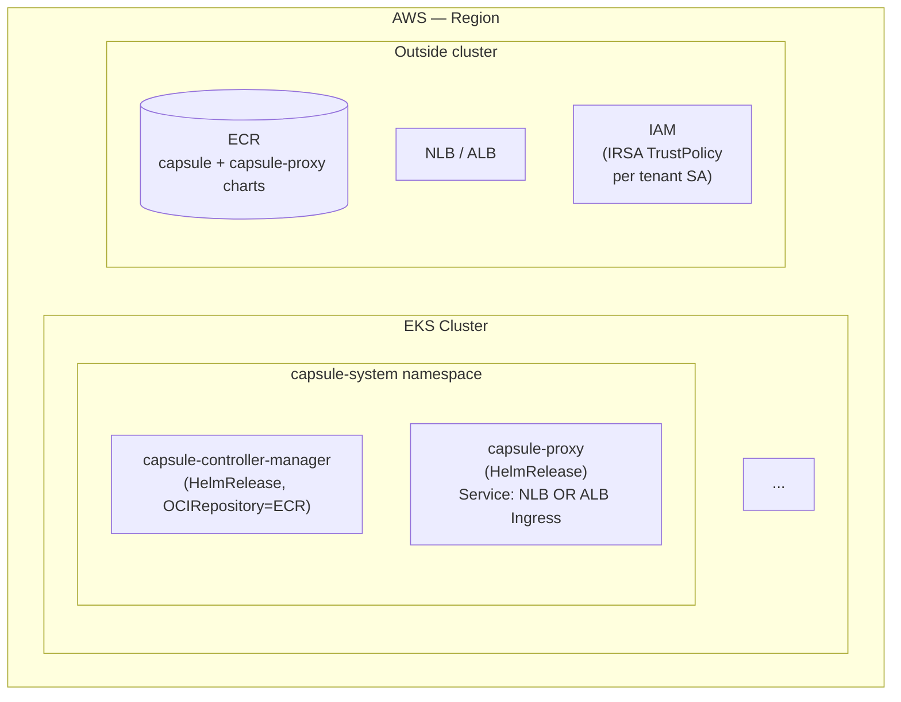

# Phase 7: Foundation — POC Seam + spoke-capsule Cluster + EKS Capsule Doc — Pattern Map

**Mapped:** 2026-04-29
**Files analyzed:** 23 (17 create + 6 modify)
**Analogs found:** 21 / 23 (2 net-new fixtures have no analog)

## File Classification

| New / Modified File | Role | Data Flow | Closest Analog | Match Quality |
|---|---|---|---|---|
| `docs/capsule-on-eks.md` (CREATE) | doc / narrative | static-doc, mermaid-diagram | `docs/architecture.md` (Mermaid + topology); `docs/flux-hub-spoke.md` (hub→spoke narrative); `docs/adr/0004-hub-only-flux-control-plane.md` (Status/Context/Decision/Consequences framing) | role-match (composite — Mermaid style + narrative + did/didn't framing) |
| `clusters/hub-flux/pocs/kustomization.yaml` (CREATE) | config / kustomize-aggregator | declarative-resources | `clusters/hub-flux/spokes/kustomization.yaml` | exact (peer aggregator pattern) |
| `clusters/hub-flux/pocs/capsule.yaml` (CREATE) | config / Flux outer-Kustomization | declarative-reconcile | `clusters/hub-flux/spokes/spoke-apps.yaml` | exact (outer Flux Kustomization with `kubeConfig.secretRef.key: value.yaml`) |
| `pocs/capsule/kustomization.yaml` (CREATE — placeholder) | config / kustomize-empty | declarative-resources | `clusters/hub-flux/spokes/kustomization.yaml` (shape only — `resources:` field) | role-match (kustomize.config.k8s.io/v1beta1, but `resources: []`) |
| `scripts/register-poc-cluster.sh` (CREATE) | script / register-and-patch | imperative-RBAC + secret-apply + sentinel-patch | `scripts/register-spokes-for-flux.sh` | exact (full structural mirror, single-cluster vs all-spokes) |
| `scripts/poc/capsule/create-cluster.sh` (CREATE) | script / k3d-cluster-create | imperative-cluster-create + drift-verify | `scripts/create-clusters.sh` (`create_cluster()` helper, lines 77-171) | exact (skip-if-exists with image / network / port drift verify) |
| `scripts/poc/capsule/fix-dns.sh` (CREATE) | script / cluster-restart | imperative-stop-start | `scripts/fix-coredns.sh` | exact (full structural mirror; spoke-capsule substituted for hub-flux; ADR-004 invariant — NO Flux check) |
| `docs/poc-capsule.md` (CREATE) | doc / runbook | static-doc, host-restart-recovery | `docs/rebuild-runbook.md` (runbook narrative); `docs/wsl-networking.md` (problem → mandate → procedure structure) | role-match (runbook tone, but POC-scoped) |
| `tests/bats/docs-06-eks.bats` (CREATE) | test / static-contract | doc-shape grep | `tests/bats/docs-02-architecture.bats` (Mermaid + topology literal grep); `tests/bats/docs-04-gpu-notes.bats` (h1 + literal section pattern) | exact (doc-shape contract for Mermaid + literals) |
| `tests/bats/poc-mount-01-static.bats` (CREATE) | test / static-contract | sentinel + yaml-shape grep | `tests/bats/register-spokes-01-static.bats` (`# KARYON SPOKES MOUNT` sentinel + `- ../spokes` greps in `flux-system/kustomization.yaml`) | exact (direct mirror, sentinel literal swapped) |
| `tests/bats/register-poc-cluster-01-static.bats` (CREATE) | test / static-contract | script-shape grep | `tests/bats/register-spokes-01-static.bats` (full RBAC + token + value.yaml + sentinel grep suite) | exact (direct mirror, single-cluster vocabulary) |
| `tests/bats/poc-cluster-01-static.bats` (CREATE) | test / static-contract | script + yaml shape grep | `tests/bats/fix-coredns-01-static.bats` (script-shape grep — strict mode + cluster-name greps + Taskfile wire-up); `tests/bats/create-clusters-02-hub-flux.bats` (live-gated single-cluster shape) | role-match (CAPCLU-01 + CAPCLU-02 + CAPCLU-03 multi-concern static suite) |
| `tests/bats/preflight-pre15.bats` (CREATE) | test / static-contract | preflight section grep | `tests/bats/preflight-pre13.bats` (cgroup_v2 mock + assertion); `tests/bats/preflight-pre09.bats` (env_file argument-driven preflight); `tests/bats/preflight-pre11.bats` (resolv.conf mock + assertion) | role-match (preflight section pattern; PRE-15 wraps `check_port_strict 30443`) |
| `tests/bats/repo-hygiene-04-poc.bats` (CREATE) | test / static-contract | gitleaks fixture + .gitignore + .gitleaks.toml grep | `tests/bats/repo-hygiene-02-taskfile.bats` (REPO-05 grep-suite over Taskfile + scripts/) | role-match (repo-hygiene contract — but gitleaks fixture-runner is novel pattern) |
| `tests/fixtures/gitleaks/synthetic-kubeconfig.yaml` (CREATE) | fixture / kubeconfig-shape | static-yaml | NONE (net-new — no fixtures dir exists) | no-analog |
| `tests/fixtures/gitleaks/benign-configmap.yaml` (CREATE) | fixture / negative-yaml | static-yaml | NONE (net-new — no fixtures dir exists) | no-analog |
| (Optional) `tests/bats/poc-isolation-01-static.bats` (CREATE) | test / static-contract | grep — zero-mention enforcement | `tests/bats/destroy-rebuild-01-static.bats` (line-order grep over multiple v0.18 scripts) | role-match (multi-script grep pattern) |
| `clusters/hub-flux/flux-system/kustomization.yaml` (MODIFY — append) | config / kustomize-patch-surface | declarative-resources | (self — extends existing `# KARYON SPOKES MOUNT` block) | exact (append `# KARYON POC MOUNT` + `- ../pocs` directly below) |
| `scripts/preflight.sh` (MODIFY — extend ports section) | script / preflight-check | port-listener detection | (self — extends existing `check_port` warn-loop with new strict variant) | exact (D-15 inverts semantics — adds `check_port_strict()` helper + PRE-15 invocation) |
| `.gitignore` (MODIFY — append) | config / vcs-ignore | glob-list | (self — extends Phase 6 D-16 expansion section) | exact (append tenant-kubeconfig globs) |
| `.gitleaks.toml` (MODIFY — append rule) | config / leak-rule | toml rule + allowlist | (self — first positive `[[rules]]` block; existing file is allowlist-only) | partial (no existing positive-rule analog in repo) |
| `Taskfile.yml` (MODIFY — append task) | config / task-wrapper | task → bash invocation | (self — sibling of existing `fix-dns:`, `register-spokes:`, `health-check:` tasks) | exact (one-cmds bash invocation pattern) |
| (Optional) `tests/bats/destroy-rebuild-01-static.bats` (MODIFY — extend) | test / static-contract | multi-script zero-mention grep | (self — adds zero `spoke-capsule` mention assertion to existing static contract) | exact |

## Pattern Assignments

### `clusters/hub-flux/pocs/kustomization.yaml` (config, kustomize-aggregator) — CREATE

**Analog:** `clusters/hub-flux/spokes/kustomization.yaml`

**Full file pattern** (lines 1-6, mirror exact shape):
```yaml
apiVersion: kustomize.config.k8s.io/v1beta1
kind: Kustomization
resources:
- spoke-ml.yaml
- spoke-apps.yaml
```

**Substitution for new file:**
```yaml
apiVersion: kustomize.config.k8s.io/v1beta1
kind: Kustomization
resources:
- capsule.yaml
```

**Critical invariants:**
- Filename is `kustomization.yaml` (NOT `aggregator.yaml`, NOT `index.yaml`) — D-06 + specifics §"Aggregator filename consistency".
- `resources` is a YAML list (`!!seq`), single entry pointing at `capsule.yaml`.

---

### `clusters/hub-flux/pocs/capsule.yaml` (config, Flux outer-Kustomization) — CREATE

**Analog:** `clusters/hub-flux/spokes/spoke-apps.yaml`

**Full file pattern** (lines 1-29) — mirror with `spoke-apps` → `poc-capsule`, `clusters/spoke-apps` → `pocs/capsule`, `spoke-apps-kubeconfig` → `spoke-capsule-kubeconfig`:
```yaml
# clusters/hub-flux/spokes/spoke-apps.yaml
# Flux v1 Kustomization - hub-flux's kustomize-controller reconciles
# clusters/spoke-apps/ into k3d-spoke-apps via the spoke-apps-kubeconfig Secret
# (applied imperatively by scripts/register-spokes-for-flux.sh; never committed
# because it contains a bearer token).
#
# REQ-SPOKE-05 (this file's existence + secretRef shape).
# REQ-SPOKE-04 (key: value.yaml explicit - RESEARCH.md Pitfall 2 reframe:
#   the silent-misroute fault is `spec.kubeConfig` ENTIRELY ABSENT, which would
#   make the controller fall back to its in-cluster SA and reconcile to HUB.
#   ALWAYS include the entire spec.kubeConfig block; explicit `key: value.yaml`
#   is belt-and-suspenders against future Flux default-key behavior changes.)
apiVersion: kustomize.toolkit.fluxcd.io/v1
kind: Kustomization
metadata:
  name: spoke-apps
  namespace: flux-system
spec:
  interval: 5m
  path: ./clusters/spoke-apps
  prune: true
  sourceRef:
    kind: GitRepository
    name: flux-system
  kubeConfig:
    secretRef:
      name: spoke-apps-kubeconfig
      key: value.yaml
```

**Critical invariants for the new file (D-11 / P40 / P18 inheritance):**
- `metadata.name: poc-capsule` (NOT `capsule`, NOT `spoke-capsule` — `poc-` prefix differentiates from spoke pattern).
- `metadata.namespace: flux-system`.
- `spec.path: ./pocs/capsule` (the in-repo placeholder dir Phase 7 ships).
- `spec.kubeConfig.secretRef.name: spoke-capsule-kubeconfig`.
- `spec.kubeConfig.secretRef.key: value.yaml` (P40 belt-and-suspenders).
- `spec.prune: true` matches the v0.18 spokes pattern.
- `spec.sourceRef.kind: GitRepository name: flux-system` matches the spokes pattern.

---

### `pocs/capsule/kustomization.yaml` (config, kustomize-empty placeholder) — CREATE

**Analog:** `clusters/hub-flux/spokes/kustomization.yaml` (shape only — empty resources list is novel)

**Full file pattern** (Phase 7 ships, Phase 8 fills):
```yaml
apiVersion: kustomize.config.k8s.io/v1beta1
kind: Kustomization
resources: []  # Phase 8 fills with operator/, proxy/, config/
```

**Critical invariants (Pitfall 7 from RESEARCH.md):**
- File MUST exist (the outer Kustomization at `clusters/hub-flux/pocs/capsule.yaml` references `spec.path: ./pocs/capsule`; without the file, the hub Kustomization reports `Ready=False; path not found`).
- `resources: []` is valid Kustomize and resolves to a no-op apply (verified — research §Assumption A3).

---

### `clusters/hub-flux/flux-system/kustomization.yaml` (config, kustomize-patch-surface) — MODIFY

**Analog:** Self (existing `# KARYON SPOKES MOUNT` sentinel block extends with peer)

**Current shape** (lines 14-21):
```yaml
apiVersion: kustomize.config.k8s.io/v1beta1
kind: Kustomization
resources:
  - gotk-components.yaml
  - gotk-sync.yaml
  # KARYON SPOKES MOUNT
  - ../spokes
```

**Target shape after modification** (D-05 — append BELOW existing SPOKES MOUNT):
```yaml
apiVersion: kustomize.config.k8s.io/v1beta1
kind: Kustomization
resources:
  - gotk-components.yaml
  - gotk-sync.yaml
  # KARYON SPOKES MOUNT
  - ../spokes
  # KARYON POC MOUNT
  - ../pocs
```

**Critical invariants (D-05 / D-09 / P30):**
- File path is `clusters/hub-flux/flux-system/kustomization.yaml` (the FLUX PATCH SURFACE — the inner-`flux-system/`-directory file). NOT `clusters/hub-flux/kustomization.yaml`.
- Existing `# KARYON SPOKES MOUNT` sentinel + `- ../spokes` line MUST be preserved unchanged (Phase 4 D-13 inheritance).
- New sentinel literal: `# KARYON POC MOUNT` (singular, no Capsule-specific suffix per D-05 + ADR-008 framing).
- Production baseline (`SPOKES MOUNT`) lands ABOVE experimental (`POC MOUNT`) — reads naturally.

---

### `scripts/register-poc-cluster.sh` (script, register-and-patch) — CREATE

**Analog:** `scripts/register-spokes-for-flux.sh` (full structural mirror; loop body becomes single-cluster body)

**Strict-mode preamble pattern** (lines 18-24 of analog):
```bash
set -euo pipefail

SCRIPT_DIR="$(cd "$(dirname "${BASH_SOURCE[0]}")" && pwd)"
REPO_ROOT="$(cd "${SCRIPT_DIR}/.." && pwd)"
# shellcheck source=lib/preflight-lib.sh
# shellcheck disable=SC1091
source "${SCRIPT_DIR}/lib/preflight-lib.sh"
```

**Constants pattern** (lines 26-37 of analog — substitute SPOKES → POCS, swap directory + sentinel):
```bash
readonly HUB_CTX="k3d-hub-flux"
readonly FLUX_NS="flux-system"
readonly HUB_KUST_FILE="${REPO_ROOT}/clusters/hub-flux/flux-system/kustomization.yaml"
readonly SPOKES_DIR="${REPO_ROOT}/clusters/hub-flux/spokes"
readonly SPOKES_SENTINEL="# KARYON SPOKES MOUNT"
readonly RECONCILER_SA="flux-reconciler"
readonly RECONCILER_BINDING="flux-reconciler-cluster-admin"
readonly RECONCILER_SECRET="flux-reconciler-token"
```

**Core RBAC pattern** (`apply_spoke_rbac()` body, lines 275-311 of analog — verbatim with `${spoke}` → `${POC_CLUSTER}`):
```bash
apply_spoke_rbac() {
  local spoke="$1"
  kubectl --context "k3d-${spoke}" apply -f - <<EOF
apiVersion: v1
kind: Namespace
metadata:
  name: flux-system
---
apiVersion: v1
kind: ServiceAccount
metadata:
  name: flux-reconciler
  namespace: flux-system
---
apiVersion: rbac.authorization.k8s.io/v1
kind: ClusterRoleBinding
metadata:
  name: flux-reconciler-cluster-admin
roleRef:
  apiGroup: rbac.authorization.k8s.io
  kind: ClusterRole
  name: cluster-admin
subjects:
- kind: ServiceAccount
  name: flux-reconciler
  namespace: flux-system
---
apiVersion: v1
kind: Secret
metadata:
  name: flux-reconciler-token
  namespace: flux-system
  annotations:
    kubernetes.io/service-account.name: flux-reconciler
type: kubernetes.io/service-account-token
EOF
}
```

**Imperative-Secret-apply pattern** (`apply_hub_secret()` body, lines 363-369 of analog — D-11 token safety):
```bash
apply_hub_secret() {
  local spoke="$1" payload="$2"
  printf '%s\n' "${payload}" |
    kubectl --context "${HUB_CTX}" -n "${FLUX_NS}" create secret generic "${spoke}-kubeconfig" \
      --from-file=value.yaml=/dev/stdin --dry-run=client -o yaml |
    kubectl --context "${HUB_CTX}" -n "${FLUX_NS}" apply -f -
}
```

**Sentinel-insertion pattern** (`ensure_hub_spokes_mount()` body, lines 525-579 of analog — port verbatim with sentinel/path swap; PER P30 MUST be a SECOND independent function):
```bash
ensure_hub_spokes_mount() {
  local tmp tmp_with_sentinel

  if [[ ! -f "${HUB_KUST_FILE}" ]]; then
    fail "${HUB_KUST_FILE} missing.
       Fix: bash scripts/bootstrap-flux.sh && bash scripts/register-spokes-for-flux.sh"
    exit 1
  fi

  tmp="$(mktemp)"
  # shellcheck disable=SC2016 # yq expression intentionally uses single quotes.
  if ! yq eval '(.resources // []) as $r | .resources = ($r + ["../spokes"] | unique)' \
      "${HUB_KUST_FILE}" > "${tmp}"; then
    rm -f "${tmp}"
    fail "${HUB_KUST_FILE} is not valid YAML.
       Fix: repair the Flux patch surface, then rerun bash scripts/register-spokes-for-flux.sh"
    exit 1
  fi
  # ... (yq existence check, awk sentinel insertion above the resource line, cmp-then-mv)
  tmp_with_sentinel="$(mktemp)"
  awk -v sentinel="${SPOKES_SENTINEL}" '
    $0 ~ /^[[:space:]]*-[[:space:]]+\.\.\/spokes[[:space:]]*$/ && !inserted {
      if (!seen_sentinel) {
        match($0, /^[[:space:]]*/)
        print substr($0, RSTART, RLENGTH) sentinel
      }
      inserted=1
    }
    index($0, sentinel) { seen_sentinel=1 }
    { print }
  ' "${tmp}" > "${tmp_with_sentinel}"
  rm -f "${tmp}"
  # ... cmp-then-mv (idempotent: skip if no diff):
  if cmp -s "${tmp_with_sentinel}" "${HUB_KUST_FILE}"; then
    rm -f "${tmp_with_sentinel}"
    info "already done, skipping: spokes mount resource present in ${HUB_KUST_FILE}"
  else
    mv "${tmp_with_sentinel}" "${HUB_KUST_FILE}"
    pass "repaired: ../spokes resource under resources in ${HUB_KUST_FILE}"
  fi
}
```

**Build-kubeconfig pattern** (`build_kubeconfig()` body, lines 338-361 of analog — pure heredoc with cluster-name substitution):
```bash
build_kubeconfig() {
  local spoke="$1" bearer="$2" cert_part="$3"
  local server
  server="$(expected_server "${spoke}")"  # https://k3d-${spoke}-server-0:6443
  cat <<EOF
apiVersion: v1
kind: Config
clusters:
- name: ${spoke}
  cluster:
    server: ${server}
    certificate-authority-data: ${cert_part}
users:
- name: ${RECONCILER_SA}
  user:
    token: ${bearer}
contexts:
- name: ${spoke}
  context:
    cluster: ${spoke}
    user: ${RECONCILER_SA}
current-context: ${spoke}
EOF
}
```

**Falsifier pattern (P18 silent-misroute defense)** — `verify_spoke_credential_layer()` lines 581-642 of analog — the openssl `/api/v1/nodes` proof must list `k3d-${POC_CLUSTER}-server-0` AND must NOT list `k3d-hub-flux-server-0`.

**Critical invariants (D-07 / D-11):**
- Single positional arg: `$1 = <cluster-name>`. No `--context` flag. No second positional. Implicit `POC_CTX="k3d-${POC_CLUSTER}"`.
- `set -euo pipefail`; NEVER `set -eux` / `set -x` (D-11 token-safety contract — bearer data is never traced).
- `apiserver` URL in `build_kubeconfig` is `https://k3d-${name}-server-0:6443` (the in-cluster port — NOT 6446 host-published port).
- The `# KARYON POC MOUNT` sentinel constant + `ensure_hub_pocs_mount` function are NEW (P30: must be independent from `# KARYON SPOKES MOUNT` / `ensure_hub_spokes_mount`).
- Constants point at `${REPO_ROOT}/clusters/hub-flux/pocs` (NOT `spokes`) and use sentinel literal `# KARYON POC MOUNT`.

---

### `scripts/poc/capsule/create-cluster.sh` (script, k3d-cluster-create) — CREATE

**Analog:** `scripts/create-clusters.sh` `create_cluster()` helper, lines 77-171

**Strict-mode preamble pattern** (analog lines 17-23 — substitute relative-path depth `../../..`):
```bash
set -euo pipefail

SCRIPT_DIR="$(cd "$(dirname "${BASH_SOURCE[0]}")" && pwd)"
REPO_ROOT="$(cd "${SCRIPT_DIR}/../../.." && pwd)"
# shellcheck source=../../lib/preflight-lib.sh
# shellcheck disable=SC1091
source "${REPO_ROOT}/scripts/lib/preflight-lib.sh"
```

**Preflight gate pattern** (analog lines 33-41 — invoke preflight; fail on blockers):
```bash
section "Preflight gate"
if ! bash "${SCRIPT_DIR}/preflight.sh" > /tmp/preflight-$$.log 2>&1; then
  fail "preflight has blockers — run scripts/preflight.sh and fix before creating clusters.
     Log: /tmp/preflight-$$.log"
  exit 1
fi
pass "preflight green"
rm -f /tmp/preflight-$$.log
```

**Idempotent skip-with-drift-verify pattern** (analog lines 84-138 — checks IMAGE / NETWORK / PORT, fails fast on drift):
```bash
# Idempotency check (D-09) — must verify IMAGE, NETWORK, API PORT, and GPU (spoke-ml only)
if k3d cluster list --no-headers 2>/dev/null | awk '{print $1}' | grep -qx "$name"; then
  local srv_container="k3d-${name}-server-0"
  local lb_container="k3d-${name}-serverlb"
  local actual_image actual_network actual_ports
  actual_image="$(docker inspect "$srv_container" -f '{{.Config.Image}}' 2>/dev/null || echo "")"
  actual_network="$(docker inspect "$srv_container" -f '{{range $k,$v := .NetworkSettings.Networks}}{{$k}} {{end}}' 2>/dev/null || echo "")"
  actual_ports="$(docker inspect "$lb_container" -f '{{range $k, $v := .NetworkSettings.Ports}}{{$k}}={{range $v}}{{.HostPort}}{{end}} {{end}}' 2>/dev/null || echo "")"

  # (a) IMAGE drift
  if [[ "$actual_image" != "$expected_image" ]]; then
    fail "cluster ${name} IMAGE drift (actual=${actual_image:-?}, expected=${expected_image}).
       Fix: scripts/delete-clusters.sh && scripts/create-clusters.sh"
    exit 1
  fi

  # (b) NETWORK drift
  if [[ "$actual_network" != *"$K8S_NET_NAME"* ]]; then
    fail "cluster ${name} NETWORK drift (actual=${actual_network:-?}, expected includes=${K8S_NET_NAME}).
       Fix: scripts/delete-clusters.sh && scripts/create-clusters.sh"
    exit 1
  fi

  # (c) API PORT drift (serverlb always exposes container port 6443; host port varies per cluster)
  if ! echo "$actual_ports" | grep -qE "6443/tcp=${port}"; then
    fail "cluster ${name} API PORT drift (serverlb ports=${actual_ports:-?}, expected=6443/tcp=${port}).
       Fix: scripts/delete-clusters.sh && scripts/create-clusters.sh"
    exit 1
  fi
  # ... (d) GPU drift check OMITTED for spoke-capsule (no GPU)
  info "already done, skipping: cluster ${name} (image=${actual_image}, network=${K8S_NET_NAME}, port=${port})"
else
  info "creating: cluster ${name} on :${port} (network=${K8S_NET_NAME})"
  k3d cluster create "$name" \
    --api-port "$port" \
    --network "$K8S_NET_NAME" \
    --k3s-arg "--tls-san=k3d-${name}-server-0@server:*" \
    "${extra_args[@]}"
  pass "created: cluster ${name}"
fi
```

**Bounded-retry SAN verifier pattern** (analog lines 149-170 — copy verbatim):
```bash
# ---------- D-13 SAN verification (bounded retry: 10 attempts × 3s = 30s cap) ----------
local expected_san="k3d-${name}-server-0"
local san_ok=0
for i in $(seq 1 10); do
  if openssl s_client -connect "127.0.0.1:${port}" -servername "$expected_san" </dev/null 2>/dev/null \
       | openssl x509 -noout -text 2>/dev/null \
       | grep -qE "DNS:${expected_san}"; then
    san_ok=1
    break
  fi
  sleep 3
done
if [[ "$san_ok" -eq 1 ]]; then
  pass "SAN verified: cluster ${name} cert includes DNS:${expected_san}"
else
  warn "deleting broken cluster ${name} (SAN missing after 10 retries / 30s)"
  k3d cluster delete "$name" >/dev/null 2>&1 || true
  fail "cluster ${name} apiserver cert missing SAN DNS:${expected_san} after 30s (k3d issue #1613 may be firing).
     Fix: confirm the create_cluster helper still uses the wildcard SAN nodefilter (see k3d issue #1613);
          the cluster has been deleted — rerun scripts/create-clusters.sh"
  exit 1
fi
```

**Critical invariants (D-10 / CAPCLU-01):**
- Pinned constants: `POC_CLUSTER="spoke-capsule"`, `POC_API_PORT="6446"`, `POC_NODEPORT="30443"`, `K8S_NET_NAME="k8s-net"`, `K3S_STOCK_IMAGE="rancher/k3s:v1.34.6-k3s1"`.
- New constraint vs analog: `--port "${POC_NODEPORT}:${POC_NODEPORT}@loadbalancer"` flag + an additional drift check for the NodePort host-publish on `serverlb` ports (per RESEARCH.md §"Open Questions (RESOLVED)" #1 — host port lives on serverlb container so the drift-verify regex matches the v0.18 inspection pattern).
- `--tls-san k3d-spoke-capsule-server-0` (D-10).
- No GPU drift check (no `--gpus` arg); no CUDA image; spoke-capsule uses the stock k3s image.

---

### `scripts/poc/capsule/fix-dns.sh` (script, cluster-restart) — CREATE

**Analog:** `scripts/fix-coredns.sh` (full structural mirror)

**Strict-mode preamble pattern** (analog lines 1-14 — substitute relative-path depth):
```bash
#!/usr/bin/env bash
# scripts/fix-coredns.sh
#
# Refreshes stale k3d CoreDNS NodeHosts entries by stop/starting only the
# hub-flux cluster, then proves the hub node and Flux controllers are healthy.

set -euo pipefail

SCRIPT_DIR="$(cd "$(dirname "${BASH_SOURCE[0]}")" && pwd)"
REPO_ROOT="$(cd "${SCRIPT_DIR}/.." && pwd)"
# shellcheck source=scripts/lib/preflight-lib.sh
# shellcheck disable=SC1091
source "${REPO_ROOT}/scripts/lib/preflight-lib.sh"
```

**Tool-gate pattern** (analog lines 19-33):
```bash
require_command() {
  local cmd="$1"
  if ! have "${cmd}"; then
    fail "required command missing: ${cmd}.
       Fix: install project tools with asdf, then rerun: bash scripts/fix-coredns.sh"
    exit 1
  fi
}

# ---------- Section 1: Tool gate ----------
section "Tool gate"
require_command k3d
require_command kubectl
require_command flux        # OMIT for spoke-capsule (D-17: NO Flux runs on spoke-capsule)
pass "required commands present"
```

**k3d stop/start pattern** (analog lines 35-51 — substitute `hub-flux` → `${POC_CLUSTER}`):
```bash
# ---------- Section 2: hub-flux stop/start ----------
section "hub-flux stop/start"
if ! k3d cluster stop hub-flux; then
  fail "failed to stop ${HUB_CLUSTER}.
     Inspect: k3d cluster list
     Fix:     bash scripts/create-clusters.sh && bash scripts/fix-coredns.sh"
  exit 1
fi
pass "stopped: ${HUB_CLUSTER}"

if ! k3d cluster start hub-flux --wait --timeout 120s; then
  fail "failed to start ${HUB_CLUSTER} within 120s.
     Inspect: k3d cluster list && kubectl --context ${HUB_CTX} get node
     Fix:     bash scripts/fix-coredns.sh"
  exit 1
fi
pass "started: ${HUB_CLUSTER}"
```

**Node-readiness pattern** (analog lines 53-61 — substitute context):
```bash
# ---------- Section 3: Hub node readiness ----------
section "Hub node readiness"
if ! kubectl --context k3d-hub-flux wait --for=condition=Ready node --all --timeout=120s; then
  fail "hub node did not become Ready within 120s.
     Inspect: kubectl --context ${HUB_CTX} get node -o wide
     Fix:     bash scripts/fix-coredns.sh"
  exit 1
fi
pass "hub node Ready=True"
```

**Summary pattern** (analog lines 117-122 — pure copy):
```bash
section "Summary"
printf "  %s%d passed%s, %s%d warnings%s, %s%d failed%s\n" \
  "${C_GREEN}" "${PASS}" "${C_RESET}" "${C_YELLOW}" "${WARN}" "${C_RESET}" "${C_RED}" "${FAIL}" "${C_RESET}"
if (( FAIL > 0 )); then exit 1; fi
printf "\n%sCoreDNS NodeHosts refresh complete for hub-flux.%s\n" "${C_GREEN}" "${C_RESET}"
```

**Critical invariants (D-16 / D-17 / ADR-004):**
- ZERO `hub-flux` mentions in stop/start commands (D-16: must NOT affect default `task fix-dns` surface).
- ZERO `flux check` invocations (D-17: NO Flux on spoke-capsule).
- The bats grep-asserts `MED-2` style — for each of `hub-flux`, `spoke-ml`, `spoke-apps` there must be ZERO `k3d cluster stop`/`start`/`restart` mentions in the body (only `spoke-capsule` should be referenced).
- OMIT analog's "Section 4: Flux readiness" (lines 64-93) and "Section 5: Post-restart spoke DNS probe" (lines 95-115) — both are hub-flux-specific.

---

### `scripts/preflight.sh` (script, preflight-check) — MODIFY

**Analog:** Self (lines 175-190 — port-check section)

**Current shape** (lines 175-190):
```bash
# ---------- 5. Network / ports ----------
section "Network / ports (k3d will want these)"

check_port() {
  local port="$1"
  if ss -ltn 2>/dev/null | awk 'NR>1 {print $4}' | grep -qE "[:.]${port}$"; then
    warn "Port ${port} is in use"
    ss -ltnp 2>/dev/null | awk -v p=":${port}" '$4 ~ p {print "      " $0}' | head -2
  else
    pass "Port ${port} free"
  fi
}

for p in 6443 6444 6445 8080 8081 8082; do
  check_port "$p"
done
```

**Target shape after modification** (D-15 — D-15 unconditional fail-fast on 30443):
```bash
# ---------- 5. Network / ports ----------
section "Network / ports (k3d will want these)"

check_port() {
  local port="$1"
  if ss -ltn 2>/dev/null | awk 'NR>1 {print $4}' | grep -qE "[:.]${port}$"; then
    warn "Port ${port} is in use"
    ss -ltnp 2>/dev/null | awk -v p=":${port}" '$4 ~ p {print "      " $0}' | head -2
  else
    pass "Port ${port} free"
  fi
}

# v0.19 POC-04 / D-15: strict-mode port check — fails fast (does NOT warn) when
# the port is in use. Used for POC-reserved ports where a stale listener would
# block k3d cluster create. UNCHANGED check_port() preserved above for v0.18 ports.
check_port_strict() {
  local port="$1"
  if ss -ltn 2>/dev/null | awk 'NR>1 {print $4}' | grep -qE "[:.]${port}$"; then
    fail "Port ${port} is in use elsewhere on the host (POC-04 reserved).
      Inspect: ss -ltnp | awk '\$4 ~ /:${port}\$/{print}'
      Fix: free the port (kill the listener) or stop the offending service before continuing"
    ss -ltnp 2>/dev/null | awk -v p=":${port}" '$4 ~ p {print "      " $0}' | head -2
  else
    pass "Port ${port} free (POC-04 fail-fast)"
  fi
}

# v0.18 warn ports (unchanged):
for p in 6443 6444 6445 8080 8081 8082; do
  check_port "$p"
done

# Phase 7 PRE-15: POC-04 fail-fast on 30443 (D-15 unconditional)
section "Network / ports (PRE-15: POC-reserved)"
check_port_strict 30443
```

**Critical invariants (D-15 / POC-04 literal contract):**
- New helper named `check_port_strict()` — distinct grep-able function (P30 disambiguation; future POC ports reuse this helper).
- Existing `check_port()` (warn-only) preserved verbatim — no v0.18 regression.
- New `# ---------- ... PRE-15 ...` section header makes it greppable as a distinct preflight section.
- Invocation literal: `check_port_strict 30443` (`tests/bats/preflight-pre15.bats` greps for this exact string).

---

### `scripts/poc/capsule/fix-dns.sh` Taskfile binding via `Taskfile.yml` (config, task-wrapper) — MODIFY

**Analog:** Self (existing `fix-dns:` task block at lines 39-42)

**Current shape** (lines 39-42 — existing `fix-dns:` task):
```yaml
  fix-dns:
    desc: Stop/start hub-flux to refresh stale k3d CoreDNS NodeHosts
    cmds:
      - bash scripts/fix-coredns.sh
```

**Target shape after modification** (CAPCLU-03 surface — append parallel sibling task):
```yaml
  fix-dns:
    desc: Stop/start hub-flux to refresh stale k3d CoreDNS NodeHosts
    cmds:
      - bash scripts/fix-coredns.sh

  fix-dns-poc-capsule:
    desc: Stop/start spoke-capsule to refresh stale k3d CoreDNS NodeHosts (POC; does NOT affect default fix-dns)
    cmds:
      - bash scripts/poc/capsule/fix-dns.sh
```

**Critical invariants (D-16 / REPO-05):**
- Sibling of `fix-dns:` (NOT a parent/child via env-var dispatch — anti-pattern per RESEARCH.md §"Anti-Patterns to Avoid").
- One `cmds:` line, single `bash scripts/poc/capsule/fix-dns.sh` invocation (REPO-05 thin-wrapper invariant from `tests/bats/repo-hygiene-02-taskfile.bats`).

---

### `.gitignore` (config, vcs-ignore) — MODIFY

**Analog:** Self (lines 9-22 — Phase 6 D-16 expansion section)

**Current shape** (lines 1-29):
```
CLAUDE.local.md
.claude/settings.local.json

# Secrets — NEVER commit .env with real values
.env
.env.local
.env.*.local

# Phase 6 D-16 expansion ──────────────────────────────────

# Kubeconfig artifacts (fix-coredns / register-spokes scratch)
kubeconfig*
*.kubeconfig

# TLS material (anything generated locally)
*.pem
*.key
*.crt
# ...
```

**Target shape after modification** (D-14 — append after Phase 6 D-16 expansion):
```
# ... (existing Phase 6 D-16 expansion preserved verbatim) ...

# Phase 7 D-14 expansion (v0.19 POC-03) ──────────────────
# Tenant kubeconfig globs (Phase 10 ${TMPDIR:-/tmp}/karyon-tenants/ destination):
karyon-tenants/
*.tenant.kubeconfig
tenants/**/access.yaml
tenants/**/admin.yaml
```

**Critical invariants (D-14 / POC-03 / P29):**
- Append-only — must NOT alter the existing Phase 6 D-16 globs (Phase 4 / Phase 6 inheritance).
- Globs match Phase 10 tenant-kubeconfig output paths; Phase 7 ships the ignore so accidental commits during Phase 10 development are filtered before the gitleaks rule fires.

---

### `.gitleaks.toml` (config, leak-rule) — MODIFY

**Analog:** Self (allowlist-only file; **no positive-rule analog exists in repo** — this is the first)

**Current shape** (full file — 18 lines):
```toml
# .gitleaks.toml
# Allow-rules for gitleaks pre-commit hook (REPO-04) and CI gitleaks-scan job
# (REPO-07, see Plan 07). Reviewed during the one-shot historical scan in this
# plan; expand only when a NEW false-positive is observed AND the value is
# verified to be a placeholder (not a real secret rotated).

[allowlist]
description = "False positives: placeholder tokens and CONTEXT.md SHAs"
regexes = [
  '''ghp_REPLACE_WITH_PAT_WITH_repo_SCOPE''',  # .env.example placeholder (D-09 Phase 1)
]
paths = [
  '''^\.env\.example$''',                       # whole-file allow (Phase 1 D-11 contract)
]
# Add per-finding entries during the one-shot scan if needed.
# Format: regexes = [ '''<exact-literal>''' ]
# Format: paths   = [ '''<file-path-regex>''' ]
```

**Target shape after modification** (D-14 — first positive `[[rules]]` block + per-fixture allowlist):
```toml
# .gitleaks.toml — existing contents preserved verbatim above ...

# Phase 7 v0.19 POC-03: kubeconfig-shaped artifact + bearer token regex.
# gitleaks 8.30.1 supports multi-line regex via [\r\n] character classes (minVersion v8.25.0).
# Ref: research/PITFALLS.md §P29; tests/fixtures/gitleaks/synthetic-kubeconfig.yaml is the bats fixture.

[[rules]]
id = "kubeconfig-bearer-token"
description = "Kubernetes kubeconfig with embedded bearer token (kind: Config + users.token)"
regex = '''(?ms)^kind:\s*Config[\s\S]*?users:[\s\S]*?token:\s*[A-Za-z0-9._-]{32,}'''
tags = ["kubernetes", "kubeconfig", "bearer-token", "v0.19"]

[rules.allowlist]
description = "Phase 7 synthetic fixtures (verified inert; positive-test only)"
paths = [
  '''^tests/fixtures/gitleaks/synthetic-kubeconfig\.yaml$''',
]
```

**Critical invariants (D-14 / POC-03 / Pitfall 5):**
- gitleaks 8.30.1 (pinned) supports `(?ms)` multi-line patterns; minVersion v8.25.0 satisfied.
- Token regex `[A-Za-z0-9._-]{32,}` matches JWT/SA-token family without entropy false-positives on short identifiers.
- Per-rule `[rules.allowlist].paths` allowlists ONLY `tests/fixtures/gitleaks/synthetic-kubeconfig.yaml` — narrowest-possible exception.
- Existing `[allowlist]` (lines 7-14) MUST be preserved verbatim (Phase 1 D-11 contract).

---

### `tests/bats/poc-mount-01-static.bats` (test, static-contract) — CREATE

**Analog:** `tests/bats/register-spokes-01-static.bats` lines 130-139 (D-02 SPOKES MOUNT sentinel test pattern)

**Setup pattern** (analog lines 18-26):
```bash
load 'test_helper'

setup() {
  HUB_FS_KUST="${REPO_ROOT}/clusters/hub-flux/flux-system/kustomization.yaml"
  POCS_INDEX="${REPO_ROOT}/clusters/hub-flux/pocs/kustomization.yaml"
  POCS_CAPSULE="${REPO_ROOT}/clusters/hub-flux/pocs/capsule.yaml"
  POCS_PLACEHOLDER="${REPO_ROOT}/pocs/capsule/kustomization.yaml"
}
```

**Sentinel-grep pattern** (analog lines 130-139 — substitute SPOKES → POCS):
```bash
@test "D-02: clusters/hub-flux/flux-system/kustomization.yaml carries # KARYON SPOKES MOUNT sentinel and - ../spokes entry" {
  [ -f "$HUB_FS_KUST" ]
  run grep -F -- '# KARYON SPOKES MOUNT' "$HUB_FS_KUST"
  [ "$status" -eq 0 ]
  run grep -F -- '- ../spokes' "$HUB_FS_KUST"
  [ "$status" -eq 0 ]
  # Phase 3 sentinel must STILL be present (D-13 inheritance / non-regression):
  run grep -F -- '# FLUX PATCH SURFACE' "$HUB_FS_KUST"
  [ "$status" -eq 0 ]
}
```

**yq-shape assertion pattern** (analog lines 121-126 — for kustomize-aggregator yaml):
```bash
@test "SPOKE-05: clusters/hub-flux/spokes/kustomization.yaml lists spoke-ml.yaml and spoke-apps.yaml as resources" {
  [ -f "$SPOKES_INDEX" ]
  run yq eval '.apiVersion == "kustomize.config.k8s.io/v1beta1" and .kind == "Kustomization" and (.resources | length) == 2 and .resources[0] == "spoke-ml.yaml" and .resources[1] == "spoke-apps.yaml"' "$SPOKES_INDEX"
  [ "$status" -eq 0 ]
  [ "$output" = "true" ]
}
```

**Critical invariants for new file:**
- Asserts `# KARYON POC MOUNT` sentinel exists exactly once in `clusters/hub-flux/flux-system/kustomization.yaml` (greppable via `grep -c`).
- Asserts `- ../pocs` resource line exists.
- Asserts both `# KARYON SPOKES MOUNT` AND `# KARYON POC MOUNT` are present (Phase 4 D-13 inheritance + Phase 7 new contract).
- Asserts `clusters/hub-flux/pocs/kustomization.yaml` shape: `apiVersion == "kustomize.config.k8s.io/v1beta1"`, `kind == "Kustomization"`, `.resources == ["capsule.yaml"]`.
- Asserts `clusters/hub-flux/pocs/capsule.yaml` shape: `apiVersion == "kustomize.toolkit.fluxcd.io/v1"`, `kind == "Kustomization"`, `metadata.name == "poc-capsule"`, `spec.path == "./pocs/capsule"`, `spec.kubeConfig.secretRef.name == "spoke-capsule-kubeconfig"`, `spec.kubeConfig.secretRef.key == "value.yaml"`.
- Asserts `pocs/capsule/kustomization.yaml` exists with `kind == "Kustomization"` and `resources` field present (may be empty list).
- Negative: `grep -F '# KARYON POC MOUNT' clusters/hub-flux/kustomization.yaml` MUST FAIL (D-09 wrong-file-protection).

---

### `tests/bats/register-poc-cluster-01-static.bats` (test, static-contract) — CREATE

**Analog:** `tests/bats/register-spokes-01-static.bats` (full structural mirror — every test pattern transfers)

**Test patterns to mirror** (substituting SPOKE → POC, `flux-reconciler-cluster-admin` stays the same since identity reuse is by D-07):
- `@test "POC-02: scripts/register-poc-cluster.sh creates flux-reconciler ServiceAccount"` — analog lines 34-40.
- `@test "POC-02: scripts/register-poc-cluster.sh creates flux-reconciler-cluster-admin CRB"` — analog lines 42-50.
- `@test "POC-02: scripts/register-poc-cluster.sh creates flux-reconciler-token Secret"` — analog lines 54-60.
- `@test "POC-02: server URL literal https://k3d-${cluster}-server-0:6443 in script body"` — analog lines 70-77.
- `@test "POC-02: value.yaml key literal in script body"` — analog lines 81-85.
- `@test "D-11: scripts/register-poc-cluster.sh uses set -euo pipefail and does NOT use set -x"` — analog lines 143-152.
- `@test "D-11 (token safety): token/kubeconfig data is never logged or literalized"` — analog lines 154-168.
- `@test "D-04: scripts/register-poc-cluster.sh does NOT mutate git"` — analog lines 172-178.
- `@test "D-13: scripts/register-poc-cluster.sh contains an idempotency skip-message literal"` — analog lines 182-188.
- `@test "D-13: scripts/register-poc-cluster.sh contains verified openssl HTTPS probes"` — analog lines 190-214.
- `@test "P18 trip-wire: node-name negative-proof literal forbidden-node 'k3d-hub-flux-server-0' present in script"` — analog lines 216-222.

**Per-spoke vs single-cluster differences:**
- Where the spokes analog tests both spoke-ml AND spoke-apps (lines 87-126), `register-poc-cluster.sh` only takes ONE positional argument (D-07). Tests assert the script's positional-arg parsing pattern (`"$#" -ne 1`, `readonly POC_CLUSTER="$1"`).
- Tests assert the new sentinel literal `# KARYON POC MOUNT` in script body.
- Tests assert the new function name `ensure_hub_pocs_mount` (P30 — independent from `ensure_hub_spokes_mount`).
- Tests assert the new constant `POCS_DIR="${REPO_ROOT}/clusters/hub-flux/pocs"`.

---

### `tests/bats/poc-cluster-01-static.bats` (test, static-contract) — CREATE

**Analog (composite):** `tests/bats/fix-coredns-01-static.bats` (script-shape grep style) + `tests/bats/create-clusters-02-hub-flux.bats` (live-gated single-cluster shape if any live tests are added)

**Setup pattern** (fix-coredns analog lines 5-10):
```bash
load 'test_helper'

setup() {
  CREATE_SCRIPT="${REPO_ROOT}/scripts/poc/capsule/create-cluster.sh"
  FIX_DNS_SCRIPT="${REPO_ROOT}/scripts/poc/capsule/fix-dns.sh"
  CAPSULE_KS="${REPO_ROOT}/clusters/hub-flux/pocs/capsule.yaml"
  TASKFILE="${REPO_ROOT}/Taskfile.yml"
}
```

**Strict-mode + preflight-source assertion pattern** (fix-coredns analog lines 12-18):
```bash
@test "CAPCLU-01: scripts/poc/capsule/create-cluster.sh exists, is strict, and sources preflight helpers" {
  [ -f "$CREATE_SCRIPT" ]
  run grep -E '^set -euo pipefail' "$CREATE_SCRIPT"
  [ "$status" -eq 0 ]
  run grep -F -- 'preflight-lib.sh' "$CREATE_SCRIPT"
  [ "$status" -eq 0 ]
}
```

**Cluster-name-only-spoke-capsule assertion pattern** (fix-coredns analog lines 38-72 — grep-AND for spoke-capsule, grep-NOT for hub-flux/spoke-ml/spoke-apps):
```bash
@test "D-12: poc/capsule/fix-dns.sh stops only spoke-capsule (not hub-flux, spoke-ml, spoke-apps)" {
  [ -f "$FIX_DNS_SCRIPT" ]
  run grep -F -- 'k3d cluster stop spoke-capsule' "$FIX_DNS_SCRIPT"
  [ "$status" -eq 0 ]
  for cluster in hub-flux spoke-ml spoke-apps; do
    run bash -c "grep -v '^[[:space:]]*#' '$FIX_DNS_SCRIPT' | grep -F -- 'k3d cluster stop ${cluster}'"
    [ "$status" -ne 0 ]
    run bash -c "grep -v '^[[:space:]]*#' '$FIX_DNS_SCRIPT' | grep -F -- 'k3d cluster start ${cluster}'"
    [ "$status" -ne 0 ]
  done
}
```

**Pin literal pattern** (fix-coredns analog lines 117-123 — Taskfile wire-up):
```bash
@test "CAPCLU-03: Taskfile wires fix-dns-poc-capsule to scripts/poc/capsule/fix-dns.sh" {
  [ -f "$TASKFILE" ]
  run grep -F -- 'fix-dns-poc-capsule:' "$TASKFILE"
  [ "$status" -eq 0 ]
  run grep -F -- 'bash scripts/poc/capsule/fix-dns.sh' "$TASKFILE"
  [ "$status" -eq 0 ]
}
```

**Critical invariants (CAPCLU-01 + CAPCLU-02 + CAPCLU-03):**
- `create-cluster.sh` body asserts: `POC_CLUSTER="spoke-capsule"`, `POC_API_PORT="6446"`, `POC_NODEPORT="30443"`, `K3S_STOCK_IMAGE="rancher/k3s:v1.34.6-k3s1"`, `--tls-san k3d-spoke-capsule-server-0`, `--port "30443:30443@loadbalancer"` (per RESEARCH.md §"Open Questions (RESOLVED)" #1).
- `fix-dns.sh` body asserts: ZERO `flux check` (D-17 invariant); ZERO `hub-flux`/`spoke-ml`/`spoke-apps` mentions in cluster commands (D-12).
- `clusters/hub-flux/pocs/capsule.yaml` asserts: `metadata.name == "poc-capsule"`, `spec.path == "./pocs/capsule"`, `spec.kubeConfig.secretRef.name == "spoke-capsule-kubeconfig"`, `spec.kubeConfig.secretRef.key == "value.yaml"` (CAPCLU-02).
- `Taskfile.yml` asserts: `fix-dns-poc-capsule:` task entry exists with `bash scripts/poc/capsule/fix-dns.sh` cmds line.

---

### `tests/bats/preflight-pre15.bats` (test, static-contract) — CREATE

**Analog:** `tests/bats/preflight-pre13.bats` (mock-driven preflight assertion); `tests/bats/preflight-pre09.bats` (file-arg preflight test); `tests/bats/preflight-pre11.bats` (tmpdir setup pattern)

**Setup + literal-grep pattern** (preflight-pre13 analog uses bash-mock, but for PRE-15 the simpler preflight-pre09 pattern of asserting against the script itself fits — D-15 is a script-content contract not a function-output one):
```bash
load 'test_helper'

setup() {
  PREFLIGHT="${REPO_ROOT}/scripts/preflight.sh"
}

@test "PRE-15: scripts/preflight.sh defines check_port_strict helper" {
  [ -f "$PREFLIGHT" ]
  run grep -F -- 'check_port_strict()' "$PREFLIGHT"
  [ "$status" -eq 0 ]
}

@test "PRE-15 / D-15: scripts/preflight.sh invokes check_port_strict on 30443" {
  [ -f "$PREFLIGHT" ]
  run grep -F -- 'check_port_strict 30443' "$PREFLIGHT"
  [ "$status" -eq 0 ]
}

@test "PRE-15: existing v0.18 check_port (warn-only) preserved" {
  [ -f "$PREFLIGHT" ]
  run grep -F -- 'check_port()' "$PREFLIGHT"
  [ "$status" -eq 0 ]
  # The for-loop over 6443 6444 6445 8080 8081 8082 must STILL use check_port (not _strict).
  run grep -F -- 'for p in 6443 6444 6445 8080 8081 8082' "$PREFLIGHT"
  [ "$status" -eq 0 ]
}

@test "PRE-15 / D-15: check_port_strict body uses fail (not warn)" {
  [ -f "$PREFLIGHT" ]
  # Greedy multi-line grep: between check_port_strict() { and the closing }
  run bash -c "awk '/^check_port_strict\\(\\)/{flag=1} flag; /^}/{if(flag){flag=0; exit}}' '$PREFLIGHT' | grep -F -- 'fail '"
  [ "$status" -eq 0 ]
}
```

**Optional: live mock pattern from preflight-pre13** (analog lines 8-17, if planner adds an end-to-end test):
```bash
@test "PRE-15 (mock): port 30443 in use causes check_port_strict to fail" {
  run bash -c "
    source '${SCRIPTS_DIR}/lib/preflight-lib.sh'
    source <(awk '/^check_port_strict/,/^}/' '${REPO_ROOT}/scripts/preflight.sh')
    ss() { echo 'LISTEN 0 4096 *:30443 *:*'; }
    export -f ss
    check_port_strict 30443
  "
  [ "$status" -ne 0 ]
}
```

**Critical invariants (D-15 / POC-04):**
- The `check_port_strict` literal is the load-bearing grep target — bats greps `'check_port_strict 30443'` to confirm the literal port reservation.
- The existing `check_port` (warn-only) function name MUST still be present (no v0.18 regression).
- `fail` (not `warn`) is invoked inside `check_port_strict` body.

---

### `tests/bats/repo-hygiene-04-poc.bats` (test, static-contract) — CREATE

**Analog:** `tests/bats/repo-hygiene-02-taskfile.bats` (REPO-05 multi-grep style); also draws on RESEARCH.md §"Pattern 6: Multi-line gitleaks rule with synthetic-fixture bats"

**Setup pattern** (repo-hygiene-02 analog lines 7-11):
```bash
load 'test_helper'

setup() {
  GITIGNORE="${REPO_ROOT}/.gitignore"
  GITLEAKS_TOML="${REPO_ROOT}/.gitleaks.toml"
  POSITIVE_FIXTURE="${REPO_ROOT}/tests/fixtures/gitleaks/synthetic-kubeconfig.yaml"
  NEGATIVE_FIXTURE="${REPO_ROOT}/tests/fixtures/gitleaks/benign-configmap.yaml"
}
```

**Multi-literal grep pattern** (repo-hygiene-02 analog lines 13-31):
```bash
@test "POC-03 (D-14): .gitignore includes tenant-kubeconfig globs" {
  [ -f "$GITIGNORE" ]
  for literal in \
    'karyon-tenants/' \
    '*.tenant.kubeconfig' \
    'tenants/**/access.yaml' \
    'tenants/**/admin.yaml'
  do
    run grep -F -- "$literal" "$GITIGNORE"
    [ "$status" -eq 0 ]
  done
}

@test "POC-03 (D-14): .gitleaks.toml has kubeconfig-bearer-token positive rule" {
  [ -f "$GITLEAKS_TOML" ]
  run grep -F -- 'id = "kubeconfig-bearer-token"' "$GITLEAKS_TOML"
  [ "$status" -eq 0 ]
  run grep -F -- 'kind:\s*Config' "$GITLEAKS_TOML"
  [ "$status" -eq 0 ]
  run grep -F -- 'tags = ["kubernetes", "kubeconfig", "bearer-token", "v0.19"]' "$GITLEAKS_TOML"
  [ "$status" -eq 0 ]
}
```

**Gitleaks fixture-runner pattern** (RESEARCH.md §Pattern 6 lines 678-696 — invokes gitleaks against fixture, asserts non-zero/zero exit):
```bash
@test "POC-03: gitleaks catches kubeconfig + bearer token shape (positive fixture MUST be caught)" {
  [ -f "$POSITIVE_FIXTURE" ]
  run gitleaks detect --no-banner --no-git --source "$POSITIVE_FIXTURE" \
    --config "$GITLEAKS_TOML" \
    --redact --verbose
  [ "$status" -ne 0 ]  # gitleaks returns non-zero on findings
}

@test "POC-03: gitleaks does NOT fire on innocuous YAML (negative fixture MUST NOT be caught)" {
  [ -f "$NEGATIVE_FIXTURE" ]
  run gitleaks detect --no-banner --no-git --source "$NEGATIVE_FIXTURE" \
    --config "$GITLEAKS_TOML" \
    --redact --verbose
  [ "$status" -eq 0 ]  # zero findings → exit 0
}

@test "POC-03 (allowlist): synthetic fixture is allowlisted in .gitleaks.toml so the file itself does not break the repo's pre-commit gitleaks scan" {
  [ -f "$GITLEAKS_TOML" ]
  run grep -F -- 'tests/fixtures/gitleaks/synthetic-kubeconfig\.yaml' "$GITLEAKS_TOML"
  [ "$status" -eq 0 ]
}
```

**Critical invariants (D-14 / POC-03):**
- The `gitleaks` invocation requires `--no-git --source <fixture>` to scan a single file path; this is the only gitleaks pattern that exercises both positive AND negative fixtures.
- The fixture's own scan-level allowlist (path-pattern) is the only way the synthetic-kubeconfig fixture can live in the repo without breaking pre-commit (Pitfall 5 from RESEARCH.md).

---

### `tests/fixtures/gitleaks/synthetic-kubeconfig.yaml` (fixture, kubeconfig-shape) — CREATE

**Analog:** NONE (net-new — `tests/fixtures/` directory does not exist)

**Full file pattern** (RESEARCH.md §Pattern 6 lines 643-662 — INERT token, never a real bearer):
```yaml
# tests/fixtures/gitleaks/synthetic-kubeconfig.yaml — POSITIVE FIXTURE
# This file MUST be caught by the kubeconfig-bearer-token rule.
# The token below is INERT (not a real bearer token). It exists only to exercise the regex.
apiVersion: v1
kind: Config
clusters:
- name: synthetic
  cluster:
    server: https://example.invalid:6443
users:
- name: synthetic
  user:
    token: ZXhhbXBsZS1pbmVydC10b2tlbi12MC4xOS1zeW50aGV0aWMtZml4dHVyZQ
contexts:
- name: synthetic
  context:
    cluster: synthetic
    user: synthetic
current-context: synthetic
```

**Critical invariants:**
- Token MUST be inert (32+ chars but no real bearer; comment makes this explicit).
- Server is `https://example.invalid:6443` (RFC 6761 reserved TLD — never resolvable).
- Allowlisted in `.gitleaks.toml` per the new `[rules.allowlist].paths` block above.

---

### `tests/fixtures/gitleaks/benign-configmap.yaml` (fixture, negative-yaml) — CREATE

**Analog:** NONE (net-new — `tests/fixtures/` directory does not exist)

**Full file pattern** (RESEARCH.md §Pattern 6 lines 664-674):
```yaml
# tests/fixtures/gitleaks/benign-configmap.yaml — NEGATIVE FIXTURE
# This file MUST NOT be caught (no kind: Config + token shape).
apiVersion: v1
kind: ConfigMap
metadata:
  name: poc-03-negative
data:
  hint: this is not a kubeconfig
  token: false-positive-canary
```

**Critical invariants:**
- `kind: ConfigMap` (NOT `kind: Config`) — the regex's first anchor is `^kind:\s*Config[\s\S]*?users:` which requires `users:` block; ConfigMap has neither.
- Includes a `token:` field intentionally — exercises the rule's negative case (does the regex fire on tokens-without-kubeconfig-shape?).

---

### `tests/bats/docs-06-eks.bats` (test, static-contract) — CREATE

**Analog:** `tests/bats/docs-02-architecture.bats` (Mermaid + topology literal grep); `tests/bats/docs-04-gpu-notes.bats` (h1 + section literal grep)

**Setup + h1 + Mermaid-fence pattern** (docs-02 analog lines 9-23):
```bash
load 'test_helper'

setup() {
  DOC="${REPO_ROOT}/docs/capsule-on-eks.md"
}

@test "EKSDOC-01: docs/capsule-on-eks.md exists and starts with an h1 (MD041 safety)" {
  [ -f "$DOC" ]
  run bash -c "h1_line=\$(grep -nE '^# ' '$DOC' | head -1 | cut -d: -f1); mermaid_line=\$(grep -nE '^\`\`\`mermaid' '$DOC' | head -1 | cut -d: -f1); [ -n \"\$h1_line\" ] && [ -n \"\$mermaid_line\" ] && [ \"\$h1_line\" -lt \"\$mermaid_line\" ]"
  [ "$status" -eq 0 ]
}

@test "EKSDOC-01 (D-03): docs/capsule-on-eks.md contains a fenced mermaid block" {
  [ -f "$DOC" ]
  run grep -E '^```mermaid' "$DOC"
  [ "$status" -eq 0 ]
}
```

**Multi-literal grep pattern** (docs-02 analog lines 26-39, docs-04 analog lines 19-29):
```bash
@test "EKSDOC-01 (D-03): Mermaid topology highlights EKS-target nodes" {
  [ -f "$DOC" ]
  for literal in \
    'capsule-proxy' \
    'IRSA' \
    'NLB' \
    'ALB' \
    'ECR'
  do
    run grep -F -- "$literal" "$DOC"
    [ "$status" -eq 0 ]
  done
}

@test "EKSDOC-01 (D-02): Section (d) carries the THREE verbatim YAML blocks" {
  [ -f "$DOC" ]
  for literal in \
    'sts:AssumeRoleWithWebIdentity' \
    'eks.amazonaws.com/role-arn' \
    'service.beta.kubernetes.io/aws-load-balancer-type' \
    'CapsuleConfiguration' \
    'allowedNodeSelectors'
  do
    run grep -F -- "$literal" "$DOC"
    [ "$status" -eq 0 ]
  done
}

@test "EKSDOC-01 (D-04): Section (e) has the locked 3-item 'NOT yet proven' framing" {
  [ -f "$DOC" ]
  for literal in \
    'HA Capsule' \
    'OIDC' \
    'multi-spoke'
  do
    run grep -iF -- "$literal" "$DOC"
    [ "$status" -eq 0 ]
  done
}

@test "EKSDOC-01 (D-13): docs/capsule-on-eks.md is referenced as v0.19 milestone artifact" {
  [ -f "$DOC" ]
  # Status field present (Draft / Reviewed) per ADR-008 alignment vocabulary.
  run grep -iE '^status:[[:space:]]*(draft|reviewed)' "$DOC"
  [ "$status" -eq 0 ]
}
```

**Critical invariants (EKSDOC-01 / D-03 / D-04):**
- Mermaid fence present (renders natively on GitHub; no diagram PNG check-in).
- Three D-02 verbatim YAML blocks (IRSA / LB / CapsuleConfiguration) all greppable by anchor literals.
- Three D-04 "NOT yet proven" items present.
- The doc file does NOT contain `hub-flux` references in the EKS-target topology section (Pattern 8 §"The bats contract greps for: cluster nodes (`hub-flux` does NOT appear because this is EKS-target)").

---

### `docs/capsule-on-eks.md` (doc, narrative) — CREATE

**Analog (composite):**
- **Mermaid + topology style:** `docs/architecture.md` (lines 1-56) — `flowchart TB` direction, fenced `mermaid` block, subgraph nesting, `direction TB`, `mlSec[/.../]` shape syntax, `kc -->|"label"| target` arrow syntax.
- **Hub→spoke narrative tone:** `docs/flux-hub-spoke.md` (lines 1-50) — explanatory prose paragraphs, "what `flux bootstrap` writes" table-of-effects, three-rule structure for the patch surface contract.
- **"What we did/didn't prove" framing:** `docs/adr/0004-hub-only-flux-control-plane.md` Status/Context/Decision/Consequences sections — `**Easier:**` / `**Harder:**` / `**No-change:**` paragraph headers.

**Mermaid skeleton from RESEARCH.md §Pattern 8** (final wording reviewed at plan time):


**Section structure (D-01 / D-02 / D-04):**
1. (a) "What Capsule is" — ≤ 2 sentences (D-01 brief).
2. (b) "Required CRDs" — narrative (FEATURES.md §"the 7 CRDs" provides source).
3. Topology Mermaid diagram (D-03).
4. (d) "Rough EKS install path" — high-level numbered walkthrough FIRST, then the THREE D-02 verbatim YAML items:
   - IRSA TrustPolicy (RESEARCH.md §Example 3 lines 1011-1044).
   - capsule-proxy LoadBalancer Service / ALB Ingress (RESEARCH.md §Example 4 lines 1046-1096).
   - CapsuleConfiguration `allowedNodeSelectors` (RESEARCH.md §Example 5 lines 1098-1118).
5. (e) "What this POC does NOT prove" — locked 3-item structure: HA Capsule, OIDC tenant authentication, multi-spoke federation (D-04 — DO NOT add EKS-flavored extras).

**Critical invariants (D-01 / D-02 / D-03 / D-04 / D-13):**
- `Status: Draft` field at top of doc (Phase 11 graduation rolls forward to `Reviewed`).
- Mermaid `flowchart TB` (top-bottom direction matching `docs/architecture.md`).
- Document is brief — Mixed Eng + Cloud Ops audience; YAML on important items only.
- Contains the 3 verbatim YAML blocks AND the 3 "NOT yet proven" items.
- No `hub-flux` references in the EKS-target topology section.

---

### `docs/poc-capsule.md` (doc, runbook) — CREATE

**Analog (composite):**
- **Runbook narrative + numbered-step structure:** `docs/rebuild-runbook.md` (lines 1-50) — h1 + paragraph intro + ordered "Step 1: ... (~Xs)" sections + "Common failures" appendix.
- **Problem → mandate → procedure flow:** `docs/wsl-networking.md` (lines 1-50) — h1 + symptom paragraph + project-mandate callout + detection-procedure section.

**Section structure (D-16 + Claude's Discretion default — quickstart depth):**
1. h1 (e.g., `# spoke-capsule POC Operator's Runbook`).
2. Brief intro paragraph (what spoke-capsule is, what Phase 7 ships).
3. "Host restart recovery" section — quickstart-style:
   - Run `task fix-dns-poc-capsule`.
   - What to expect (output snippets).
   - How to verify (`kubectl --context k3d-spoke-capsule get nodes`).
4. "Troubleshooting" subsection — Docker/WSL restart edge cases.
5. (Optional) "Reserved port: 30443" callout — table entry showing the future-POC port table extension point.

**Critical invariants (CAPCLU-04 / D-16 / Claude's Discretion):**
- Mention of `task fix-dns-poc-capsule` (the literal task name from D-16).
- Mention of NodePort 30443 reservation (so future POC authors see the table when they read this doc — Pitfall 4 mitigation).
- README + architecture.md cross-link (planner decides depth — Claude's Discretion).
- No tenant-kubeconfig content (that's Phase 10's POC content).

---

### `tests/bats/poc-isolation-01-static.bats` (test, static-contract — OPTIONAL) — CREATE

**Analog:** `tests/bats/destroy-rebuild-01-static.bats` (multi-script line-order grep — `prune` rejection lint pattern lines 148-200)

**Setup pattern**:
```bash
load 'test_helper'

setup() {
  V018_SCRIPTS=(
    "${REPO_ROOT}/scripts/create-clusters.sh"
    "${REPO_ROOT}/scripts/register-spokes-for-flux.sh"
    "${REPO_ROOT}/scripts/health-check.sh"
    "${REPO_ROOT}/scripts/destroy.sh"
    "${REPO_ROOT}/scripts/delete-clusters.sh"
    "${REPO_ROOT}/scripts/rebuild.sh"
  )
}
```

**Multi-script zero-mention grep pattern** (destroy-rebuild analog lines 148-200):
```bash
@test "P31 / D-12: v0.18 scripts have ZERO spoke-capsule mentions" {
  for f in "${V018_SCRIPTS[@]}"; do
    [ -f "$f" ]
    run bash -c "grep -v '^[[:space:]]*#' '$f' | grep -F -- 'spoke-capsule'"
    [ "$status" -ne 0 ]
  done
}

@test "P31 / D-12: v0.18 scripts have ZERO register-poc-cluster mentions" {
  for f in "${V018_SCRIPTS[@]}"; do
    [ -f "$f" ]
    run bash -c "grep -v '^[[:space:]]*#' '$f' | grep -F -- 'register-poc-cluster'"
    [ "$status" -ne 0 ]
  done
}
```

**Critical invariants (D-12 / P31):**
- Loop pattern is preferred over per-script tests so adding the seventh v0.18 script later is a one-line `V018_SCRIPTS+=...` array extension.
- The `grep -v '^[[:space:]]*#'` comment-filter is critical — comment-only references don't violate the contract.
- Optional in the sense that planner can decide whether this is a sibling file or extension to `tests/bats/destroy-rebuild-01-static.bats`.

---

## Shared Patterns

### Strict-mode bash preamble

**Source:** Every existing v0.18 script (e.g., `scripts/register-spokes-for-flux.sh` lines 18-24, `scripts/create-clusters.sh` lines 17-23, `scripts/fix-coredns.sh` lines 7-13).
**Apply to:** All new Phase 7 scripts (`scripts/register-poc-cluster.sh`, `scripts/poc/capsule/create-cluster.sh`, `scripts/poc/capsule/fix-dns.sh`).

```bash
set -euo pipefail

SCRIPT_DIR="$(cd "$(dirname "${BASH_SOURCE[0]}")" && pwd)"
REPO_ROOT="$(cd "${SCRIPT_DIR}/.." && pwd)"        # adjust depth for poc/capsule/ → ../../..
# shellcheck source=lib/preflight-lib.sh
# shellcheck disable=SC1091
source "${SCRIPT_DIR}/lib/preflight-lib.sh"        # poc-subdir scripts source via "${REPO_ROOT}/scripts/lib/preflight-lib.sh"
```

**Critical invariants:**
- `set -euo pipefail`; D-11 forbids `set -x` / `set -eux` / any trace flag (token safety).
- `SCRIPT_DIR` and `REPO_ROOT` are pinned at script head as `readonly`-friendly local vars.
- `# shellcheck source=...` directive uses the relative path that shellcheck can resolve from the script's own directory.

### Output helpers from `scripts/lib/preflight-lib.sh`

**Source:** `scripts/lib/preflight-lib.sh` lines 18-27 (the `section()`, `pass()`, `warn()`, `fail()`, `info()`, `have()` functions; `PASS`/`WARN`/`FAIL` counters).
**Apply to:** All new Phase 7 scripts AND `tests/bats/test_helper.bash` (which already sources the lib for bats).

```bash
section() { printf "\n%s%s== %s ==%s\n" "$C_BOLD" "$C_BLUE" "$1" "$C_RESET"; }
pass()    { printf "  %s✓%s %s\n" "$C_GREEN" "$C_RESET" "$1"; PASS=$((PASS+1)); }
warn()    { printf "  %s!%s %s\n" "$C_YELLOW" "$C_RESET" "$1"; WARN=$((WARN+1)); WARN_MSGS+=("$1"); }
fail()    { printf "  %s✗%s %s\n" "$C_RED" "$C_RESET" "$1"; FAIL=$((FAIL+1)); FAIL_MSGS+=("$1"); }
info()    { printf "  %s·%s %s\n" "$C_DIM" "$C_RESET" "$1"; }
have()    { command -v "$1" >/dev/null 2>&1; }
```

**Critical invariants:**
- All scripts source the lib (no duplicate helpers).
- Summary block at end of each script reuses the counters: `printf "  %s%d passed%s, ..."` pattern.

### Idempotency skip-message literal

**Source:** Every existing v0.18 script (e.g., `scripts/register-spokes-for-flux.sh` line 651 `info "already done, skipping: ..."`, `scripts/create-clusters.sh` line 49, line 138).
**Apply to:** All new Phase 7 scripts where idempotent skip-paths exist.

**Literal:** `already done, skipping: <subject>` — bats greps `grep -F 'already done, skipping:'` to assert idempotency narrative is present.

### Bats setup() boilerplate

**Source:** Every existing static-contract bats (e.g., `tests/bats/register-spokes-01-static.bats` lines 16-26, `tests/bats/fix-coredns-01-static.bats` lines 5-10).
**Apply to:** All new Phase 7 bats files.

```bash
#!/usr/bin/env bats
# tests/bats/<area>-<NN>-<topic>.bats
# <one-line description>

load 'test_helper'

setup() {
  # Pin file paths under test
  PRIMARY="${REPO_ROOT}/scripts/<name>.sh"
  TASKFILE="${REPO_ROOT}/Taskfile.yml"
}

teardown() {
  :
}

@test "<REQ-ID>: <assertion narrative>" {
  [ -f "$PRIMARY" ]
  run grep -F -- '<literal>' "$PRIMARY"
  [ "$status" -eq 0 ]
}
```

**Critical invariants:**
- `load 'test_helper'` (not `load '../test_helper'`).
- Use `grep -F --` for literal text matching (avoids accidental regex interpretation).
- `[ "$status" -eq 0 ]` for positive assertions; `[ "$status" -ne 0 ]` for negative (must-not-fire).
- Naming convention: `<area>-<NN>-<topic>.bats` (e.g., `poc-mount-01-static.bats`).

### Comment-filter before grep

**Source:** `tests/bats/register-spokes-01-static.bats` lines 150, 165 — `grep -v '^[[:space:]]*#'` filters comment lines before matching.
**Apply to:** Any bats test that asserts script BODY content (filtering header comments avoids self-invalidating greps).

```bash
run bash -c "grep -v '^[[:space:]]*#' '$SCRIPT' | grep -F -- '<literal>'"
[ "$status" -ne 0 ]   # for "must not fire"
```

### `cmp`-then-`mv` idempotent file repair

**Source:** `scripts/register-spokes-for-flux.sh` lines 371-381 (`repair_file_if_needed()`).
**Apply to:** Any new script that writes YAML files via heredoc and may run multiple times.

```bash
repair_file_if_needed() {
  local target="$1" tmp="$2" label="$3"
  if [[ -f "${target}" ]] && cmp -s "${tmp}" "${target}"; then
    info "already done, skipping: ${label}"
    rm -f "${tmp}"
  else
    mkdir -p "$(dirname "${target}")"
    mv "${tmp}" "${target}"
    pass "repaired: ${label}"
  fi
}
```

### Imperative kubeconfig Secret apply (NEVER committed)

**Source:** `scripts/register-spokes-for-flux.sh` lines 363-369 (`apply_hub_secret()`).
**Apply to:** `scripts/register-poc-cluster.sh` (single-cluster mirror).

```bash
apply_hub_secret() {
  local spoke="$1" payload="$2"
  printf '%s\n' "${payload}" |
    kubectl --context "${HUB_CTX}" -n "${FLUX_NS}" create secret generic "${spoke}-kubeconfig" \
      --from-file=value.yaml=/dev/stdin --dry-run=client -o yaml |
    kubectl --context "${HUB_CTX}" -n "${FLUX_NS}" apply -f -
}
```

**Critical invariants (D-11 token safety):**
- `--from-file=value.yaml=/dev/stdin` is the ONLY safe path (D-11 contract).
- `--dry-run=client | kubectl apply -f -` is the idempotent apply pattern.
- NEVER use `--from-literal` (exposes token in argv / shell history).
- NEVER `tee` or `echo` the payload to a file.

---

## No Analog Found

Files with no close match in the codebase (planner relies on RESEARCH.md §"Code Examples" for the verbatim content):

| File | Role | Data Flow | Reason |
|------|------|-----------|--------|
| `tests/fixtures/gitleaks/synthetic-kubeconfig.yaml` | fixture / kubeconfig-shape | static-yaml | `tests/fixtures/` directory does not yet exist; RESEARCH.md §Pattern 6 lines 643-662 provides the verbatim content |
| `tests/fixtures/gitleaks/benign-configmap.yaml` | fixture / negative-yaml | static-yaml | `tests/fixtures/` directory does not yet exist; RESEARCH.md §Pattern 6 lines 664-674 provides the verbatim content |
| `.gitleaks.toml` (positive-rule block) | config / leak-rule | toml rule | The current `.gitleaks.toml` is allowlist-only — the new `[[rules]]` block is the project's first positive rule. RESEARCH.md §Pattern 6 lines 619-638 provides the verbatim block |
| `docs/capsule-on-eks.md` (EKS-specific verbatim YAML blocks) | doc / narrative | static-doc | The repo has no AWS / EKS content prior to v0.19. RESEARCH.md §Examples 3-5 (lines 1011-1118) provide the IRSA TrustPolicy + LoadBalancer Service + CapsuleConfiguration verbatim YAML |

For these files, the planner should reference RESEARCH.md §"Code Examples" sections directly rather than searching for a closer codebase analog.

## Metadata

**Analog search scope:**
- `clusters/` (hub-flux, spoke-apps, spoke-ml subtrees)
- `scripts/` and `scripts/lib/` (entire v0.18 script surface)
- `docs/` and `docs/adr/` (existing doc style references)
- `tests/bats/` (existing static-contract test suite)
- `Taskfile.yml`, `.gitignore`, `.gitleaks.toml` (cross-cutting config)

**Files scanned:** 23 source files (5 manifests, 6 scripts, 5 docs, ~10 bats tests, 4 config files)
**Pattern extraction date:** 2026-04-29

**Key insight (echoes RESEARCH.md §"Don't Hand-Roll"):** Phase 7 has remarkably little custom logic. ~21 of 23 files have direct or composite v0.18 analogs. The planner's discipline is "find the closest v0.18 analog, port verbatim with constants substituted, write the bats contract, ship." Anywhere a planner is tempted to design something new (other than the 2 net-new gitleaks fixtures + the EKS-specific YAML), that's a flag — go re-read the analog first.
