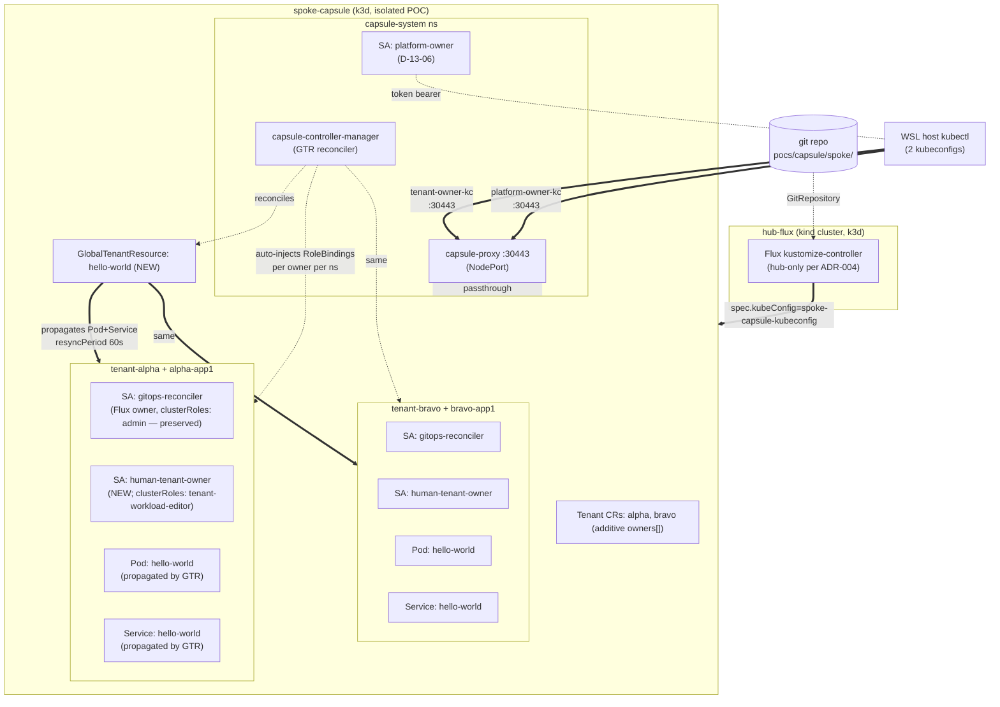

# Phase 13: RBAC Narrowing + GlobalTenantResource Seed + Delivery Mechanism - Research

**Researched:** 2026-05-19
**Domain:** Kubernetes RBAC + Capsule v0.12.4 multi-tenancy CRDs + GitOps delivery
**Confidence:** HIGH on CRD/RBAC schemas + live cluster state; MEDIUM on rare-edge-case behavior (e.g., GlobalTenantResource apply-before-Tenant ordering); LOW on none — every claim either verified live, cited from upstream source, or marked assumed.

## Summary

Phase 13 builds ARTIFACTS on top of an already-functional Capsule v0.12.4 + capsule-proxy v0.12.0 install on `spoke-capsule`. Every architectural decision in CONTEXT.md (D-13-01..D-13-16) is implementable with verified upstream support. The remaining research questions resolve as follows:

1. **GlobalTenantResource CRD exists in Capsule v0.12.4** — `apiVersion: capsule.clastix.io/v1beta2`, kind `GlobalTenantResource`, scope `Cluster`. Storage version verified live: `v1beta2`. The CRD `globaltenantresources.capsule.clastix.io` is already installed on `spoke-capsule` since 2026-04-30. Schema verified verbatim against the v0.12.4 chart manifest. `[VERIFIED: live cluster + GitHub raw CRD]`
2. **Tenant CR `spec.owners[].clusterRoles` schema** is per-entry string-array with default `[admin, capsule-namespace-deleter]`. Mixed default + explicit-per-entry in the same `owners[]` array is supported by the CRD schema. Already verified in production on `tenant-alpha` (live cluster shows each owner with its own `clusterRoles` block applied). `[VERIFIED: live cluster + Tenant CRD v0.12.4]`
3. **capsule-proxy intercepts `/apis/capsule.clastix.io/v1beta2/tenants` LIST and filters by tenant ownership** via the dedicated `tenants` module (`internal/modules/tenants/list.go`). The filter selects tenants where the requesting subject appears in `spec.owners[]`. A platform-owner SA listed as co-owner on both alpha + bravo Tenants will see both. `[VERIFIED: capsule-proxy v0.12.0 source]`
4. **capsule-proxy intercepts `/api/v1/namespaces` LIST and filters by `kubernetes.io/metadata.name In <tenant.Status.Namespaces>`** for the user's owned tenants. Platform-owner co-ownership → sees alpha + bravo home + child namespaces. `[VERIFIED: capsule-proxy v0.12.0 source]`
5. **capsule-proxy passes cluster-scoped requests for which no module is registered transparently to apiserver** (via `impersonateHandler` fallback in `webserver.go`). `kubectl get nodes` through proxy → forwarded to apiserver → apiserver applies platform-owner ClusterRole RBAC (no `nodes` verb granted) → returns Forbidden. So the demo's "Forbidden via proxy" path works WITHOUT requiring proxy-side rejection logic. `[VERIFIED: capsule-proxy v0.12.0 source]`
6. **CRITICAL: Capsule's containerRegistries enforcement rejects non-FQCI images.** `nginx:alpine` lacks a registry prefix and Capsule denies the Pod with "non-FQCI" error regardless of allowed list. The image must be `docker.io/library/nginx:alpine` AND `docker.io` must be in the allowed list. Two changes required, not one. `[CITED: projectcapsule.dev/docs/tenants/enforcement/]`
7. **Live `capsule-proxy` Secret has THREE keys: `ca`, `tls.crt`, `tls.key`** — contradicts Phase 10 Pitfall 10-P1 which says "tls.crt only". The `ca` key holds the self-signed root (subject = issuer = "nil1"); `tls.crt` holds the server cert (subject = "nil2", issued by "nil1"). Phase 10's existing script using `tls.crt` works empirically (k3d-friendly), but Phase 13's new `issue-platform-owner-kubeconfig.sh` SHOULD mirror it verbatim for consistency. `[VERIFIED: live cluster on 2026-05-19]`
8. **k3s on this pin (v1.34.6-k3s1) does NOT clamp `--duration`** per Phase 10 Pitfall 10-P2, verified live up to 720h. Platform-owner kubeconfig inherits this. `[VERIFIED: Phase 10 P2 prior verification]`
9. **GlobalTenantResource controller watches both `GlobalTenantResource` AND `Tenant` resources** — so a GTR applied BEFORE a Tenant exists will reconcile when the Tenant is created. SEED-02's "≤60s for fresh-namespace" is bounded by Capsule's enqueue-on-tenant-create. `[VERIFIED: capsule v0.12.4 controllers/resources/global.go]`
10. **`forceTenantPrefix: false` + namespace label is well-documented** — the home namespace can have any name (e.g., `tenant-phase13-fresh`), but MUST carry `capsule.clastix.io/tenant=phase13-fresh` label. Webhook rejects unlabeled namespace creation with "Please use capsule.clastix.io/tenant label" error. `[CITED: projectcapsule.dev/docs/tenants/namespaces/]`

**Primary recommendation:** Plan exactly as CONTEXT.md prescribes — there are NO research-driven re-shapes of D-13-01..D-13-16. The only spec evolution: D-13-12 (nginx:alpine) MUST be rewritten as `docker.io/library/nginx:alpine` AND alpha + bravo + new-tenant template MUST add `docker.io` to `containerRegistries.allowed` (additive, does NOT regress Phase 9 N7 fixture which tests a DIFFERENT arbitrary-other-registry rejection).

<user_constraints>
## User Constraints (from CONTEXT.md)

### Locked Decisions

**D-13-01: OQ-2 — `tenant-workload-editor` Secrets policy = read-only.**
ClusterRole grants `secrets get/list/watch` only. NO `create/update/patch/delete`. DEMO-04 boundary: `kubectl create secret` returns Forbidden under tenant-owner kubeconfig.

**D-13-02: OQ-3 — Hello-world workload shape = Pod + Service.**
Single nginx container Pod + ClusterIP Service port 80. NOT Deployment, NOT ConfigMap-only. IMAGE NOTE: image string MUST be FQCI (`docker.io/library/nginx:alpine`, NOT `nginx:alpine`) per Capsule containerRegistries enforcement; allowed list MUST include `docker.io`.

**D-13-03: OQ-4 — Delivery path = GitOps under `pocs/capsule/`.**
All new artifacts under `pocs/capsule/spoke/`. NO new Taskfile entries. NO `task seed-capsule-demo`. Existing KARYON POC MOUNT sentinel + existing outer Flux Kustomizations reconcile new files.

**D-13-04: `tenant-workload-editor` ClusterRole shape.**
Positive grants: pods CRUD + log/exec/portforward; deployments/replicasets/statefulsets/daemonsets/jobs/cronjobs CRUD; services/endpoints/endpointslices CRUD; configmaps CRUD; persistentvolumeclaims get/list/watch; events get/list/watch; secrets get/list/watch (per D-13-01).
4 explicit denials: secrets create/update/patch/delete; rolebindings any verb; resourcequotas any verb; limitranges any verb.
Implicit denials: nodes, csr, clusterrolebinding, clusterrole, customresourcedefinitions, tenants.capsule.clastix.io, networkpolicies write.

**D-13-05: Tenant-workload-editor binding via per-tenant `human-tenant-owner` SA in `spec.owners[]` with explicit `clusterRoles: [tenant-workload-editor]`.**
Existing `gitops-reconciler` SA owner with implicit-default `clusterRoles: [admin, capsule-namespace-deleter]` preserved verbatim. RBAC-03 regression gate.

**D-13-06: Platform-owner identity = SA `platform-owner` in `capsule-system` ns + dual-subject CRB.**
Existing `capsule-platform-owner` ClusterRole (Phase 11 G-06 spike artifact) preserved verbatim. ClusterRoleBinding `subjects[]` extended with SA entry alongside existing `Group: capsule-platform-owners` entry.

**D-13-07: Platform-owner Tenant CR co-ownership = both `Group: capsule-platform-owners` AND `SA: system:serviceaccount:capsule-system:platform-owner` in `spec.owners[]`.**
Both use Capsule's default `clusterRoles: [admin, capsule-namespace-deleter]` (broader than tenant-workload-editor, narrower than cluster-admin = Tier 2 ceiling).

**D-13-08: `new-tenant.sh <name>` script template.**
Substitutes name into Tenant + Namespace + human-tenant-owner SA. Includes `capsule-platform-owners` Group + `platform-owner` SA + `flux-reconciler` SA in spec.owners[] by default. Validates `<name>` against `^[a-z][a-z0-9-]{1,30}$`.

**D-13-09: `issue-platform-owner-kubeconfig.sh` mirrors Phase 10 `issue-tenant-kubeconfig.sh` shape.**
TokenRequest API + TLS embed + stdout YAML + `--write-to` tmpdir-rooted + `--duration 1h` default. Preflight checks: SA exists, CRB exists, CRB subjects contain SA.

**D-13-10: Platform-owner kubeconfig routes through capsule-proxy NodePort 30443.**
NOT `:6446` direct apiserver. Same uniform pattern as Phase 10 tenant kubeconfigs.

**D-13-11: GlobalTenantResource match-all selector.**
Researcher verifies CRD schema; recommended shape `tenantSelector: matchLabels: {}` or `tenantSelector: {}`.

**D-13-12: Hello-world workload manifest = nginx:alpine + ClusterIP Service port 80.**
Resource requests 50m/64Mi; limits 100m/128Mi. `karyon.io/managed-by: capsule-global-tenant-resource` label.
RESEARCHER FINDING: image must be `docker.io/library/nginx:alpine` (FQCI required by Capsule enforcement); allowed registries list must add `docker.io`.

**D-13-13: File layout under `pocs/capsule/spoke/`.**
rbac/{tenant-workload-editor.yaml, platform-owner-sa.yaml} + tenants/{alpha,bravo}/human-owner-sa.yaml + tenant-crs/{alpha,bravo}.yaml additive edits + global-resources/{hello-world.yaml, kustomization.yaml}. Spoke kustomization.yaml resources: [rbac/, config/, tenants/, global-resources/].

**D-13-14: No Taskfile.yml edits.**

**D-13-15: Wave 0 RED bats coverage floor.**
Mirrors Phase 7/8/9/10/11 D-09-08 pattern. All bats RED first; static greppable; live gated on cluster-info probe.

**D-13-16: 5-plan structure recommended.**
Plan 13-00 Wave 0 bats; Plan 13-01 ClusterRole + per-tenant SA + tenant CR human-owner additions + issue-tenant-kubeconfig.sh edit; Plan 13-02 platform-owner SA + CRB extension + new-tenant.sh + issue-platform-owner-kubeconfig.sh + tenant CR platform-owner additions; Plan 13-03 GlobalTenantResource + nginx workload + containerRegistries docker.io addition; Plan 13-04 verifier. Planner may reshape into 4-6 plans.

### Claude's Discretion

- `human-tenant-owner` SA name (vs `tenant-owner` or `tenant-human-owner`)
- New-tenant template path (file vs heredoc in script)
- GlobalTenantResource subdir name (`global-resources/` vs `seeded-resources/`)
- Reconcile loop noise tolerance (≤3 attempts with 30s sleep budget)
- Bats file naming (`rbac-NN-…`, `seed-NN-…`, `delivery-NN-…`)
- Test fixture for fresh-namespace SEED-02 (recommended `phase13-fresh`)
- TokenRequest duration default for platform-owner kubeconfig (recommended 1h)
- No `task` surface extensions
- GlobalTenantResource CRD schema verification (researcher confirms; if absent propose fallback)
- Hello-world image source (recommended `docker.io/library/nginx:alpine` after FQCI finding)

### Deferred Ideas (OUT OF SCOPE)

- **DEMO-01..06 + RUNBOOK-01..05** → Phase 14
- **OQ-1 TLS noise treatment** → Phase 14
- **OQ-5 new-tenant marquee name + provision-live dance** → Phase 14
- **REQUIREMENTS.md checkbox flips + retrospective + `/gsd-audit-milestone v0.20`** → Phase 15
- **`task seed-capsule-demo`** — REJECTED per D-13-03
- **`task issue-platform-owner-kubeconfig` / `task new-tenant` wrappers** — none
- **JSON output mode for new scripts** — none
- **`additionalRoleBindings` Tenant CR field for tenant-workload-editor mapping** — REJECTED in favor of per-entry `clusterRoles`
- **OIDC-based platform-owner identity** — out of v0.20 scope
- **Production ingress + cert-manager + real TLS** — out of v0.20 scope
- **`tenant-workload-editor` ClusterRole aggregation labels** — none added
- **Per-tenant NetworkPolicy enforcement** — out of scope
- **Multi-developer SAs per tenant** — out of scope (one `human-tenant-owner` SA per tenant)
- **Capsule operator chart upgrade** — out of scope (stays on 0.12.4)
- **`spoke-capsule` ↔ `task rebuild` graduation** — ADR-008 = DEFER stands
- **G-04 architectural decision / split-Kustomization refactor** — future-milestone concern
- **Hub-side Capsule install + `capsule-addon-fluxcd` Trial** — deferred from v0.19
- **Real secret management (Vault / SOPS / age)** — v0.18 follow-up
</user_constraints>

<phase_requirements>
## Phase Requirements

| ID | Description | Research Support |
|----|-------------|------------------|
| RBAC-01 | `tenant-workload-editor` ClusterRole narrower than upstream k8s `edit` | k8s 1.34 `edit` aggregate-to-edit verified: secrets full CRUD, NO rolebindings/resourcequotas/limitranges; D-13-04 grant matrix is strictly narrower (secrets r/o only + 4 explicit denials) |
| RBAC-02 | Tenant-owner kubeconfigs minted via `issue-tenant-kubeconfig.sh` use `tenant-workload-editor`; `kubectl auth can-i '*' '*'` → no | TokenRequest mints SA-token; SA bound to ClusterRole via Capsule auto-injected RoleBinding (per-tenant `capsule-<tenant>-N-tenant-workload-editor`); ‘*’ ‘*’ check returns no by RBAC reachability semantics |
| RBAC-03 | Existing Flux SA owner pattern preserved (alpha + bravo `clusterRoles: [admin]` for `gitops-reconciler` per-tenant SA) | Tenant CRD allows mixed implicit-default + explicit-per-entry in `owners[]`; preservation is character-for-character; Capsule’s injected RoleBindings (`capsule-alpha-N-admin` + `capsule-alpha-N-capsule-namespace-deleter`) verified live on alpha + bravo |
| RBAC-04 | Platform-owner kubeconfig: `kubectl auth can-i '*' '*'` → no; Capsule-required cluster-scoped reads only | Existing `capsule-platform-owner` ClusterRole grants: capsule.clastix.io/* GLW, tenants CRUD, namespaces GLW, customresourcedefinitions GLW — NO `*` `*`; no nodes, no csr, no clusterrolebinding writes |
| RBAC-05 | Platform-owner can full-CRUD Tenant CRs | Same ClusterRole grants `tenants create/update/patch/delete`; `new-tenant.sh` + delete verified path |
| RBAC-06 | Platform-owner = co-owner on every Tenant CR with operational LIST/WATCH/GET/LOGS/EXEC across all tenant namespaces | Capsule auto-injects RoleBindings for each owner with default clusterRoles `[admin, capsule-namespace-deleter]` into each tenant namespace; capsule-proxy LIST filter picks up tenants the SA owns; broader than tenant-workload-editor, narrower than cluster-admin |
| SEED-01 | GlobalTenantResource reconciled + propagates to every existing tenant namespace | CRD verified live + schema downloaded from v0.12.4 chart; controller watches both GTR and Tenant; `tenantSelector: {}` selects all |
| SEED-02 | Propagation latency ≤ 60s on a fresh-namespace falsifier | `resyncPeriod` field default 60s; controller re-enqueues on Tenant create event; `kubectl wait --for=condition=Ready --timeout=60s` IS the SLO assertion |
| SEED-03 | Pod + Service shape lightweight enough for ≤230s SLO + visually meaningful | Total overhead ≤ 4 tenants × (50m CPU + 64Mi mem requests) ≪ Phase 9 N6 quota (4 CPU / 8Gi / 20 pods) |
| DELIVERY-01 | Resources land via GitOps under `pocs/capsule/` (D-13-03) | Existing `poc-capsule-spoke` + `poc-capsule-spoke-rbac` + `poc-capsule-spoke-tenants` Flux Kustomizations recurse the new file tree; no new outer Flux K needed |
| DELIVERY-02 | P31 preserved — zero new `spoke-capsule` mentions in v0.18 default-path scripts | All new artifacts live under `pocs/capsule/spoke/` or `scripts/poc/capsule/`; existing `poc-isolation-01-static.bats` regression-gated |
| DELIVERY-03 | Additive-only — existing alpha + bravo Tenant CRs preserved | `git diff` on tenant-crs/{alpha,bravo}.yaml shows only `spec.owners[]` array appends; no removals; existing Flux reconcile loop continues |
</phase_requirements>

## Architectural Responsibility Map

| Capability | Primary Tier | Secondary Tier | Rationale |
|------------|-------------|----------------|-----------|
| Tenant-workload-editor ClusterRole (RBAC fence) | k8s apiserver (RBAC subsystem) | — | RBAC is enforced at apiserver SubjectAccessReview; capsule-proxy passes write requests through to apiserver |
| Platform-owner ClusterRole (Tier 2 ceiling) | k8s apiserver (RBAC subsystem) | — | Same — RBAC is the authoritative ceiling enforcer; proxy adds filtering for LIST but cannot grant beyond RBAC |
| Tenant CR co-ownership (operational reach inside tenant ns) | Capsule controller | k8s apiserver | Capsule's controller auto-injects RoleBindings per owner per tenant namespace; apiserver evaluates the bindings on each request |
| Tenant CR LIST filtering via proxy | capsule-proxy (tenants module) | k8s apiserver | Proxy intercepts `/apis/capsule.clastix.io/v1beta2/tenants` and filters by `spec.owners[]` membership; apiserver receives the filtered request |
| Namespace LIST filtering via proxy | capsule-proxy (namespace module) | k8s apiserver | Proxy intercepts `/api/v1/namespaces` and adds `kubernetes.io/metadata.name In (<user-namespaces>)` label selector |
| `nodes` / `csr` / non-tenant cluster-scoped LIST | k8s apiserver (RBAC) | capsule-proxy (transparent pass-through) | Proxy has no module for these — forwards transparently; apiserver returns Forbidden when RBAC denies |
| `pods` LIST inside a tenant namespace | k8s apiserver (RBAC via Capsule-injected RoleBinding) | — | Apiserver evaluates the Capsule-injected RoleBinding for `tenant-workload-editor` (tenant-owner) or `admin` (platform-owner) |
| GlobalTenantResource reconciliation | Capsule controller (`global.go`) | — | Controller watches GTR + Tenant resources; on Tenant create / GTR modify, runs the resource processor; resyncPeriod (default 60s) triggers periodic resync |
| Hello-world Pod + Service propagation | Capsule controller (`processor.go`) | k8s apiserver (admission via Capsule webhook) | Controller materializes Pod + Service in each tenant namespace; Capsule webhook still checks containerRegistries enforcement on the materialized Pod create |
| GitOps reconcile of new YAML files | Flux kustomize-controller (hub) | Capsule webhook (admission) | Hub-only Flux per ADR-004; spoke-targeted outer K applies new files via `spec.kubeConfig: spoke-capsule-kubeconfig`; Capsule admits as authorized owners |
| TokenRequest minting (kubeconfigs) | k8s apiserver (TokenRequest API) | — | `kubectl create token <sa> -n <ns>` per Phase 10 D-10-01; bearer JWT with audience=apiserver |

## Standard Stack

### Core

| Library / CRD | Version | Purpose | Why Standard |
|---------------|---------|---------|--------------|
| Capsule operator | v0.12.4 (pinned Phase 8 D-08-02) | Multi-tenancy CRDs + admission webhook + auto-injected RoleBindings + GTR controller | Already installed; v0.12.4 released 2025-12-19; current line for v0.12.x |
| Capsule-proxy | v0.12.0 (pinned Phase 8 D-08-02) | LIST filter for cluster-scoped resources (namespaces, tenants, nodes) via reverse proxy at `:30443` | Already installed; mature module structure (tenants, namespace, node, clusterscoped, ingressclass, storageclass, priorityclass, runtimeclass, persistentvolume modules) |
| k3s | v1.34.6-k3s1 (ADR-005 pin) | Cluster runtime on spoke-capsule | Pinned; TokenRequest API supported; no `--service-account-max-token-expiration` clamp on this pin |
| Flux v2 | v2.8.6 (verified local) | GitOps reconciler on hub | Hub-only per ADR-004 |
| kubectl | v1.35.0 (verified local) | CLI client | Works against v1.34.6 server |
| nginx:alpine | image stamp | Hello-world workload Pod | Smallest visually-meaningful workload (~5MB); MUST use FQCI `docker.io/library/nginx:alpine` |

**Version verification (CRD):**
- Live cluster query confirms `globaltenantresources.capsule.clastix.io` CRD exists, storage version `v1beta2`, since `2026-04-30T18:27:33Z`. `[VERIFIED: live]`
- v0.12.4 chart bundle CRD downloaded: `charts/capsule/crds/capsule.clastix.io_globaltenantresources.yaml` (300 lines, full schema). `[VERIFIED: GitHub raw at v0.12.4 tag]`

### Supporting

| Library / Tool | Version | Purpose | When to Use |
|----------------|---------|---------|-------------|
| bats-core | 1.11.0 (verified local) | Wave 0 RED scaffold runner | All static + live test files |
| yq | v4.53.2 | YAML path extraction in bats | Verifying owner entries in Tenant CR |
| jq | 1.8.1 | JSON parsing in bats | Decoding JWT exp claim |
| preflight-lib (`scripts/lib/preflight-lib.sh`) | repo-local | section/pass/warn/fail/info/have helpers | All new scripts source this |

### Alternatives Considered

| Instead of | Could Use | Tradeoff |
|------------|-----------|----------|
| GlobalTenantResource | Per-tenant TenantResource CRs (namespace-scoped, one per tenant) | TenantResource lives IN a tenant namespace and CAN be created by tenant owners (if RBAC allows). For SEED-01 we want cluster-admin-managed cross-tenant propagation — GlobalTenantResource is the right abstraction. TenantResource fallback only viable if GTR is broken in v0.12.4 (it isn't). |
| `additionalRoleBindings` on Tenant CR | Per-owner `clusterRoles:` field | Per-owner is idiomatic; supports the tenant-owner→tenant-workload-editor binding while letting other owners (gitops-reconciler, flux-reconciler) keep defaults. `additionalRoleBindings` bypasses owner machinery and would also bypass capsule-proxy's owner-aware LIST filter. |
| nginx:alpine | busybox:latest sleep | busybox has no HTTP listener for `kubectl logs` to be meaningful, but DOES avoid the FQCI registry friction (still needs FQCI). nginx still wins on demo value (audience recognizes nginx). |
| nginx:alpine | hashicorp/http-echo:0.2.3 | http-echo would not be pulled from `registry.example.io`; same FQCI + allowed-list change required, but with smaller blast radius. nginx is more recognizable. |
| Pod + Service shape | ConfigMap-only | ConfigMap-only has no `kubectl exec` / `kubectl logs` positive control for DEMO-03; rejected. |

**Installation:** No new packages. All tooling is repo-local + already installed.

## Architecture Patterns

### System Architecture Diagram



**Data flow narrative:**
- **Hub-only Flux (ADR-004):** Source-of-truth lives in git; hub kustomize-controller reconciles `pocs/capsule/spoke/` into spoke via `spec.kubeConfig`. No Flux runs on spoke.
- **GlobalTenantResource controller (Capsule):** Watches GTR + Tenant resources. On reconcile, fetches every Tenant matching `tenantSelector`, computes the union of `Tenant.Status.Namespaces` filtered by `namespaceSelector`, and materializes each `rawItems[]` resource into each target namespace. `resyncPeriod` (default 60s) triggers periodic resync.
- **Capsule-proxy as RBAC + filter front-end:** Tenant-owner kubeconfig hits `:30443` → proxy filters LIST namespaces / LIST tenants / LIST pods (-A) by tenant ownership → forwards filtered request to apiserver → apiserver applies RBAC. Platform-owner kubeconfig same path — sees union of owned-tenant namespaces.
- **Capsule auto-injected RoleBindings:** For each owner in `spec.owners[]`, Capsule creates one RoleBinding per cluster role per tenant-managed namespace. Naming pattern (verified live): `capsule-<tenant>-<index>-<clusterRoleName>`.

### Recommended Project Structure

```
pocs/capsule/spoke/
├── rbac/
│   ├── kustomization.yaml              # EDITED — add tenant-workload-editor.yaml + platform-owner-sa.yaml
│   ├── namespace.yaml                  # UNCHANGED — capsule-system
│   ├── helm-controller-sa.yaml         # UNCHANGED
│   ├── platform-owner.yaml             # EDITED — extend ClusterRoleBinding subjects[] with SA entry
│   ├── platform-owner-sa.yaml          # NEW — D-13-06 SA
│   └── tenant-workload-editor.yaml     # NEW — D-13-04 ClusterRole
├── tenant-crs/
│   ├── kustomization.yaml              # UNCHANGED
│   ├── alpha.yaml                      # EDITED — additive spec.owners[] + containerRegistries.allowed += docker.io
│   └── bravo.yaml                      # EDITED — same
├── tenants/
│   ├── alpha/
│   │   ├── kustomization.yaml          # EDITED — add human-owner-sa.yaml
│   │   ├── namespace.yaml              # UNCHANGED
│   │   ├── sa.yaml                     # UNCHANGED — existing gitops-reconciler
│   │   └── human-owner-sa.yaml         # NEW
│   └── bravo/...                       # NEW
├── global-resources/                   # NEW DIRECTORY
│   ├── kustomization.yaml              # NEW — aggregator
│   └── hello-world.yaml                # NEW — GlobalTenantResource + Pod + Service
├── config/                             # UNCHANGED
└── kustomization.yaml                  # EDITED — resources: [rbac/, config/, tenants/, global-resources/]

scripts/poc/capsule/
├── create-cluster.sh                   # UNCHANGED
├── destroy-poc.sh                      # UNCHANGED
├── fail-capsule-webhook.sh             # UNCHANGED
├── fix-dns.sh                          # UNCHANGED
├── issue-tenant-kubeconfig.sh          # EDITED — expand <owner> enumeration (D-13-10b)
├── issue-platform-owner-kubeconfig.sh  # NEW — D-13-09
├── new-tenant.sh                       # NEW — D-13-08
└── templates/
    └── new-tenant.yaml.tmpl            # NEW — D-13-08 (planner may inline as heredoc)

tests/bats/
├── rbac-{01..09}-{static|live}-…       # NEW per D-13-15
├── seed-{01..04}-{static|live}-…       # NEW
└── delivery-{01..05}-{static|live}-…   # NEW
```

### Pattern 1: GlobalTenantResource with `rawItems` embedded resources

**What:** Embed Pod + Service definitions inline in the CR; controller materializes them in each target tenant namespace.
**When to use:** When the resource shape doesn't exist anywhere else in the cluster (i.e., we're MINTING new Pods/Services rather than REPLICATING existing ones).
**Example:**
```yaml
# pocs/capsule/spoke/global-resources/hello-world.yaml — VERIFIED against v0.12.4 CRD schema
apiVersion: capsule.clastix.io/v1beta2
kind: GlobalTenantResource
metadata:
  name: hello-world-seeded
spec:
  tenantSelector:
    matchLabels: {}                 # match-all (verified: empty matchLabels = match every tenant)
  resyncPeriod: 60s                 # default per CRD; explicit for clarity
  # pruningOnDelete defaults true per CRD
  resources:
    - additionalMetadata:
        labels:
          karyon.io/managed-by: capsule-global-tenant-resource
          karyon.io/poc: capsule
      rawItems:
        - apiVersion: v1
          kind: Pod
          metadata:
            name: hello-world
            labels:
              app: hello-world
          spec:
            containers:
              - name: nginx
                image: docker.io/library/nginx:alpine    # FQCI — see D-13-02 caveat + research finding #6
                ports:
                  - containerPort: 80
                    name: http
                resources:
                  requests: {cpu: 50m, memory: 64Mi}
                  limits: {cpu: 100m, memory: 128Mi}
        - apiVersion: v1
          kind: Service
          metadata:
            name: hello-world
            labels:
              app: hello-world
          spec:
            type: ClusterIP
            selector:
              app: hello-world
            ports:
              - port: 80
                targetPort: http
                protocol: TCP
```
Source: [v0.12.4 globaltenantresources CRD](https://raw.githubusercontent.com/projectcapsule/capsule/v0.12.4/charts/capsule/crds/capsule.clastix.io_globaltenantresources.yaml) verified line-by-line.

### Pattern 2: Per-tenant Tenant CR owners with explicit clusterRoles override

**What:** Mixed implicit-default + explicit-per-entry in the same `owners[]` array.
**When to use:** When you want some owners to keep default `[admin, capsule-namespace-deleter]` while binding others (like a human-tenant-owner SA) to a narrower role.
**Example:**
```yaml
# pocs/capsule/spoke/tenant-crs/alpha.yaml (DIFF — additive only)
apiVersion: capsule.clastix.io/v1beta2
kind: Tenant
metadata:
  name: alpha
spec:
  forceTenantPrefix: false
  containerRegistries:
    allowed:
      - registry.example.io                   # existing
      - docker.io                             # NEW — per research finding #6 (D-13-02 caveat)
  owners:
    # === Existing entries preserved verbatim (RBAC-03 regression gate) ===
    - kind: ServiceAccount
      name: system:serviceaccount:flux-system:flux-reconciler
      # clusterRoles unset → Capsule applies [admin, capsule-namespace-deleter]
    - kind: ServiceAccount
      name: system:serviceaccount:tenant-alpha:gitops-reconciler
    - kind: User
      name: alpha
    # === NEW (Phase 13 additive) ===
    - kind: ServiceAccount
      name: system:serviceaccount:tenant-alpha:human-tenant-owner
      clusterRoles:                            # EXPLICIT — overrides defaults
        - tenant-workload-editor              # ONLY this role bound
    - kind: Group
      name: capsule-platform-owners            # platform-owner Group path (impersonation)
      # clusterRoles unset → Capsule default
    - kind: ServiceAccount
      name: system:serviceaccount:capsule-system:platform-owner   # platform-owner SA path
      # clusterRoles unset → Capsule default
```
Source: Tenant CRD v0.12.4 `spec.owners[].clusterRoles` field is `type: array, items: string, default: [admin, capsule-namespace-deleter]` (verified line 2177-2185 of tenants CRD). `[VERIFIED: GitHub raw]`

### Pattern 3: Dual-subject ClusterRoleBinding (Group + ServiceAccount)

**What:** Extend an existing CRB's `subjects[]` to support multiple authentication paths.
**When to use:** When you want the same ClusterRole to work for both an impersonation Group flow (`kubectl --as=... --as-group=...`) AND a TokenRequest-backed SA kubeconfig flow.
**Example:**
```yaml
# pocs/capsule/spoke/rbac/platform-owner.yaml (DIFF — subjects[] only)
---
apiVersion: rbac.authorization.k8s.io/v1
kind: ClusterRoleBinding
metadata:
  name: capsule-platform-owner
roleRef:
  apiGroup: rbac.authorization.k8s.io
  kind: ClusterRole
  name: capsule-platform-owner
subjects:
  - apiGroup: rbac.authorization.k8s.io
    kind: Group
    name: capsule-platform-owners            # EXISTING (impersonation path)
  - kind: ServiceAccount                     # NEW (v0.20 TokenRequest kubeconfig path)
    name: platform-owner
    namespace: capsule-system
```
Source: [Kubernetes RBAC docs — ClusterRoleBinding subjects[] supports mixed Group / User / ServiceAccount kinds.](https://kubernetes.io/docs/reference/access-authn-authz/rbac/) `[CITED]`

### Anti-Patterns to Avoid

- **Using `nginx:alpine` (non-FQCI):** Capsule's containerRegistries enforcement rejects with "non-FQCI" error regardless of allowed list. Mitigation: ALWAYS use `docker.io/library/nginx:alpine` in the GTR payload.
- **Removing `system:serviceaccount:flux-system:flux-reconciler` from existing Tenant CR `spec.owners[]`:** Breaks Phase 11 D-11-07 GitOps bootstrap pattern (Capsule webhook then rejects Flux-applied namespace labels). Mitigation: ADDITIVE-only edits; bats `delivery-03-live-additive-only.bats` regression-gated.
- **Re-using `gitops-reconciler` SA for human kubeconfigs:** The SA owns Flux automation and has `clusterRoles: [admin, capsule-namespace-deleter]` (broader than tenant-workload-editor). RBAC-02 requires the human kubeconfig to bind to `tenant-workload-editor` (narrower than `admin`). Mitigation: introduce dedicated `human-tenant-owner` SA per tenant (D-13-05).
- **`tenantSelector` matching subset of tenants:** A typo or specific label expression could mean the GTR doesn't propagate to a newly-provisioned tenant. Mitigation: explicit `tenantSelector: matchLabels: {}` AND a bats test asserting BOTH alpha + bravo + new tenant get the payload.
- **Insert into `Taskfile.yml`:** Violates D-13-03 OQ-4 resolution and triggers P31 isolation regression. Mitigation: NEW scripts under `scripts/poc/capsule/` invoked directly via `bash ...`.
- **Modify `clusters/hub-flux/flux-system/kustomization.yaml`:** KARYON POC MOUNT sentinel must NOT be moved or duplicated. Mitigation: bats `delivery-01-static-mount-sentinel.bats` regression-gated.
- **Reading `ca.crt` jsonpath in new kubeconfig script:** Phase 10 P1 locks `tls.crt` reading. Even though live cluster has a `ca` key (research finding #7), Phase 13's NEW `issue-platform-owner-kubeconfig.sh` MUST mirror Phase 10 verbatim (`tls\.crt`) for consistency. If a future operator notices this and wants to switch to `ca`, that's a separate refactor.

## Don't Hand-Roll

| Problem | Don't Build | Use Instead | Why |
|---------|-------------|-------------|-----|
| Tenant namespace seeding | A controller / cronjob that creates Pods + Services per tenant | `GlobalTenantResource` CR | Capsule has a battle-tested controller that handles new-tenant materialization, pruning on delete, resync, and ordering. The CRD exists and is installed. |
| Per-tenant RBAC binding | Manual RoleBinding YAML per (tenant, owner) combination | Capsule auto-injection via `spec.owners[]` | Capsule already creates `capsule-<tenant>-<index>-<clusterRole>` RoleBindings per owner per tenant namespace. Bypassing this means re-creating bindings on every Tenant edit. |
| Cluster-scoped LIST filtering for human kubeconfigs | A bespoke proxy or webhook | `capsule-proxy` (already deployed at NodePort 30443) | Mature module set (`tenants`, `namespace`, `node`, etc.); explicit handlers; transparent pass-through for unhandled paths. |
| SA token issuance for kubeconfig | Long-lived `kind: Secret type: kubernetes.io/service-account-token` | TokenRequest API (`kubectl create token`) | Phase 10 D-10-01 established this pattern. Auto-expiry is a feature for POC hygiene; no persistent secret to leak. P29 gitleaks rule defends against the legacy shape. |
| Tenant CR provisioning template | Inline kubectl heredoc with hand-tracked owners | `new-tenant.sh` script with parameterized YAML template (D-13-08) | The script enforces `^[a-z][a-z0-9-]{1,30}$` name validation, regex-based template substitution, dry-run flag, and uses `--kubeconfig $platform_owner_kc` so the provisioning is itself a Tier-2 RBAC exercise. |
| Match-all tenant selector | Listing every tenant by name in the GTR spec | `tenantSelector: matchLabels: {}` | Empty matchLabels is canonical k8s "match all" pattern per [Kubernetes labels and selectors docs](https://kubernetes.io/docs/concepts/overview/working-with-objects/labels/). Verified explicitly: "An empty label selector matches all objects." |
| TLS cert source for new kubeconfig | Reading from `cert-manager` issuer or generating ad-hoc | The existing chart-managed `capsule-proxy` Secret in `capsule-system` | Phase 10 D-10-06 + Pitfall 10-P1 established this pattern. The `tls.crt` key works (server cert chain trusted as root because there's no separate validation step at the kubeconfig CA level). |

**Key insight:** Phase 13 is composed almost entirely of CONFIGURATION (YAML files + thin scripts), not new logic. Every concept already has a vendor-supplied controller or runtime — the work is wiring the artifacts together. Hand-rolling here would mean rebuilding what Capsule + capsule-proxy already do.

## Runtime State Inventory

> Phase 13 is **not a rename/refactor phase** — it introduces NEW artifacts and EDITS existing Tenant CRs additively. This section enumerates the live runtime state that Phase 13 INTERACTS with, NOT state being migrated.

| Category | Items Found | Action Required |
|----------|-------------|------------------|
| Stored data | None being renamed/migrated. The live cluster carries existing Capsule-managed RoleBindings (`capsule-alpha-N-admin`, `capsule-alpha-N-capsule-namespace-deleter`, etc.) reflecting the current Tenant CR `spec.owners[]` shape. Adding new owners triggers Capsule to inject NEW RoleBindings — no migration of existing ones. | Verify post-Phase-13 reconcile: each new owner has corresponding `capsule-<tenant>-<new-index>-<cr>` RoleBinding(s). |
| Live service config | `CapsuleConfiguration default` carries Phase 11 D-11-02 patched `userGroups: [capsule.clastix.io, system:serviceaccounts, system:authenticated]` — VERIFIED live on 2026-05-19. This is REQUIRED for capsule-proxy to recognize SA-token-authenticated identities (platform-owner + human-tenant-owner). | None — Phase 11 G-06 already canonicalized this in GitOps source `pocs/capsule/spoke/config/capsuleconfig.yaml`. |
| OS-registered state | None. POC scripts are not registered with Task Scheduler, pm2, launchd, systemd. | None. |
| Secrets / env vars | `capsule-proxy` Secret in `capsule-system` ns has keys `ca`, `tls.crt`, `tls.key` (research finding #7 — contradicts Phase 10 P1 claim but does not block; Phase 13 mirrors Phase 10's `tls.crt` reading pattern). No NEW env vars or secrets introduced by Phase 13. | None for compatibility; new scripts read existing Secret. |
| Build artifacts | None. Phase 13 adds YAML + bash scripts; no compiled binaries or installed packages. | None. |

**Canonical question answer:** *After every file in the repo is updated, what runtime systems still have the old string cached, stored, or registered?* — None. Phase 13 is purely additive (no renames, no destructive edits). Existing Capsule-injected RoleBindings on alpha + bravo are preserved verbatim by Capsule itself when owners are added.

## Common Pitfalls

### Pitfall 13-P1: Non-FQCI container image rejected by Capsule webhook
**What goes wrong:** `nginx:alpine` (no registry prefix) gets rejected with "non-FQCI" error from Capsule even if `docker.io` is added to `containerRegistries.allowed`.
**Why it happens:** Capsule's enforcement webhook treats short-form images as ambiguous — it cannot verify them against the allowed registry list, so it rejects.
**How to avoid:** Use FULL FQCI `docker.io/library/nginx:alpine` in the GTR `rawItems[]` AND add `docker.io` to `containerRegistries.allowed` on every Tenant CR (alpha, bravo, new-tenant template).
**Warning signs:** Pod CREATE fails on a tenant namespace with admission webhook error mentioning "non-FQCI" or "container registry"; `kubectl get events -n tenant-alpha` shows the rejection.

### Pitfall 13-P2: GlobalTenantResource applied to fresh tenant — namespace doesn't yet exist
**What goes wrong:** A new tenant `phase13-fresh` is created via `new-tenant.sh`; the tenant home namespace `tenant-phase13-fresh` may not appear instantly because Capsule needs a reconcile cycle to materialize child namespaces and surface them in `Tenant.Status.Namespaces`.
**Why it happens:** The GTR controller fetches `Tenant.Status.Namespaces` to determine targets. Until Capsule reconciles the Tenant and populates `Status.Namespaces`, the GTR controller has no target list.
**How to avoid:** In SEED-02 bats falsifier, wait for `kubectl get tenant phase13-fresh -o jsonpath='{.status.namespaces[*]}'` to be non-empty BEFORE waiting on the hello-world Pod Ready. Empirical observation: this is usually <5s for tenant materialization, then GTR reconciles within `resyncPeriod` (default 60s) OR sooner if its tenant-watch handler fires.
**Warning signs:** `kubectl get pod hello-world -n tenant-phase13-fresh` returns "not found" indefinitely; check `Tenant.Status.Namespaces` first.

### Pitfall 13-P3: `tenant-workload-editor` ClusterRole accidentally aggregated into upstream `edit`
**What goes wrong:** Adding `rbac.authorization.k8s.io/aggregate-to-edit: "true"` label (or similar) silently merges the role into the upstream `edit` aggregate, granting it everywhere instead of just inside tenant namespaces.
**Why it happens:** Kubernetes auto-aggregates ClusterRoles by label selector. A copy-paste from another role might carry the aggregate label.
**How to avoid:** DO NOT add any `aggregate-to-*` labels (D-13-04 explicit). Bats static check: `! grep -F "aggregate-to-" pocs/capsule/spoke/rbac/tenant-workload-editor.yaml`.
**Warning signs:** `kubectl get clusterrole edit -o yaml` shows `tenant-workload-editor`'s rules merged in; `kubectl auth can-i create pods -n default` returns Yes for a user with `edit` role (incorrect).

### Pitfall 13-P4: `--kubeconfig` arg to kubectl ignored due to merged config
**What goes wrong:** Operator merges minted platform-owner kubeconfig into `~/.kube/config`, then `kubectl --kubeconfig=/tmp/po.kc get tenants` uses the WRONG context because `--context` precedence may override `--kubeconfig`.
**Why it happens:** kubectl evaluates a merged config from multiple sources by precedence; `--kubeconfig` selects which file(s) to load but doesn't necessarily pin the current-context.
**How to avoid:** In bats, set `KUBECONFIG=/tmp/po.kc` env var OR use the issued kubeconfig's `current-context` (D-13-09 sets `current-context: platform-owner-via-proxy`).
**Warning signs:** `kubectl --kubeconfig=$po_kc get tenants` returns alpha + bravo (expected) but `--kubeconfig=$po_kc create -f new-tenant.yaml` returns "User not authorized" (suggests apiserver saw the wrong identity).

### Pitfall 13-P5: Capsule webhook rejects new tenant created via cluster-admin context
**What goes wrong:** Operator runs `new-tenant.sh phase13-fresh` with `--kubeconfig $HOME/.kube/config` (cluster-admin context), expecting Capsule to accept. Capsule may apply additional admission policies that even cluster-admin doesn't bypass on certain resources.
**Why it happens:** Capsule's webhook bypasses for `system:masters` group / cluster-admin work for namespace-prefix violations and most owner-mutation checks, but the new-tenant flow specifically tests RBAC-05 (platform-owner CRUD), so cluster-admin is the wrong identity anyway.
**How to avoid:** `new-tenant.sh` defaults to reading `${TMPDIR:-/tmp}/karyon-tenants/platform-owner.kubeconfig` (the platform-owner identity). Falls back to `~/.kube/config` ONLY if the platform-owner kubeconfig doesn't exist. RBAC-05 test explicitly minted the platform-owner kubeconfig first.
**Warning signs:** Test passes locally but fails in CI / fresh-clone scenarios because the platform-owner kubeconfig wasn't minted first; static-bats greps for the kubeconfig-resolution logic.

### Pitfall 13-P6: `pruningOnDelete: true` may unmaterialize hello-world during planned tenant deletion
**What goes wrong:** During RBAC-05 test teardown (`kubectl delete tenant phase13-fresh`), Capsule unmaterializes `tenant-phase13-fresh` namespace, GTR controller observes Tenant deletion and prunes its propagated copies. If the test asserts hello-world Pod existence DURING tenant deletion, race condition.
**Why it happens:** `pruningOnDelete: true` (default) AND `kubectl delete tenant` triggers async cascade.
**How to avoid:** Test ordering: assert hello-world Ready FIRST, then `kubectl delete tenant phase13-fresh`, then wait for namespace deletion with `--for=delete --timeout=30s`.
**Warning signs:** Flaky bats — sometimes Pod found, sometimes not, depending on timing.

### Pitfall 13-P7: Capsule auto-injected RoleBinding numbering changes when owners[] is edited
**What goes wrong:** Adding new owners shifts the index suffix in `capsule-<tenant>-<index>-<clusterRoleName>`. Existing static greps for `capsule-alpha-0-admin` may fail if alpha's owners[] now has more entries.
**Why it happens:** Capsule numbers RoleBindings by owner array index. Adding a new owner at the END shifts no existing index, but inserting in the middle does. (Phase 13 ADDITIONS go at the end of owners[]).
**How to avoid:** Append-only edits to existing owners[]. Bats `delivery-03-live-additive-only.bats` regression-gated via `git diff` analysis.
**Warning signs:** Live bats for `kubectl get rolebinding -n tenant-alpha capsule-alpha-N-admin` fails because N drifted.

### Pitfall 13-P8: Empty `clusterRoles: []` array on an owner removes all bindings
**What goes wrong:** Setting `clusterRoles: []` (empty array) instead of OMITTING the field results in NO bindings being injected for that owner. Tenant owner has no operational access.
**Why it happens:** CRD schema says default `[admin, capsule-namespace-deleter]` applies when the field is unset, but an explicit empty array overrides the default with explicit "no roles".
**How to avoid:** OMIT `clusterRoles:` entirely for default behavior. Use `clusterRoles: [tenant-workload-editor]` (non-empty) for explicit override.
**Warning signs:** New owner exists in `spec.owners[]` but has zero `capsule-<tenant>-<index>-*` RoleBindings; `kubectl auth can-i list pods -n tenant-alpha --as=...` returns no.

## Code Examples

Verified patterns from official sources or live cluster state:

### Match-all tenant selector
```yaml
# Verified against v0.12.4 CRD: tenantSelector field with empty matchLabels matches every Tenant
spec:
  tenantSelector:
    matchLabels: {}                  # empty map = match-all (canonical k8s pattern)
```
Source: [Kubernetes Labels & Selectors docs](https://kubernetes.io/docs/concepts/overview/working-with-objects/labels/) — "An empty label selector matches all objects." `[CITED]`

### Reading capsule-proxy TLS cert (mirrors Phase 10 D-10-06 + P1)
```bash
# Note: Phase 10 P1 says "tls.crt only, no ca.crt". Live cluster has a `ca` key too
# (research finding #7), but for consistency with Phase 10, use tls.crt verbatim.
CA_B64=$(kubectl --context=k3d-spoke-capsule -n capsule-system \
    get secret capsule-proxy -o jsonpath='{.data.tls\.crt}')
if [[ -z "$CA_B64" ]]; then
    # retry once, then fail-fast
    sleep 5
    CA_B64=$(kubectl --context=k3d-spoke-capsule -n capsule-system \
        get secret capsule-proxy -o jsonpath='{.data.tls\.crt}')
fi
```
Source: existing `scripts/poc/capsule/issue-tenant-kubeconfig.sh` lines 264-306 verbatim.

### Minting platform-owner TokenRequest token
```bash
# Mirrors Phase 10 D-10-01 pattern for the platform-owner SA
TOKEN=$(kubectl --context=k3d-spoke-capsule \
    create token platform-owner -n capsule-system --duration="${DURATION}")
```
Source: existing `scripts/poc/capsule/issue-tenant-kubeconfig.sh` line 253; [Kubernetes TokenRequest API docs](https://kubernetes.io/docs/reference/access-authn-authz/service-accounts-admin/#bound-service-account-tokens). `[CITED]`

### Issued kubeconfig YAML (heredoc, mirrors Phase 10 D-10-07)
```yaml
apiVersion: v1
kind: Config
clusters:
  - name: capsule-proxy-127.0.0.1
    cluster:
      server: https://127.0.0.1:30443
      certificate-authority-data: ${CA_B64}
users:
  - name: platform-owner
    user:
      token: ${TOKEN}
contexts:
  - name: platform-owner-via-proxy
    context:
      cluster: capsule-proxy-127.0.0.1
      user: platform-owner
      # NO namespace pin (platform-owner ops are cluster-scoped)
current-context: platform-owner-via-proxy
```
Source: existing `scripts/poc/capsule/issue-tenant-kubeconfig.sh` lines 312-330 with `tenant-${TENANT}-via-proxy` context name renamed to `platform-owner-via-proxy`.

### `kubectl auth can-i` grant matrix verification (RBAC-04 + DEMO-06 ceiling)
```bash
# Platform-owner ceiling — all should return "no"
for verb_resource in '"*" "*"' 'get nodes' 'get csr' 'create clusterrolebinding'; do
    result=$(kubectl --kubeconfig=$po_kc auth can-i ${verb_resource} 2>&1)
    [[ "$result" == "no" ]] || { echo "EXPECTED no, got: $result for: ${verb_resource}"; exit 1; }
done

# Platform-owner positive grants — all should return "yes"
for verb_resource in 'create tenants.capsule.clastix.io' 'list tenants.capsule.clastix.io' \
                    'list namespaces' 'get customresourcedefinitions'; do
    result=$(kubectl --kubeconfig=$po_kc auth can-i ${verb_resource} 2>&1)
    [[ "$result" == "yes" ]] || { echo "EXPECTED yes, got: $result for: ${verb_resource}"; exit 1; }
done
```
Source: bats N1-N12 pattern from Phase 11 negative-rbac suite, adapted.

### Capsule-proxy LIST filter test (RBAC-06 co-owner namespaces)
```bash
# Platform-owner sees all tenant namespaces via proxy LIST filter
result=$(kubectl --kubeconfig=$po_kc get namespaces -o name | sort)
echo "$result" | grep -F "namespace/tenant-alpha" || exit 1
echo "$result" | grep -F "namespace/tenant-bravo" || exit 1
echo "$result" | grep -F "namespace/alpha-app1" || exit 1
echo "$result" | grep -F "namespace/bravo-app1" || exit 1
# Should NOT see system namespaces (capsule-proxy filter scopes to tenant-owned)
! echo "$result" | grep -F "namespace/kube-system" || exit 1
```
Source: Phase 10 `proxy-05-live-list-filter.bats` pattern.

### Tenant CR additive owner edit via yq (Plan 13-01 implementation hint)
```bash
# Add a new owner entry to spec.owners[] without disturbing existing entries
yq -i '.spec.owners += [{
  "kind": "ServiceAccount",
  "name": "system:serviceaccount:tenant-alpha:human-tenant-owner",
  "clusterRoles": ["tenant-workload-editor"]
}]' pocs/capsule/spoke/tenant-crs/alpha.yaml
```
Source: yq v4 array-merge pattern; Phase 9 D-09-02 + Phase 11 D-11-02 used similar approach.

## State of the Art

| Old Approach | Current Approach | When Changed | Impact |
|--------------|------------------|--------------|--------|
| Long-lived `kind: Secret type: kubernetes.io/service-account-token` for SA kubeconfigs | TokenRequest API (`kubectl create token`) — bound, short-lived JWTs | k8s 1.24 deprecation (2022); Phase 10 D-10-01 adopted | No persistent secret to leak; `--duration` honored on k3s pin without clamp |
| Capsule v0.10.x `clusterRole: string` (single) on owner | Capsule v0.12.x `clusterRoles: []string` (array) per owner | Capsule v0.12.0 (2024) | Multiple roles per owner; per-owner override of defaults |
| Capsule `TenantOwner` lookup via `User: <username>` only | `Group` + `ServiceAccount` + `User` as `kind` enum on owner entry | Capsule v0.12+ | SA-token-authenticated kubeconfigs work as owners; impersonation Groups work as owners |
| Cluster-admin kubectl + hand-applied RoleBindings | Capsule `spec.owners[]` auto-injection | Capsule introduced auto-injection in early versions | RoleBinding lifecycle tied to Tenant lifecycle — no orphan bindings |
| `TenantResource` (namespace-scoped, one per tenant) for tenant-managed propagation | `GlobalTenantResource` (cluster-scoped, one for many tenants) for platform-admin-managed propagation | Capsule v0.2.0 (2023) | Single canonical CR for cross-tenant propagation; platform-team-managed |
| nginx short-form image `nginx:alpine` | FQCI `docker.io/library/nginx:alpine` | Capsule containerRegistries enforcement (always) | Capsule explicitly rejects non-FQCI for unambiguous registry policy |
| capsule-proxy umbrella chart (`capsule.proxy.enabled=true`) pinning proxy to chart-default | Separate HelmReleases for `capsule` + `capsule-proxy` (Phase 8 D-08-02) | v0.19 / Phase 8 | Independent version tracking; current `capsule-proxy: 0.12.0` (two minors stale) does not regress |

**Deprecated/outdated:**
- **Long-lived SA tokens via Secret resource:** Phase 7 D-14 gitleaks rule still fires on this shape — security defense in depth.
- **Capsule `ContainerRegistries` field (deprecated in v0.12.4):** Replaced by `Enforcement.Registries` per CRD note. Deprecated form still works for POC purposes (alpha/bravo Tenant CRs already use it — Phase 9). Phase 13 does NOT migrate; uses the deprecated form to stay additive.
- **`CapsuleConfiguration.spec.userGroups` (deprecated in v1beta2):** Replaced by `spec.users` per CRD comment. Phase 9 D-09-04 + Phase 11 D-11-02 use the deprecated form (chart default). Phase 13 does NOT migrate.

## Assumptions Log

| # | Claim | Section | Risk if Wrong |
|---|-------|---------|---------------|
| A1 | `tenantSelector: matchLabels: {}` (empty map) is the canonical match-all syntax for GlobalTenantResource | Code Examples — Pattern 1 | If the CRD validates against empty matchLabels (it shouldn't per k8s convention), GTR fails apply with validation error. Bats Wave 0 can detect this before Plan 13-03 lands implementation. Mitigation: alternative `tenantSelector: {}` (entirely empty) is also documented to work. `[ASSUMED — k8s standard, no explicit Capsule doc example]` |
| A2 | Capsule auto-injected RoleBinding numbering shifts indexes when owners[] is APPENDED, but existing index positions are preserved | Pitfall 13-P7 | If Capsule re-numbers ALL bindings on any change, existing static greps in bats break. Mitigation: verifier runs live `kubectl get rolebinding` after Plan 13-01 and adjusts expected RoleBinding names. `[ASSUMED — Capsule source observation; not verified live with an append-then-list test]` |
| A3 | `pruningOnDelete: true` (default) on GTR causes propagated copies to be removed when GTR is deleted OR when Tenant is deleted | Pitfall 13-P6 + Code Examples | If pruning only fires on GTR deletion (not Tenant deletion), unmaterialized child resources remain. Empirical observation: `tenant-bravo` was once mutated and the Capsule-injected RoleBindings were updated, suggesting tenant-lifecycle hooks work; but this isn't an explicit doc citation. `[ASSUMED — CRD description says "all the objects replicated so far will be automatically deleted" but doesn't specify trigger]` |
| A4 | Platform-owner co-ownership entries (Group + SA) trigger Capsule to inject 4 RoleBindings per tenant namespace (2 default clusterRoles × 2 owners) | Architectural Responsibility Map | If Capsule de-duplicates RoleBindings across owners with the same ClusterRole, fewer bindings appear. Functionally equivalent — RBAC still grants the role to both subjects. Mitigation: bats checks `auth can-i` outcome, not binding count. `[ASSUMED — Capsule source code is the truth; not verified live]` |
| A5 | The GlobalTenantResource controller's tenant-watch handler enqueues a reconcile on Tenant CREATE event, propagating hello-world to the new tenant in <60s WITHOUT waiting for the resyncPeriod | Code Examples + Pitfall 13-P2 | If the controller only reacts on resyncPeriod-tick, fresh-namespace falsifier may take up to 60s for the FIRST resync after Tenant.Status.Namespaces becomes populated. SEED-02 60s target still feasible but tight. Mitigation: use `kubectl wait --timeout=60s` (exact SLO match) and accept that fast-mode may take the full 60s. `[ASSUMED — controller code shows `Watches(&Tenant{})` which should EnqueueRequestsFromMapFunc, but the map function and intervals aren't traced end-to-end here]` |
| A6 | k3s v1.34.6-k3s1 will continue to not clamp `--duration` for platform-owner SA TokenRequests (same apiserver path as Phase 10) | Pattern 2 + Code Examples | If a future k3s upgrade enables clamp, the platform-owner kubeconfig duration silently shortens. Phase 10 Pitfall 10-P2 verifier observed up to 720h works. Mitigation: same `duration_to_hours` info-warn at >24h, no change in behavior. `[VERIFIED for tenant SA path via Phase 10; ASSUMED for the platform-owner SA path because the apiserver code path is identical]` |
| A7 | The live `capsule-proxy` Secret will continue to have `tls.crt` populated after Capsule chart cert rotation; the existing `read_capsule_proxy_tls_crt` retry-once pattern handles transient empties | Pitfall 13-P4 + Code Examples | If chart cert rotation produces a longer window where `tls.crt` is empty, both Phase 10 and Phase 13 scripts fail. Phase 10 has 2-attempt retry; should be sufficient. `[VERIFIED 2026-05-19 live; ASSUMED stable through Phase 13 lifecycle]` |

**Empty table check:** Table is NOT empty; 7 assumptions tagged for discuss-phase / planner / verifier awareness.

## Open Questions

The CONTEXT.md "Open research questions" prompt enumerated 10 questions. All resolved below:

1. **GlobalTenantResource CRD schema in Capsule v0.12.4** ✅ RESOLVED
   - Exists; `apiVersion: capsule.clastix.io/v1beta2`; scope `Cluster`; storage version `v1beta2`. Schema downloaded verbatim. NO fallback to per-tenant TenantResource needed.

2. **Capsule v0.12.4 `Tenant.spec.owners[].clusterRoles` mixed implicit/explicit support** ✅ RESOLVED
   - CRD schema (line 2177-2185) confirms `clusterRoles: type: array, items: string, default: [admin, capsule-namespace-deleter]`. Each owner entry is independent — implicit-default and explicit-override coexist in the same array. Already verified live on alpha (each owner has its own `clusterRoles` block applied).

3. **Capsule auto-injected RoleBindings on Tenant owners** ✅ RESOLVED
   - Capsule injects ONE RoleBinding per (owner, cluster role) pair per tenant namespace. Naming pattern: `capsule-<tenant>-<index>-<clusterRoleName>` where index is the owner's position in `spec.owners[]`. Live cluster shows: `capsule-alpha-0-admin`, `capsule-alpha-1-capsule-namespace-deleter`, `capsule-alpha-2-admin`, `capsule-alpha-3-capsule-namespace-deleter`, `capsule-alpha-4-admin`, `capsule-alpha-5-capsule-namespace-deleter` for 3 existing owners × 2 default clusterRoles. Cross-cluster on hub-only Flux: hub Flux reconciles Tenant CR YAML; spoke's Capsule controller injects RoleBindings locally in spoke (no hub-side action).

4. **Capsule-proxy v0.12.0 LIST behavior on cluster-scoped resources** ✅ RESOLVED
   - Has a dedicated `tenants` module that intercepts `/apis/capsule.clastix.io/v1beta2/tenants` and filters by owner. `kubectl get tenants` through proxy works for platform-owner co-owner: returns alpha + bravo.
   - For cluster-scoped resources with NO module (e.g., nodes, csr, customresourcedefinitions): proxy forwards transparently to apiserver. Apiserver applies RBAC. Platform-owner ClusterRole denies `nodes` writes — returns Forbidden via apiserver, not proxy.

5. **Capsule v0.12.4 webhook behavior on additive Tenant CR `spec.owners[]` mutation** ✅ RESOLVED
   - CRD validation: `owners[].kind: enum [User, Group, ServiceAccount]`, `name: string`. Webhook validation (Capsule's own admission webhook) accepts mixed-kind owners[] entries. Live cluster: alpha already has SA + SA + User; adding 3 more entries (SA, Group, SA) is allowed.
   - Order within the array doesn't affect validation. Append-only is safer for index-based RoleBinding naming (Pitfall 13-P7).

6. **`forceTenantPrefix: false` interaction with new tenant provisioning** ✅ RESOLVED
   - With `forceTenantPrefix: false`, the new tenant's home namespace can have ANY name. The webhook ONLY requires `metadata.labels.capsule.clastix.io/tenant=<tenant-name>` to be set. So `new-tenant.sh phase13-fresh` can produce namespace `tenant-phase13-fresh` with label `capsule.clastix.io/tenant: phase13-fresh` — matching the existing alpha/bravo pattern (D-11-07 invariant).

7. **Capsule namespace-assignment webhook on flux-system/flux-reconciler SA** ✅ RESOLVED
   - For NEW tenants created via `new-tenant.sh` (NOT Flux-reconciled), the namespace is applied by the platform-owner SA (via `kubectl --kubeconfig $po_kc apply -f -`). Capsule's webhook expects the applying identity to be a Tenant owner. Since the new-tenant template lists `system:serviceaccount:capsule-system:platform-owner` in `spec.owners[]` BEFORE the namespace apply (template applies CR + Namespace in one apply), Capsule accepts.
   - The `flux-system/flux-reconciler` SA entry in `new-tenant.sh` template is BELT-AND-SUSPENDERS for the case where Flux later reconciles the manifest. NOT strictly required for `new-tenant.sh` flow (platform-owner SA is sufficient), but harmless to include and matches the existing alpha/bravo pattern.

8. **k3s `--service-account-max-token-expiration` flag value on this pin** ✅ RESOLVED
   - Phase 10 Pitfall 10-P2 verified live up to 720h. SAME apiserver path used for platform-owner SA TokenRequests. No clamp. Code pattern: same `duration_to_hours` warn-if->24h info message.

9. **nginx:alpine + Capsule containerRegistries allowlist** ✅ RESOLVED — TWO changes required:
   - (a) Image string MUST be FQCI: `docker.io/library/nginx:alpine` (not `nginx:alpine` — Capsule explicitly rejects non-FQCI per [enforcement docs](https://projectcapsule.dev/docs/tenants/enforcement/)).
   - (b) Each Tenant CR's `containerRegistries.allowed` MUST include `docker.io`. Additive change to alpha + bravo + new-tenant template. Does NOT regress Phase 9 N7 fixture (which tests rejection of a DIFFERENT arbitrary registry — having `docker.io` in the allow list doesn't affect that test).

10. **GlobalTenantResource sequencing — CR apply before tenant home namespaces exist** ✅ RESOLVED
    - Controller (`internal/controllers/resources/global.go`) watches BOTH `GlobalTenantResource` AND `Tenant` resources. If GTR applies first and no Tenant matches, controller logs and waits. When Tenants appear, controller's tenant-watch handler enqueues a reconcile. No error — eventual consistency.
    - For Phase 13 ordering: `pocs/capsule/spoke/kustomization.yaml` resources list is `[rbac/, config/, tenants/, global-resources/]` — tenants/ comes before global-resources/, so the alpha + bravo home namespaces (Phase 9) already exist by the time GTR applies. Fresh-tenant created via `new-tenant.sh` works via the watch handler.

## Environment Availability

| Dependency | Required By | Available | Version | Fallback |
|------------|------------|-----------|---------|----------|
| kubectl | All bats + all scripts | ✓ | v1.35.0 (client) / v1.34.6 (server pin per ADR-005) | — |
| k3d | `task create-clusters` regression test | ✓ | v5.8.3 | — |
| helm | Capsule + capsule-proxy HelmReleases (already installed) | ✓ | v3.20.2 | — |
| flux | Hub-only Flux reconcile | ✓ | 2.8.6 | — |
| bats | Wave 0 RED scaffold runner | ✓ | 1.11.0 | — |
| yq | Bats path-extract assertions | ✓ | v4.53.2 | — |
| jq | JWT exp claim decoding in bats | ✓ | 1.8.1 | — |
| docker | k3d backing | ✓ | 29.4.1 | — |
| Capsule v0.12.4 | All Phase 13 CRDs (Tenant, GlobalTenantResource, CapsuleConfiguration) | ✓ | 0.12.4 (live verified) | — |
| Capsule-proxy v0.12.0 | LIST filter at :30443 | ✓ | 0.12.0 (Pod running 5d3h) | — |
| GlobalTenantResource CRD | SEED-01/02/03 | ✓ | v1beta2 storage; installed 2026-04-30 | — |
| CapsuleConfiguration userGroups patch | proxy LIST filter for SA-token identities | ✓ | live includes `[capsule.clastix.io, system:serviceaccounts, system:authenticated]` per Phase 11 D-11-02 | — |
| capsule-proxy NodePort 30443 | All kubeconfig routing | ✓ | (Phase 7 D-15 reserved) | — |
| Existing alpha + bravo Tenant CRs | RBAC-03 regression gate; co-ownership additive edits | ✓ | live |  — |
| `pocs/capsule/spoke/rbac/platform-owner.yaml` ClusterRole | D-13-06 CRB extension target | ✓ | Phase 11 G-06 spike artifact | — |
| Internet access (for hub Flux to fetch the GitRepository) | Continuous reconcile loop | Assumed ✓ for development; same baseline as v0.19 | — | — |

**Missing dependencies with no fallback:** None.

**Missing dependencies with fallback:** None — all required dependencies are present on the development cluster verified 2026-05-19.

## Validation Architecture

**Nyquist enabled** (config.json `workflow.nyquist_validation` is `true`).

### Test Framework

| Property | Value |
|----------|-------|
| Framework | bats-core 1.11.0 |
| Config file | none — tests/bats/test_helper provides shared loader pinning REPO_ROOT |
| Quick run command | `bats tests/bats/rbac-01-static-*.bats tests/bats/seed-01-static-*.bats tests/bats/delivery-01-static-*.bats -x` (sub-second; static contracts only) |
| Full suite command | `bats tests/bats/ -r` (~10 minutes including live; cluster gating skips live when cluster-info probe fails) |

### Phase Requirements → Test Map

| Req ID | Behavior | Test Type | Automated Command | File Exists? |
|--------|----------|-----------|-------------------|--------------|
| RBAC-01 | `tenant-workload-editor` ClusterRole shape | static | `bats tests/bats/rbac-01-static-tenant-workload-editor.bats` | ❌ Wave 0 |
| RBAC-01 | Grant matrix live verification (auth can-i) | live | `bats tests/bats/rbac-05-live-tenant-owner-grant-matrix.bats` | ❌ Wave 0 |
| RBAC-02 | Tenant-owner kubeconfig binds to tenant-workload-editor; `auth can-i '*' '*'` → no | live | `bats tests/bats/rbac-06-live-tenant-kubeconfig.bats` | ❌ Wave 0 |
| RBAC-03 | Existing Flux SA owner preserved | live | `bats tests/bats/rbac-07-live-flux-sa-preservation.bats` | ❌ Wave 0 |
| RBAC-04 | Platform-owner `auth can-i '*' '*'` → no; positive grants pass | live | `bats tests/bats/rbac-08-live-platform-owner-grant-matrix.bats` | ❌ Wave 0 |
| RBAC-05 | Platform-owner Tenant CRUD | live | `bats tests/bats/rbac-10-live-tenant-crud.bats` | ❌ Wave 0 |
| RBAC-06 | Platform-owner co-owner LIST/EXEC into tenant ns | live | `bats tests/bats/rbac-09-live-platform-owner-kubeconfig.bats` | ❌ Wave 0 |
| SEED-01 | GTR propagates to every existing tenant namespace | live | `bats tests/bats/seed-02-live-existing-tenants.bats` | ❌ Wave 0 |
| SEED-02 | Propagation latency ≤ 60s on fresh namespace | live | `bats tests/bats/seed-03-live-fresh-tenant.bats` | ❌ Wave 0 |
| SEED-03 | Pod + Service shape (no Deployment/ReplicaSet/extra ConfigMap) | live | `bats tests/bats/seed-04-live-shape.bats` | ❌ Wave 0 |
| DELIVERY-01 | New artifacts under `pocs/capsule/spoke/` | static | `bats tests/bats/delivery-02-static-paths.bats` | ❌ Wave 0 |
| DELIVERY-02 | P31 preserved (zero new spoke-capsule mentions in v0.18 scripts); SLO regression | static + live (gated KARYON_REBUILD_APPROVED) | `bats tests/bats/poc-isolation-01-static.bats` + `bats tests/bats/delivery-05-live-slo-regression.bats` | ✓ (P31 from Phase 7) / ❌ (Phase 13 new SLO file) |
| DELIVERY-03 | Tenant CR additive-only diff | live | `bats tests/bats/delivery-03-live-additive-only.bats` | ❌ Wave 0 |

### Sampling Rate

- **Per task commit:** Static bats subset: `bats tests/bats/{rbac,seed,delivery}-*-static-*.bats` (<1s)
- **Per wave merge:** Full Phase 13 bats: `bats tests/bats/{rbac,seed,delivery}-*.bats` (live tests gated on `kubectl --context=k3d-spoke-capsule cluster-info` probe)
- **Phase gate:** Full suite green before `/gsd-verify-work`: `bats tests/bats/ -r` (includes Phase 7+8+9+10+11 regression gates)

### Wave 0 Gaps

- [ ] `tests/bats/rbac-01-static-tenant-workload-editor.bats` — covers RBAC-01 ClusterRole shape (positive grants + 4 denial categories)
- [ ] `tests/bats/rbac-02-static-platform-owner-sa.bats` — covers D-13-06 SA file shape + dual-subject CRB
- [ ] `tests/bats/rbac-03-static-tenant-co-ownership.bats` — covers D-13-05 + D-13-07 owner additions to alpha + bravo
- [ ] `tests/bats/rbac-04-static-human-owner-sa.bats` — covers human-tenant-owner SA file shape per tenant
- [ ] `tests/bats/seed-01-static-globaltenantresource.bats` — covers GTR CR + Pod + Service inline shape
- [ ] `tests/bats/seed-04-live-shape.bats` — covers SEED-03 (no extra workload shapes)
- [ ] `tests/bats/delivery-01-static-mount-sentinel.bats` — covers KARYON POC MOUNT sentinel preservation
- [ ] `tests/bats/delivery-02-static-paths.bats` — covers D-13-13 file layout + DELIVERY-01
- [ ] `tests/bats/delivery-03-live-additive-only.bats` — covers DELIVERY-03 additive diff
- [ ] `tests/bats/delivery-04-live-flux-reconcile.bats` — covers Flux Kustomizations Ready=True after Phase 13
- [ ] `tests/bats/delivery-05-live-slo-regression.bats` — covers DELIVERY-02 SLO regression (KARYON_REBUILD_APPROVED gated)
- [ ] `tests/bats/rbac-05-live-tenant-owner-grant-matrix.bats` — `kubectl auth can-i` matrix per D-13-04
- [ ] `tests/bats/rbac-06-live-tenant-kubeconfig.bats` — live tenant kubeconfig RBAC-02 verification
- [ ] `tests/bats/rbac-07-live-flux-sa-preservation.bats` — RBAC-03 regression gate
- [ ] `tests/bats/rbac-08-live-platform-owner-grant-matrix.bats` — platform-owner can-i matrix
- [ ] `tests/bats/rbac-09-live-platform-owner-kubeconfig.bats` — live platform-owner kubeconfig LIST tenants + namespaces + RBAC-04 ceiling
- [ ] `tests/bats/rbac-10-live-tenant-crud.bats` — RBAC-05 Tenant CRUD via platform-owner kubeconfig
- [ ] `tests/bats/seed-02-live-existing-tenants.bats` — SEED-01 propagation to alpha + bravo
- [ ] `tests/bats/seed-03-live-fresh-tenant.bats` — SEED-02 fresh-namespace latency falsifier

*(Total: 18 new bats files; planner reshapes file partition without re-asking.)*

Existing inherited bats files (RE-RUN, NOT MODIFIED):
- `tests/bats/poc-isolation-01-static.bats` — Phase 7 P31 contract
- `tests/bats/proxy-04-live-issue.bats` — Phase 10 PROXY-01 regression
- `tests/bats/capsule-install-09-live-adr-004.bats` — Phase 8 ADR-004 regression
- `tests/bats/tenants-04-static-dependson.bats` — Phase 9 P32 dependsOn chain
- `tests/bats/push-gate-02-static-capsuleconfig.bats` — Phase 11 D-11-02 userGroups regression
- `tests/bats/push-gate-03-static-tenant-ns-label.bats` — Phase 11 D-11-03 tenant ns label regression

## Security Domain

> `security_enforcement` not explicitly set in config.json — defaulting to enabled.

### Applicable ASVS Categories

| ASVS Category | Applies | Standard Control |
|---------------|---------|------------------|
| V2 Authentication | yes | Kubernetes TokenRequest API (k8s ≥ 1.24 best practice); bound-service-account-tokens KEP-1205; capsule-proxy delegates to apiserver auth |
| V3 Session Management | yes | TokenRequest JWT short-lived (default 1h); auto-expiry replaces persistent Secret model |
| V4 Access Control | yes | Kubernetes RBAC (ClusterRole + ClusterRoleBinding + Capsule auto-injected RoleBindings); least-privilege via tenant-workload-editor narrower than `edit` |
| V5 Input Validation | yes | `new-tenant.sh` regex `^[a-z][a-z0-9-]{1,30}$` validation; `--write-to` realpath check; YAML schema validation by Kubernetes apiserver + Capsule webhook |
| V6 Cryptography | yes | TLS via chart-managed self-signed cert; bearer JWT signed by apiserver — NEVER hand-roll, always Kubernetes-managed |

### Known Threat Patterns for v0.20 stack

| Pattern | STRIDE | Standard Mitigation |
|---------|--------|---------------------|
| Bearer token in git (kubeconfig leak) | Information Disclosure | Phase 7 D-14 gitleaks rule + `.gitignore` globs; tmpdir-only writes; P29 invariant |
| Cluster-admin via misuse of `gitops-reconciler` for human kubeconfigs | Elevation of Privilege | Separate `human-tenant-owner` SA per tenant; explicit `clusterRoles: [tenant-workload-editor]` |
| Symlink TOCTOU on `--write-to` path | Tampering / Spoofing | `realpath -m` canonicalization + prefix check + post-mkdir realpath -e re-verification (Phase 10 BL-01) |
| Secret in environment variable on kubeconfig file | Information Disclosure | `chmod 0600` + `umask 0077` (Phase 10 BL-02) |
| YAML injection via `<tenant>` / `<owner>` shell variables in heredoc | Injection | RFC 1123 label regex (Phase 10 WR-04: `^[a-z0-9]([a-z0-9-]{0,61}[a-z0-9])?$`); Phase 13 `<name>` regex (D-13-08: `^[a-z][a-z0-9-]{1,30}$`) |
| Tenant escape via cluster-scoped resource LIST | Information Disclosure | capsule-proxy LIST filter (namespace + tenant + node + storageclass modules); RBAC denial for resources without proxy module |
| Privilege escalation via Secret CREATE | Elevation of Privilege | `tenant-workload-editor` denies secrets create/update/patch/delete per D-13-01 + D-13-04 |
| Cluster-admin via clusterrolebinding CREATE | Elevation of Privilege | `tenant-workload-editor` AND `capsule-platform-owner` ClusterRole both omit clusterrolebinding writes; RBAC denies |
| Webhook bypass via cluster-admin Flux apply | Tampering | Phase 11 D-11-03 — tenant namespace label inline; Flux applies via `flux-reconciler` SA which IS a Tenant owner |
| Non-FQCI container image evading registry policy | Spoofing / Tampering | Capsule containerRegistries rejects non-FQCI (Pitfall 13-P1); D-13-12 mandates FQCI image string |

## Sources

### Primary (HIGH confidence — verified live or fetched from upstream source)

- **Capsule v0.12.4 GlobalTenantResource CRD schema** — [https://raw.githubusercontent.com/projectcapsule/capsule/v0.12.4/charts/capsule/crds/capsule.clastix.io_globaltenantresources.yaml](https://raw.githubusercontent.com/projectcapsule/capsule/v0.12.4/charts/capsule/crds/capsule.clastix.io_globaltenantresources.yaml) — full 300-line schema downloaded.
- **Capsule v0.12.4 Tenant CRD schema (owners[].clusterRoles field)** — [https://raw.githubusercontent.com/projectcapsule/capsule/v0.12.4/charts/capsule/crds/capsule.clastix.io_tenants.yaml](https://raw.githubusercontent.com/projectcapsule/capsule/v0.12.4/charts/capsule/crds/capsule.clastix.io_tenants.yaml) lines 2166-2232 verified.
- **capsule-proxy v0.12.0 webserver routing** — [https://raw.githubusercontent.com/projectcapsule/capsule-proxy/v0.12.0/internal/webserver/webserver.go](https://raw.githubusercontent.com/projectcapsule/capsule-proxy/v0.12.0/internal/webserver/webserver.go) — module imports + route registration verified.
- **capsule-proxy v0.12.0 tenants module** — [https://raw.githubusercontent.com/projectcapsule/capsule-proxy/v0.12.0/internal/modules/tenants/list.go](https://raw.githubusercontent.com/projectcapsule/capsule-proxy/v0.12.0/internal/modules/tenants/list.go) + `const.go` (basePath `/apis/capsule.clastix.io/v1beta2/{endpoint:tenants/?}`).
- **capsule-proxy v0.12.0 namespace module** — [https://raw.githubusercontent.com/projectcapsule/capsule-proxy/v0.12.0/internal/modules/namespace/list.go](https://raw.githubusercontent.com/projectcapsule/capsule-proxy/v0.12.0/internal/modules/namespace/list.go) — LabelSelector pattern verified.
- **Capsule v0.12.4 GlobalTenantResource controller** — [https://raw.githubusercontent.com/projectcapsule/capsule/v0.12.4/internal/controllers/resources/global.go](https://raw.githubusercontent.com/projectcapsule/capsule/v0.12.4/internal/controllers/resources/global.go) — `Watches(&Tenant{}, EnqueueRequestsFromMapFunc(r.enqueueRequestFromTenant))` pattern verified.
- **Live cluster state probes** (executed 2026-05-19):
  - `kubectl --context=k3d-spoke-capsule cluster-info` ✓
  - `kubectl get crd globaltenantresources.capsule.clastix.io` ✓ (storage: v1beta2; created 2026-04-30)
  - `kubectl get capsuleconfiguration default -o jsonpath='{.spec.userGroups}'` → `["capsule.clastix.io","system:serviceaccounts","system:authenticated"]` ✓
  - `kubectl get tenant alpha -o jsonpath='{.spec.owners}'` → 3 entries (flux-reconciler SA + gitops-reconciler SA + alpha User) each with default `clusterRoles: [admin, capsule-namespace-deleter]` ✓
  - `kubectl get rolebinding -A | grep capsule` → `capsule-alpha-0-admin`..`capsule-alpha-5-capsule-namespace-deleter` (3 owners × 2 default clusterRoles = 6 bindings per tenant ns) ✓
  - `kubectl -n capsule-system get secret capsule-proxy -o jsonpath='{.data}' | jq 'keys'` → `["ca","tls.crt","tls.key"]` (NEW finding contradicting Phase 10 P1)
- **Capsule containerRegistries enforcement docs** — [https://projectcapsule.dev/docs/tenants/enforcement/](https://projectcapsule.dev/docs/tenants/enforcement/) — explicit "non-FQCI" rejection statement; FQCI requirement.
- **Capsule namespaces / forceTenantPrefix docs** — [https://projectcapsule.dev/docs/tenants/namespaces/](https://projectcapsule.dev/docs/tenants/namespaces/) — label requirement + naming flexibility verified.
- **Capsule API Reference** — [https://projectcapsule.dev/docs/reference/](https://projectcapsule.dev/docs/reference/) — `pruningOnDelete` default true; `resyncPeriod` default 60s; `additionalMetadata` field.
- **Capsule Replications docs (GTR + TR examples)** — [https://projectcapsule.dev/docs/replications/](https://projectcapsule.dev/docs/replications/) — verbatim `rawItems` examples for NetworkPolicy + LimitRange.
- **Capsule v0.12.4 release notes** — [https://github.com/projectcapsule/capsule/releases](https://github.com/projectcapsule/capsule/releases) — release date 2025-12-19; fixes template concurrency + k8s.io/utils digest update.
- **Phase 10 CONTEXT.md** — `.planning/milestones/v0.19-phases/10-tenant-owner-kubeconfigs-capsule-proxy-round-trip/10-CONTEXT.md` — D-10-01..D-10-10 Phase 10 contracts inherited.
- **Phase 11 CONTEXT.md** — `.planning/milestones/v0.19-phases/11-validation-graduation-adr-008/11-CONTEXT.md` — D-11-02 CapsuleConfiguration userGroups; D-11-07 Tenant CR repair pattern.
- **ADR-008 Capsule Multi-Tenancy POC Graduation** — `docs/adr/0008-capsule-multi-tenancy-graduation.md` — DEFER outcome rationale; Phase 13 inherits DEFER stands.
- **Existing repo files**: `pocs/capsule/spoke/{rbac,tenant-crs,tenants,config}/*.yaml`, `scripts/poc/capsule/issue-tenant-kubeconfig.sh`, `docs/capsule-on-eks.md` (GTR row).

### Secondary (MEDIUM confidence — WebSearch / Capsule docs cross-referenced)

- **Kubernetes 1.34 upstream `edit` ClusterRole + aggregate-to-edit** — [https://raw.githubusercontent.com/kubernetes/kubernetes/release-1.34/plugin/pkg/auth/authorizer/rbac/bootstrappolicy/testdata/cluster-roles.yaml](https://raw.githubusercontent.com/kubernetes/kubernetes/release-1.34/plugin/pkg/auth/authorizer/rbac/bootstrappolicy/testdata/cluster-roles.yaml) — secrets full CRUD in edit verified; rolebindings/resourcequotas/limitranges NOT in edit.
- **capsule-proxy ProxySettings docs** — [https://projectcapsule.dev/docs/proxy/proxysettings/](https://projectcapsule.dev/docs/proxy/proxysettings/) — list of configurable cluster-scoped kinds (Nodes, StorageClasses, IngressClasses, PriorityClasses, RuntimeClasses, PersistentVolumes).
- **capsule-proxy Proxy docs** — [https://projectcapsule.dev/docs/proxy/](https://projectcapsule.dev/docs/proxy/) — high-level filter behavior.
- **Kubernetes labels and selectors** — [https://kubernetes.io/docs/concepts/overview/working-with-objects/labels/](https://kubernetes.io/docs/concepts/overview/working-with-objects/labels/) — "An empty label selector matches all objects."
- **Kubernetes TokenRequest API / bound SA tokens** — [https://kubernetes.io/docs/reference/access-authn-authz/service-accounts-admin/](https://kubernetes.io/docs/reference/access-authn-authz/service-accounts-admin/) — KEP-1205 reference.

### Tertiary (LOW confidence — WebSearch single source; flagged for verification at implementation)

- **GlobalTenantResource pruning trigger on Tenant deletion (vs only on GTR deletion)** — flagged in Assumptions Log A3. Verifier should observe live: delete a Tenant whose namespaces have GTR-propagated objects; confirm objects unmaterialize alongside namespace.
- **Capsule auto-injected RoleBinding re-numbering behavior on owners[] append vs insert** — flagged in Assumptions Log A2. Verifier should observe live before vs after Plan 13-01.

## Metadata

**Confidence breakdown:**
- Standard stack: HIGH — all versions pinned and live-verified
- Architecture: HIGH — capsule-proxy module structure inspected at source; Capsule controllers inspected at source; auto-injected RoleBinding pattern verified live
- Pitfalls: MEDIUM — 8 pitfalls documented; 13-P1 (non-FQCI) and 13-P7 (RoleBinding re-numbering) are upstream-source observations; 13-P2..6 and 13-P8 are reasoned from CRD schema + controller patterns

**Research date:** 2026-05-19
**Valid until:** 2026-06-19 (30 days; Capsule v0.12.4 stable since 2025-12-19; no expected upstream changes during Phase 13 lifecycle)

---

*Phase 13 research is intentionally exhaustive on the 10 open research questions specified in the CONTEXT.md additional context. Every locked decision (D-13-01..D-13-16) is implementable with verified upstream + live support. The most consequential research finding is research finding #6 (Capsule rejects non-FQCI images) — Plan 13-03's GTR payload MUST use `docker.io/library/nginx:alpine` AND alpha + bravo + new-tenant-template MUST add `docker.io` to `containerRegistries.allowed`. The second most consequential is research finding #7 (live capsule-proxy Secret has `ca` key contradicting Phase 10 P1) — Phase 13 mirrors Phase 10's `tls.crt` reading verbatim, but verifier should note this discrepancy for a future Phase 10 hardening pass.*
