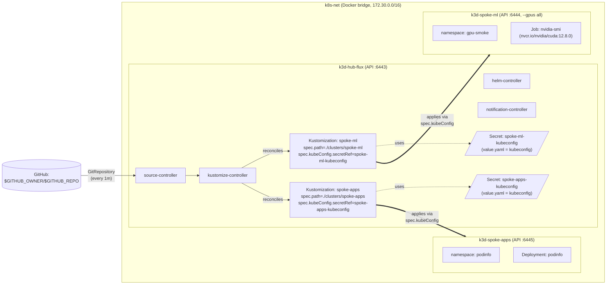

<objective>
Author the two remaining v1 reference docs that the README will cross-link to:
the architecture.md Mermaid topology and gpu-notes.md (3-part k3d GPU contract
+ Blackwell floor narrative). Both are greenfield; neither depends on the
README assembly (Plan 05) — they can ship in Wave 2.

Purpose: DOCS-02 + DOCS-04. The Mermaid diagram is the first visual artifact a
new reader encounters via the README; gpu-notes is the canonical answer to
"why does spoke-ml need this exact CUDA setup?" See PROJECT.md "Constraints"
for source content; CONTEXT.md `<decisions>` D-03 for the Mermaid scope; D-04
keeps gpu-notes focused on the three-part contract + sm_120 floor.

Output: 2 NEW Markdown files; bats docs-02 and docs-04 contracts green.
</objective>

<execution_context>
@$HOME/.claude/get-shit-done/workflows/execute-plan.md
@$HOME/.claude/get-shit-done/templates/summary.md
</execution_context>

<context>
@.planning/PROJECT.md
@.planning/REQUIREMENTS.md
@.planning/phases/06-repo-hygiene-docs-adrs/06-CONTEXT.md
@.planning/phases/06-repo-hygiene-docs-adrs/06-RESEARCH.md
@.planning/phases/06-repo-hygiene-docs-adrs/06-PATTERNS.md
@.planning/phases/02-cluster-layer/02-CONTEXT.md
@docs/flux-hub-spoke.md
@docs/wsl-networking.md

<interfaces>
<!-- Mermaid topology block — verbatim from 06-RESEARCH.md §Pattern 4 lines 603-647.
Required nodes per D-03 + bats `tests/bats/docs-02-architecture.bats`:
  - hub-flux + 6443
  - spoke-ml + 6444 + GPU annotation
  - spoke-apps + 6445
  - k8s-net + 172.30.0.0/16
  - source-controller, kustomize-controller, helm-controller, notification-controller
  - spec.kubeConfig arrows from hub into each spoke
-->

<!-- 3-part k3d GPU contract (PROJECT.md "Pinned versions" + Phase 2 RESEARCH.md):
  Part 1: /etc/docker/daemon.json sets default-runtime: nvidia
  Part 2: Custom k3s+CUDA image FROM nvidia/cuda:12.8.1-base-ubuntu22.04
          (Ubuntu base; Alpine cannot host nvidia runtime)
  Part 3: containerd config.toml.tmpl baked into the custom image with
          default_runtime_name = "nvidia"
All three must be true SIMULTANEOUSLY for spoke-ml to advertise nvidia.com/gpu. -->

<!-- Blackwell / sm_120 / CUDA 12.8+ floor (PROJECT.md Constraints + STATE.md decisions):
  - RTX 5090 is Blackwell architecture, compiled kernel set sm_120
  - sm_120 is unsupported on CUDA <12.8
  - The lab pins CUDA 12.8+ specifically because of this hardware floor
  - Most PyTorch stable releases need nightlies for sm_120 support (DEP-03 reason)
  - Phase 2 D-15 phase-scoped override: nvidia-device-plugin pinned to v0.17.4
    instead of REQUIREMENTS.md's v0.19.0+ (no compatible v0.19.x at research time) -->

<!-- Doc style conventions inherited from docs/flux-hub-spoke.md and docs/wsl-networking.md:
  - Lead with `# <Doc Title>` h1 (MD041 enforced)
  - Followed by a short orientation paragraph naming the load-bearing
    script/file/concept
  - `## Section` h2s
  - `---` horizontal rule separators between major sections
  - Code blocks fenced with language hints (`bash`, `yaml`, `mermaid`, etc.)
  - Cross-references via inline backticks for paths (`scripts/...`)
  - Bold lead-ins for hard rules: `**v1 of this project requires X.**` -->
</interfaces>
</context>

<tasks>

<task type="auto">
  <name>Task 1: Author docs/architecture.md with Mermaid hub-spoke topology</name>
  <files>docs/architecture.md</files>
  <read_first>
    - .planning/phases/06-repo-hygiene-docs-adrs/06-RESEARCH.md §Pattern 4 lines 595-649 (Mermaid block verbatim)
    - .planning/phases/06-repo-hygiene-docs-adrs/06-RESEARCH.md §Pitfall 4 lines 814-829 (MD041 — h1 BEFORE the Mermaid block)
    - .planning/phases/06-repo-hygiene-docs-adrs/06-PATTERNS.md "docs/architecture.md" section
    - .planning/phases/06-repo-hygiene-docs-adrs/06-CONTEXT.md `<decisions>` D-03 (load-bearing node + edge list) + `<specifics>` 410-413
    - docs/flux-hub-spoke.md lines 1-30 (analog top-of-file h1 + orientation paragraph pattern)
    - .planning/phases/02-cluster-layer/02-CONTEXT.md (k8s-net 172.30.0.0/16 CIDR pin reference)
  </read_first>
  <action>
Use `Write` to create `docs/architecture.md`. Content:

```markdown
# Karyon Architecture

This document describes the topology of the karyon lab: three k3d clusters on
a single shared Docker bridge network, hub-only Flux GitOps, and the
`spec.kubeConfig`-mediated reconciliation pattern from `hub-flux` into each
spoke.

The diagram below renders natively on GitHub via the [Mermaid](https://mermaid.js.org/)
fence convention. For the rationale behind each architectural choice, see the
ADRs under [`adr/`](adr/).

## Hub-Spoke Topology



## What the Diagram Shows

- **Network:** All three k3d clusters attach to the `k8s-net` Docker bridge
  network (`172.30.0.0/16`). This is what makes Docker embedded DNS reachable
  cross-cluster: `hub-flux`'s `kustomize-controller` resolves
  `k3d-spoke-ml-server-0` and `k3d-spoke-apps-server-0` directly without
  host-routing gymnastics. Pinned in `scripts/create-clusters.sh`.

- **Hub controllers:** `flux bootstrap github` installs the four canonical
  Flux v2 controllers on `hub-flux`: `source-controller` (pulls Git,
  Helm, Bucket sources), `kustomize-controller` (reconciles `Kustomization`
  resources — including the spoke ones), `helm-controller` (reconciles
  `HelmRelease` resources), and `notification-controller` (event routing).
  See `flux-hub-spoke.md` for the patch-surface contract on
  `clusters/hub-flux/flux-system/`.

- **Spoke kubeconfig Secrets:** `scripts/register-spokes-for-flux.sh`
  provisions a legacy-Secret-backed ServiceAccount token on each spoke
  (Phase 4 SPOKE-01..02) and embeds the kubeconfig (server + CA + token)
  into a `flux-system/<spoke>-kubeconfig` Secret on the hub under the key
  `value.yaml`. Phase 4 SPOKE-03..04.

- **Cross-cluster reconciliation:** Each spoke `Kustomization` on the hub
  has `spec.kubeConfig.secretRef.name: <spoke>-kubeconfig` AND
  `spec.kubeConfig.secretRef.key: value.yaml`. The
  `kustomize-controller` reads the kubeconfig from the Secret, talks to the
  spoke's apiserver via the Docker DNS hostname, and applies the manifests
  there. See [`adr/0004-hub-only-flux-control-plane.md`](adr/0004-hub-only-flux-control-plane.md)
  for the rationale and the P18 silent-misroute defense.

- **Workload examples:** `spoke-ml` runs an `nvidia-smi` smoke-test Job
  (DEP-02..03); `spoke-apps` runs the standard podinfo Deployment (DEP-01).
  Manifests live under [`../examples/`](../examples/).

***

## Cross-Reference Index

| Concern | Doc |
|---------|-----|
| GPU pass-through and the 3-part k3d contract | [`gpu-notes.md`](gpu-notes.md) |
| Flux bootstrap behavior + the patch-surface contract | [`flux-hub-spoke.md`](flux-hub-spoke.md) |
| WSL2 networking modes (mirrored vs NAT) | [`wsl-networking.md`](wsl-networking.md) |
| Rebuild procedure + expected timings | [`rebuild-runbook.md`](rebuild-runbook.md) |
| Architectural decisions | [`adr/`](adr/) |
```

CRITICAL ordering check: the h1 (`# Karyon Architecture`) MUST be on line 1.
The Mermaid fence (the literal `\`\`\`mermaid` line) MUST appear AFTER the h1
to satisfy MD041 (Pitfall 4 in 06-RESEARCH.md). The bats `docs-02-architecture`
test verifies this ordering with a line-number comparison.
  </action>
  <verify>
    <automated>bats tests/bats/docs-02-architecture.bats</automated>
  </verify>
  <acceptance_criteria>
    - `[ -f docs/architecture.md ]` true
    - `head -1 docs/architecture.md` matches `^# ` (MD041)
    - `grep -c '^# ' docs/architecture.md | head -1` returns 1 (single h1)
    - `grep -E '^\`\`\`mermaid' docs/architecture.md` exits 0 (Mermaid fence present)
    - The h1 line number is less than the first Mermaid fence line number (Pitfall 4): `[ "$(grep -nE '^# ' docs/architecture.md | head -1 | cut -d: -f1)" -lt "$(grep -nE '^\`\`\`mermaid' docs/architecture.md | head -1 | cut -d: -f1)" ]`
    - All required nodes present: `for n in hub-flux spoke-ml spoke-apps 6443 6444 6445 k8s-net 172.30.0.0/16 spec.kubeConfig source-controller kustomize-controller helm-controller notification-controller; do grep -F "$n" docs/architecture.md >/dev/null || echo "MISSING: $n"; done` produces no output
    - `wc -l < docs/architecture.md` returns >= 40
    - `bats tests/bats/docs-02-architecture.bats` is fully green
  </acceptance_criteria>
  <done>docs/architecture.md committed; all bats `DOCS-02` tests green; Mermaid block contains every required node (hub-flux/spoke-ml/spoke-apps + 6443/6444/6445 + k8s-net/172.30.0.0/16 + spec.kubeConfig + 4 flux-system controllers).</done>
</task>

<task type="auto">
  <name>Task 2: Author docs/gpu-notes.md with the 3-part k3d GPU contract and Blackwell floor</name>
  <files>docs/gpu-notes.md</files>
  <read_first>
    - .planning/phases/06-repo-hygiene-docs-adrs/06-PATTERNS.md "docs/gpu-notes.md" section
    - .planning/phases/06-repo-hygiene-docs-adrs/06-RESEARCH.md §Validation Architecture line 1222 (DOCS-04 keyword list: default-runtime, nvidia/cuda, config.toml.tmpl, RTX 5090, sm_120, 12.8)
    - .planning/PROJECT.md "Pinned versions" + "Constraints" line 88-90 (RTX 5090 + sm_120 + CUDA 12.8+ floor narrative source)
    - .planning/REQUIREMENTS.md §CUDA Image (IMG-01..06) and DEP-03 (smoke-test scope rationale)
    - .planning/phases/02-cluster-layer/02-CONTEXT.md D-15 (nvidia-device-plugin v0.17.4 phase-scoped override; reference for "Harder" section narrative per Open Question #4 in 06-RESEARCH.md)
    - docs/wsl-networking.md lines 1-30 (analog: h1 + orientation + ## sections + horizontal rules + bold lead-in for hard rule)
  </read_first>
  <action>
Use `Write` to create `docs/gpu-notes.md`. Content:

```markdown
# GPU Notes: 3-Part k3d Contract and the RTX 5090 (Blackwell) Floor

The karyon lab runs CUDA workloads on `spoke-ml` via Docker → containerd → k3s
→ Pod. Three configuration knobs must be set CORRECTLY at the same time for
the spoke to advertise `nvidia.com/gpu` capacity. This is the "3-part k3d GPU
contract" — the most common cause of "the cluster is up but no GPU" failures
during early lab setup.

This document also covers the RTX 5090 (Blackwell architecture, sm_120
compiled-kernel set) compatibility floor: CUDA 12.8 or newer at the runtime
is required.

***

## The 3-Part k3d GPU Contract

All three parts must be configured before the lab will surface
`nvidia.com/gpu` to Pod scheduling. If any one is missing, the cluster looks
healthy in `kubectl get nodes` output but
`kubectl --context k3d-spoke-ml describe node` shows zero GPU capacity.

### Part 1: `/etc/docker/daemon.json` sets `default-runtime: nvidia`

`scripts/install-docker.sh` writes a `daemon.json` with the `default-runtime`
key set to `nvidia` and an explicit `dns` array (the DNS array prevents the
container from inheriting `systemd-resolved`'s `127.0.0.53` stub address —
HOST-04). The default-runtime change is what makes every `docker run` —
including the one k3d invokes when it boots a cluster server container —
inherit the NVIDIA Container Toolkit shim.

```bash
# Confirm:
docker info | grep "Default Runtime"     # expected: Default Runtime: nvidia
```

If this line is missing or returns `runc`, the GPU contract is broken at
its foundation.

### Part 2: Ubuntu-base custom k3s+CUDA image (NOT Alpine)

`images/Dockerfile.k3s-cuda` builds an image FROM
`nvidia/cuda:12.8.1-base-ubuntu22.04` with k3s binaries layered in from
`rancher/k3s:v1.34.6-k3s1` as a build stage. The base MUST be Ubuntu (or
another glibc distro): the NVIDIA Container Runtime cannot inject the
`libcuda.so.1` stub into Alpine's musl libc, so a stock Alpine k3s image
will fail to host any CUDA workload.

```bash
# Confirm the image exists locally and was tagged correctly:
docker images | grep karyon/k3s-cuda     # expected: at least one tag
```

### Part 3: containerd `config.toml.tmpl` with `default_runtime_name = "nvidia"`

The custom k3s image bakes a containerd config template at
`/var/lib/rancher/k3s/agent/etc/containerd/config.toml.tmpl` (see
`images/config.toml.tmpl`). The template sets:

```toml
[plugins."io.containerd.grpc.v1.cri".containerd]
  default_runtime_name = "nvidia"
```

Without this, containerd will use the default `runc` runtime even if Docker
itself launches the k3s server container with `--runtime=nvidia`. The result:
GPU pass-through works at the Docker layer but evaporates inside k3s.

```bash
# Confirm by inspecting a running spoke-ml node:
docker exec k3d-spoke-ml-server-0 cat /var/lib/rancher/k3s/agent/etc/containerd/config.toml \
  | grep default_runtime_name      # expected: default_runtime_name = "nvidia"
```

***

## RTX 5090 (Blackwell, sm_120) Compatibility Floor

The author's dev box has an RTX 5090. Blackwell architecture compiles to the
`sm_120` PTX target. CUDA 12.8 is the **first** release with first-class
sm_120 support in the runtime; any CUDA version earlier than 12.8 cannot
dispatch sm_120 kernels and the GPU smoke-test pod will fail.

**v1 of this project requires CUDA 12.8 or newer at the runtime.** This is
why:

- The custom k3s+CUDA image is FROM `nvidia/cuda:12.8.1-base-ubuntu22.04`
  (the build stage; IMG-01).
- The GPU smoke-test container is `nvcr.io/nvidia/cuda:12.8.0-base-ubuntu22.04`
  (DEP-03).
- The smoke-test runs ONLY `nvidia-smi` (DEP-03). PyTorch / framework workloads
  are explicitly out of scope because most stable PyTorch wheels still need
  nightlies for sm_120 support; coupling lab health to nightly availability is
  not acceptable.

Pinning rationale is documented in
[`adr/0005-kubernetes-version-pin.md`](adr/0005-kubernetes-version-pin.md).

***

## Phase 2 Override: nvidia-device-plugin v0.17.4

REQUIREMENTS.md (IMG-04) calls for `nvidia-device-plugin` v0.19.0 or newer.
Phase 2 RESEARCH.md surfaced that no stable v0.19.x release was compatible
with RTX 5090 / Blackwell / sm_120 at research time; the lab pins to
`v0.17.4` instead as a phase-scoped D-15 override (PROJECT.md "Key Decisions"
records this explicitly).

The override is not architectural — it's a "ship-with-what-works" decision.
When a v0.19.x release lands with verified sm_120 support, the pin can be
bumped via the standard ROADMAP / Phase-1+ flow.

***

## Failure Modes and What to Check First

| Symptom | First place to look |
|---------|---------------------|
| `kubectl --context k3d-spoke-ml describe node` shows no `nvidia.com/gpu` | Run `bash scripts/preflight.sh` — it covers Parts 1 and 2 of the contract. If preflight is green, exec into the spoke-ml server container and verify Part 3. |
| `nvidia-smi` works on the host but not inside any container | `default-runtime` is wrong or `nvidia-ctk runtime configure` was never run. Re-run `scripts/install-nvidia-container-toolkit.sh`. |
| GPU smoke-test Job loops or `CrashLoopBackOff` | Check Pod logs with `kubectl --context k3d-spoke-ml -n gpu-smoke logs job/nvidia-smi`. CUDA-version mismatch (smoke-test image too old) is the most common cause. |
| Cluster appears `Ready` but DNS to `k3d-spoke-ml-server-0` fails from the hub | Stale CoreDNS NodeHosts; run `task fix-dns`. See [`flux-hub-spoke.md`](flux-hub-spoke.md). |

***

## Cross-References

- Architecture topology: [`architecture.md`](architecture.md)
- Version pin rationale: [`adr/0005-kubernetes-version-pin.md`](adr/0005-kubernetes-version-pin.md)
- WSL2 networking modes: [`wsl-networking.md`](wsl-networking.md)
- Rebuild runbook (incident response): [`rebuild-runbook.md`](rebuild-runbook.md)
```
  </action>
  <verify>
    <automated>bats tests/bats/docs-04-gpu-notes.bats</automated>
  </verify>
  <acceptance_criteria>
    - `[ -f docs/gpu-notes.md ]` true
    - `head -1 docs/gpu-notes.md` matches `^# `
    - `grep -F 'default-runtime' docs/gpu-notes.md` exits 0 (RESEARCH §Validation Architecture line 1222 keyword)
    - `grep -F 'nvidia/cuda' docs/gpu-notes.md` exits 0 (keyword)
    - `grep -F 'config.toml.tmpl' docs/gpu-notes.md` exits 0 (keyword)
    - `grep -F 'RTX 5090' docs/gpu-notes.md` exits 0 (keyword)
    - `grep -F 'sm_120' docs/gpu-notes.md` exits 0 (keyword)
    - `grep -F '12.8' docs/gpu-notes.md` exits 0 (keyword)
    - `wc -l < docs/gpu-notes.md` returns >= 50
    - `grep -F 'adr/0005-kubernetes-version-pin.md' docs/gpu-notes.md` exits 0 (cross-link to ADR-005)
    - `bats tests/bats/docs-04-gpu-notes.bats` is fully green
  </acceptance_criteria>
  <done>docs/gpu-notes.md committed; bats `DOCS-04` tests all green; cross-link to ADR-005 in place.</done>
</task>

</tasks>

<threat_model>
## Trust Boundaries

This is a documentation-authoring plan; no application surface, no live services, no secret material. Boundary analysis: Markdown files written into `docs/`. Pre-commit hook from Plan 01 gates these commits like any other.

## STRIDE Threat Register

| Threat ID | Category | Component | Disposition | Mitigation Plan |
|-----------|----------|-----------|-------------|-----------------|
| (n/a) | (n/a) | architecture.md + gpu-notes.md | accept | No application surface. Plan 01's pre-commit hook would catch any accidental token / kubeconfig embedded in the prose. The Mermaid block lives in source-text Markdown — no binary asset, no evaluated code. |
</threat_model>

<verification>
```bash
bats tests/bats/docs-02-architecture.bats     # expected: all DOCS-02 tests green
bats tests/bats/docs-04-gpu-notes.bats        # expected: all DOCS-04 tests green
```

Manual:
- Open `docs/architecture.md` in GitHub UI (or `glow`); confirm the Mermaid
  block renders as a labeled hub-spoke graph with all expected ports and
  spec.kubeConfig dotted lines.
- Open `docs/gpu-notes.md`; confirm 4 sections, the bold "**v1 of this project
  requires CUDA 12.8 or newer at the runtime.**" lead-in is present, and the
  cross-references resolve.
</verification>

<success_criteria>
- 2 NEW files committed: docs/architecture.md and docs/gpu-notes.md.
- bats DOCS-02 and DOCS-04 tests fully green.
- architecture.md has h1 BEFORE Mermaid fence (MD041 safe).
- architecture.md Mermaid block contains all 13 required literals (hub-flux/spoke-ml/spoke-apps/6443/6444/6445/k8s-net/172.30.0.0/16/spec.kubeConfig + 4 flux-system controllers).
- gpu-notes.md contains all 6 required keywords (default-runtime, nvidia/cuda, config.toml.tmpl, RTX 5090, sm_120, 12.8).
- gpu-notes.md cross-links to ADR-005.
- Plan committed.
</success_criteria>

<output>
After completion, create `.planning/phases/06-repo-hygiene-docs-adrs/06-03-SUMMARY.md` recording:
- 2 docs created with line counts
- bats output for DOCS-02 + DOCS-04 (both green)
- Note: render verification is manual (open in GitHub UI) — captured as developer sign-off.
</output>
