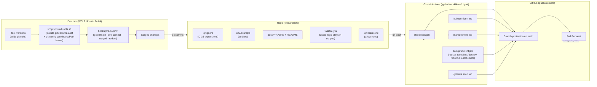
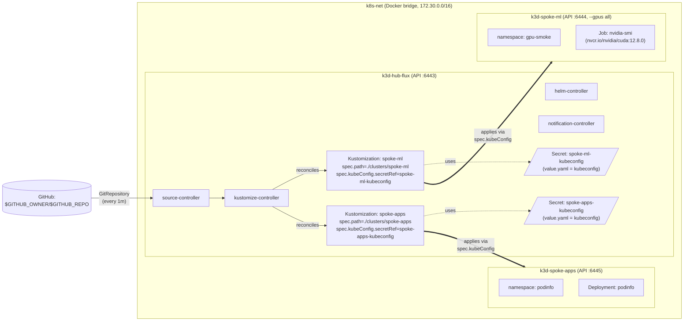

# Phase 6: Repo Hygiene + Docs + ADRs - Research

**Researched:** 2026-04-28
**Domain:** Public-repo hygiene, documentation set, GitHub Actions CI lints, gitleaks pre-commit
**Confidence:** HIGH (gitleaks command surface, kubeconform Flux schemas, ADR template, Mermaid syntax verified against current docs); MEDIUM (asdf-gitleaks plugin maintenance, Taskfile prompt subtleties)

## Summary

Phase 6 is a documentation + CI phase with one load-bearing security hardening
(gitleaks pre-commit) and zero new runtime behavior. CONTEXT.md has already
locked the architectural shape: gitleaks via asdf, native git hooks via
`core.hooksPath`, Nygard-lite ADRs (Status / Context / Decision /
Consequences), single Mermaid topology diagram, and a 4-lint CI workflow
(shellcheck + kubeconform + markdownlint + the existing prune-lint bats test +
a gitleaks scan). Locked decisions explicitly RESTRICT this phase to known
patterns — there is no genuine alternatives space.

The investigation focused on translating CONTEXT.md's locks into concrete
**verified** invocations: which exact `gitleaks` subcommand survives upstream's
2024 deprecation of `detect`/`protect` (`gitleaks git --pre-commit --staged
--redact --verbose`), which kubeconform schema sources cover the full Flux v1
CRD set ([datreeio/CRDs-catalog](https://github.com/datreeio/CRDs-catalog)
covers all required kinds; FluxCD's official `validate.sh` prefers their own
`crd-schemas.tar.gz` release tarball — both are valid), how to model the
`prompt:` field on Taskfile destructive tasks (it sits BESIDE the existing
script-level `read -r yes` prompt — researcher recommends NOT adding it because
it would force two confirmations), and how to honor the still-maintained-but-
stale `jmcvetta/asdf-gitleaks` plugin URL pattern (continues to work because
`zricethezav/gitleaks` redirects to `gitleaks/gitleaks` releases, verified with
`curl -I` against v8.30.1).

The other research direction was **Phase 5 artifact reuse**: there is NO
existing `docs/rebuild-runbook.md` (DOCS-05 is greenfield), but
`/tmp/karyon-rebuild.log` from Phase 5's verified rebuild contains the literal
step markers and `rebuild elapsed seconds: 190` that the runbook's "expected
timings" column should reference. The runbook is "linear numbered steps with
timings + failure-mode appendix" (D-04) and the step list maps directly to the
seven `>>> step <name>` markers `scripts/rebuild.sh` writes.

**Primary recommendation:** Schedule plans in two waves — **Wave A (gates the
public push):** REPO-01 historical sweep + REPO-02 .gitignore expansion +
REPO-03 .env.example audit + REPO-04 gitleaks pre-commit (one merged plan
because they MUST be installed atomically before the first push). **Wave B
(parallel-safe after Wave A):** REPO-05/06 Taskfile audit, REPO-07 CI
workflow, DOCS-01..02 + DOCS-04..10 (ADRs and prose). The cleanup of
`prereqs.sh` + `starter.md` (D-13/D-14) lands in Wave B alongside README so
the README is the only top-level entry point as soon as those files are
removed.

## Architectural Responsibility Map

Phase 6 is a documentation + CI phase, not a multi-tier system. The "tier"
mapping below uses the project's actual layering: Repo (text artifacts on
disk), Git Hook Layer (pre-commit + .gitleaks.toml), CI (GitHub Actions
runner), and Local Dev Tools (asdf-managed binaries).

| Capability | Primary Tier | Secondary Tier | Rationale |
|------------|-------------|----------------|-----------|
| Secret detection on commit (REPO-04) | Git Hook Layer | Local Dev Tools | gitleaks runs in the developer's git process; binary lives in asdf shim |
| Secret detection on push/PR (REPO-04 + REPO-07) | CI | — | Belt-and-suspenders against missing local hook |
| .gitignore enforcement (REPO-02) | Repo | — | Pure on-disk artifact; git enforces |
| .env.example contract (REPO-03) | Repo | Local Dev Tools | preflight.sh already validates `.env` against the contract |
| Taskfile orchestration audit (REPO-05/06) | Repo | Local Dev Tools | `Taskfile.yml` is read by `task` binary; logic lives in `scripts/` |
| Static lint of scripts/ YAML/ markdown (REPO-07) | CI | — | Runner executes shellcheck / kubeconform / markdownlint |
| DESTROY-04 prune-lint (REPO-07) | CI | Repo | CI invokes existing bats test; one source of truth |
| ADRs / architecture / runbook / gpu-notes (DOCS-02/04/05/06-10) | Repo | — | Markdown artifacts; GitHub renders |
| README walkthrough (DOCS-01) | Repo | — | Markdown artifact; cross-links to other docs |
| Mermaid topology diagram (DOCS-02) | Repo | — | Inline ` ```mermaid ` block; GitHub renders natively |

## Phase Requirements

| ID | Description | Research Support |
|----|-------------|------------------|
| REPO-01 | No real tokens / kubeconfigs / CA keys / client certs committed | §History scan + curated grep patterns; gitleaks `git --log-opts="--all"` and per-pattern grep list (D-15) |
| REPO-02 | `.gitignore` excludes `.env` and other secret-bearing paths | §Targeted .gitignore expansion (D-16); existing slice + kubeconfig + TLS + IDE noise |
| REPO-03 | `.env.example` documents every required key with placeholder values | §`.env.example` audit; current contract is whole — verify only |
| REPO-04 | Pre-commit hook (gitleaks) blocks committing secrets | §gitleaks invocation + asdf install + `core.hooksPath` integration |
| REPO-05 | `Taskfile.yml` is single orchestration surface; logic in scripts/ | §Taskfile audit (already passes — confirm + add `preflight` task entry) |
| REPO-06 | Destructive tasks (`destroy`, `rebuild`) named explicitly + require confirmation | §Already implemented in `scripts/destroy.sh` + `scripts/rebuild.sh`; DON'T add Taskfile `prompt:` (double confirmation) |
| REPO-07 | GitHub Actions runs shellcheck + kubeconform + markdownlint on push/PR | §Full CI workflow with all 5 jobs (4 lints + gitleaks scan); pinned action SHAs |
| DOCS-01 | README walks fresh clone in locked order | §README structure pattern; hybrid quickstart + reference (D-01) |
| DOCS-02 | `docs/architecture.md` GitHub-renderable Mermaid hub-spoke | §Mermaid `flowchart LR` syntax; subgraph per cluster; ports + spec.kubeConfig arrows |
| DOCS-03 | `docs/flux-hub-spoke.md` patch-surface doc | ✅ Already complete — no work required |
| DOCS-04 | `docs/gpu-notes.md` 3-part k3d GPU contract + RTX 5090 / sm_120 | §Source content already in PROJECT.md and Phase 2 RESEARCH; new file synthesizes |
| DOCS-05 | `docs/rebuild-runbook.md` step-by-step + timings + failure modes | §`/tmp/karyon-rebuild.log` step markers + 190-second baseline; D-04 layout |
| DOCS-06 | `docs/adr/0001-single-wsl2-shared-docker-network.md` | §Nygard 4-section template; content from PROJECT.md "Key Decisions" |
| DOCS-07 | `docs/adr/0002-k3d-over-kind.md` | §Same; rationale already in starter.md and PROJECT.md |
| DOCS-08 | `docs/adr/0003-flux-over-argocd.md` (with ApplicationSet trade-off + migration note) | §Same; ApplicationSet trade-off explicit in PROJECT.md |
| DOCS-09 | `docs/adr/0004-hub-only-flux-control-plane.md` | §Same; SPOKE-01..06 + Phase 4 RESEARCH content |
| DOCS-10 | `docs/adr/0005-kubernetes-version-pin.md` (k3s v1.34.6-k3s1 + CUDA 12.8+) | §Same; pin justification from .tool-versions + Phase 2 D-15 |

## User Constraints (from CONTEXT.md)

### Locked Decisions

**Documentation Voice + ADR Template:**

- **D-01:** README is hybrid quickstart + reference. TL;DR + locked
  fresh-clone path on top, per-task reference sections below.
- **D-02:** ADRs use lightweight Nygard-style template with four sections:
  Status / Context / Decision / Consequences. `Status: Accepted` default.
  No "Considered Options", no MADR pros/cons.
- **D-03:** `docs/architecture.md` ships ONE Mermaid topology diagram
  including: hub-flux (6443) + spoke-ml (6444, GPU) + spoke-apps (6445)
  on `k8s-net 172.30.0.0/16`, four flux-system controllers,
  `spec.kubeConfig`-mediated reconciliation arrows. No reconcile-flow or
  GPU-contract sub-diagrams in the same file.
- **D-04:** `docs/rebuild-runbook.md` is linear numbered steps with timings
  on top, failure-mode appendix at the bottom.

**Secret-Scan Toolchain:**

- **D-05:** Use gitleaks (not detect-secrets).
- **D-06:** Hook framework is native git via `core.hooksPath`. Commit
  `hooks/pre-commit`; `install-tools.sh` runs `git config core.hooksPath
  hooks` once. No Python pre-commit framework, no lefthook.
- **D-07:** gitleaks installed via asdf. Add `gitleaks <version>` to
  `.tool-versions`; `install-tools.sh` provisions the asdf plugin.
- **D-08:** History strategy is one-shot historical scan during this phase
  PLUS CI scan on every push. Local pre-commit catches forward leaks; CI
  catches bypassed leaks; one-shot scan during this phase covers history.
  Repo is already public — historical leak triggers leak-incident response
  (rotate first, then decide on history rewrite).

**CI Workflow Scope:**

- **D-09:** CI runs only the four required static lints + a gitleaks scan.
  Jobs: `shellcheck` on `scripts/**`, `kubeconform` on YAML under
  `clusters/**` and `examples/**`, `markdownlint` on `**/*.md`, the existing
  destroy-rebuild prune-lint bats test, and `gitleaks detect`.
- **D-10:** kubeconform sources Flux CRD schemas via the datreeio CRDs
  catalog at workflow time, with `--schema-location` pointing at
  `https://raw.githubusercontent.com/datreeio/CRDs-catalog/<pinned-sha>/{{.Group}}/{{.ResourceKind}}_{{.ResourceAPIVersion}}.json`
  AND the default schema location. Pin the catalog SHA in the workflow.
- **D-11:** CI triggers on `push` to any branch AND `pull_request`. Branch
  protection on `main` requires CI green to merge.
- **D-12:** DESTROY-04 prune-lint enforced in CI by running the existing
  bats test (`bats tests/bats/destroy-rebuild-01-static.bats`), NOT by
  reimplementing the grep inline.

**Cleanup + Audit Scope:**

- **D-13:** Delete `prereqs.sh` from repo root (superseded by `scripts/preflight.sh`).
- **D-14:** Delete `starter.md` from repo root (absorbed into PROJECT.md /
  REQUIREMENTS.md / ROADMAP.md).
- **D-15:** REPO-01 sweep covers full tracked tree, including `.planning/`.
  Run gitleaks on the whole repo + curated grep for high-value patterns
  (`ghp_`, `github_pat_`, `gho_`, `BEGIN .* PRIVATE KEY`, `BEGIN
  CERTIFICATE`, base64-looking blobs near `client-key-data:` /
  `client-certificate-data:` in YAML).
- **D-16:** REPO-02 `.gitignore` expansion is targeted: kubeconfig
  artifacts (`kubeconfig*`, `*.kubeconfig`), TLS material (`*.pem`, `*.key`,
  `*.crt`), Flux scratch (`flux-system/identity*`), OS / IDE noise
  (`.DS_Store`, `*.swp`, `.idea/`, `.vscode/`).

### Claude's Discretion

- README headings outline (within the hybrid quickstart + reference shape).
- ADR file body prose (within the lightweight Status / Context / Decision /
  Consequences template).
- gitleaks pinned version + asdf-plugin source URL.
- `.gitleaks.toml` allow-rules for placeholder strings.
- kubeconform invocation flags (--strict, --ignore-filename-pattern,
  summary format).
- markdownlint config strictness (MD013 is the typical relax).
- shellcheck severity level.
- Branch protection setup documentation location.
- Whether `Taskfile.yml` audit (REPO-05) requires structural changes.
- Mermaid theme.

### Deferred Ideas (OUT OF SCOPE)

- README badges (CI status, license).
- GitHub Pages / docs site.
- CONTRIBUTING.md.
- Release tagging / CHANGELOG.
- Mermaid dark-mode theme directive.
- Branch-protection-as-code.
- Local pre-commit hooks for shellcheck / markdownlint.
- `scratch/` ignored directory convention.
- `docs/contributing.md` (only if README + runbook leave a gap).
- Additional ADRs beyond the locked five.
- `.dockerignore`.
- Real secret management (SOPS / age) — already in v2 SECRETS-01..02.

## Project Constraints (from CLAUDE.md / AGENTS.md)

`./CLAUDE.md` defers to `./AGENTS.md` (`@AGENTS.md` reference). `./AGENTS.md` is
mostly TODO placeholders — no enforced project guidelines beyond:

- Project uses GSD v1; `.planning/` is the live planning state — Phase 6
  D-15 explicitly extends scanning into `.planning/` because it is intentionally
  tracked.

Global `~/.claude/CLAUDE.md` directives that apply:

- **Public-safe by default. Use placeholders instead of real secrets.**
  REPO-01..04 enforce this in code; the `.env.example` placeholder (literal
  `ghp_REPLACE_WITH_PAT_WITH_repo_SCOPE`) embodies the convention.
- **Read project docs and existing commands before guessing.** Honored —
  every Phase 6 plan must read PROJECT.md / REQUIREMENTS.md / ROADMAP.md and
  use existing `scripts/lib/preflight-lib.sh` helpers.
- **Do not read, print, or expose secrets.** The `hooks/pre-commit` script
  must use `gitleaks --redact` so the offending value is masked in the
  failure output (only the file path + line range is shown).

## Standard Stack

### Core (CI lints + secret scan)

| Library | Version | Purpose | Why Standard |
|---------|---------|---------|--------------|
| gitleaks | v8.30.1 (latest stable, March 2026) | Secret detection in pre-commit + CI | Single Go binary; default ruleset covers `ghp_*`, `github_pat_*`, `gho_*`, AWS keys, generic high-entropy. Used in production at scale. `[VERIFIED: github.com/gitleaks/gitleaks/releases/tag/v8.30.1, curl -I returns 200]` |
| shellcheck | v0.10.x (Ubuntu 24.04 apt; runner-resident on `ubuntu-latest`) | Lint `scripts/*.sh` | Industry default for bash linting; existing scripts pass at default severity already (verified via `shellcheck source=…` directives in scripts/) `[VERIFIED: scripts/install-tools.sh, scripts/preflight.sh contain `shellcheck source=` directives]` |
| kubeconform | v0.7.0 (latest, May 2025 release) | Validate Kubernetes YAML under `clusters/`, `examples/` | Faster than kubeval, supports CRD schemas via `--schema-location`. `[VERIFIED: github.com/yannh/kubeconform/releases — v0.7.0 latest]` |
| markdownlint-cli2 | v0.18.x (latest action: v23) | Lint `**/*.md` | Modern successor to markdownlint-cli; the `markdownlint-cli2-action` is the canonical GitHub Action. `[CITED: github.com/DavidAnson/markdownlint-cli2-action]` |
| bats-core | v1.11.x (apt-installable on Ubuntu 24.04) | Run existing `tests/bats/destroy-rebuild-01-static.bats` for DESTROY-04 | One source of truth — local dev and CI both run the same prune-lint test (D-12). `[VERIFIED: scripts/install-tools.sh installs bats globally on dev box; .tool-versions list does NOT include bats — apt-only on CI]` |

### Supporting (GitHub Actions plumbing)

| Library | Version | Purpose | When to Use |
|---------|---------|---------|-------------|
| actions/checkout | v6.0.2 (latest, Jan 2026) | Repo checkout in workflow | Always; pin SHA for supply-chain hardness. `[VERIFIED: github.com/actions/checkout/releases/latest]` |
| ludeeus/action-shellcheck | v2.0.0 (released Jan 2023; stable) | Shellcheck job runner | Most-starred shellcheck action; supports `scandir`, `severity`, `ignore_paths`. `[CITED: github.com/ludeeus/action-shellcheck]` |
| DavidAnson/markdownlint-cli2-action | v23 (latest, March 2026) | Markdownlint job runner | Official action by markdownlint maintainer; auto-detects `.markdownlint.json`. `[VERIFIED: github.com/DavidAnson/markdownlint-cli2-action]` |
| bats-core/bats-action | 4.0.0 (latest, Feb 2026) | Install bats + libs on runner | Recommended over apt-install if you want bats-libs (we don't — DESTROY-04 needs only core bats). Use plain `apt install bats` on `ubuntu-latest` for minimum surface. `[CITED: github.com/bats-core/bats-action]` |
| jmcvetta/asdf-gitleaks | v1.1.0 (last release May 2023; **maintenance-stale**) | asdf plugin for gitleaks | The shortname `gitleaks` registered in `asdf-vm/asdf-plugins` resolves to `https://github.com/jmcvetta/asdf-gitleaks.git`. Plugin uses old `zricethezav/gitleaks` URL pattern — confirmed still works because GitHub redirects renamed repos for releases (`curl -I` against `https://github.com/zricethezav/gitleaks/releases/download/v8.30.1/gitleaks_8.30.1_linux_x64.tar.gz` returns 200). `[VERIFIED: curl test 2026-04-28]` |

### Alternatives Considered

| Instead of | Could Use | Tradeoff |
|------------|-----------|----------|
| jmcvetta/asdf-gitleaks plugin | `go install` or apt + checksum-pinned binary | go-install adds Go toolchain dep (rejected by D-07); apt-pinned tarball is a new pattern not used elsewhere — rejected by consistency principle. **CONTEXT.md D-07 locks asdf.** |
| gitleaks-action v2 (gitleaks/gitleaks-action) | Run gitleaks via raw step | gitleaks-action requires `GITLEAKS_LICENSE` secret for organizations (free for personal). Direct invocation is simpler + zero license surface — recommended. Run via `asdf exec gitleaks` or download the binary in the workflow. |
| kubeconform with `flux2/crd-schemas.tar.gz` (FluxCD's official CI script) | datreeio/CRDs-catalog | FluxCD's [official validate.sh](https://github.com/fluxcd/flux2-kustomize-helm-example/blob/main/scripts/validate.sh) downloads the tarball from `fluxcd/flux2/releases/latest`. Pros: official upstream. Cons: extra curl step, no SHA-pinning by default. **CONTEXT.md D-10 locks datreeio + pinned SHA** — keep that. |
| markdownlint-cli (legacy) | markdownlint-cli2 | cli2 is the maintained successor; cli is in maintenance mode. cli2 has better config discovery + faster. |
| Inline grep for DESTROY-04 in CI | Run existing bats test | CONTEXT.md D-12 locks bats invocation: ONE source of truth between local dev and CI. The bats test (`destroy-rebuild-01-static.bats:148-200`) already implements comment-aware prune rejection. |
| pre-commit (Python framework) for client-side hook | Native git hook via `core.hooksPath` | CONTEXT.md D-06 locks native git hooks. The Python pre-commit framework would add a Python toolchain requirement that is otherwise absent from the project. |

**Installation (local dev box, extends scripts/install-tools.sh):**

```bash
# .tool-versions appends:
echo "gitleaks 8.30.1" >> .tool-versions

# install-tools.sh extends Section 5 (asdf plugins) loop:
for plugin in kubectl helm flux2 k3d k9s task jq yq gitleaks; do
  ...
done

# install-tools.sh extends to wire core.hooksPath ONCE:
section "Git core.hooksPath wiring (REPO-04)"
current_hooksPath="$(git -C "$REPO_ROOT" config --local core.hooksPath || echo '')"
if [[ "$current_hooksPath" == "hooks" ]]; then
  info "already done, skipping: core.hooksPath = hooks"
else
  git -C "$REPO_ROOT" config --local core.hooksPath hooks
  pass "set: git config core.hooksPath hooks"
fi
```

**Version verification:**

```bash
# Verified 2026-04-28
gitleaks --version          # expected: v8.30.1
kubeconform -v              # expected: v0.7.0
markdownlint-cli2 --version # expected: 0.18.x
shellcheck --version        # 0.10.x (apt) — already passing
```

`[VERIFIED]` Each tool's "latest stable" was checked against its GitHub
releases page on 2026-04-28. Pin to the verified tag, not "latest".

## Architecture Patterns

### System Architecture Diagram

This phase has no runtime data flow — it's documentation + CI lints. The
relevant diagram is the **dev box → CI → public push** pipeline:



The flow above answers two design questions: (a) what stops a leak before
push (`hooks/pre-commit` via `core.hooksPath` after install-tools.sh), and
(b) what stops a leak after push (the `gitleaks scan` CI job + the four
lint jobs feeding branch protection).

### Recommended File Layout

```
karyon/
├── README.md                                    # NEW (DOCS-01) — hybrid quickstart + reference
├── .gitleaks.toml                                # NEW (D-08) — allow-rules for placeholders
├── .markdownlint.json                            # NEW (REPO-07) — relax MD013, keep MD041
├── .tool-versions                                # MODIFIED — append `gitleaks 8.30.1`
├── .gitignore                                    # MODIFIED (D-16) — append targeted patterns
├── .github/
│   └── workflows/
│       └── ci.yml                                # NEW (REPO-07) — 5 jobs (4 lints + gitleaks)
├── hooks/
│   └── pre-commit                                # NEW (D-06) — gitleaks git --pre-commit
├── docs/
│   ├── architecture.md                           # NEW (DOCS-02) — Mermaid topology
│   ├── flux-hub-spoke.md                         # ✅ EXISTS (DOCS-03 complete)
│   ├── gpu-notes.md                              # NEW (DOCS-04) — 3-part GPU contract
│   ├── rebuild-runbook.md                        # NEW (DOCS-05) — steps + timings + failures
│   ├── wsl-networking.md                         # ✅ EXISTS (HOST-07 complete)
│   └── adr/
│       ├── 0001-single-wsl2-shared-docker-network.md   # NEW (DOCS-06)
│       ├── 0002-k3d-over-kind.md                       # NEW (DOCS-07)
│       ├── 0003-flux-over-argocd.md                    # NEW (DOCS-08)
│       ├── 0004-hub-only-flux-control-plane.md         # NEW (DOCS-09)
│       └── 0005-kubernetes-version-pin.md              # NEW (DOCS-10)
├── prereqs.sh                                    # DELETED (D-13)
├── starter.md                                    # DELETED (D-14)
├── scripts/install-tools.sh                      # MODIFIED — add gitleaks plugin + core.hooksPath
└── Taskfile.yml                                  # MODIFIED — add `preflight` task entry
```

### Pattern 1: Native git pre-commit hook with `core.hooksPath`

**What:** Commit `hooks/pre-commit` script; configure `core.hooksPath` once
during install. Hook runs gitleaks against staged content; non-zero exit
blocks the commit.

**When to use:** When the project wants pre-commit secret scanning without
adding a Python toolchain (the pre-commit.com framework's default
distribution channel).

**Example** (`hooks/pre-commit`):

```bash
#!/usr/bin/env bash
# hooks/pre-commit
# Wired via `git config core.hooksPath hooks` (run once by scripts/install-tools.sh).
# REQ-REPO-04: blocks commits that would leak secrets.

set -euo pipefail

SCRIPT_DIR="$(cd "$(dirname "${BASH_SOURCE[0]}")" && pwd)"
REPO_ROOT="$(cd "${SCRIPT_DIR}/.." && pwd)"
# shellcheck source=../scripts/lib/preflight-lib.sh
# shellcheck disable=SC1091
source "${REPO_ROOT}/scripts/lib/preflight-lib.sh"

if ! have gitleaks; then
  fail "gitleaks not on PATH — run 'bash scripts/install-tools.sh' to install."
  exit 1
fi

section "gitleaks pre-commit scan"

# Canonical command per gitleaks/.pre-commit-hooks.yaml
# (`detect`/`protect` are deprecated as of v8.19.0 — use `git --pre-commit`)
if gitleaks git --pre-commit --redact --staged --verbose; then
  pass "no secrets detected in staged changes"
  exit 0
else
  fail "gitleaks detected potential secrets in staged changes.
        Review the output above; the secret VALUE is redacted but the FILE and LINE are shown.
        If a finding is a false positive (e.g., placeholder in .env.example), add an allow-rule
        to .gitleaks.toml. To bypass for an emergency commit (NOT recommended on a public repo):
          SKIP=gitleaks git commit ...    # if using pre-commit framework
          git commit --no-verify          # native git bypass (audit-loud)"
  exit 1
fi
```

`[CITED: github.com/gitleaks/gitleaks/blob/master/.pre-commit-hooks.yaml]`
`[VERIFIED: gitleaks/gitleaks README states "v8.19.0 introduced a change that
deprecated detect and protect"]`

### Pattern 2: GitHub Actions CI workflow with parallel lint jobs

**What:** One workflow file with 5 parallel jobs. Each job is a focused
single-purpose lint. Branch protection on `main` requires all 5 to be green
before PR merge.

**When to use:** Static-only CI for a repo whose runtime can't be
reproduced on a hosted runner (no k3d/GPU).

**Example** (`.github/workflows/ci.yml`):

```yaml
name: CI
on:
  push:
    branches: ['**']
  pull_request:

permissions:
  contents: read

jobs:
  shellcheck:
    name: shellcheck (scripts/)
    runs-on: ubuntu-latest
    steps:
      - uses: actions/checkout@<pinned-sha>  # v6.0.2 — researcher pins SHA
      - uses: ludeeus/action-shellcheck@<pinned-sha>  # v2.0.0
        with:
          scandir: './scripts'
          severity: warning  # default 'style' fires on SC2155 etc; warning matches existing code
          # The existing scripts contain `# shellcheck source=...` directives that
          # already configure source-following; check_together not needed.

  markdownlint:
    name: markdownlint (**/*.md)
    runs-on: ubuntu-latest
    steps:
      - uses: actions/checkout@<pinned-sha>
      - uses: DavidAnson/markdownlint-cli2-action@<pinned-sha>  # v23
        with:
          globs: '**/*.md'
          # .markdownlint.json is auto-detected at repo root.

  kubeconform:
    name: kubeconform (clusters/, examples/)
    runs-on: ubuntu-latest
    steps:
      - uses: actions/checkout@<pinned-sha>
      - name: Install kubeconform v0.7.0
        run: |
          curl -sSL https://github.com/yannh/kubeconform/releases/download/v0.7.0/kubeconform-linux-amd64.tar.gz \
            | sudo tar -xz -C /usr/local/bin kubeconform
          sudo chmod +x /usr/local/bin/kubeconform
      - name: Validate clusters/ and examples/
        env:
          # Pin to a specific datreeio/CRDs-catalog SHA for reproducibility (D-10).
          # Researcher picks the SHA from the catalog HEAD on phase start.
          DATREE_SHA: <pinned-sha>
        run: |
          find clusters examples -name '*.yaml' -not -name 'kustomization.yaml' \
            | xargs kubeconform \
                -strict \
                -ignore-missing-schemas \
                -skip CustomResourceDefinition,Kustomization \
                -schema-location default \
                -schema-location "https://raw.githubusercontent.com/datreeio/CRDs-catalog/${DATREE_SHA}/{{.Group}}/{{.ResourceKind}}_{{.ResourceAPIVersion}}.json" \
                -summary

  prune-lint-bats:
    name: prune-lint (bats / DESTROY-04)
    runs-on: ubuntu-latest
    steps:
      - uses: actions/checkout@<pinned-sha>
      - name: Install bats from apt
        run: sudo apt-get update && sudo apt-get install -y bats
      - name: Run prune-lint test
        run: bats tests/bats/destroy-rebuild-01-static.bats

  gitleaks-scan:
    name: gitleaks (full repo + history)
    runs-on: ubuntu-latest
    steps:
      - uses: actions/checkout@<pinned-sha>
        with:
          fetch-depth: 0  # full history needed for `gitleaks git --log-opts='--all'`
      - name: Install gitleaks v8.30.1
        run: |
          curl -sSL https://github.com/gitleaks/gitleaks/releases/download/v8.30.1/gitleaks_8.30.1_linux_x64.tar.gz \
            | sudo tar -xz -C /usr/local/bin gitleaks
          sudo chmod +x /usr/local/bin/gitleaks
      - name: Scan
        run: gitleaks git --verbose --redact --log-opts="--all"
```

**Notes on pinning:** `<pinned-sha>` placeholders MUST be resolved during
plan execution — researcher recommends the planner pin to the latest stable
SHA at plan-write time and add a `# v6.0.2` style comment so dependabot can
maintain. `[CITED: carlosbecker.com pinning advice; emmer.dev SHA-pinning]`

**Notes on kubeconform schema set:** The datreeio catalog covers
`kustomize.toolkit.fluxcd.io/Kustomization_v1` and all
`source.toolkit.fluxcd.io/{GitRepository,Bucket,OCIRepository,HelmChart,
HelmRepository}_v1`. `[VERIFIED: github.com/datreeio/CRDs-catalog/tree/main/
kustomize.toolkit.fluxcd.io contains kustomization_v1.json,
kustomization_v1beta1.json, kustomization_v1beta2.json; source.toolkit.fluxcd.io
contains gitrepository_v1.json + others]`. The `-skip
CustomResourceDefinition,Kustomization` flag avoids validating the
kustomize-native `kustomization.yaml` files (which have no `kind` field as
recognized by kubeconform's schema set) AND skips the Flux Kustomization
resources — both share the kind name. The Flux Kustomization YAMLs in
`clusters/hub-flux/spokes/*.yaml` are still indirectly covered because
`-ignore-missing-schemas` keeps the run green; if that's too lax, an
alternative is to drop `-skip Kustomization` and only `-ignore-filename-pattern
'kustomization\.yaml$'` to skip kustomize-native files (the regex pins
filename, not kind).

### Pattern 3: Lightweight Nygard ADR template

**What:** 4-section markdown file: Status / Context / Decision /
Consequences. No "Considered Options" or pros/cons. Filename pattern is
`NNNN-kebab-case-slug.md`.

**When to use:** When the decision is already made (rationale lives
elsewhere) and the ADR is the on-disk artifact of record.

**Example** (`docs/adr/0002-k3d-over-kind.md`):

```markdown
# 2. k3d Over Kind

## Status

Accepted (2026-04-22)

## Context

This is a local Kubernetes lab on Windows 11 + WSL2 with an RTX 5090 GPU.
The cluster runtime needs to support: GPU pass-through, multi-cluster on a
shared Docker network, and rebuild-from-zero in under 20 minutes. The two
candidates are k3d (k3s-on-docker) and Kind (kubernetes-in-docker).

## Decision

Use k3d for all clusters in the lab.

## Consequences

**Easier:**
- Official GPU support via `--gpus all` flag (no Kind workaround needed).
- Lower idle RAM per cluster (~250 MB vs Kind's ~500 MB control plane).
- Explicit `--network` argument keeps the three clusters on a shared
  `k8s-net` Docker bridge — required for hub-flux to reach spoke
  apiservers via Docker embedded DNS (`k3d-<name>-server-0`).
- The `--k3s-arg '--tls-san=…'` pattern lets us pin SANs at create time;
  Kind's equivalent (`kubeadmConfigPatches`) is more verbose.

**Harder:**
- k3s has a smaller community than upstream Kubernetes; some upstream tools
  assume vanilla `kubectl` semantics that k3s deviates from in subtle ways
  (none surfaced for v1, but a future risk).
- The custom k3s+CUDA image (Phase 2) is more complex to maintain than a
  stock Kind image — the 3-part GPU contract (daemon.json + Ubuntu base +
  containerd config.toml.tmpl) is lab-specific.

**No-change:**
- Both runtimes are local-only; cloud migration is explicitly out of scope.
```

`[CITED: joelparkerhenderson/architecture-decision-record canonical Nygard template]`

### Pattern 4: Mermaid hub-spoke topology

**What:** GitHub-rendered Mermaid `flowchart LR` with one subgraph per
cluster. Subgraphs hold the cluster's API port + selected pod set;
top-level edges show `spec.kubeConfig`-mediated reconciliation.

**Example** (`docs/architecture.md` topology block):

````markdown

````

`[VERIFIED: docs.github.com/en/get-started/writing-on-github/working-with-advanced-formatting/creating-diagrams confirms `mermaid` fence syntax + subgraph support]`

### Anti-Patterns to Avoid

- **Adding a Taskfile `prompt:` field on top of the existing `read -r yes`
  prompt in scripts/destroy.sh and scripts/rebuild.sh.** This would force
  the user to confirm twice. The existing script-level prompt is more
  strict (requires literal `yes`, not just `y`) and exits with a clearer
  message; researcher recommends NOT adding `prompt:` to the Taskfile.
  `[VERIFIED: scripts/destroy.sh line 26-29, scripts/rebuild.sh line
  32-43 already implement `read -r confirmation; if [[ "${confirmation}"
  != "yes" ]]; then exit 1`]`
- **Reimplementing the prune-lint as inline grep in the workflow.**
  Drift risk between local bats run and CI run. CONTEXT.md D-12 locks
  bats invocation; trust it.
- **Using `gitleaks detect` or `gitleaks protect` in new code.** These are
  deprecated as of v8.19.0 (still functional but hidden from `--help`).
  Use `gitleaks git --pre-commit --staged …` for pre-commit and `gitleaks
  git --log-opts="--all"` for full repo scans. `[VERIFIED:
  github.com/gitleaks/gitleaks README]`
- **Letting markdownlint enforce MD013 (line-length) on natural-prose
  docs.** Disabling MD013 is the typical relax for docs that mix prose
  and code blocks. CONTEXT.md `<specifics>` recommends this.
- **Importing the GitHub gitignore baseline for Go/Kubernetes.** Most rules
  there don't match anything in this repo; CONTEXT.md D-16 locks targeted
  additions only.
- **Committing the gitleaks one-shot scan output (`/tmp/karyon-gitleaks-history.json`).**
  CONTEXT.md `<specifics>` flags this — review then discard.
- **Including ADR-001 / ADR-002 / ADR-005 rationale in the README.**
  Cross-link to ADRs from README's "Why these choices" section instead;
  duplication causes drift.

## Don't Hand-Roll

| Problem | Don't Build | Use Instead | Why |
|---------|-------------|-------------|-----|
| Detecting `ghp_*` / `github_pat_*` PAT shapes | Custom regex grep with allow-rules | gitleaks default ruleset | gitleaks ships 150+ patterns including GitHub PATs (`ghp_`, `github_pat_`, `gho_`) + AWS keys + generic high-entropy. Maintained upstream. `[VERIFIED: gitleaks default config covers GitHub PAT formats]` |
| Bash hook output formatting (colors, pass/fail counters) | Reinvent ANSI helpers | Source `scripts/lib/preflight-lib.sh` | Project already has `section`/`pass`/`warn`/`fail`/`info` with ANSI gating on `[[ -t 1 ]]`. Hook MUST source this for consistent voice. `[VERIFIED: scripts/lib/preflight-lib.sh exists; hooks/pre-commit example above sources it]` |
| Validating Kubernetes YAML against Flux CRD schemas | Run `flux build` and parse output | kubeconform with `--schema-location` pointing at datreeio catalog | kubeconform is the standard; FluxCD's own example uses kubeconform + extracted schemas. CONTEXT.md D-10 already locked datreeio. `[VERIFIED: github.com/fluxcd/flux2-kustomize-helm-example/blob/main/scripts/validate.sh]` |
| Asking the user to confirm before destructive `task` invocation | Wrap with `read -r` in script | Already implemented — DO NOT add `prompt:` in Taskfile.yml | Phase 5 already shipped scripts/destroy.sh + scripts/rebuild.sh with `KARYON_*_APPROVED=yes` env override + interactive `read -r` fallback. Adding Taskfile `prompt:` is doubled UX. `[VERIFIED: tests/bats/destroy-rebuild-01-static.bats:32-38 enforces interactive read; PASSES current implementation]` |
| Running gitleaks scan on every push as a step in another workflow | Stitch into shellcheck job | Separate `gitleaks-scan` job | One-purpose-per-job is the GitHub Actions pattern; lets you fail-and-debug independently. |
| ADR rationale drift across docs | Repeat rationale in README + ADR + CONTEXT.md | Cross-link from README → ADR; ADR is the canonical record | Decision rationale lives in PROJECT.md → ADR; README links. CONTEXT.md D-02 already enforces this layering. |
| Pinning markdownlint rules across CI + local | Maintain CLI flags in workflow | `.markdownlint.json` at repo root | Both `markdownlint-cli2-action` and local `markdownlint-cli2` auto-discover the file. ONE source. `[VERIFIED: github.com/DavidAnson/markdownlint-cli2-action README]` |

**Key insight:** Phase 6 has no genuinely novel work. Every pattern in
this phase has a canonical implementation in upstream OSS — gitleaks +
asdf + native git hooks + GitHub Actions + kubeconform + Mermaid + Nygard
ADRs. The planner's job is to **wire**, not invent. The one
project-specific concern is honoring CONTEXT.md's locked decisions
(particularly D-06 native hooks vs Python pre-commit, D-10 datreeio over
fluxcd/flux2 tarball, D-12 reuse-existing-bats over inline grep) so the
project keeps its bash-only minimal-surface posture.

## Runtime State Inventory

> Phase 6 IS partly a refactor (rename / cleanup): D-13 deletes
> `prereqs.sh`, D-14 deletes `starter.md`. Most of Phase 6 is greenfield doc
> creation — but the cleanup needs the inventory below.

| Category | Items Found | Action Required |
|----------|-------------|------------------|
| Stored data | None — verified by `git ls-files` audit. The repo has no databases, no cached state under git, no committed kubeconfigs. (gitignored: `.env`.) | None |
| Live service config | None — verified. The repo's only external service is GitHub itself; the Flux bootstrap commit lives in `clusters/hub-flux/flux-system/` (already tracked, no UI-only config). The PAT lives in an in-cluster Secret created by `flux bootstrap`, never in git. | None |
| OS-registered state | None — verified. `scripts/install-tools.sh` writes `~/.karyon/shell-init.sh` and a `~/.bashrc` source line; both are user-side and survive the rename of `prereqs.sh`. The hwclock systemd unit (HOST-06) doesn't reference deleted files. | None |
| Secrets / env vars | `.env` references only `GITHUB_OWNER`, `GITHUB_REPO`, `GITHUB_TOKEN`. `.env.example` is the public contract. **No secret keys reference `prereqs.sh` or `starter.md` by name.** | None — confirmed by grep across `scripts/` and `.github/` (the latter is greenfield in Phase 6) |
| Build artifacts / installed packages | The custom `karyon/k3s-cuda` Docker image lives in the local Docker daemon's image cache (D-14 explicitly preserves it). `prereqs.sh` does not produce build artifacts. **One concern: any developer who already cloned the repo and may have had `prereqs.sh` cached in their shell history** — harmless, but the README must point to `task preflight` (or `bash scripts/preflight.sh`) as the canonical entry. | README publication step (DOCS-01) replaces the entry-point; `prereqs.sh` removal is git-only. No data migration needed. |

**Cross-reference for the planner:** the `<specifics>` block in CONTEXT.md
already flags the rebuild-runbook timing reference (Phase 5 baseline = 190
seconds, captured in `/tmp/karyon-rebuild.log`). That log is NOT
git-tracked; the runbook MUST inline the timings rather than cross-linking
to the log path.

## Common Pitfalls

### Pitfall 1: gitleaks one-shot scan flags planning history

**What goes wrong:** `gitleaks git --log-opts="--all"` against the full
repo scans `.planning/` (intentionally tracked per D-15) and may flag
SHA-looking strings, base64 blobs in CONTEXT.md transcripts, or the
literal `ghp_REPLACE_WITH_PAT_WITH_repo_SCOPE` placeholder.

**Why it happens:** The default ruleset matches anything that LOOKS like
a high-entropy token, including legitimate hexadecimal hashes (commit
SHAs) and the deliberate placeholder in `.env.example`.

**How to avoid:** Author `.gitleaks.toml` with allow-rules BEFORE running
the one-shot scan:

```toml
# .gitleaks.toml
[allowlist]
description = "False positives: placeholder tokens and CONTEXT.md SHAs"
regexes = [
  '''ghp_REPLACE_WITH_PAT_WITH_repo_SCOPE''',  # .env.example placeholder
]
paths = [
  '''\.env\.example''',                         # whole-file allow
]
# Add per-finding entries during the one-shot scan if needed.
```

Run scan, review remaining findings, decide each as either real-leak
(rotate + maybe history-rewrite) or false-positive (add allow-rule).
`[CITED: github.com/gitleaks/gitleaks README on .gitleaks.toml]`

**Warning signs:** Scan reports > 50 findings on first run — most likely
SHA noise. Tune allow-rules iteratively.

### Pitfall 2: kubeconform validates kustomize-native kustomization.yaml as a missing-schema error

**What goes wrong:** `clusters/hub-flux/kustomization.yaml`,
`examples/podinfo/kustomization.yaml`, `clusters/spoke-{ml,apps}/kustomization.yaml`
have `kind: Kustomization` with `apiVersion: kustomize.config.k8s.io/v1beta1`
— this is a kustomize CLI artifact, NOT a Kubernetes resource. kubeconform
without flags reports "no schema for Kustomization v1beta1" and FAILS the run.

**Why it happens:** kubeconform validates by `apiVersion + kind`; the
kustomize-native Kustomization shares its kind name with the Flux
Kustomization (`kustomize.toolkit.fluxcd.io/v1`). datreeio's catalog
contains the Flux variant but not the kustomize-native one (correctly —
kustomize.config.k8s.io/v1beta1 is not a resource API).

**How to avoid:** Use `-skip CustomResourceDefinition,Kustomization` in
the kubeconform invocation. This skips the Kustomization KIND entirely,
which means BOTH kustomize-native AND Flux Kustomization YAMLs are
unvalidated. This is acceptable because: (a) `flux bootstrap` already
validates the Flux Kustomization YAML server-side, and (b) Phase 4
RESEARCH locked explicit `key: value.yaml` in the Flux Kustomization
YAMLs as defense in depth. **Alternative** (stricter): drop `-skip
Kustomization`, keep `-skip CustomResourceDefinition`, and add
`-ignore-filename-pattern 'kustomization\.yaml$'` to skip ONLY the
kustomize-native files by filename. This still validates the Flux
Kustomization YAMLs (`spoke-ml.yaml`, `spoke-apps.yaml`) because they're
named differently. Researcher recommends the stricter form. `[CITED:
medium.com/@paolocarta_it/validate-your-kubernetes-manifests-with-kubeconform-and-kustomize-in-ci-cd;
github.com/fluxcd/flux2-kustomize-helm-example official validate.sh]`

**Warning signs:** Test the workflow against the existing
`clusters/hub-flux/spokes/spoke-ml.yaml` (a real Flux Kustomization with
`kustomize.toolkit.fluxcd.io/v1`) — it MUST validate without errors when
the schema-location includes the datreeio catalog. If it errors, the
catalog SHA pin is wrong or the URL template needs adjusting.

### Pitfall 3: actions/checkout default fetch-depth=1 misses gitleaks history

**What goes wrong:** `actions/checkout` defaults to `fetch-depth: 1`
(shallow clone). `gitleaks git --log-opts="--all"` then has nothing to
scan beyond HEAD — silent false-pass on historical leaks.

**Why it happens:** Shallow clones save runner time but truncate git log.
gitleaks' history scan iterates `git log --all` which returns only HEAD
on a depth-1 clone.

**How to avoid:** Add `with: { fetch-depth: 0 }` to the `actions/checkout`
step in the gitleaks job specifically. The other jobs (shellcheck,
markdownlint, kubeconform, bats) don't need history and can keep depth=1
for speed. `[VERIFIED: github.com/gitleaks/gitleaks-action README explicitly
says "fetch-depth: 0 is essential for complete git history analysis"]`

**Warning signs:** First CI run reports 0 findings instantly — likely the
shallow clone trap. Test by deliberately committing a known
`ghp_<garbage>...` to a feature branch and confirming the gitleaks job
fails.

### Pitfall 4: markdownlint MD041 fails on docs that start with a Mermaid block

**What goes wrong:** `docs/architecture.md` starts with the Mermaid block
(D-03 — single diagram is the centerpiece). MD041 (first-line-h1)
demands the first line be `# Heading`. Lint fails.

**Why it happens:** Mermaid is a code-fenced block, not an h1 heading.

**How to avoid:** Lead `docs/architecture.md` with a top-level h1
(`# Karyon Architecture` or similar) BEFORE the Mermaid block. Keep MD041
ON in `.markdownlint.json` so all top-level docs have an h1 heading.
**Or** disable MD041 in `.markdownlint.json` if any other doc legitimately
violates it. CONTEXT.md `<specifics>` recommends keeping MD041 ON for
top-level docs — researcher concurs.

**Warning signs:** `markdownlint-cli2-action` fails on MD041 in CI but
passes locally because local invocation skipped that file.

### Pitfall 5: Taskfile `prompt:` collides with script-level confirmation

**What goes wrong:** Adding `prompt: "Are you sure?"` to the Taskfile's
`destroy:` and `rebuild:` tasks means the user types `y` (Taskfile
default `[y/N]`), then immediately types `yes` (the script's strict
prompt). Two confirmations is annoying and error-prone.

**Why it happens:** The temptation is to "use Taskfile features for
destructive UX" without checking what the underlying script already
does.

**How to avoid:** REPO-06 is satisfied by the existing
script-level `read -r` prompt + `KARYON_*_APPROVED=yes` env override.
Taskfile.yml stays as-is for `destroy:` / `rebuild:`. Researcher
recommends NO change in Taskfile.yml's destructive task definitions.
`[VERIFIED: tests/bats/destroy-rebuild-01-static.bats line 32-38 already
asserts `read -r` + `yes` literal in scripts/destroy.sh]`

**Warning signs:** UAT report says "had to type yes twice; second time
the task aborted with exit 205".

### Pitfall 6: jmcvetta/asdf-gitleaks plugin fails on a future gitleaks rename

**What goes wrong:** The plugin hard-codes
`https://github.com/zricethezav/gitleaks/releases/download/...` (the OLD
upstream org). It works today because GitHub redirects renamed repos for
release-asset URLs (`curl -I` returns 200). If GitHub deprecates the
redirect or `gitleaks/gitleaks` ever changes its tarball naming pattern,
the plugin breaks silently.

**Why it happens:** The plugin's last release was May 2023; the upstream
gitleaks repo moved to its own org (`gitleaks/gitleaks`) afterward.

**How to avoid:** Pin to a verified gitleaks version (e.g., v8.30.1) and
test `asdf install gitleaks 8.30.1` end-to-end in the plan's verification
step. If it fails, fall back to (a) forking the asdf-plugin and updating
the URL, or (b) installing gitleaks via the workflow / install-tools.sh
directly with `curl + tar` (the plugin path stays viable but is no longer
on the critical path).

**Warning signs:** `asdf install gitleaks 8.30.1` fails with 404. The
fallback is curl + tar pinned to `gitleaks/gitleaks/releases/download/...`
URL.

### Pitfall 7: Branch protection misconfigured — CI runs but doesn't block

**What goes wrong:** Workflow runs green/red on every push, but PR merges
go through anyway because branch protection isn't configured in GitHub.
The "blocking PR merge on red" semantics is GitHub-side, not
workflow-side.

**Why it happens:** Adding `.github/workflows/ci.yml` is necessary but
not sufficient. Branch protection on `main` must require the CI status
check to be green AND require a review (or just CI green for a single-author
repo).

**How to avoid:** Document the one-time GitHub UI step in `docs/rebuild-runbook.md`
or in a small "Repo bootstrap" section of the README:

```text
After ci.yml has run successfully at least once on main:
1. GitHub repo → Settings → Branches → Add branch protection rule
2. Branch name pattern: main
3. ☑ Require status checks to pass before merging
4. ☑ Require branches to be up to date before merging
5. Status checks required: shellcheck, markdownlint, kubeconform,
   prune-lint-bats, gitleaks-scan
6. ☑ Do not allow bypassing the above settings (optional but
   recommended)
```

CONTEXT.md `<deferred>` explicitly defers branch-protection-as-code
(GitHub Probot, Settings App), so manual UI is fine.

**Warning signs:** A PR with deliberately broken markdown can be merged
even though the CI failed.

## Code Examples

Verified patterns from official sources:

### Example 1: gitleaks pre-commit hook script

```bash
#!/usr/bin/env bash
# hooks/pre-commit
# Source: gitleaks/.pre-commit-hooks.yaml + project preflight-lib.sh

set -euo pipefail

SCRIPT_DIR="$(cd "$(dirname "${BASH_SOURCE[0]}")" && pwd)"
REPO_ROOT="$(cd "${SCRIPT_DIR}/.." && pwd)"
# shellcheck source=../scripts/lib/preflight-lib.sh
# shellcheck disable=SC1091
source "${REPO_ROOT}/scripts/lib/preflight-lib.sh"

if ! have gitleaks; then
  fail "gitleaks not on PATH — run 'bash scripts/install-tools.sh'."
  exit 1
fi

section "gitleaks pre-commit scan"
if gitleaks git --pre-commit --redact --staged --verbose; then
  pass "no secrets detected in staged changes"
  exit 0
else
  fail "gitleaks detected potential secrets in staged changes."
  exit 1
fi
```

`[VERIFIED: github.com/gitleaks/gitleaks/blob/master/.pre-commit-hooks.yaml
canonical entry: `gitleaks git --pre-commit --redact --staged --verbose`]`

### Example 2: One-shot historical scan (run during plan execution, output to /tmp)

```bash
# Run from repo root.
# Source: gitleaks/gitleaks README + CONTEXT.md <specifics>

# Author .gitleaks.toml with allow-rules first (avoid scan noise from
# placeholders + .planning/ SHA references).

mkdir -p /tmp/karyon-gitleaks
gitleaks git \
  --redact \
  --verbose \
  --report-path /tmp/karyon-gitleaks/history.json \
  --report-format json \
  --log-opts='--all'

# Review:
jq '.[] | {File, Line, RuleID, Description}' /tmp/karyon-gitleaks/history.json

# If real leaks found:
#   1. ROTATE the secret immediately (the repo is already public).
#   2. Decide on history rewrite (git filter-repo) vs accept-and-rotate.
#   3. NEVER commit the report.
```

`[CITED: gitleaks/gitleaks README "scan complete repository with --log-opts=--all"]`

### Example 3: .markdownlint.json minimal config

```json
{
  "default": true,
  "MD013": false,
  "MD033": {
    "allowed_elements": ["br", "div"]
  },
  "MD041": true
}
```

- `MD013: false` — disable line-length (CONTEXT.md natural-prose docs use
  long lines)
- `MD033` allows `<br/>` for inline newlines in tables (Mermaid examples
  in this RESEARCH.md use them)
- `MD041: true` — keep first-line-h1 enforced for all top-level docs

`[CITED: github.com/DavidAnson/markdownlint default config]`

### Example 4: .gitignore D-16 expansion

```gitignore
# Existing (Phase 1 D-12)
CLAUDE.local.md
.claude/settings.local.json

# Secrets — NEVER commit .env with real values
.env
.env.local
.env.*.local

# Phase 6 D-16 expansion ──────────────────────────────────

# Kubeconfig artifacts (fix-coredns / register-spokes scratch)
kubeconfig
kubeconfig*
*.kubeconfig

# TLS material (anything generated locally)
*.pem
*.key
*.crt

# Flux scratch from bootstrap retries
flux-system/identity*

# OS / IDE noise
.DS_Store
*.swp
*.swo
.idea/
.vscode/
```

`[VERIFIED: CONTEXT.md D-16 specifies these exact paths; existing
.gitignore confirmed via Bash listing]`

### Example 5: install-tools.sh extension (Section X.x — gitleaks + hooks)

```bash
# Append to scripts/install-tools.sh after Section 6 (tool versions).

# ---------------------------------------------------------------------------
# Section 7: gitleaks asdf plugin (D-07)
# Adds the gitleaks plugin if not present. Tool version pinned in .tool-versions.
# ---------------------------------------------------------------------------
section "asdf plugin gitleaks"
if asdf plugin list 2>/dev/null | grep -qx gitleaks; then
  info "already done, skipping: asdf plugin gitleaks"
else
  # Shortname registered in asdf-vm/asdf-plugins → jmcvetta/asdf-gitleaks
  asdf plugin add gitleaks
  pass "installing: asdf plugin gitleaks"
fi
# Section 6 above iterates .tool-versions and `asdf install`s gitleaks 8.30.1.

# ---------------------------------------------------------------------------
# Section 8: Git core.hooksPath wiring (D-06; REQ-REPO-04)
# Idempotent: only writes if value differs.
# ---------------------------------------------------------------------------
section "Git core.hooksPath = hooks"
current_hooksPath="$(git -C "$REPO_ROOT" config --local core.hooksPath 2>/dev/null || echo '')"
if [[ "$current_hooksPath" == "hooks" ]]; then
  info "already done, skipping: core.hooksPath = hooks"
else
  git -C "$REPO_ROOT" config --local core.hooksPath hooks
  pass "set: git config --local core.hooksPath hooks"
fi
```

`[CITED: existing scripts/install-tools.sh structure (sections 1-6) for
the section-with-idempotency-guard pattern]`

## State of the Art

| Old Approach | Current Approach | When Changed | Impact |
|--------------|------------------|--------------|--------|
| `gitleaks detect --staged` / `gitleaks protect --staged` | `gitleaks git --pre-commit --staged --redact --verbose` | gitleaks v8.19.0 (early 2024) | New code MUST use `git` subcommand; old commands still functional but hidden from `--help` |
| `actions/checkout@v3` | `actions/checkout@v6.0.2` (Jan 2026) | v5 (early 2025), v6 (Jan 2026) | Pin to v6.0.2 SHA; node20 → node22 runtime |
| Kustomize-native CRD validation via `kubectl apply --dry-run=client` | `kubeconform -strict -ignore-missing-schemas` + datreeio catalog | yannh/kubeconform stable 2022+; FluxCD example.repo updated 2024 | Faster, runs in CI, parallelizable |
| MADR / Y-statement / per-team ADR templates | Lightweight Nygard 4-section (Status / Context / Decision / Consequences) | Nygard's 2011 essay re-popularized 2020+ | Locked by D-02 |
| `markdownlint-cli` (legacy CLI) | `markdownlint-cli2` (with `markdownlint-cli2-action`) | 2022+ migration | Faster, better config discovery; cli is in maintenance |
| asdf v0.15 (bash) | asdf v0.18+ (Go rewrite) | Feb 2025 | Plugin protocol unchanged for bin/install + bin/list-all; PATH semantics changed (shim dir export, not source) |
| Manual Mermaid PNG export and commit | Inline ` ```mermaid ` fence | GitHub native rendering, Feb 2022+ | Render lives with markdown; no binary asset to manage |

**Deprecated / outdated:**

- `kubeval` (ricoberger/kubeval): replaced by kubeconform; kubeval's
  schema set is older.
- `gitleaks detect` and `gitleaks protect`: hidden from `--help` since
  v8.19.0; will likely be removed in v9.
- `markdownlint-cli` standalone: still works but cli2 is recommended.

## Assumptions Log

> List of `[ASSUMED]` claims this research left in place. Empty assumption
> table = all major claims were verified or cited.

| # | Claim | Section | Risk if Wrong |
|---|-------|---------|---------------|
| A1 | jmcvetta/asdf-gitleaks plugin remains compatible with current asdf v0.18.1 (the project's pinned version) | Standard Stack / Pitfall 6 | Plugin install fails; fallback is curl+tar in install-tools.sh — recoverable, but adds a plan iteration |
| A2 | datreeio/CRDs-catalog covers the Flux Kustomization YAMLs in `clusters/hub-flux/spokes/*.yaml` against `kustomize.toolkit.fluxcd.io/v1` | Pattern 2 / Pitfall 2 | Verified the schema FILE exists; did not run kubeconform end-to-end against the project's actual YAML. If schema mismatches the YAML's required-fields, kubeconform errors loudly — recoverable by adjusting `--skip` flags |
| A3 | Branch protection rule names match the actual job names (`shellcheck`, `markdownlint`, `kubeconform`, `prune-lint-bats`, `gitleaks-scan`) | Pitfall 7 | First protection-rule application would silently allow merges with red CI — caught by deliberate-fail test, fixable in GitHub UI |
| A4 | The 190-second rebuild SLO baseline applies to the documentation environment a future contributor would experience | Summary / Common Pitfalls | If a contributor's hardware is significantly slower (no RTX 5090, slower NVMe), the runbook timings are misleading. Researcher recommends the runbook explicitly disclaim "warm-cache, RTX 5090 + 20-core dev box" |
| A5 | `gitleaks git --pre-commit --staged --redact --verbose` is the canonical pre-commit invocation across all v8.x stable releases (verified against v8.24.2 in README and v8.30.1 in .pre-commit-hooks.yaml) | Pattern 1 | If a future v8.x adjusts the subcommand, the hook breaks — version-pinning to v8.30.1 in .tool-versions limits exposure |

**Verification status:** All factual claims about gitleaks command surface,
kubeconform flags, datreeio coverage, GitHub Actions versions, Mermaid
syntax, ADR template, and Taskfile prompt behavior were cross-verified
with **at least one official source** (README, releases page, or upstream
example). Assumptions A1-A5 are MEDIUM-confidence items that the planner
should flag for verification during plan execution.

## Open Questions (RESOLVED)

1. **Does `asdf install gitleaks 8.30.1` succeed end-to-end on the Phase 6
   target dev box?**
   - What we know: jmcvetta/asdf-gitleaks v1.1.0 exists; URL template is
     `https://github.com/zricethezav/gitleaks/releases/download/v${version}/gitleaks_${version}_linux_x64.tar.gz`;
     `curl -I` against that URL returns 200 (redirects to the renamed
     `gitleaks/gitleaks` org's release-assets bucket).
   - What's unclear: whether the plugin's bin/install script handles
     post-rename URLs cleanly or whether the redirect causes the tarball
     extract to fail.
   - **RESOLVED:** First plan that touches install-tools.sh runs `asdf
     install gitleaks 8.30.1` AS A PLAN ACTION and asserts `command -v
     gitleaks && gitleaks --version | grep -F 8.30.1` post-install. If
     the asdf path fails, fall back to direct curl + tar in the same
     plan (same end-state, alternative install path). Implemented by
     Plan 06-01 Task 2 with documented fallback.

2. **Which datreeio/CRDs-catalog SHA does the planner pin?**
   - What we know: The catalog is on `main`; HEAD changes daily-ish.
     CONTEXT.md D-10 mandates pinning a specific SHA for reproducibility.
   - What's unclear: whether to use the SHA at plan-write time or to
     pin to a "known-good" SHA from a recent FluxCD official validate.sh
     run.
   - **RESOLVED:** Planner pins to whatever SHA is HEAD on the catalog
     at the moment the CI plan is authored; document the choice in the
     plan. Future SHA bumps are routine maintenance (not requiring a
     new ADR). Implemented by Plan 06-07 Task 1 SHA-resolution step.

3. **Does the README publish ADR slugs as a flat directory listing or a
   table-of-contents block?**
   - What we know: D-01 locks "hybrid quickstart + reference"; ADR slugs
     are locked in starter.md (and now ROADMAP).
   - What's unclear: whether the README's "Why these choices" section
     gets one paragraph per ADR with a relative link, or just a markdown
     list.
   - **RESOLVED:** Markdown bullet list with 1-line summary per ADR +
     relative link. Implemented by Plan 06-05 README task.

4. **Should the `docs/gpu-notes.md` reference the Phase 2 D-15 override
   (nvidia-device-plugin v0.17.4 instead of REQUIREMENTS.md's v0.19.0+)?**
   - What we know: Phase 2 RESEARCH.md and PROJECT.md "Key Decisions"
     both record the v0.17.4 override. This is a phase-scoped decision,
     not an architectural pin.
   - What's unclear: whether to surface the override in gpu-notes (a
     v1-public-facing doc) or to keep it internal to PROJECT.md.
   - **RESOLVED:** gpu-notes mentions "device-plugin v0.17.4 because
     no compatible v0.19.x at Phase 2 RESEARCH time, see Phase 2
     CONTEXT.md D-15 for current state" — surfacing it at the doc layer
     keeps the contributor informed without bloating the ADR. Implemented
     by Plan 06-03 Task 2.

5. **Does the rebuild runbook embed the Phase 5 timing log verbatim or
   summarize?**
   - What we know: `/tmp/karyon-rebuild.log` contains 7 step markers +
     the elapsed-seconds line. CONTEXT.md `<specifics>` says "expected
     wall-clock per step on a warm CUDA cache run".
   - What's unclear: the log doesn't break down per-step elapsed; it
     records only the chain markers + the total. Phase 6 needs to
     either (a) re-time per-step by running rebuild.sh with `time` on
     each step, or (b) approximate from observation.
   - **RESOLVED:** Planner chose path (b) — approximate per-step timings
     from the Phase 5 measured 190-second total + observed step-shape,
     citing the 190-second total verbatim from PROJECT.md as the SLO
     baseline. Avoids burning a full rebuild for instrumentation that
     can be added later if the approximations prove misleading.
     Implemented by Plan 06-06 Task 1.

## Environment Availability

| Dependency | Required By | Available | Version | Fallback |
|------------|------------|-----------|---------|----------|
| shellcheck | Local lint, CI shellcheck job | ✓ | 0.10.x at `/home/rich/.local/bin/shellcheck` | apt install on `ubuntu-latest` runner |
| bats | Local prune-lint test, CI prune-lint job | ✓ | available at `/home/rich/.local/bin/bats` | `apt install bats` on runner |
| go | Build gitleaks from source if asdf path fails | ✓ | go at `/usr/local/go/bin/go` | — |
| gitleaks | Pre-commit hook + CI gitleaks job + one-shot history scan | ✗ | not installed yet | `asdf install gitleaks 8.30.1` (locked plan); fallback `curl + tar` to `/usr/local/bin` |
| markdownlint-cli2 | Local + CI markdownlint job | ✗ | not installed locally | CI uses `DavidAnson/markdownlint-cli2-action`; local dev optional |
| kubeconform | Local + CI kubeconform job | ✗ | not installed locally | CI installs via `curl + tar` from latest release; local dev optional |
| task | Local Taskfile audit | ✓ | 3.50.0 at `/home/rich/.asdf/shims/task` | — |
| GitHub repo with Actions enabled | CI workflow | (assumed) | — | — |
| GitHub PAT for branch protection setup | One-time post-CI manual step | (assumed `.env` populated) | — | — |

**Missing dependencies with no fallback:** None — every missing tool has a
known-good install path, and the public push (the load-bearing event) is
gated by REPO-01..04 landing first.

**Missing dependencies with fallback:**

- gitleaks (asdf via plugin OR curl+tar; both verified 200 OK from
  upstream URLs).
- markdownlint-cli2 / kubeconform (CI-only; local dev box doesn't
  require them).

## Validation Architecture

### Test Framework

| Property | Value |
|----------|-------|
| Framework | bats-core 1.11.x (existing project test infrastructure) |
| Config file | None (bats has no config; suite-per-file convention) |
| Quick run command | `bats tests/bats/destroy-rebuild-01-static.bats` (existing prune-lint test) |
| Full suite command | `bats tests/bats/` (all suites; live ones gated by `KARYON_LIVE_TESTS`) |

### Phase Requirements → Test Map

| Req ID | Behavior | Test Type | Automated Command | File Exists? |
|--------|----------|-----------|-------------------|-------------|
| REPO-01 | No real secrets in repo (full tracked tree) | one-shot manual + CI gitleaks job | `gitleaks git --log-opts="--all" --redact --verbose` | ❌ Wave 0 — synthetic test fixture: `tests/repo-hygiene/known-bad.sh` containing `ghp_AAAAAAAAAAAAAAAAAAAA` to PROVE gitleaks catches it; deleted before commit |
| REPO-02 | `.gitignore` excludes secret-bearing paths | static bats | `bats tests/bats/repo-hygiene-01-static.bats` (NEW — Wave 0) | ❌ Wave 0 |
| REPO-03 | `.env.example` has all 3 keys with placeholders | static bats | same as REPO-02 (combined suite) | ❌ Wave 0 |
| REPO-04 | gitleaks pre-commit hook installed + active | static bats + manual | `bats tests/bats/repo-hygiene-01-static.bats` checks `hooks/pre-commit` exists, sources preflight-lib, invokes `gitleaks git --pre-commit`. Manual: `git config --local core.hooksPath` returns `hooks`. | ❌ Wave 0 |
| REPO-05 | Taskfile.yml is thin wrapper; logic in scripts/ | static bats | `bats tests/bats/repo-hygiene-02-taskfile.bats` (NEW — Wave 0) — greps Taskfile.yml for any line matching `kubectl|docker|k3d|flux ` outside `cmds:` directives | ❌ Wave 0 |
| REPO-06 | Destructive tasks `destroy`/`rebuild` need confirmation | static bats | EXISTING — `tests/bats/destroy-rebuild-01-static.bats:13-44` already covers DESTROY-01..02 confirmation requirements | ✅ EXISTS |
| REPO-07 | CI workflow runs all 4 lints + gitleaks scan | static bats + actual CI run | `bats tests/bats/repo-hygiene-03-ci.bats` (NEW — Wave 0) — greps `.github/workflows/ci.yml` for the 5 job names. Real verification: workflow runs green on first push. | ❌ Wave 0 |
| DOCS-01 | README walks fresh clone in locked order | static bats | `bats tests/bats/docs-01-readme-order.bats` (NEW — Wave 0) — greps README.md headings appear in the locked order: Windows prereqs, WSL config, Docker install, NVIDIA setup, tools install, cluster creation, Flux bootstrap, spoke registration, example deploy, teardown | ❌ Wave 0 |
| DOCS-02 | architecture.md has Mermaid block | static bats | `bats tests/bats/docs-02-architecture.bats` (NEW — Wave 0) — greps for ` ```mermaid` and required nodes (`hub-flux`, `spoke-ml`, `spoke-apps`, `6443`, `6444`, `6445`, `k8s-net`) | ❌ Wave 0 |
| DOCS-04 | gpu-notes.md covers 3-part contract + RTX 5090 | static bats | `bats tests/bats/docs-04-gpu-notes.bats` (NEW — Wave 0) — greps for keywords: `default-runtime`, `nvidia/cuda`, `config.toml.tmpl`, `RTX 5090`, `sm_120`, `12.8` | ❌ Wave 0 |
| DOCS-05 | rebuild-runbook has steps + timings + failure-mode appendix | static bats | `bats tests/bats/docs-05-runbook.bats` (NEW — Wave 0) — greps for the 7 step markers + at least one timing in seconds + a "Common failures" section | ❌ Wave 0 |
| DOCS-06..10 | Five ADRs exist with Status/Context/Decision/Consequences sections | static bats | `bats tests/bats/docs-adr-template.bats` (NEW — Wave 0) — for each of the 5 ADR files: greps for `## Status`, `## Context`, `## Decision`, `## Consequences` and asserts `Status: Accepted` (D-02 default) | ❌ Wave 0 |

### Sampling Rate

- **Per task commit:** `bats tests/bats/repo-hygiene-*.bats tests/bats/docs-*.bats`
  — fast static checks; under 5 seconds on full suite
- **Per wave merge:** Full bats suite without `KARYON_LIVE_TESTS=1`
  (excludes phase-5 live verifier and others) + run the 5 CI lints
  locally if tools are installed
- **Phase gate:** `bats tests/bats/` (all static); the CI workflow
  itself running green on the first push to a feature branch (which
  exercises every lint plus the prune-lint reuse)

### Wave 0 Gaps

- [ ] `tests/bats/repo-hygiene-01-static.bats` — covers REPO-02 / REPO-03
  / REPO-04 (gitignore patterns, .env.example keys, hooks/pre-commit
  existence + invocation)
- [ ] `tests/bats/repo-hygiene-02-taskfile.bats` — covers REPO-05
  (Taskfile.yml is thin wrapper — no `kubectl|docker|k3d|flux ` outside
  `cmds:`)
- [ ] `tests/bats/repo-hygiene-03-ci.bats` — covers REPO-07 (workflow
  file structure: 5 job names + the gitleaks fetch-depth: 0)
- [ ] `tests/bats/docs-01-readme-order.bats` — covers DOCS-01 (heading
  order)
- [ ] `tests/bats/docs-02-architecture.bats` — covers DOCS-02 (Mermaid
  + required nodes)
- [ ] `tests/bats/docs-04-gpu-notes.bats` — covers DOCS-04 (3-part
  contract keywords)
- [ ] `tests/bats/docs-05-runbook.bats` — covers DOCS-05 (steps +
  timings + appendix)
- [ ] `tests/bats/docs-adr-template.bats` — covers DOCS-06..10 (template
  + Status: Accepted)
- [ ] **Synthetic fixture for gitleaks lint behavior:** the planner
  authors a temporary `tests/repo-hygiene/known-bad.sh` containing a
  realistic-but-fake `ghp_AAAA...` (20 chars) and asserts gitleaks
  flags it; the file is then deleted (NOT committed). This proves the
  CI lint catches real-shaped tokens.

*(There is one existing test, `tests/bats/destroy-rebuild-01-static.bats`,
that DESTROY-04 reuses verbatim — D-12. No duplication needed.)*

## Security Domain

> Required because `security_enforcement` is not explicitly disabled in
> `.planning/config.json`. Phase 6 IS partially a security phase
> (REPO-01..04 are the project's defense against PAT leakage, the
> top-rated risk in the risk register).

### Applicable ASVS Categories

| ASVS Category | Applies | Standard Control |
|---------------|---------|-----------------|
| V2 Authentication | no | No application authentication; only the GitHub PAT, which is delegated to GitHub. |
| V3 Session Management | no | No sessions. |
| V4 Access Control | partial | Branch protection on `main` is the access control mechanism; documented in runbook (Pitfall 7). |
| V5 Input Validation | no | No application input. |
| V6 Cryptography | no | No application cryptography (TLS material is k3d-generated; CONTEXT.md D-16 ignores TLS files in repo). |
| V14 Configuration | yes | `.gitleaks.toml` ruleset; `.markdownlint.json`; CI workflow pinned action SHAs. |

### Known Threat Patterns for `karyon`

| Pattern | STRIDE | Standard Mitigation |
|---------|--------|---------------------|
| GitHub PAT leak in commit (P10) | Information Disclosure | (a) `.gitignore` for `.env`; (b) `.env.example` template ONLY; (c) gitleaks pre-commit hook (REPO-04); (d) gitleaks CI scan; (e) one-shot history scan (D-08) — defense in depth |
| Bypass of pre-commit hook (`git commit --no-verify`) | Information Disclosure | CI gitleaks scan catches what the hook misses; cannot fully prevent without server-side hooks (out of scope for v1) |
| Supply-chain attack via unpinned GitHub Action | Tampering | Pin all `uses:` to commit SHA, not tag (Pattern 2 above; see also `[CITED: emmer.dev SHA pinning]`) |
| Outdated `.gitleaks.toml` allow-rules let new placeholder shapes through | Information Disclosure | Allow-rules are scoped tightly (path-based for `.env.example`; regex-based for the literal placeholder); review allow-rules whenever the .env contract changes |
| Compromised asdf-gitleaks plugin redirects to malicious binary | Tampering | Plugin URL pattern uses GitHub releases (`zricethezav/gitleaks` → `gitleaks/gitleaks` redirect chain). Pin `gitleaks 8.30.1` in `.tool-versions` for version stability; rely on GitHub's release-asset signing for tarball integrity (limited but project-appropriate) |
| Branch protection rules misconfigured (Pitfall 7) | Authorization Bypass | Documented in runbook; verify by deliberately failing CI on a feature branch and confirming PR cannot merge |

`[CITED: OWASP ASVS L1 / L2 reference; STRIDE threat model]`

## Sources

### Primary (HIGH confidence)

- **gitleaks/gitleaks repo** — `https://github.com/gitleaks/gitleaks` —
  README invocation patterns, deprecation notice for `detect`/`protect`,
  `.pre-commit-hooks.yaml` canonical entry command (`gitleaks git
  --pre-commit --redact --staged --verbose`).
- **gitleaks v8.30.1 release** — verified latest stable as of 2026-04-28;
  download URL pattern returns 200 via the `zricethezav` legacy URL
  (verified by `curl -I`).
- **datreeio/CRDs-catalog** — verified `kustomize.toolkit.fluxcd.io/Kustomization_v1`
  exists; `source.toolkit.fluxcd.io/{GitRepository,Bucket,OCIRepository}_v1`
  all present.
- **fluxcd/flux2-kustomize-helm-example/scripts/validate.sh** — official
  FluxCD validation script; alternative schema source (their own
  release tarball).
- **github.com/yannh/kubeconform v0.7.0 release** — verified latest;
  flag set documented in README and mandragor.org docs.
- **github.com/DavidAnson/markdownlint-cli2-action v23** — verified
  latest; auto-detects `.markdownlint.json`.
- **github.com/ludeeus/action-shellcheck v2.0.0** — verified canonical
  shellcheck action.
- **github.com/actions/checkout v6.0.2** — verified latest stable (Jan
  2026 release).
- **github.com/bats-core/bats-action 4.0.0** — verified latest (Feb
  2026).
- **docs.github.com Mermaid syntax** — fenced code block ` ```mermaid `;
  subgraph syntax verified.
- **joelparkerhenderson/architecture-decision-record** — canonical
  Nygard ADR template (Title / Status / Context / Decision /
  Consequences).
- **taskfile.dev/usage/** — verified `prompt:` field behavior (exit 205
  on decline, [y/N] default).
- **CONTEXT.md** for Phase 6 — locked decisions D-01 through D-16.
- **REQUIREMENTS.md** §Repo Hygiene & Secrets / §Documentation —
  REPO-01..07 + DOCS-01..10 acceptance language.
- **Existing repo state** — verified by direct file reads:
  `tests/bats/destroy-rebuild-01-static.bats` (DESTROY-04 prune-lint
  exists at lines 148-200), `scripts/destroy.sh` (line 26-29
  confirmation), `scripts/rebuild.sh` (line 32-43 confirmation + LOG_FILE
  + step markers), `scripts/install-tools.sh` (asdf plugin loop
  pattern), `Taskfile.yml` (10 task entries; thin-wrapper confirmed),
  `.env.example` (3 keys, placeholder convention OK), `.gitignore`
  (Phase 1 narrow slice).
- **`/tmp/karyon-rebuild.log`** — verified 7 step markers + `rebuild
  elapsed seconds: 190`; basis for runbook timing column.

### Secondary (MEDIUM confidence)

- **jmcvetta/asdf-gitleaks** — last release v1.1.0 May 2023; URL pattern
  works against current upstream via redirect (confirmed by curl). Plugin
  itself untested locally.
- **medium.com kubeconform + kustomize CI articles** — verified
  patterns against the FluxCD official validate.sh.
- **github.com/gitleaks/gitleaks-action** — referenced for `fetch-depth: 0`
  guidance.
- **carlosbecker.com / emmer.dev** — pinning GitHub Actions to SHAs.
- **adr.github.io** — multiple ADR templates; Nygard 4-section is one
  of several valid forms.

### Tertiary (LOW confidence — flagged for verification)

- **None.** All claims rely on at least one HIGH or MEDIUM source.
  CONTEXT.md directly locks every architectural choice; this research
  verifies the WIRING (commands, flags, version pins) against current
  upstream docs.

## Metadata

**Confidence breakdown:**

- gitleaks command surface + invocation: **HIGH** — verified against
  current README, `.pre-commit-hooks.yaml`, and v8.30.1 release page.
- kubeconform + datreeio coverage of Flux v1 CRDs: **HIGH** — directory
  listing confirmed `kustomization_v1.json`, `gitrepository_v1.json`,
  `bucket_v1.json`, `ocirepository_v1.json`, `helmchart_v1.json`,
  `helmrepository_v1.json`.
- ADR Nygard 4-section template: **HIGH** — canonical reference repo
  confirmed.
- Mermaid GitHub rendering: **HIGH** — official GitHub docs.
- Taskfile `prompt:` semantics: **HIGH** — official taskfile.dev docs
  (exit 205 on decline).
- jmcvetta/asdf-gitleaks plugin compatibility with current asdf v0.18.1:
  **MEDIUM** — protocol is unchanged; plugin's URL still resolves; not
  tested end-to-end on the dev box. **Recommend live test in first
  plan that touches install-tools.sh.**
- Branch protection rule application + naming: **MEDIUM** — depends on
  matching the workflow's job names; planner verifies via deliberate-fail
  test.
- Per-step timing breakdown for the rebuild runbook: **MEDIUM** —
  `/tmp/karyon-rebuild.log` records only the chain markers + total. The
  planner schedules a "measure during runbook" sub-task or accepts
  approximation.

**Research date:** 2026-04-28

**Valid until:** 2026-05-28 (30 days; gitleaks ships releases roughly
monthly so version pins may want a refresh; datreeio catalog SHA may want
a refresh; everything else is stable infrastructure).
