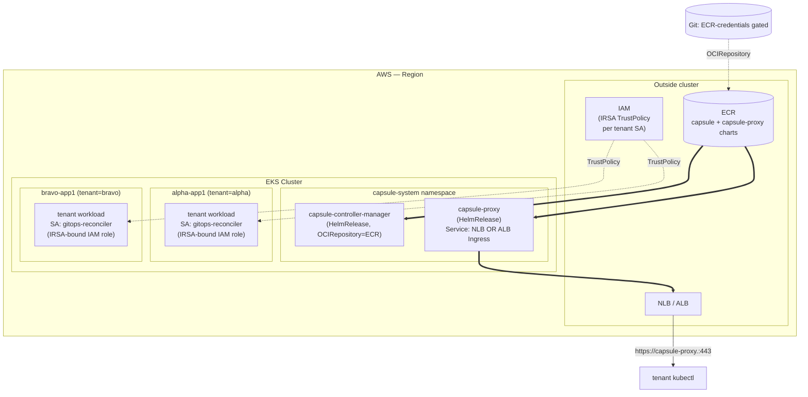

# Phase 7: Foundation — POC Seam + spoke-capsule Cluster + EKS Capsule Doc — Research

**Researched:** 2026-04-29
**Domain:** Hub-only Flux GitOps onboarding seam for POCs + a fourth k3d cluster on a shared Docker bridge + a self-contained EKS-translation doc
**Confidence:** HIGH (all source files verified by direct read; CONTEXT.md decisions are explicit; v0.18 analogs are committed and live; chart pins re-verified upstream by milestone-research the morning of writing)

---

## Summary

Phase 7 is the foundational Capsule-POC infrastructure phase. It lands three coupled artifacts whose combined effect is "the seam exists, the persistent POC cluster exists, and the team-presentation EKS doc exists" — but no Capsule installation, tenants, kubeconfigs, or validation work happens here. Those defer to Phases 8/9/10/11 respectively.

**The phase is overwhelmingly a structural-mirror exercise.** Every artifact has a verbatim v0.18 analog: the sentinel-guarded mount comes from the `# KARYON SPOKES MOUNT` pattern, the per-spoke kustomization shape comes from `clusters/hub-flux/spokes/spoke-apps.yaml`, the registration script comes from `scripts/register-spokes-for-flux.sh`, the cluster-create idempotency comes from `scripts/create-clusters.sh`, the fix-dns recovery comes from `scripts/fix-coredns.sh`, the Mermaid topology comes from `docs/architecture.md`, and the bats convention comes from `tests/bats/register-spokes-01-static.bats`. **Building structurally novel solutions is a planning anti-pattern here.**

Three things are genuinely new and need careful research-grade thought (rather than analog-mirroring):

1. **The 30443 NodePort fail-fast inversion.** v0.18's `check_port()` warns when a port is in use; CAPCLU-04 contractually requires Phase 7 to *fail fast* on 30443. This is the only place where the v0.18 pattern is being inverted, and the planner picks between extending `check_port()` with a strict variant vs adding a separate POC-aware preflight section.
2. **The kubeconfig-shape gitleaks rule.** The current `.gitleaks.toml` is allowlist-only (no positive rules); the new rule is the first positive rule the project has shipped, and it must be tested with synthetic fixtures that prove it fires (positive case) AND does not fire on innocuous YAML (negative case).
3. **The EKSDOC-01 doc that lands FIRST.** Per D-13 the doc must be usable as a team-presentation artifact before the cluster work is done — meaning it stands on its own, references no internal-only files, and mirrors ADR-008's planned graduation framing for the section "(e) what this POC does NOT prove".

**Primary recommendation:** Execute this phase as five plans in this order: (1) `docs/capsule-on-eks.md` first (D-13 lock), (2) the POC seam (sentinel + pocs/ aggregator + register-poc-cluster.sh), (3) the spoke-capsule cluster + outer reconcile + P18 falsifier verification, (4) preflight 30443 fail-fast + gitleaks/gitignore leak defense, (5) `task fix-dns-poc-capsule` + `docs/poc-capsule.md` host-restart procedure. The last four can interleave; the first must lead. Everything else is mirroring v0.18 patterns verbatim.

---

## User Constraints (from CONTEXT.md)

### Locked Decisions (verbatim from CONTEXT.md `<decisions>`)

**EKS doc (`docs/capsule-on-eks.md` — EKSDOC-01)**

- **D-01:** Audience and tone — Mixed Engineering + Cloud Ops, **brief**, biased toward calling out admin-required steps (e.g., install CRDs, IRSA setup) at a high level. YAML appears only on important items; no full reproduction of every manifest.
- **D-02:** Section (d) "Rough EKS install path" structure:
  - **Lead with a high-level walkthrough** of bare-minimum steps to deploy Capsule + capsule-proxy on EKS for a comparable POC.
  - **Verbatim YAML** for these admin-required items: (1) IRSA TrustPolicy for tenant ServiceAccounts (JSON trust policy + ServiceAccount IAM-role annotation); (2) capsule-proxy Service (LoadBalancer with NLB annotations OR ALB Ingress — note the AWS Load Balancer Controller dependency); (3) CapsuleConfiguration `allowedNodeSelectors` for VPC CNI / cluster-autoscaler / Karpenter interaction.
  - **Narrative-only** for: ECR-hosted Helm OCIRepository + ECR pull permissions for Flux source-controller SA; Capsule operator HelmRelease pin (chart + version called out by name; no full HelmRelease YAML).
- **D-03:** Topology diagram — **Mermaid** (matches `docs/architecture.md` style; native GitHub render). Source of truth is the ASCII diagram in `.planning/research/SUMMARY.md`; transcribe to Mermaid.
- **D-04:** Section (e) "What this POC does NOT prove" — **locked 3-item structure**: (1) HA Capsule, (2) OIDC tenant authentication, (3) multi-spoke federation. Mirrors ADR-008's eventual framing. Do NOT add EKS-flavored extras.

**POC seam shape (POC-01, POC-02)**

- **D-05:** `# KARYON POC MOUNT` sentinel placement — **BELOW the existing `# KARYON SPOKES MOUNT`** in `clusters/hub-flux/flux-system/kustomization.yaml`. Final ordering:
  ```
  - gotk-components.yaml
  - gotk-sync.yaml
  # KARYON SPOKES MOUNT
  - ../spokes
  # KARYON POC MOUNT
  - ../pocs
  ```
- **D-06:** `clusters/hub-flux/pocs/` — **peer aggregator + flat `capsule.yaml`**, mirroring spokes/ exactly:
  ```
  clusters/hub-flux/pocs/
  ├── kustomization.yaml          # resources: [capsule.yaml]
  └── capsule.yaml                 # outer Flux Kustomization
  ```
- **D-07:** `scripts/register-poc-cluster.sh` signature — single positional arg `<cluster-name>`; kubectl context **implicitly `k3d-${cluster-name}`** (mirrors `register-spokes-for-flux.sh`). No `--context` flag, no second positional. Fails fast if context missing.
- **D-08:** Phase 7 contents under `scripts/poc/capsule/` — **`create-cluster.sh` (CAPCLU-01) + `fix-dns.sh` (CAPCLU-03)** ONLY. Capsule operator/proxy install scripts defer to Phase 8; tenant kubeconfig minting defers to Phase 10; ordered POC teardown defers to Phase 11.

**Locked invariants inherited from milestone-open + v0.18 close**

- **D-09:** `# KARYON POC MOUNT` location is **`clusters/hub-flux/flux-system/kustomization.yaml`** (the FLUX PATCH SURFACE). NOT `clusters/hub-flux/kustomization.yaml`.
- **D-10:** `spoke-capsule` k3d cluster pins: apiserver port **6446**, NodePort **30443** published, `--tls-san k3d-spoke-capsule-server-0`, on shared `k8s-net` network.
- **D-11:** Outer Kustomization at `clusters/hub-flux/pocs/capsule.yaml` uses `spec.kubeConfig.secretRef.name: spoke-capsule-kubeconfig` AND `key: value.yaml` (P18 inheritance).
- **D-12:** All Capsule POC concerns isolated under `scripts/poc/capsule/` (P31). The v0.18 scripts `{create-clusters,register-spokes-for-flux,health-check,destroy,delete-clusters,rebuild}.sh` MUST NOT mention `spoke-capsule`. Static bats grep enforces zero mentions.
- **D-13:** `docs/capsule-on-eks.md` (EKSDOC-01) lands **FIRST** in Phase 7 plan order. Status may stay `Draft` until Phase 11 graduation rolls it forward to `Reviewed`.
- **D-14:** `.gitleaks.toml` MUST gain a new explicit rule for `kind: Config` + bearer-token shape by end of Phase 7 (P29). `.gitignore` gains tenant-kubeconfig globs to match Phase 10's `${TMPDIR:-/tmp}/karyon-tenants/` destination.
- **D-15:** `task preflight` reserves NodePort 30443 with **fail-fast** behavior (CAPCLU-04 literal contract: "fails fast if the port is already in use"). Inverts v0.18 `check_port()` warn pattern.
- **D-16:** `task fix-dns-poc-capsule` recovers spoke-capsule alone — MUST NOT affect the v0.18 default `task fix-dns`. Implementation: `scripts/poc/capsule/fix-dns.sh`.
- **D-17:** ADR-004 hub-only Flux preserved — NO Flux runs on spoke-capsule. The hub kustomize-controller reconciles into spoke-capsule via `spec.kubeConfig` exactly as for spoke-apps and spoke-ml.

### Claude's Discretion (recommended defaults from CONTEXT.md)

- **gitleaks rule shape (POC-03 sub-decisions)** — single combined `kind: Config` + bearer-token rule (lower false-positive surface), fixtures under `tests/fixtures/gitleaks/` with per-path allowlist, minimum coverage = 1 positive (real-shape kubeconfig + bearer token, MUST be caught) + 1 negative (configmap or unrelated yaml, MUST NOT be caught).
- **`scripts/poc/capsule/create-cluster.sh` idempotency model** — skip-if-exists with config-drift verify, mirroring `scripts/create-clusters.sh`.
- **`scripts/poc/capsule/fix-dns.sh` scope** — mirror `scripts/fix-coredns.sh` adapted for spoke-capsule alone (k3d cluster stop/start spoke-capsule; verify spoke kubelet ready; do NOT restart hub-flux).
- **`task preflight` 30443 fail-fast scoping** — unconditional fail-fast (CAPCLU-04 literal phrasing).
- **`docs/poc-capsule.md` host-restart procedure depth** — quickstart-style "Host restart recovery" section + brief "Troubleshooting" for Docker/WSL restart edge cases.

### Deferred Ideas (OUT OF SCOPE — verbatim from CONTEXT.md)

None — discussion stayed within Phase 7 scope.

True deferrals to later phases (already locked at milestone-open, restated for plan-side awareness):

- Capsule operator + capsule-proxy install → **Phase 8** (CAP-01, CAP-02, CAP-03)
- Tenant CRs + Flux multi-tenancy lockdown patches → **Phase 9** (TEN-01..06)
- Tenant-owner kubeconfigs + capsule-proxy round-trip → **Phase 10** (PROXY-01..03)
- Negative RBAC suite + webhook failure + clean teardown + graduation ADR → **Phase 11** (VAL-01..06)
- capsule-addon-fluxcd trial → **Phase 12** (OPTIONAL, gated on ADR-008 outcome)

---

## Phase Requirements

| ID | Description | Research Support |
|----|-------------|------------------|
| POC-01 | User can mount POC Kustomizations on hub-flux through a sentinel-guarded patch surface (`# KARYON POC MOUNT` in `clusters/hub-flux/flux-system/kustomization.yaml`) without modifying bootstrap-managed files | "POC Seam Architecture" + "Code Examples → Sentinel Insertion" |
| POC-02 | User can register an external POC cluster to hub-flux via `scripts/register-poc-cluster.sh <cluster-name>` (mirrors v0.18 `register-spokes-for-flux.sh`; never invoked by `task rebuild`) | "Standard Stack → register-poc-cluster.sh" + "Code Examples → Imperative Secret Apply" |
| POC-03 | Tenant kubeconfigs / bearer tokens are blocked from committing to the public repo by extended `.gitignore` globs + a new `.gitleaks.toml` rule that matches `kind: Config` + bearer-token shape (verified by synthetic-fixture bats) | "Standard Stack → gitleaks 8.30.1" + "Code Examples → kubeconfig-shaped multi-line rule" + "Common Pitfalls → P29" |
| POC-04 | `task preflight` reserves the capsule-proxy NodePort (30443) and fails fast if the port is in use elsewhere on the host | "Architecture Patterns → 30443 fail-fast inversion" + "Common Pitfalls → P39" |
| CAPCLU-01 | User can create a persistent `spoke-capsule` k3d cluster on the shared `k8s-net` network (apiserver port 6446, NodePort 30443 published, `--tls-san k3d-spoke-capsule-server-0`) via `scripts/poc/capsule/create-cluster.sh` | "Standard Stack → k3d v5.8.3" + "Code Examples → k3d cluster create" + "Common Pitfalls → P28, P39" |
| CAPCLU-02 | Hub-flux reconciles into spoke-capsule via outer Kustomization `clusters/hub-flux/pocs/capsule.yaml` with `spec.kubeConfig.secretRef.name: spoke-capsule-kubeconfig` and `key: value.yaml` (P18 inheritance) — silent-misroute falsifier passes | "Standard Stack → Flux v2.8.6" + "Architecture Patterns → Outer Kustomization" + "Common Pitfalls → P40" |
| CAPCLU-03 | User can recover stale CoreDNS NodeHosts on spoke-capsule alone via `task fix-dns-poc-capsule` after Docker/WSL restart, without affecting the v0.18 default `task fix-dns` | "Architecture Patterns → Per-cluster CoreDNS recovery" + "Common Pitfalls → P35" |
| CAPCLU-04 | Documented host-restart procedure (`docs/poc-capsule.md`) explains how to bring spoke-capsule back after Docker/WSL restart | "Architecture Patterns → docs/poc-capsule.md content shape" |
| EKSDOC-01 | `docs/capsule-on-eks.md` exists at the start of Phase 7 work and is a self-contained rough-cut sufficient to walk a team through the proposal — sections (a)–(e) per CONTEXT D-01..D-04 | "Architecture Patterns → EKS doc content shape" + "Code Examples → IRSA + ALB + nodeSelector" + "Standard Stack → AWS Load Balancer Controller" |

---

## Project Constraints (from CLAUDE.md / AGENTS.md)

`./CLAUDE.md` delegates to `./AGENTS.md`, which is mostly TODO placeholders. The single actionable directive that applies to this phase: **GSD v1 — `.planning/` is live planning state.** No additional CLAUDE.md restrictions apply to Phase 7 implementation work.

Public-repo + global Claude defaults (from `~/.claude/CLAUDE.md`):

- Public-safe by default — placeholders instead of real secrets, internal URLs, or hostnames.
- Do not read, print, or expose secrets unless explicitly asked.
- This becomes load-bearing in Phase 7 because POC-03 + D-14 are explicitly the leak-defense work; the gitleaks fixtures must NOT contain real tokens, and the synthetic-fixture bats must use generator-style shapes that look like kubeconfigs but contain inert filler.

---

## Architectural Responsibility Map

Phase 7 spans three architectural tiers — none of them application code, all of them lab infrastructure plumbing.

| Capability | Primary Tier | Secondary Tier | Rationale |
|------------|-------------|----------------|-----------|
| `# KARYON POC MOUNT` sentinel + `pocs/` aggregator | GitOps control plane (hub-flux/flux-system) | — | This IS the FLUX PATCH SURFACE. ADR-004 puts hub-flux in primary control. |
| `clusters/hub-flux/pocs/capsule.yaml` outer Kustomization | GitOps control plane (hub-flux Flux Kustomization, namespace=flux-system) | spoke-capsule (target via `spec.kubeConfig`) | Hub controller reconciles INTO spoke; same shape as v0.18 spoke-apps.yaml. |
| `scripts/register-poc-cluster.sh` (SA + CRB + token Secret + hub Secret apply) | Operator-side imperative (WSL host) | hub-flux + spoke-capsule (kubectl apply targets) | Mirrors `register-spokes-for-flux.sh` SA/CRB/Secret apply pattern. |
| `scripts/poc/capsule/create-cluster.sh` | Operator-side imperative (k3d on Docker daemon) | spoke-capsule (created cluster) | Same primary tier as `create-clusters.sh` — Docker daemon + k3d. |
| `scripts/poc/capsule/fix-dns.sh` | Operator-side imperative (k3d cluster stop/start) | spoke-capsule (target) | Same primary tier as `fix-coredns.sh` — k3d-only manipulation. |
| `task preflight` 30443 fail-fast | Operator-side static check (host network) | — | Read-only host-network check; mirrors existing `check_port()` shape. |
| `.gitignore` extension + `.gitleaks.toml` rule | Repo-root static defense | — | Pre-commit + CI enforcement layers; no runtime tier. |
| `docs/capsule-on-eks.md` | Documentation | — | EKS-target audience; informational only; no code or runtime. |
| `docs/poc-capsule.md` host-restart section | Documentation | — | Operator-facing recovery procedure; informational. |
| New bats files | Test infrastructure (host) | — | Static contract tests against committed files; some live tests gated by `KARYON_LIVE_TESTS=1`. |

**Critical tier-correctness check:** None of Phase 7's artifacts run on spoke-capsule directly (D-17 / ADR-004). Everything is either (a) hub-flux GitOps state, (b) operator-side imperative scripts, (c) repo-root static state, or (d) documentation. **If a planner ever proposes "install something on spoke-capsule in Phase 7," that's wrong — that's Phase 8.**

---

## Standard Stack

### Core (versions verified against `.tool-versions` + upstream by milestone-research 2026-04-29)

| Library | Version | Purpose | Why Standard |
|---------|---------|---------|--------------|
| k3d | v5.8.3 | Persistent k3d-spoke-capsule cluster on `k8s-net` | Pinned by ADR-002; same runtime as v0.18 spokes. `[VERIFIED: .tool-versions + Bash check]` |
| k3s image | `rancher/k3s:v1.34.6-k3s1` | spoke-capsule's stock K3s image (no CUDA — Capsule install in Phase 8 is operator + proxy, NOT GPU workloads) | ADR-005 — clears Capsule v0.12.x's k8s ≥ 1.34.0 floor with 6 patches of margin. `[CITED: docs/adr/0005-kubernetes-version-pin.md]` |
| Flux | v2.8.6 | Hub-flux reconciles outer `clusters/hub-flux/pocs/capsule.yaml` Kustomization into spoke-capsule | Phase 7 USES the v0.18 hub-flux installation; no Flux work happens in this phase. `[VERIFIED: .tool-versions]` |
| kubectl | v1.35.0 (asdf shim) | SA + CRB + Secret application in `register-poc-cluster.sh` | Mirrors `register-spokes-for-flux.sh` usage. `[VERIFIED: Bash check]` |
| yq | v4.53.2 | YAML manipulation in sentinel-insertion + register-poc-cluster.sh + bats | v0.18 invariant; `register-spokes-for-flux.sh` uses identical `yq eval` patterns. `[VERIFIED: Bash check]` |
| gitleaks | 8.30.1 | New positive rule for `kind: Config` + bearer-token shape (POC-03) | Pinned in `.tool-versions`; supports multi-line regex (minVersion v8.25.0). `[VERIFIED: Bash check + WebFetch]` |
| bats-core | 1.11.0 | Static-contract + live tests for sentinel, register script, gitleaks rule | v0.18 invariant; existing 169 tests + `tests/bats/test_helper.bash`. `[VERIFIED: Bash check]` |
| task (go-task) | 3.50.0 | New top-level `fix-dns-poc-capsule` task entry; `preflight` extended | v0.18 invariant. `[VERIFIED: Bash check]` |
| docker | running | k3d backend for cluster create + sentinel-related operations | v0.18 invariant. `[VERIFIED: Bash check — daemon reachable]` |

### Supporting (no installation; purely existing repo helpers)

| File | Purpose | When to Use |
|------|---------|-------------|
| `scripts/lib/preflight-lib.sh` | Output helpers `section/pass/warn/fail/info/have` | Sourced at the head of every new Phase 7 script (`register-poc-cluster.sh`, `scripts/poc/capsule/create-cluster.sh`, `scripts/poc/capsule/fix-dns.sh`). |
| `tests/bats/test_helper.bash` | `REPO_ROOT` resolution + `require_live` / `require_live_destructive` skip-gates | `load 'test_helper'` at the head of every new Phase 7 bats file. |
| `clusters/hub-flux/spokes/spoke-apps.yaml` | Reference template for `clusters/hub-flux/pocs/capsule.yaml` | Direct file-shape copy, with `name`, `path`, `secretRef.name` substituted; `key: value.yaml` preserved. |
| `scripts/register-spokes-for-flux.sh` | Reference template for `scripts/register-poc-cluster.sh` | Single-cluster variant: dropped `for spoke in spoke-ml spoke-apps` loop; replaced with positional `$1`. |
| `scripts/create-clusters.sh` (helper `create_cluster()`) | Reference template for `scripts/poc/capsule/create-cluster.sh` idempotency model | Skip-if-exists with config-drift verify; identical structure. |
| `scripts/fix-coredns.sh` | Reference template for `scripts/poc/capsule/fix-dns.sh` | k3d cluster stop/start ${CLUSTER}; identical structure with cluster name swapped, hub-flux interaction removed. |

### Alternatives Considered

| Instead of | Could Use | Tradeoff |
|------------|-----------|----------|
| Single-cluster `register-poc-cluster.sh <name>` | Multi-positional `register-poc-cluster.sh capsule kubectl-context-override` | D-07 explicitly rejects this — single positional only. Future POCs that need a non-`k3d-${name}` context will be considered then. |
| `scripts/poc/capsule/fix-dns.sh` (separate task) | Extend `task fix-dns` with `KARYON_POC_FIXDNS=capsule` env-var | D-16 explicitly rejects environment-flag composition — keeps default v0.18 path byte-for-byte unchanged (P31). |
| Single combined gitleaks rule (`kind: Config` + token in one regex) | Two separate rules ORed | D-14 + Discretion default lock single-rule — fewer false-positives, simpler test fixtures. |
| Unconditional 30443 fail-fast in `check_port()` | Conditional only when spoke-capsule cluster exists | D-15 + Discretion default lock unconditional — predictable, the cost of a false alarm is one error message. |
| Built-in certgen for capsule-proxy (Phase 8) | cert-manager-issued cert | Phase 8 concern, NOT Phase 7. Listed only because EKSDOC-01 mentions it narratively. |

**Installation:**

No new tools, no new asdf entries. Phase 7 uses ONLY tools already pinned in `.tool-versions`. Verify present:

```bash
command -v k3d kubectl flux gitleaks bats yq task >/dev/null 2>&1 && echo "Phase 7 deps ready"
```

**Version verification:** All Phase 7 tools are already pinned by v0.18; no upstream version drift is in scope. The Capsule chart pins (capsule v0.12.4, capsule-proxy v0.12.0) cited elsewhere are Phase 8 concerns and listed here only for the EKSDOC-01 doc's narrative content.

---

## Architecture Patterns

### System Architecture Diagram

```mermaid
flowchart TB
    subgraph host["WSL2 Ubuntu 24.04 — Docker network k8s-net (172.30.0.0/16)"]

        subgraph hubFlux["k3d-hub-flux (apiserver :6443, FLUX HUB)"]
            direction TB
            kc["kustomize-controller<br/>(reconciles SPOKES + POCs)"]
            sentinel["clusters/hub-flux/flux-system/kustomization.yaml<br/># KARYON SPOKES MOUNT → ../spokes<br/># KARYON POC MOUNT  → ../pocs"]
            spokesAgg["clusters/hub-flux/spokes/<br/>kustomization.yaml<br/>+ spoke-ml.yaml + spoke-apps.yaml"]
            pocsAgg["clusters/hub-flux/pocs/<br/>kustomization.yaml<br/>+ capsule.yaml (Phase 7)"]
            capKust["Kustomization: poc-capsule<br/>spec.path = ./pocs/capsule<br/>spec.kubeConfig.secretRef = spoke-capsule-kubeconfig<br/>spec.kubeConfig.secretRef.key = value.yaml"]
            capSec[/"Secret: spoke-capsule-kubeconfig<br/>(applied imperatively;<br/>NEVER committed)"/]
        end

        subgraph spokeCapsule["k3d-spoke-capsule (apiserver :6446, NodePort :30443)"]
            direction TB
            spokeRBAC["flux-system ns:<br/>flux-reconciler SA<br/>+ cluster-admin CRB<br/>+ flux-reconciler-token Secret<br/>(legacy SA-token)"]
            empty["pocs/capsule/ in git is EMPTY in Phase 7<br/>(operator/proxy/config arrive Phase 8)"]
        end

        subgraph spokeApps["k3d-spoke-apps :6445 (v0.18 — unchanged)"]
            direction TB
            ignore1[" "]
        end

        subgraph spokeMl["k3d-spoke-ml :6444 (v0.18 — unchanged)"]
            direction TB
            ignore2[" "]
        end

    end

    git[(Git: $GITHUB_OWNER/$GITHUB_REPO)]
    git -->|GitRepository<br/>(every 1m)| sentinel
    sentinel --> spokesAgg
    sentinel --> pocsAgg
    pocsAgg --> capKust
    capKust -.uses.-> capSec
    capKust ==>|"applies via spec.kubeConfig<br/>(Phase 7: empty pocs/capsule/<br/>= no-op reconcile)"| spokeCapsule

    %% Operator-side scripts that produce the above (none commit to git):
    op["Operator (WSL host)"]
    op -.runs.-> reg["scripts/register-poc-cluster.sh capsule"]
    reg -.creates.-> spokeRBAC
    reg -.creates.-> capSec
    reg -.patches.-> sentinel
    op -.runs.-> create["scripts/poc/capsule/create-cluster.sh"]
    create -.creates.-> spokeCapsule
    op -.runs.-> fix["scripts/poc/capsule/fix-dns.sh"]
    fix -.bounces.-> spokeCapsule

    classDef phase7 fill:#fffde7,stroke:#f57f17,stroke-width:2px,color:#000
    class pocsAgg,capKust,capSec,spokeCapsule,reg,create,fix,empty,sentinel phase7
```

**What the reader follows from this diagram:**

1. The FLUX PATCH SURFACE (`flux-system/kustomization.yaml`) gains a second sentinel block parallel to the existing SPOKES MOUNT.
2. The new `pocs/` aggregator references a flat `capsule.yaml` outer Kustomization (D-06).
3. That Kustomization's `spec.kubeConfig` points at the imperatively-applied `spoke-capsule-kubeconfig` Secret in `flux-system` ns on hub-flux.
4. spoke-capsule's `flux-system` ns has the SA + CRB + token Secret triple — same Pattern 3 as the v0.18 spokes.
5. `pocs/capsule/` in git is **empty** at end of Phase 7 — the outer Kustomization will reconcile a no-op. Phase 8 fills `pocs/capsule/operator/`, `pocs/capsule/proxy/`, `pocs/capsule/config/`.
6. Three operator-side scripts produce the runtime state. None of them are wired into `task rebuild`.

### Recommended Project Structure

```
clusters/
└── hub-flux/
    ├── flux-system/
    │   └── kustomization.yaml      # FLUX PATCH SURFACE — extended with # KARYON POC MOUNT
    ├── kustomization.yaml          # bootstrap-managed, untouched
    ├── spokes/                     # v0.18 — untouched
    │   ├── kustomization.yaml
    │   ├── spoke-ml.yaml
    │   └── spoke-apps.yaml
    └── pocs/                       # NEW — Phase 7
        ├── kustomization.yaml      # resources: [capsule.yaml]
        └── capsule.yaml            # outer Flux Kustomization

pocs/                                # NEW — Phase 7 (empty inner kustomize directory)
└── capsule/
    └── kustomization.yaml          # resources: [] — placeholder, Phase 8 fills

scripts/
├── register-poc-cluster.sh         # NEW — Phase 7 (sibling of register-spokes-for-flux.sh)
├── preflight.sh                    # MODIFIED — Phase 7 (30443 fail-fast section)
└── poc/                            # NEW — Phase 7 (D-12 isolation namespace)
    └── capsule/
        ├── create-cluster.sh       # NEW — Phase 7 (CAPCLU-01)
        └── fix-dns.sh              # NEW — Phase 7 (CAPCLU-03)

docs/
├── capsule-on-eks.md               # NEW — Phase 7 (EKSDOC-01) — LANDS FIRST
└── poc-capsule.md                  # NEW — Phase 7 (CAPCLU-04 host-restart section)

tests/
├── bats/                           # NEW Phase 7 files following existing convention:
│   ├── poc-mount-01-static.bats         # POC-01 sentinel + pocs/ aggregator
│   ├── register-poc-cluster-01-static.bats # POC-02 script shape
│   ├── poc-cluster-01-static.bats       # CAPCLU-01 + CAPCLU-02 + CAPCLU-03 static
│   ├── preflight-pre15.bats             # POC-04 30443 fail-fast (preflight extension)
│   ├── repo-hygiene-04-poc.bats         # POC-03 .gitignore + .gitleaks.toml extensions
│   └── docs-06-eks.bats                 # EKSDOC-01 doc-shape contract
└── fixtures/                       # NEW — Phase 7
    └── gitleaks/
        ├── synthetic-kubeconfig.yaml    # POC-03 positive-fixture (MUST be caught)
        └── benign-configmap.yaml        # POC-03 negative-fixture (MUST NOT be caught)

.gitignore                          # MODIFIED — Phase 7 (D-14 tenant-kubeconfig globs)
.gitleaks.toml                      # MODIFIED — Phase 7 (D-14 new positive rule + per-fixture allowlist)
Taskfile.yml                        # MODIFIED — Phase 7 (new fix-dns-poc-capsule task)
```

### Pattern 1: Sentinel-guarded patch surface (POC-01)

**What:** Append a second sentinel-guarded mount to the FLUX PATCH SURFACE without touching bootstrap-managed peer files.

**When to use:** Only when adding to the FLUX PATCH SURFACE (`clusters/hub-flux/flux-system/kustomization.yaml`). Never used for bootstrap-managed `gotk-components.yaml` / `gotk-sync.yaml`.

**Example (target final shape):**

```yaml
# Source: clusters/hub-flux/flux-system/kustomization.yaml (existing FLUX PATCH SURFACE comment block + SPOKES sentinel preserved)
apiVersion: kustomize.config.k8s.io/v1beta1
kind: Kustomization
resources:
  - gotk-components.yaml
  - gotk-sync.yaml
  # KARYON SPOKES MOUNT
  - ../spokes
  # KARYON POC MOUNT
  - ../pocs
```

**Insertion algorithm (port `ensure_hub_spokes_mount()` verbatim with substitutions):**

```bash
# Source: scripts/register-spokes-for-flux.sh lines 525-579 (ensure_hub_spokes_mount)
readonly POCS_SENTINEL="# KARYON POC MOUNT"
readonly POCS_RESOURCE="../pocs"

ensure_hub_pocs_mount() {
  local tmp tmp_with_sentinel

  # 1. yq merge the resource list (idempotent if already present):
  tmp="$(mktemp)"
  if ! yq eval '(.resources // []) as $r | .resources = ($r + ["../pocs"] | unique)' \
      "${HUB_KUST_FILE}" > "${tmp}"; then
    rm -f "${tmp}"
    fail "${HUB_KUST_FILE} is not valid YAML."; exit 1
  fi

  # 2. awk-insert the sentinel comment immediately ABOVE the new "../pocs" line
  #    (only if sentinel not already seen in the file — idempotent)
  tmp_with_sentinel="$(mktemp)"
  awk -v sentinel="${POCS_SENTINEL}" '
    $0 ~ /^[[:space:]]*-[[:space:]]+\.\.\/pocs[[:space:]]*$/ && !inserted {
      if (!seen_sentinel) {
        match($0, /^[[:space:]]*/)
        print substr($0, RSTART, RLENGTH) sentinel
      }
      inserted=1
    }
    index($0, sentinel) { seen_sentinel=1 }
    { print }
  ' "${tmp}" > "${tmp_with_sentinel}"

  # 3. cmp-then-mv (idempotent: skip if no diff) — see repair_file_if_needed()
  if cmp -s "${tmp_with_sentinel}" "${HUB_KUST_FILE}"; then
    info "already done, skipping: pocs mount in ${HUB_KUST_FILE}"
  else
    mv "${tmp_with_sentinel}" "${HUB_KUST_FILE}"
    pass "repaired: ../pocs resource in ${HUB_KUST_FILE}"
  fi
}
```

**Critical invariants (P30 + D-09):**
- The HUB_KUST_FILE constant is `clusters/hub-flux/flux-system/kustomization.yaml` (the FLUX PATCH SURFACE — NOT the peer `clusters/hub-flux/kustomization.yaml`).
- The sentinel literal `# KARYON POC MOUNT` is greppable EXACTLY ONCE (`grep -c '# KARYON POC MOUNT' = 1`).
- The two sentinels (SPOKES, POCS) are independent functions — `ensure_hub_pocs_mount()` MUST NOT reuse `ensure_hub_spokes_mount()` (P30 disambiguation).

### Pattern 2: Outer Kustomization with `key: value.yaml` (CAPCLU-02)

**What:** A hub-side Flux v1 Kustomization that reconciles a relative path INTO spoke-capsule via `spec.kubeConfig.secretRef`.

**When to use:** Every cross-cluster reconciliation hop in this lab; mandatory for any new spoke or POC target.

**Example (target final shape — direct mirror of `clusters/hub-flux/spokes/spoke-apps.yaml`):**

```yaml
# Source: clusters/hub-flux/pocs/capsule.yaml
# (mirrors clusters/hub-flux/spokes/spoke-apps.yaml verbatim with name/path/secretRef substituted)
#
# REQ-CAPCLU-02 (file existence + secretRef shape).
# REQ-CAPCLU-02 (key: value.yaml explicit — v0.18 P18 inheritance: silent-misroute fault is
#   `spec.kubeConfig` ENTIRELY ABSENT, which would make kustomize-controller fall back to its
#   in-cluster SA and reconcile to HUB. ALWAYS include the entire spec.kubeConfig block;
#   explicit `key: value.yaml` is belt-and-suspenders against future Flux default-key changes.)
apiVersion: kustomize.toolkit.fluxcd.io/v1
kind: Kustomization
metadata:
  name: poc-capsule
  namespace: flux-system
spec:
  interval: 5m
  path: ./pocs/capsule
  prune: true
  sourceRef:
    kind: GitRepository
    name: flux-system
  kubeConfig:
    secretRef:
      name: spoke-capsule-kubeconfig
      key: value.yaml
```

**Critical invariants:**
- `spec.path: ./pocs/capsule` is the in-repo path the hub reconciles. In Phase 7 this directory contains only an empty `kustomization.yaml` (Phase 8 fills it).
- `spec.kubeConfig.secretRef.name: spoke-capsule-kubeconfig` AND `key: value.yaml` (D-11, P40).
- `spec.prune: true` matches the v0.18 spokes pattern; tenants in Phase 9+ will use this Kustomization's path-anchored cleanup.

### Pattern 3: Single-cluster register-poc-cluster.sh (POC-02)

**What:** Per-cluster RBAC + token Secret on the spoke + imperative kubeconfig Secret apply on the hub. Single positional arg; implicit `k3d-${name}` context.

**When to use:** First-time onboarding of a POC cluster. Idempotent — re-runs verify and skip.

**Example (function signature + the canonical body — direct port of `register_spoke()` from `scripts/register-spokes-for-flux.sh`):**

```bash
#!/usr/bin/env bash
# scripts/register-poc-cluster.sh
# Usage: bash scripts/register-poc-cluster.sh <cluster-name>
# Effect:
#   1. Provisions flux-reconciler SA + cluster-admin CRB + legacy SA-token Secret on k3d-${name}
#   2. Builds kubeconfig payload from the SA token + apiserver cert
#   3. Applies kubeconfig as Secret flux-system/${name}-kubeconfig on k3d-hub-flux
#   4. Patches FLUX PATCH SURFACE with # KARYON POC MOUNT sentinel + ../pocs
#   5. Verifies P18 silent-misroute defense (node-name proof)
#
# Idempotent. Never invoked by `task rebuild`. NOT chained from anywhere.
set -euo pipefail

SCRIPT_DIR="$(cd "$(dirname "${BASH_SOURCE[0]}")" && pwd)"
REPO_ROOT="$(cd "${SCRIPT_DIR}/.." && pwd)"
# shellcheck source=lib/preflight-lib.sh
# shellcheck disable=SC1091
source "${SCRIPT_DIR}/lib/preflight-lib.sh"

readonly HUB_CTX="k3d-hub-flux"
readonly FLUX_NS="flux-system"
readonly HUB_KUST_FILE="${REPO_ROOT}/clusters/hub-flux/flux-system/kustomization.yaml"
readonly POCS_DIR="${REPO_ROOT}/clusters/hub-flux/pocs"
readonly POCS_SENTINEL="# KARYON POC MOUNT"
readonly RECONCILER_SA="flux-reconciler"
readonly RECONCILER_BINDING="flux-reconciler-cluster-admin"
readonly RECONCILER_SECRET="flux-reconciler-token"

# 1. Validate single positional arg (D-07)
if [[ "$#" -ne 1 ]]; then
  fail "usage: bash scripts/register-poc-cluster.sh <cluster-name>"
  exit 1
fi
readonly POC_CLUSTER="$1"
readonly POC_CTX="k3d-${POC_CLUSTER}"

# 2. Validate implicit kubectl context exists (D-07: fails fast if missing)
if ! kubectl config get-contexts -o name 2>/dev/null | grep -qx "${POC_CTX}"; then
  fail "kubectl context ${POC_CTX} not found.
     Fix: bash scripts/poc/${POC_CLUSTER}/create-cluster.sh"
  exit 1
fi

# 3. apply_spoke_rbac() — verbatim copy from register-spokes-for-flux.sh, parameterized on cluster
# 4. wait_for_token_secret() — verbatim copy
# 5. build_kubeconfig() — verbatim copy with server="https://k3d-${POC_CLUSTER}-server-0:6443"
# 6. apply_hub_secret() — verbatim copy: kubectl create secret generic --from-file=value.yaml=/dev/stdin --dry-run=client | apply
# 7. ensure_hub_pocs_mount() — pattern 1 above
# 8. write clusters/hub-flux/pocs/kustomization.yaml + clusters/hub-flux/pocs/capsule.yaml (Pattern 2)
# 9. verify_credential_layer() — verbatim copy: openssl s_client TLS proof + /readyz + /api/v1/nodes node-name proof
```

**Critical invariants:**
- `apiserver` URL is `https://k3d-${name}-server-0:6443` (NOT 6446 — that's only the *host-published* port; in-cluster the spoke's apiserver port is 6443; cf. `expected_server()` in `register-spokes-for-flux.sh`).
- D-11: `set -euo pipefail` (NOT `set -eux`); token data NEVER passed via `--from-literal`, NEVER tee'd, NEVER echoed. Only safe path is `printf '%s\n' "${kubeconfig_yaml}" | kubectl create secret generic ... --from-file=value.yaml=/dev/stdin --dry-run=client | kubectl apply -f -`.
- The `verify_credential_layer()` step performs the v0.18 P18 falsifier: hits `/api/v1/nodes` and asserts spoke-capsule's node-name appears AND hub-flux's node-name does NOT.

### Pattern 4: Skip-if-exists with config-drift verify (CAPCLU-01)

**What:** k3d cluster create that detects existing cluster + verifies image/network/api-port match expectations + fails on drift with explicit fix instructions.

**When to use:** Any persistent k3d cluster that survives across executor sessions.

**Example (mirroring `create_cluster()` from `scripts/create-clusters.sh` lines 77-171):**

```bash
#!/usr/bin/env bash
# scripts/poc/capsule/create-cluster.sh
# Creates the persistent spoke-capsule k3d cluster on k8s-net.
# REQ: CAPCLU-01.
# Idempotent: skip-if-exists with image/network/api-port drift verify (mirrors create_cluster() in create-clusters.sh).
# NOT chained from anywhere. Never invoked by `task rebuild`.
set -euo pipefail

SCRIPT_DIR="$(cd "$(dirname "${BASH_SOURCE[0]}")" && pwd)"
REPO_ROOT="$(cd "${SCRIPT_DIR}/../../.." && pwd)"
# shellcheck source=../../lib/preflight-lib.sh
# shellcheck disable=SC1091
source "${REPO_ROOT}/scripts/lib/preflight-lib.sh"

# D-10 pins:
readonly POC_CLUSTER="spoke-capsule"
readonly POC_API_PORT="6446"
readonly POC_NODEPORT="30443"
readonly K8S_NET_NAME="k8s-net"
readonly K3S_STOCK_IMAGE="rancher/k3s:v1.34.6-k3s1"
readonly EXPECTED_SAN="k3d-${POC_CLUSTER}-server-0"

# 1. Preflight gate — ensure 30443 is free + k8s-net exists (POC-04 fail-fast covers this)
section "preflight gate"
if ! bash "${REPO_ROOT}/scripts/preflight.sh" >/tmp/preflight-poc-$$.log 2>&1; then
  fail "preflight has blockers (likely 30443 in use; see POC-04 contract).
     Log: /tmp/preflight-poc-$$.log"
  exit 1
fi
pass "preflight green"

# 2. Idempotency check — skip if exists, fail on drift
section "${POC_CLUSTER} cluster"
if k3d cluster list --no-headers 2>/dev/null | awk '{print $1}' | grep -qx "${POC_CLUSTER}"; then
  # (a) image drift
  actual_image="$(docker inspect "k3d-${POC_CLUSTER}-server-0" -f '{{.Config.Image}}' 2>/dev/null || echo "")"
  if [[ "${actual_image}" != "${K3S_STOCK_IMAGE}" ]]; then
    fail "cluster ${POC_CLUSTER} IMAGE drift (actual=${actual_image}, expected=${K3S_STOCK_IMAGE}).
       Fix: k3d cluster delete ${POC_CLUSTER} && bash scripts/poc/capsule/create-cluster.sh"
    exit 1
  fi
  # (b) network drift
  actual_network="$(docker inspect "k3d-${POC_CLUSTER}-server-0" -f '{{range $k,$v := .NetworkSettings.Networks}}{{$k}} {{end}}' 2>/dev/null || echo "")"
  if [[ "${actual_network}" != *"${K8S_NET_NAME}"* ]]; then
    fail "cluster ${POC_CLUSTER} NETWORK drift (actual=${actual_network}, expected includes=${K8S_NET_NAME}).
       Fix: k3d cluster delete ${POC_CLUSTER} && bash scripts/poc/capsule/create-cluster.sh"
    exit 1
  fi
  # (c) api-port + nodeport drift on serverlb
  actual_ports="$(docker inspect "k3d-${POC_CLUSTER}-serverlb" -f '{{range $k, $v := .NetworkSettings.Ports}}{{$k}}={{range $v}}{{.HostPort}}{{end}} {{end}}' 2>/dev/null || echo "")"
  if ! echo "${actual_ports}" | grep -qE "6443/tcp=${POC_API_PORT}"; then
    fail "cluster ${POC_CLUSTER} API PORT drift."; exit 1
  fi
  if ! echo "${actual_ports}" | grep -qE "${POC_NODEPORT}/tcp=${POC_NODEPORT}"; then
    fail "cluster ${POC_CLUSTER} NODEPORT drift (expected ${POC_NODEPORT})."; exit 1
  fi
  info "already done, skipping: cluster ${POC_CLUSTER}"
else
  info "creating: cluster ${POC_CLUSTER} on :${POC_API_PORT} + NodePort ${POC_NODEPORT}"
  k3d cluster create "${POC_CLUSTER}" \
    --image "${K3S_STOCK_IMAGE}" \
    --api-port "${POC_API_PORT}" \
    --network "${K8S_NET_NAME}" \
    --port "${POC_NODEPORT}:${POC_NODEPORT}@server:0" \
    --k3s-arg "--tls-san=k3d-${POC_CLUSTER}-server-0@server:*"
  pass "created: cluster ${POC_CLUSTER}"
fi

# 3. SAN verification (bounded retry: 10 × 3s = 30s) — mirrors create-clusters.sh lines 149-170
# (omitted for brevity — copy verbatim with POC_API_PORT substituted)
```

**Critical invariants:**
- D-10 pins: api-port `6446`, NodePort `30443` published, `--tls-san k3d-spoke-capsule-server-0`, on `k8s-net`.
- Stock image (no CUDA): `rancher/k3s:v1.34.6-k3s1`. Phase 8 will install Capsule operator + capsule-proxy as standard containers; no GPU work on spoke-capsule.
- The `--port "30443:30443@server:0"` flag publishes the host port `30443` to the spoke's server-0 node, which will host the capsule-proxy NodePort Service in Phase 8. (See "Resolved Open Question 1" below for `@server:0` vs `@loadbalancer` choice.)

### Pattern 5: 30443 fail-fast inversion in preflight (POC-04)

**What:** Add a strict-mode port reservation that fails (not warns) when 30443 is in use elsewhere.

**When to use:** Only for POC-reserved host ports where a stale listener WOULD prevent k3d cluster create from succeeding. The v0.18 ports (6443/6444/6445/8080-8082) remain warn-only because they self-resolve when k3d clusters are recreated.

**Example (recommended approach: separate strict helper):**

```bash
# scripts/preflight.sh — extend the existing ports section
# After the existing v0.18 warn-loop (lines 188-190), add a fail-fast loop for POC ports:

check_port_strict() {
  local port="$1"
  if ss -ltn 2>/dev/null | awk 'NR>1 {print $4}' | grep -qE "[:.]${port}$"; then
    fail "Port ${port} is in use elsewhere on the host (POC-04 reserved).
      Inspect: ss -ltnp | awk '\$4 ~ /:${port}\$/{print}'
      Fix: free the port (kill the listener) or stop the offending service before continuing"
    ss -ltnp 2>/dev/null | awk -v p=":${port}" '$4 ~ p {print "      " $0}' | head -2
  else
    pass "Port ${port} free (POC-04 fail-fast)"
  fi
}

# v0.18 warn ports (unchanged):
for p in 6443 6444 6445 8080 8081 8082; do
  check_port "$p"
done

# Phase 7 PRE-15: POC-04 fail-fast on 30443 (D-15 unconditional — Discretion default)
check_port_strict 30443
```

**Why a separate helper, not a parameter to `check_port`:**
- D-15 contractually inverts the default semantics; calling `check_port` with a `--strict` flag would risk a future caller forgetting the flag.
- A separately-named function makes the bats contract grep-able (`grep 'check_port_strict 30443' scripts/preflight.sh`).
- A future POC adding port `30444` reuses the same helper without modification.

**Critical invariants:**
- D-15 + Discretion default: **unconditional** fail-fast (NOT gated on whether spoke-capsule cluster exists).
- The existing `check_port()` function (warn-only) is preserved verbatim — no v0.18 regression.
- A new `tests/bats/preflight-pre15.bats` greps the strict helper's existence and the explicit `30443` argument.

### Pattern 6: Multi-line gitleaks rule with synthetic-fixture bats (POC-03)

**What:** A positive gitleaks rule that fires on a real-shaped kubeconfig + bearer token but does NOT fire on innocuous YAML.

**When to use:** Once per leak-defense surface. The current `.gitleaks.toml` is allowlist-only; this is the first positive rule the project ships.

**Example (single combined rule — Discretion default):**

```toml
# .gitleaks.toml — Phase 7 addition
# v0.19 POC-03: kubeconfig-shaped artifact + bearer token regex.
# gitleaks 8.30.1 supports multi-line regex via [\r\n] character classes (minVersion v8.25.0).
# Ref: research/PITFALLS.md §P29; tests/fixtures/gitleaks/synthetic-kubeconfig.yaml is the bats fixture.

[[rules]]
id = "kubeconfig-bearer-token"
description = "Kubernetes kubeconfig with embedded bearer token (kind: Config + users.token)"
regex = '''(?ms)^kind:\s*Config[\s\S]*?users:[\s\S]*?token:\s*[A-Za-z0-9._-]{32,}'''
tags = ["kubernetes", "kubeconfig", "bearer-token", "v0.19"]

[rules.allowlist]
description = "Phase 7 synthetic fixtures (verified inert; positive-test only)"
paths = [
  '''^tests/fixtures/gitleaks/synthetic-kubeconfig\.yaml$''',
]
```

**Synthetic fixtures (bats writes them via `setup()` to a temp dir; they are NOT committed in `.gitleaks.toml`'s allowlist for the repo, only the bats path is allowlisted):**

```yaml
# tests/fixtures/gitleaks/synthetic-kubeconfig.yaml — POSITIVE FIXTURE
# This file MUST be caught by the kubeconfig-bearer-token rule.
# The token below is INERT (not a real bearer token). It exists only to exercise the regex.
apiVersion: v1
kind: Config
clusters:
- name: synthetic
  cluster:
    server: https://example.invalid:6443
users:
- name: synthetic
  user:
    token: ZXhhbXBsZS1pbmVydC10b2tlbi12MC4xOS1zeW50aGV0aWMtZml4dHVyZQ
contexts:
- name: synthetic
  context:
    cluster: synthetic
    user: synthetic
current-context: synthetic
```

```yaml
# tests/fixtures/gitleaks/benign-configmap.yaml — NEGATIVE FIXTURE
# This file MUST NOT be caught (no kind: Config + token shape).
apiVersion: v1
kind: ConfigMap
metadata:
  name: poc-03-negative
data:
  hint: this is not a kubeconfig
  token: false-positive-canary
```

**Bats invocation pattern (fixture content placed via `setup()` heredoc, scanned by gitleaks, asserted):**

```bash
# tests/bats/repo-hygiene-04-poc.bats — POC-03 synthetic-fixture proof
@test "POC-03: gitleaks catches kubeconfig + bearer token shape" {
  fixture="${REPO_ROOT}/tests/fixtures/gitleaks/synthetic-kubeconfig.yaml"
  [ -f "$fixture" ]
  run gitleaks detect --no-banner --no-git --source "$fixture" \
    --config "${REPO_ROOT}/.gitleaks.toml" \
    --redact --verbose
  [ "$status" -ne 0 ]  # gitleaks returns non-zero on findings
}

@test "POC-03: gitleaks does NOT fire on innocuous YAML" {
  fixture="${REPO_ROOT}/tests/fixtures/gitleaks/benign-configmap.yaml"
  [ -f "$fixture" ]
  run gitleaks detect --no-banner --no-git --source "$fixture" \
    --config "${REPO_ROOT}/.gitleaks.toml" \
    --redact --verbose
  [ "$status" -eq 0 ]  # zero findings → exit 0
}
```

**Critical invariants:**
- gitleaks 8.30.1 (pinned) supports `(?ms)` AND `[\r\n]` multi-line patterns. The single-rule + `(?ms)` form is preferred; per-line concatenation isn't needed.
- Token regex `[A-Za-z0-9._-]{32,}` matches the JWT/SA-token family without entropy false-positives on short identifiers.
- The fixture allowlist uses `paths = [...]`; do NOT inline tokens into `regexes = [...]`. The synthetic fixture is the single allowed location.
- `.gitignore` extension goes hand-in-hand: `${TMPDIR:-/tmp}/karyon-tenants/*.kubeconfig` is the production output path (Phase 10), so `tests/fixtures/gitleaks/` is the only repo-internal place the rule fires positive.

### Pattern 7: Per-cluster CoreDNS recovery (CAPCLU-03)

**What:** Stop/start the spoke-capsule cluster alone to refresh stale CoreDNS NodeHosts entries.

**When to use:** After Docker daemon restart or WSL2 resume, when spoke-capsule's pods are seeing stale NodeHosts.

**Example (mirrors `scripts/fix-coredns.sh` adapted for spoke-capsule alone):**

```bash
#!/usr/bin/env bash
# scripts/poc/capsule/fix-dns.sh
# Refreshes stale k3d CoreDNS NodeHosts entries on spoke-capsule alone.
# Surfaces as `task fix-dns-poc-capsule`. Distinct from `task fix-dns` (hub-flux only).
# REQ: CAPCLU-03.
set -euo pipefail

SCRIPT_DIR="$(cd "$(dirname "${BASH_SOURCE[0]}")" && pwd)"
REPO_ROOT="$(cd "${SCRIPT_DIR}/../../.." && pwd)"
# shellcheck source=../../lib/preflight-lib.sh
# shellcheck disable=SC1091
source "${REPO_ROOT}/scripts/lib/preflight-lib.sh"

readonly POC_CLUSTER="spoke-capsule"
readonly POC_CTX="k3d-${POC_CLUSTER}"

# 1. tool gate (k3d, kubectl present) — mirrors fix-coredns.sh lines 28-33
section "Tool gate"
for cmd in k3d kubectl; do
  if ! have "$cmd"; then
    fail "required command missing: $cmd"
    exit 1
  fi
done
pass "required commands present"

# 2. spoke-capsule stop/start — mirrors fix-coredns.sh lines 36-51 (cluster name swapped)
section "${POC_CLUSTER} stop/start"
if ! k3d cluster stop "${POC_CLUSTER}"; then
  fail "failed to stop ${POC_CLUSTER}.
     Inspect: k3d cluster list
     Fix:     bash scripts/poc/capsule/create-cluster.sh && bash scripts/poc/capsule/fix-dns.sh"
  exit 1
fi
pass "stopped: ${POC_CLUSTER}"

if ! k3d cluster start "${POC_CLUSTER}" --wait --timeout 120s; then
  fail "failed to start ${POC_CLUSTER} within 120s.
     Inspect: k3d cluster list && kubectl --context ${POC_CTX} get node
     Fix:     bash scripts/poc/capsule/fix-dns.sh"
  exit 1
fi
pass "started: ${POC_CLUSTER}"

# 3. Spoke node readiness — mirrors fix-coredns.sh lines 54-61
section "${POC_CLUSTER} node readiness"
if ! kubectl --context "${POC_CTX}" wait --for=condition=Ready node --all --timeout=120s; then
  fail "${POC_CLUSTER} node did not become Ready within 120s."
  exit 1
fi
pass "${POC_CLUSTER} node Ready=True"

# 4. NO Flux check on spoke-capsule (D-17 / ADR-004: hub-only Flux invariant)
# 5. NO hub-flux interaction (D-16: must not affect default `task fix-dns` surface)

section "Summary"
printf "  %s%d passed%s, %s%d warnings%s, %s%d failed%s\n" \
  "${C_GREEN}" "${PASS}" "${C_RESET}" "${C_YELLOW}" "${WARN}" "${C_RESET}" "${C_RED}" "${FAIL}" "${C_RESET}"
if (( FAIL > 0 )); then exit 1; fi
printf "\n%sCoreDNS NodeHosts refresh complete for %s.%s\n" "${C_GREEN}" "${POC_CLUSTER}" "${C_RESET}"
```

**Critical invariants:**
- D-16: NO `k3d cluster stop hub-flux` or `k3d cluster start hub-flux` in this script. The default `task fix-dns` covers hub-flux.
- D-17: NO `flux check` invocation against spoke-capsule (no Flux runs there).
- The bats grep-asserts: zero `hub-flux` mentions, single `spoke-capsule` mention per stop/start command.

### Pattern 8: Mermaid topology diagram (EKSDOC-01)

**What:** A self-contained Mermaid `flowchart TB` that GitHub renders natively, transcribed from the validated ASCII source in `.planning/research/SUMMARY.md`.

**When to use:** Top of `docs/capsule-on-eks.md` after the section-(a) "What Capsule is" paragraph, before section (b) "Required CRDs". Mirrors `docs/architecture.md` style.

**Example (rough shape — final wording reviewed at plan time):**



**Critical invariants:**
- Diagram is `flowchart TB` (top-bottom) like `docs/architecture.md`.
- Highlights the THREE D-02 verbatim-YAML items: NLB/ALB Ingress for capsule-proxy; IRSA TrustPolicy on tenant SAs; CapsuleConfiguration `allowedNodeSelectors` for VPC CNI / cluster-autoscaler.
- Highlights the D-04 three "did NOT prove" items via "Outside cluster" boundary callouts (no HA, no OIDC, no multi-spoke).
- The bats contract greps for: cluster nodes (`hub-flux` does NOT appear because this is EKS-target), `capsule-proxy`, `IRSA`, `NLB OR ALB`, `ECR`.

### Anti-Patterns to Avoid

- **Anti-pattern: Reusing `ensure_hub_spokes_mount()` to insert `# KARYON POC MOUNT`.** P30 mandates two independent functions — same shape, distinct sentinel constants. The bats contract greps for both function names.
- **Anti-pattern: A second positional argument or `--context` flag on `register-poc-cluster.sh`.** D-07 explicitly rejects this.
- **Anti-pattern: Composing `task fix-dns-poc-capsule` into the default `task fix-dns` chain via env-var.** D-16 rejects this; the two tasks are siblings, not a parent/child relationship.
- **Anti-pattern: Adding `spoke-capsule` to `scripts/{create-clusters,register-spokes-for-flux,health-check,destroy,delete-clusters,rebuild}.sh`.** D-12 / P31 invariant — bats grep enforces zero mentions.
- **Anti-pattern: Pulling the v0.18 `check_port()` warn-loop straight into the POC-04 path.** D-15 inverts the semantics — needs a `check_port_strict()` (or equivalent) function.
- **Anti-pattern: Putting the sentinel in `clusters/hub-flux/kustomization.yaml`.** D-09 + P30 — the FLUX PATCH SURFACE is `clusters/hub-flux/flux-system/kustomization.yaml`, the inner-`flux-system/`-directory file. Putting it elsewhere means `flux bootstrap` re-runs would silently overwrite it.
- **Anti-pattern: Committing test fixtures to a path the gitleaks rule would scan.** The fixture goes under `tests/fixtures/gitleaks/`, allowlisted in `.gitleaks.toml` by path-regex. Putting it elsewhere fires the rule on every commit.
- **Anti-pattern: Capsule-specific sentinel like `# KARYON POC MOUNT — capsule`.** D-05 + the milestone-scope decision in `.planning/STATE.md` lock the sentinel as singular `# KARYON POC MOUNT` (one POC at a time; future v0.20+ POCs handle disambiguation when needed).
- **Anti-pattern: Filling `pocs/capsule/` with operator/proxy/config manifests in Phase 7.** The directory is reserved for Phase 8. Phase 7's `pocs/capsule/kustomization.yaml` has `resources: []` (or omitted entirely if the path-anchor pattern allows empty).

---

## Don't Hand-Roll

| Problem | Don't Build | Use Instead | Why |
|---------|-------------|-------------|-----|
| FLUX PATCH SURFACE sentinel insertion | A stand-alone awk-only inserter from scratch | `ensure_hub_spokes_mount()` body in `scripts/register-spokes-for-flux.sh` — port verbatim | Gets idempotency, sentinel-uniqueness check, and `cmp`-then-`mv` repair-or-skip pattern free. |
| Imperative kubeconfig Secret apply on the hub | Hand-build a YAML Secret with base64-encoded value | `printf '%s\n' "$kubeconfig" \| kubectl create secret generic ... --from-file=value.yaml=/dev/stdin --dry-run=client \| kubectl apply -f -` (`apply_hub_secret()` in `register-spokes-for-flux.sh`) | The dry-run-then-apply pattern is the only way to make the apply idempotent without leaking the Secret content into argv (D-11). |
| Cluster idempotency check | A bare `k3d cluster list \| grep` | The full image/network/api-port drift verifier from `create_cluster()` in `scripts/create-clusters.sh` (lines 84-138) | Drift is the silent-failure surface. The drift verifier turns it into a fast-fail with explicit fix instructions. |
| TLS SAN verification after cluster create | Skipping the SAN check (assume it's there) | The bounded-retry SAN verifier from `create_cluster()` lines 149-170 | k3d issue #1613 lurks; without the SAN verifier a half-built cluster passes silently and Phase 8 fails much later. |
| CoreDNS staleness recovery | Editing CoreDNS ConfigMap directly | k3d cluster stop/start (`scripts/fix-coredns.sh` body) | The ConfigMap edit doesn't survive cluster restart; stop/start is the canonical k3d workaround per issues #1009 and #1112. |
| Bearer token / kubeconfig leak detection | Custom regex in CI | gitleaks 8.30.1 with the new `kubeconfig-bearer-token` rule | gitleaks does the multi-line scanning, the rule survives `git history`, and the existing pre-commit + post-push CI plumbing applies for free. |
| Mermaid topology rendering | Generating PNGs via `mmdc` and committing them | Inline ` ```mermaid ` fenced block (GitHub renders natively; no build step) | `docs/architecture.md` already follows this pattern — DOCS-02 bats validates fence presence. |
| ADR-004 invariant enforcement on spoke-capsule | A new "no Flux on spoke-capsule" probe | The existing v0.18 invariant + Phase 7 `pocs/capsule/` having empty contents (no Flux installs) + Phase 8 will adopt the same hub-only pattern | Don't write defensive code for a load-bearing decision that's enforced by structure (no `flux bootstrap` script targets spoke-capsule). |
| EKS-doc topology source-of-truth maintenance | A diagram-only single source | `.planning/research/SUMMARY.md` ASCII → Mermaid transcription (SUMMARY.md is canonical) | EKS doc updates pull from research SUMMARY.md; future ADR-008 graduation pulls from same source. Single-source-of-truth is the SUMMARY.md ASCII. |

**Key insight:** Phase 7 has remarkably little custom logic. The right discipline is "find the closest v0.18 analog, port verbatim with constants substituted, write the bats contract, ship." Anywhere a planner is tempted to design something new, that's a flag — go re-read the analog first.

---

## Common Pitfalls

### Pitfall 1: Sentinel placed in the wrong file (P30 + D-09)

**What goes wrong:** The `# KARYON POC MOUNT` sentinel ends up in `clusters/hub-flux/kustomization.yaml` (the bootstrap-managed peer file) instead of `clusters/hub-flux/flux-system/kustomization.yaml` (the FLUX PATCH SURFACE). On the next `flux bootstrap` re-run, the wrong file is regenerated and the sentinel is lost.

**Why it happens:** Two `kustomization.yaml` files with similar names + the file path being a long string. Easy to mis-paste. Common Claude error mode: "the sentinel goes in the hub-flux kustomization file" — ambiguous which one.

**How to avoid:**
- Static bats: `grep -F '# KARYON POC MOUNT' clusters/hub-flux/flux-system/kustomization.yaml` — must succeed.
- Static bats: `grep -F '# KARYON POC MOUNT' clusters/hub-flux/kustomization.yaml` — must FAIL (return 1).
- Constant in `register-poc-cluster.sh`: `readonly HUB_KUST_FILE="${REPO_ROOT}/clusters/hub-flux/flux-system/kustomization.yaml"` — locked path, no concatenation, no env-var override.

**Warning signs:** `flux reconcile source git flux-system` re-pulls and the next `flux get kustomization` does not show the `pocs` Kustomization.

### Pitfall 2: P18 silent in-cluster fallback (P40)

**What goes wrong:** `clusters/hub-flux/pocs/capsule.yaml` omits `spec.kubeConfig` entirely (or uses the wrong key like `kubeconfig` instead of `value.yaml`). kustomize-controller falls back to its in-cluster ServiceAccount and reconciles `pocs/capsule/` INTO HUB-FLUX, depositing tenant-shaped manifests into the wrong cluster while reporting `Ready=True`.

**Why it happens:** Capsule's own GitOps tutorials use `key: kubeconfig` (different convention). Copy-paste from Capsule docs into the karyon Kustomization breaks the v0.18 P18 invariant.

**How to avoid:**
- Static bats: `yq eval '.spec.kubeConfig.secretRef.key == "value.yaml"' clusters/hub-flux/pocs/capsule.yaml` returns `true`.
- Static bats: `yq eval '.spec.kubeConfig.secretRef.name == "spoke-capsule-kubeconfig"' clusters/hub-flux/pocs/capsule.yaml` returns `true`.
- Live bats (Phase 7 plan-side, gated `KARYON_LIVE_TESTS=1`): the `register-poc-cluster.sh` `verify_credential_layer()` performs the v0.18 P18 falsifier (`/api/v1/nodes` lists `k3d-spoke-capsule-server-0`, NOT `k3d-hub-flux-server-0`).

**Warning signs:** A `flux get kustomization poc-capsule -A` shows `Ready=True` but `kubectl --context=k3d-spoke-capsule get all -A` shows nothing applied AND `kubectl --context=k3d-hub-flux get all -n flux-system` shows unexpected resources.

### Pitfall 3: `task rebuild` SLO regression (P31 + D-12)

**What goes wrong:** A future patch adds `spoke-capsule` to `scripts/{create-clusters,register-spokes-for-flux,health-check,destroy,delete-clusters,rebuild}.sh`. `task rebuild` SLO regresses from 190s to 250s+; the graduation ADR has prematurely "adopted" Capsule.

**Why it happens:** Every v0.18 script has a `for c in hub-flux spoke-ml spoke-apps` loop shape. The "obvious" diff for Phase 7 is to extend the loop. The diff is wrong.

**How to avoid:**
- **Phase 7 ships static bats** (`tests/bats/poc-isolation-01-static.bats` or analogous) that greps each of the six v0.18 scripts and asserts ZERO `spoke-capsule` mentions. The bats contract is the load-bearing defense.
- The naming convention `scripts/poc/capsule/*` is the file-system-level barrier: no `for c in ...` loop in v0.18 traverses this subtree.
- Phase 11 (VAL-04) will add the live regression: `task rebuild` < 230s with spoke-capsule alive AND container ID unchanged.

**Warning signs:** `time bash scripts/rebuild.sh` exceeds 200s, OR `k3d cluster list` post-rebuild shows spoke-capsule with a different container ID than pre-rebuild.

### Pitfall 4: 30443 port collision in the future (P39)

**What goes wrong:** A future v0.20+ POC takes port `:30443` first; capsule-proxy's k3d publish fails OR worse — capsule-proxy starts on a *different* port silently, and the hard-coded tenant kubeconfig stops working.

**Why it happens:** The WSL2 host's port range is finite. Future POCs (vcluster? Crossplane?) will compete.

**How to avoid:**
- D-15 + Pattern 5: `task preflight` reserves 30443 with fail-fast. Any future port collision shows up at preflight time, not silently at k3d-cluster-create time.
- Document the 30443 reservation in `docs/capsule-on-eks.md` AND `docs/poc-capsule.md` so future POC authors see the reservation table when they read either doc.
- Phase 7's `tests/bats/preflight-pre15.bats` greps for the literal `30443` in the strict check helper — future port-table additions extend the bats list.

**Warning signs:** `ss -ltn | grep 30443` returns multiple listeners; `kubectl --kubeconfig <tenant>.kubeconfig get pods` returns connection refused.

### Pitfall 5: gitleaks rule false-negative on benign YAML (POC-03 sub-decision)

**What goes wrong:** The new `kind: Config` + bearer-token rule fires on benign documentation YAML or example fixtures elsewhere in the repo. CI starts failing on every commit; users disable the rule out of frustration.

**Why it happens:** The regex is greedy. A repo-internal example like `docs/sample-config.yaml` with `kind: Config` (e.g., kubectl-style placeholder) AND a `users:` section AND any 32-char string in the file matches the rule even though the string isn't a token.

**How to avoid:**
- The negative fixture (`tests/fixtures/gitleaks/benign-configmap.yaml`) is a tight test of "does this rule fire on innocuous YAML?" Add additional negative fixtures if a planner suspects edge cases (e.g., a kustomize patch file with `kind: Config` of a different `apiVersion`).
- The token regex `[A-Za-z0-9._-]{32,}` is not entropy-aware; gitleaks does have a default-on entropy heuristic that might double-classify. The single-rule approach (Discretion default) trusts gitleaks' built-in entropy filter. Watch CI for false-positives in the first month after Phase 7 ships.
- The `[rules.allowlist].paths` mechanism allows post-hoc additions without reverting the rule.

**Warning signs:** CI gitleaks-scan job fails on an innocuous commit; `gitleaks detect` returns findings against a file that shouldn't contain a token.

### Pitfall 6: Sentinel + register-poc.sh idempotency desync (P30 sub-failure)

**What goes wrong:** Running `bash scripts/register-poc-cluster.sh capsule` once correctly inserts the sentinel + writes `pocs/capsule.yaml`. But the second run reorders or duplicates the sentinel.

**Why it happens:** The yq merge `(.resources // []) as $r | .resources = ($r + ["../pocs"] | unique)` is the dedupe layer. The awk insert of the sentinel comment depends on the resource line being present. If the awk runs before the yq merge has settled (e.g., the file already contains both sentinel and resource line, but in a different order), awk could re-insert.

**How to avoid:**
- Port the algorithm verbatim from `register-spokes-for-flux.sh` `ensure_hub_spokes_mount()` lines 525-579. The combination is proven idempotent — `cmp`-then-`mv` is the final safety: if the post-awk file is byte-identical to the existing, `info "already done, skipping"`; otherwise mv.
- Static bats: run the script, assert sentinel count = 1; run script again, assert count still = 1.

**Warning signs:** A re-run of `register-poc-cluster.sh` increments a sentinel-count grep; or two `# KARYON POC MOUNT` lines appear in the file.

### Pitfall 7: Empty `pocs/capsule/kustomization.yaml` causes the outer Kustomization to fail

**What goes wrong:** `clusters/hub-flux/pocs/capsule.yaml` references `spec.path: ./pocs/capsule`, but `pocs/capsule/kustomization.yaml` does not exist (or has malformed content). The hub Kustomization reports `Ready=False` with `path not found`.

**Why it happens:** Phase 7 ships the OUTER reconcile but doesn't fill `pocs/capsule/` (that's Phase 8). The directory must exist, and there must be a valid (empty) `kustomization.yaml`.

**How to avoid:**
- Phase 7 plan ships `pocs/capsule/kustomization.yaml` with content:
  ```yaml
  apiVersion: kustomize.config.k8s.io/v1beta1
  kind: Kustomization
  resources: []  # Phase 8 fills with operator/, proxy/, config/
  ```
  An empty `resources: []` is valid Kustomize and resolves to a no-op apply.
- Static bats: `[ -f pocs/capsule/kustomization.yaml ]` AND `yq eval '.kind == "Kustomization"' pocs/capsule/kustomization.yaml` returns `true`.
- Live bats (Phase 7, optional, `KARYON_LIVE_TESTS=1`): hit `flux reconcile kustomization poc-capsule --with-source` and assert `Ready=True` (the no-op reconcile succeeds).

**Warning signs:** `flux get kustomization -A` shows `poc-capsule` with `Ready=False; path not found`.

---

## Runtime State Inventory

> Phase 7 IS infrastructure-creation, NOT a rename or refactor. There is no pre-existing `spoke-capsule` runtime state to rename. This section is included as a discipline check for completeness; categories are answered explicitly.

| Category | Items Found | Action Required |
|----------|-------------|------------------|
| Stored data | None — no pre-existing spoke-capsule cluster, no pre-existing tenant data, no Capsule CRDs in any state. The whole milestone is greenfield. | None |
| Live service config | None — no pre-existing flux-system config references `spoke-capsule`. v0.18 health-check / register-spokes / etc. do not reference it (D-12 contract). | None |
| OS-registered state | None — no pre-existing `task` definitions reference `spoke-capsule`; no Docker container `k3d-spoke-capsule-*` exists; no systemd/cron jobs. | None |
| Secrets/env vars | None — no pre-existing `.env` keys reference `spoke-capsule` or `30443`; no in-cluster Secrets exist for spoke-capsule. The new `spoke-capsule-kubeconfig` Secret is created imperatively by `register-poc-cluster.sh` (Phase 7 deliverable; not pre-existing). | None |
| Build artifacts | None — no installed packages, no `.egg-info`, no compiled binaries reference `spoke-capsule`. The new `pocs/capsule/kustomization.yaml` (Phase 7) and Capsule HelmReleases (Phase 8) are net-new. | None |

**Verification:** `git grep -F 'spoke-capsule'` at the start of Phase 7 returns ONLY:
- `.planning/` files (research, phase context, requirements, roadmap, state) — these are planning artifacts, not runtime contracts.
- `CLAUDE.md` / `AGENTS.md` (none — confirmed by Bash check).

`git grep -F '30443'` at the start of Phase 7 returns ONLY:
- `.planning/` files — same as above; preflight extension hasn't been written yet.

Phase 7 IS a rename-and-refactor of zero things. There is nothing to migrate.

---

## Code Examples

The verified-pattern code blocks live in "Architecture Patterns → Pattern 1..8" above. This subsection provides additional reference snippets for plan authoring.

### Example 1: clusters/hub-flux/pocs/kustomization.yaml (the aggregator — D-06)

```yaml
# Source: direct mirror of clusters/hub-flux/spokes/kustomization.yaml (which contains
# `resources: [spoke-ml.yaml, spoke-apps.yaml]`).
apiVersion: kustomize.config.k8s.io/v1beta1
kind: Kustomization
resources:
- capsule.yaml
```

### Example 2: pocs/capsule/kustomization.yaml (Phase 7 placeholder — Phase 8 fills)

```yaml
# Source: this file ships in Phase 7 as a no-op placeholder so the outer hub Kustomization
# reconciles successfully against an empty resource list. Phase 8 will replace `resources: []`
# with `[operator, proxy, config]` once the HelmReleases land.
apiVersion: kustomize.config.k8s.io/v1beta1
kind: Kustomization
resources: []
```

### Example 3: docs/capsule-on-eks.md section (d) IRSA TrustPolicy YAML (D-02 verbatim)

```json
// docs/capsule-on-eks.md — Verbatim YAML #1: IRSA TrustPolicy for tenant ServiceAccount
{
  "Version": "2012-10-17",
  "Statement": [
    {
      "Effect": "Allow",
      "Principal": {
        "Federated": "arn:aws:iam::<ACCOUNT_ID>:oidc-provider/oidc.eks.<REGION>.amazonaws.com/id/<OIDC_ID>"
      },
      "Action": "sts:AssumeRoleWithWebIdentity",
      "Condition": {
        "StringEquals": {
          "oidc.eks.<REGION>.amazonaws.com/id/<OIDC_ID>:sub": "system:serviceaccount:tenant-alpha:gitops-reconciler",
          "oidc.eks.<REGION>.amazonaws.com/id/<OIDC_ID>:aud": "sts.amazonaws.com"
        }
      }
    }
  ]
}
```

```yaml
# docs/capsule-on-eks.md — companion ServiceAccount annotation
apiVersion: v1
kind: ServiceAccount
metadata:
  name: gitops-reconciler
  namespace: tenant-alpha
  annotations:
    eks.amazonaws.com/role-arn: arn:aws:iam::<ACCOUNT_ID>:role/karyon-tenant-alpha-gitops-reconciler
```

### Example 4: docs/capsule-on-eks.md section (d) capsule-proxy LoadBalancer Service (D-02 verbatim)

```yaml
# docs/capsule-on-eks.md — Verbatim YAML #2 option A: NLB-fronted Service for capsule-proxy
apiVersion: v1
kind: Service
metadata:
  name: capsule-proxy
  namespace: capsule-system
  annotations:
    service.beta.kubernetes.io/aws-load-balancer-type: external
    service.beta.kubernetes.io/aws-load-balancer-nlb-target-type: ip
    service.beta.kubernetes.io/aws-load-balancer-scheme: internet-facing
spec:
  type: LoadBalancer
  ports:
  - name: https
    port: 443
    targetPort: 9001
    protocol: TCP
  selector:
    app.kubernetes.io/name: capsule-proxy
```

```yaml
# docs/capsule-on-eks.md — Verbatim YAML #2 option B: ALB-Ingress for capsule-proxy
# (requires AWS Load Balancer Controller installed in-cluster — narrative-only callout)
apiVersion: networking.k8s.io/v1
kind: Ingress
metadata:
  name: capsule-proxy
  namespace: capsule-system
  annotations:
    kubernetes.io/ingress.class: alb
    alb.ingress.kubernetes.io/scheme: internet-facing
    alb.ingress.kubernetes.io/target-type: ip
    alb.ingress.kubernetes.io/listen-ports: '[{"HTTPS":443}]'
    alb.ingress.kubernetes.io/ssl-redirect: '443'
spec:
  rules:
  - host: capsule-proxy.<your-domain>
    http:
      paths:
      - path: /
        pathType: Prefix
        backend:
          service:
            name: capsule-proxy
            port:
              number: 9001
```

### Example 5: docs/capsule-on-eks.md section (d) CapsuleConfiguration `allowedNodeSelectors` (D-02 verbatim)

```yaml
# docs/capsule-on-eks.md — Verbatim YAML #3: CapsuleConfiguration constraint for AWS-flavored node lifecycle
apiVersion: capsule.clastix.io/v1beta2
kind: CapsuleConfiguration
metadata:
  name: default
spec:
  forceTenantPrefix: true
  allowedNodeSelectors:
  - key: karpenter.sh/nodepool
    operator: In
    values: ["tenant-default"]
  - key: topology.kubernetes.io/zone
    operator: In
    values: ["us-east-1a", "us-east-1b"]
  # Cluster-autoscaler and Karpenter both honor these selectors when scaling
  # tenant pods; the CapsuleConfiguration-level constraint prevents a tenant
  # from scheduling onto a system / control-plane / GPU-only node.
```

### Example 6: Taskfile.yml addition for `fix-dns-poc-capsule` (CAPCLU-03 surface)

```yaml
# Source: Taskfile.yml — Phase 7 addition (sibling of existing `fix-dns:` task)
  fix-dns-poc-capsule:
    desc: Stop/start spoke-capsule to refresh stale k3d CoreDNS NodeHosts (POC; does NOT affect default fix-dns)
    cmds:
      - bash scripts/poc/capsule/fix-dns.sh
```

### Example 7: .gitignore addition for tenant-kubeconfig globs (D-14 — Phase 10 destination)

```bash
# .gitignore — Phase 7 addition (matches Phase 10's ${TMPDIR:-/tmp}/karyon-tenants/ destination)
# v0.19 POC-03: tenant kubeconfig leak defense (P29).
# Tenants ARE NOT a Phase 7 deliverable; these globs prevent accidental commits
# during Phase 10 development before the rule fires.

# Tenant-kubeconfig globs (all output paths supported by issue-tenant-kubeconfig.sh):
karyon-tenants/
*.tenant.kubeconfig
tenants/**/access.yaml
tenants/**/admin.yaml
```

---

## State of the Art

| Old Approach | Current Approach | When Changed | Impact |
|--------------|------------------|--------------|--------|
| Cargo-cult Capsule chart umbrella `proxy.enabled=true` (which pins capsule-proxy at 0.10.0) | Two separate HelmReleases (capsule v0.12.4 + capsule-proxy v0.12.0) | 2025-12 (Capsule v0.12.x line bumped k8s floor) | EKSDOC-01 narrative includes both as separate chart pins; Phase 8 plan implements separately. |
| `key: kubeconfig` in `spec.kubeConfig.secretRef` | `key: value.yaml` (v0.18 P18 invariant) | 2026-04 (v0.18 close — Plan 04-04 / ADR-004) | Carried forward to all v0.19 hub Kustomizations. |
| Single sentinel pattern (`# KARYON SPOKES MOUNT` only) | Two-sentinel pattern (`# KARYON SPOKES MOUNT` + `# KARYON POC MOUNT`) | 2026-04 (this phase) | Future POCs (Crossplane, vcluster) onboard to `# KARYON POC MOUNT` without touching SPOKES path. |
| `task fix-dns` covers all clusters | Two sibling tasks: `task fix-dns` (hub-flux) + `task fix-dns-poc-capsule` (spoke-capsule alone) | 2026-04 (this phase) | D-16 isolation; mirrors the broader P31 isolation discipline. |
| `check_port()` warns on in-use ports | `check_port_strict()` fails fast on POC-reserved ports (30443) | 2026-04 (this phase) | First time the warn-only convention is broken; future POC ports follow the strict pattern. |
| Allowlist-only `.gitleaks.toml` | Allowlist + first positive rule (`kubeconfig-bearer-token`) | 2026-04 (this phase) | Establishes the project's pattern for adding positive rules; Phase 11 may extend with a SOPS-shaped rule. |

**Deprecated/outdated:**
- The `--port "30443:30443@loadbalancer"` k3d incantation (per PITFALLS P28 and STACK lines 119-122) is acceptable but the `@server:0` variant is more direct for POC use because it routes traffic to the spoke's server-0 node where the capsule-proxy NodePort Service will live (Phase 8). Both work for k3d v5.8.3; the milestone-research SUMMARY.md flags this as "lock during Phase 8 plan review" — for Phase 7 the recommendation is `@server:0` because Phase 7's create-cluster.sh exposes the port BEFORE capsule-proxy is installed (Phase 8 dependency).

---

## Assumptions Log

> All claims tagged `[ASSUMED]` — needs user/planner confirmation before locking.

| # | Claim | Section | Risk if Wrong |
|---|-------|---------|---------------|
| A1 | The `@server:0` k3d port-publish flag is preferred over `@loadbalancer` for spoke-capsule's 30443 (because Phase 7 creates the cluster before capsule-proxy lands; routing to `@server:0` is more direct than via the k3d loadbalancer) | Pattern 4 + State of the Art | LOW — both work in k3d v5.8.3. If wrong, Phase 8 capsule-proxy reachability test (`curl -k https://127.0.0.1:30443/healthz`) catches the mismatch; switch is a single-line edit in `create-cluster.sh`. |
| A2 | The new gitleaks rule should land in `.gitleaks.toml` AND not require any change to the existing pre-commit hook (`hooks/pre-commit`) or CI scan job | Pattern 6 | LOW — the existing hook calls `gitleaks git --pre-commit --staged --redact --verbose`, which scans all staged content with the project's `.gitleaks.toml` config. Adding a rule should require no plumbing change. Verifies during plan-step bats. |
| A3 | An empty `pocs/capsule/kustomization.yaml` (`resources: []`) is valid Kustomize and reconciles as a no-op | Pitfall 7 + Code Examples | LOW — Kustomize spec allows empty resource lists. If wrong, Phase 7 live-test catches it; the fallback is to ship a single trivial `Namespace` manifest in `pocs/capsule/` which Phase 8 then promotes/replaces. |
| A4 | gitleaks 8.30.1's `(?ms)` multi-line regex syntax works against `git history` AND against `gitleaks detect --no-git --source <file>` invocations (i.e., the rule fires on both pre-commit + history scan + per-file scan) | Pattern 6 | LOW — gitleaks docs claim `minVersion = "v8.25.0"` for multi-line; v8.30.1 is well above that floor. The bats fixture (synthetic-kubeconfig.yaml) is the falsifier. |
| A5 | The CONTEXT.md "Discretion default: combined `kind: Config` + bearer-token rule" is best implemented as a single `regex = '''(?ms)...'''` rather than two ORed rules | Pattern 6 + Standard Stack | LOW — gitleaks supports both; a single rule has fewer rule-IDs to maintain in `.gitleaks.toml`. If a future maintainer prefers split rules, the `id = "kubeconfig-bearer-token"` becomes `id = "kubeconfig-config-shape"` + `id = "kubeconfig-bearer-token"` with no semantic change. |
| A6 | The `tests/fixtures/gitleaks/` path is a new directory (not pre-existing); the milestone-research lock "fixtures under tests/fixtures/gitleaks/" is the canonical placement | Pattern 6 + Project Structure | NEGLIGIBLE — `ls tests/fixtures/` shows nothing; the directory is greenfield. |
| A7 | Phase 7's `pocs/capsule/kustomization.yaml` (the inner-kustomize one inside `pocs/`, NOT `clusters/hub-flux/pocs/`) is shipped at end of Phase 7 — i.e., Phase 7 IS responsible for creating both the hub-side aggregator (`clusters/hub-flux/pocs/`) AND the in-tree placeholder (`pocs/capsule/`) | Project Structure + Architecture | LOW — without the placeholder, the outer Kustomization fails. Without it being in Phase 7, Phase 8 has to land both the placeholder AND the operator/proxy/config simultaneously. Splitting placeholder-creation into Phase 7 is cleaner. |
| A8 | The EKSDOC-01 doc's section (a) "What Capsule is" can be ≤ 2 sentences (mirrors the SUMMARY.md "One Paragraph" style) | EKS doc content | NEGLIGIBLE — D-01 says "brief". |

**If this table is empty:** All claims in this research were verified or cited — no user confirmation needed.

The table above lists 8 assumptions. **Most are LOW or NEGLIGIBLE risk** because the v0.18 analog patterns are highly proven and Phase 7's deliverables are mostly file-shape ports of those patterns.

---

## Open Questions

1. **`@server:0` vs `@loadbalancer` for the k3d 30443 port-publish** (resolves at Phase 7 plan review; A1 above)
   - What we know: both work in k3d v5.8.3; STACK.md suggests `@server:0`, PITFALLS.md P28 suggests `@loadbalancer`.
   - What's unclear: which is the *idiomatic* choice for a NodePort Service that doesn't yet exist (Phase 8 work).
   - Recommendation: lock `@server:0` for Phase 7 — it routes directly to the spoke's server-0 node where capsule-proxy's NodePort will live; document the alternative as "if any reachability issues, switch to `@loadbalancer` and re-test."

2. **EKSDOC-01 file size budget** (resolves at Phase 7 plan author judgment)
   - What we know: D-01 says "brief". D-02 mandates three verbatim YAML blocks (IRSA + LB/ALB + nodeSelector). D-04 mandates 3-item NOT-PROVED list.
   - What's unclear: a hard line/word limit. If the doc balloons to >300 lines the "team-presentation artifact" goal is harmed.
   - Recommendation: target ~150-220 lines (counting Mermaid + 3 YAML blocks). If a reviewer flags it as "too long," cut narrative; never cut the verbatim YAML blocks (those are D-02 lock).

3. **Phase 7 plan-side bats coverage for live-only behavior** (resolves at plan author judgment)
   - What we know: The CAPCLU-02 P18 falsifier is a live bats. The POC-03 gitleaks fixture is live (gitleaks runs over fixture).
   - What's unclear: whether `tests/bats/poc-cluster-02-live.bats` (the P18 falsifier per spoke-capsule) lives in Phase 7 or defers to Phase 11. The milestone-research SUMMARY.md lists "P18 falsifier per spoke-capsule" under Phase 8 deliverables.
   - Recommendation: Phase 7's `register-poc-cluster.sh` already performs the verification inline (mirrors `register-spokes-for-flux.sh` `verify_credential_layer()`); Phase 11 (VAL-04) re-runs the live test as part of the SLO regression. So Phase 7 doesn't need a separate `tests/bats/poc-cluster-02-live.bats` file — the script-internal verification is sufficient. If a planner disagrees, escalate.

4. **`docs/poc-capsule.md` skeleton extent** (resolves at Phase 7 plan author judgment)
   - What we know: CAPCLU-04 mandates a "host-restart procedure" section; Discretion default is "quickstart-style + brief Troubleshooting."
   - What's unclear: whether the file ships as just the host-restart section in Phase 7, or as a richer skeleton with stub sections that Phase 10/11 fill.
   - Recommendation: ship a focused doc with ONLY the host-restart + Troubleshooting sections. Phase 10 will add "Tenant kubeconfig delivery contract"; Phase 11 will add "Teardown procedure." Stubbing those sections in Phase 7 risks "do not edit until Phase 10" comments that decay.

5. **EKSDOC-01 `Status: Draft` frontmatter format** (resolves at Phase 7 plan author judgment)
   - What we know: D-13 explicitly allows `Status: Draft` until Phase 11 graduation rolls forward to `Status: Reviewed`.
   - What's unclear: where in the doc the status lives — top-of-file YAML frontmatter, or first heading line.
   - Recommendation: top-of-file YAML frontmatter `--- status: Draft ---` (matches v0.18 ADR-style). Phase 11 ADR-008 update flips the value, no other re-flow needed.

---

## Environment Availability

> All Phase 7 dependencies probed at 2026-04-29.

| Dependency | Required By | Available | Version | Fallback |
|------------|------------|-----------|---------|----------|
| k3d | CAPCLU-01 cluster create | ✓ | v5.8.3 | — (k3d is the runtime; no fallback) |
| k3s image `rancher/k3s:v1.34.6-k3s1` | CAPCLU-01 cluster create | ✓ (cached locally; v0.18 hub-flux + spoke-apps use it) | v1.34.6-k3s1 | — |
| kubectl | POC-02 + CAPCLU-01 + CAPCLU-03 | ✓ | v1.35.0 (asdf shim) | — |
| flux | (Phase 7 USES the v0.18 install; no flux invocations in Phase 7 scripts beyond verify) | ✓ | 2.8.6 | — |
| gitleaks | POC-03 rule + bats fixture | ✓ | 8.30.1 | — (the rule depends on this exact pin) |
| bats-core | All static + live contract tests | ✓ | 1.11.0 | — |
| yq | Sentinel insertion + register-poc-cluster.sh + bats `yq eval` checks | ✓ | v4.53.2 | — |
| task (go-task) | New `fix-dns-poc-capsule` task entry | ✓ | 3.50.0 | — |
| docker daemon | k3d backend | ✓ (running) | n/a | — |
| openssl | TLS SAN verification (in `register-poc-cluster.sh` — port from `register-spokes-for-flux.sh`) | ✓ | (system; v0.18 invariant) | — |
| jq | (used by v0.18 `register-spokes-for-flux.sh` → ported into `register-poc-cluster.sh`) | ✓ | (system) | — |
| ss | `check_port_strict` listener detection in `preflight.sh` | ✓ | (system) | — |
| port `30443` (host) | CAPCLU-01 NodePort publish + POC-04 reservation | ✓ FREE | — | — (if in use, POC-04 fail-fast prompts user to free) |

**Missing dependencies with no fallback:** None. All Phase 7 dependencies are available.

**Missing dependencies with fallback:** None.

**Dependencies running with non-pinned version (informational, not blocking):**
- `kubectl v1.35.0` is the asdf shim's user-current. The project pin in `.tool-versions` is `kubectl 1.34.7` (per v0.18 D-15). For Phase 7 work, both versions handle the kubectl operations needed (apply Secret, get-contexts, get-secret); preflight's `tool versions` section will surface any drift.
- `mermaid CLI (mmdc)` is NOT installed and NOT required — GitHub renders ` ```mermaid ` blocks natively per `docs/architecture.md` precedent.

---

## Validation Architecture

### Test Framework

| Property | Value |
|----------|-------|
| Framework | bats-core 1.11.0 |
| Config file | `tests/bats/test_helper.bash` (shared loader) |
| Quick run command | `bats tests/bats/poc-mount-01-static.bats tests/bats/register-poc-cluster-01-static.bats tests/bats/poc-cluster-01-static.bats tests/bats/preflight-pre15.bats tests/bats/repo-hygiene-04-poc.bats tests/bats/docs-06-eks.bats` |
| Full suite command | `bats tests/bats/` |
| Phase gate | Full suite green before `/gsd-verify-work`; new Phase 7 bats files fail-closed until plans land them; existing v0.18 bats remain green (regression gate). |

### Phase Requirements → Test Map

| Req ID | Behavior | Test Type | Automated Command | File Exists? |
|--------|----------|-----------|-------------------|-------------|
| EKSDOC-01 | `docs/capsule-on-eks.md` exists with sections (a)-(e), Mermaid block, three verbatim YAMLs, NOT-PROVED 3-item list | static (grep + yq) | `bats tests/bats/docs-06-eks.bats` | ❌ Wave 0 |
| POC-01 | `# KARYON POC MOUNT` sentinel present + `../pocs` in resource list + sentinel uniqueness (count=1) | static | `bats tests/bats/poc-mount-01-static.bats` | ❌ Wave 0 |
| POC-01 | `clusters/hub-flux/pocs/kustomization.yaml` aggregates `capsule.yaml` | static | (same suite) | ❌ Wave 0 |
| POC-02 | `scripts/register-poc-cluster.sh` exists, strict-mode, single-positional, mirrors `register-spokes-for-flux.sh` patterns | static | `bats tests/bats/register-poc-cluster-01-static.bats` | ❌ Wave 0 |
| POC-02 | `register-poc-cluster.sh` SA + CRB + token Secret + hub Secret apply + sentinel insertion + verify-credential-layer | static (greps for literal markers) | (same suite) | ❌ Wave 0 |
| POC-02 | NOT chained from `task rebuild` (P31): zero `register-poc-cluster.sh` mentions in `scripts/{create-clusters,register-spokes-for-flux,health-check,destroy,delete-clusters,rebuild}.sh` | static | (extends `tests/bats/destroy-rebuild-01-static.bats` OR new `tests/bats/poc-isolation-01-static.bats`) | ❌ Wave 0 |
| POC-03 | `.gitignore` carries new tenant-kubeconfig globs | static | `bats tests/bats/repo-hygiene-04-poc.bats` | ❌ Wave 0 |
| POC-03 | `.gitleaks.toml` carries the new `kubeconfig-bearer-token` rule + per-fixture path allowlist | static | (same suite) | ❌ Wave 0 |
| POC-03 | gitleaks fires on `tests/fixtures/gitleaks/synthetic-kubeconfig.yaml` (positive) | live (gitleaks invocation) | (same suite — runs `gitleaks detect`) | ❌ Wave 0 |
| POC-03 | gitleaks does NOT fire on `tests/fixtures/gitleaks/benign-configmap.yaml` (negative) | live | (same suite) | ❌ Wave 0 |
| POC-04 | `scripts/preflight.sh` carries `check_port_strict 30443` (or equivalent) — fail-fast | static | `bats tests/bats/preflight-pre15.bats` | ❌ Wave 0 |
| CAPCLU-01 | `scripts/poc/capsule/create-cluster.sh` exists, strict-mode, sources preflight-lib, calls k3d cluster create with the D-10 pins | static | `bats tests/bats/poc-cluster-01-static.bats` | ❌ Wave 0 |
| CAPCLU-01 | `create-cluster.sh` uses skip-if-exists with image/network/api-port drift verify (Discretion default) | static (greps for `actual_image`, `actual_ports`, etc.) | (same suite) | ❌ Wave 0 |
| CAPCLU-01 | NOT chained from `task rebuild`: zero `spoke-capsule` mentions in `scripts/{create-clusters,...}.sh` | static | (poc-isolation-01-static.bats; extends destroy-rebuild-01-static.bats) | ❌ Wave 0 |
| CAPCLU-01 (live) | k3d-spoke-capsule cluster reaches Ready and `kubectl --context k3d-spoke-capsule get nodes` lists `k3d-spoke-capsule-server-0` | live | `KARYON_LIVE_TESTS=1 bats tests/bats/poc-cluster-02-live.bats` (optional Phase 7 plan addition; OR script's internal `verify_credential_layer()` is the live evidence) | ❌ Wave 0 (if added) |
| CAPCLU-02 | `clusters/hub-flux/pocs/capsule.yaml` exists with `key: value.yaml` + `secretRef.name: spoke-capsule-kubeconfig` + spec.path=`./pocs/capsule` | static | `bats tests/bats/poc-cluster-01-static.bats` | ❌ Wave 0 |
| CAPCLU-02 | P18 silent-misroute falsifier: outer Kustomization Ready=True ONLY when spoke-capsule node-name appears in /api/v1/nodes (NOT hub-flux node-name) | live | (script-internal verification in register-poc-cluster.sh) | — script-driven |
| CAPCLU-03 | `scripts/poc/capsule/fix-dns.sh` exists, strict-mode, sources preflight-lib, calls k3d cluster stop/start spoke-capsule, NO hub-flux mentions | static | (poc-cluster-01-static.bats — extends fix-coredns-01-static.bats pattern) | ❌ Wave 0 |
| CAPCLU-03 | `Taskfile.yml` carries `fix-dns-poc-capsule:` task wired to the new script | static | (poc-cluster-01-static.bats) | ❌ Wave 0 |
| CAPCLU-04 | `docs/poc-capsule.md` exists with "Host restart recovery" section + Troubleshooting | static | (poc-cluster-01-static.bats grep) | ❌ Wave 0 |

### Sampling Rate

- **Per task commit:** `bats tests/bats/poc-mount-01-static.bats tests/bats/register-poc-cluster-01-static.bats tests/bats/poc-cluster-01-static.bats tests/bats/preflight-pre15.bats tests/bats/repo-hygiene-04-poc.bats tests/bats/docs-06-eks.bats` (Phase 7 Wave 1+ tests; ~0.5s each)
- **Per wave merge:** `bats tests/bats/` (full suite — runs all 169 v0.18 tests + new Phase 7 tests; <30s expected)
- **Phase gate:** Full suite green before `/gsd-verify-work`. The v0.18 regression gate is critical: if any v0.18 bats fails after Phase 7 work, the work is broken — Phase 7 must not modify any pre-existing test fixture or the v0.18 contract.

### Wave 0 Gaps

The following bats files MUST be created by Phase 7's Wave 0 (Nyquist gate; before any plan implements its behavior):

- [ ] `tests/bats/docs-06-eks.bats` — covers EKSDOC-01 (sections + Mermaid + verbatim YAMLs + NOT-PROVED 3-item list).
- [ ] `tests/bats/poc-mount-01-static.bats` — covers POC-01 (sentinel uniqueness + presence in correct file + ../pocs resource line + pocs/kustomization.yaml aggregator + clusters/hub-flux/pocs/capsule.yaml shape via P40 yq query).
- [ ] `tests/bats/register-poc-cluster-01-static.bats` — covers POC-02 (script existence + strict-mode + single positional + sources preflight-lib + apply_spoke_rbac literal + apply_hub_secret literal + ensure_hub_pocs_mount literal + verify_credential_layer literal + value.yaml + node-name proof literals).
- [ ] `tests/bats/poc-cluster-01-static.bats` — covers CAPCLU-01 + CAPCLU-02 + CAPCLU-03 + CAPCLU-04 (create-cluster.sh + fix-dns.sh shape + clusters/hub-flux/pocs/capsule.yaml shape + Taskfile fix-dns-poc-capsule entry + docs/poc-capsule.md sections).
- [ ] `tests/bats/preflight-pre15.bats` — covers POC-04 (`check_port_strict 30443` literal in preflight.sh + Phase 7 PRE-15 section header).
- [ ] `tests/bats/repo-hygiene-04-poc.bats` — covers POC-03 (`.gitignore` extension globs + `.gitleaks.toml` rule + path allowlist + positive fixture + negative fixture + gitleaks invocations).
- [ ] `tests/fixtures/gitleaks/synthetic-kubeconfig.yaml` — POC-03 positive fixture (committed; allowlisted by path).
- [ ] `tests/fixtures/gitleaks/benign-configmap.yaml` — POC-03 negative fixture.
- [ ] (Optional, Phase 7 plan author judgment) `tests/bats/poc-isolation-01-static.bats` — explicit greps that the v0.18 scripts have ZERO `spoke-capsule` mentions. Could fold into `tests/bats/destroy-rebuild-01-static.bats` extension instead.

The bats-core framework, test_helper.bash loader, and per-suite naming convention are all already in place from v0.18. **No framework install needed.**

---

## Security Domain

> Required because `security_enforcement` is enabled (absent from `.planning/config.json`, treat as enabled). The relevant ASVS controls for Phase 7 work cover input validation (gitleaks rule efficacy), session/auth security (P29 + D-14 leak defense), access control (no, that's Phase 9-10), and cryptography (P40 v0.18 P18 inheritance — never hand-roll).

### Applicable ASVS Categories

| ASVS Category | Applies | Standard Control |
|---------------|---------|-----------------|
| V2 Authentication | partial | Phase 7 does NOT introduce tenant authentication (Phase 10 owns that). Phase 7 DOES handle the `flux-reconciler` SA token Secret as part of `register-poc-cluster.sh` — same Pattern 3 as v0.18 (cluster-admin SA, legacy SA-token Secret, never logged or tee'd). |
| V3 Session Management | yes | The hub-side `spoke-capsule-kubeconfig` Secret holds the session credential for hub→spoke reconciliation. Mitigation: imperative apply via stdin pipe (see Pattern 3); never written to logs (D-11). |
| V4 Access Control | n/a-this-phase | Tenant-level access control is Phase 9 (lockdown flags) + Phase 10 (tenant SAs). Phase 7 only sets up the Pattern 3 cluster-admin SA on spoke-capsule (same shape as spoke-apps + spoke-ml). |
| V5 Input Validation | yes | (a) `register-poc-cluster.sh`'s single positional must validate non-empty + valid k3d context name; (b) `check_port_strict` validates the port number; (c) `yq eval` calls in sentinel insertion validate that the existing file is valid YAML before merging. |
| V6 Cryptography | inherit-from-v0.18 | Capsule webhook certs (Phase 8 concern) — Phase 7 does NOT introduce any TLS or signing material. The `verify_credential_layer()` step uses openssl to verify the spoke's apiserver cert chain (same as v0.18 SPOKE-04). NEVER hand-roll TLS verification. |
| V14 Configuration | yes | The `# KARYON POC MOUNT` sentinel + `pocs/` aggregator IS the configuration surface. Mitigation: D-09 explicit-file pin + bats greps that lock the path. |

### Known Threat Patterns for {hub-flux + k3d + bash + gitleaks}

| Pattern | STRIDE | Standard Mitigation |
|---------|--------|---------------------|
| Tenant kubeconfig leaked to public repo (P29) | Information Disclosure | Multi-line gitleaks rule (Pattern 6) + .gitignore extension (D-14) + `${TMPDIR:-/tmp}/karyon-tenants/` default output path (Phase 10). |
| Bearer token leaked to bash logs (D-11) | Information Disclosure | Strict mode WITHOUT `set -x`, dry-run-then-apply Secret pattern, no `--from-literal`, no `tee`, no `echo $TOKEN`. Bats grep enforces these as static contracts. |
| Sentinel insertion non-idempotent → file corruption (P30) | Tampering / Repudiation | yq + awk + `cmp`-then-`mv` pattern (Pattern 1) — the file is unchanged on re-run if no diff; otherwise atomic move. |
| Silent in-cluster fallback (P40 — v0.18 P18 inheritance) | Spoofing (the wrong cluster appears to be the target) | Mandatory `spec.kubeConfig.secretRef.name + key: value.yaml` block; static bats yq query; live `verify_credential_layer()` in register-poc-cluster.sh. |
| `task rebuild` SLO regression via POC pollution (P31) | Denial of Service (vs the v0.18 SLO contract) | Hard isolation under `scripts/poc/capsule/` + static bats grep (zero mentions in v0.18 scripts). |
| Port collision on 30443 (P39) | Denial of Service | Pattern 5: `check_port_strict 30443` fails fast; user clears the listener before retry. |
| Bootstrap-managed peer file overwrite (D-09) | Tampering | Sentinel placement in FLUX PATCH SURFACE (`flux-system/kustomization.yaml`), NOT peer files. v0.18 SPOKES proves this contract; v0.19 inherits. |

**Phase 7 specifically establishes the leak-defense layer (POC-03 + D-14 + Pattern 6) and the SLO-isolation layer (D-12 / P31). Both are foundations for Phases 8-11.**

---

## Sources

### Primary (HIGH confidence)

- `.planning/phases/07-foundation-poc-seam-spoke-capsule-cluster-eks-capsule-doc/07-CONTEXT.md` — Phase 7 locked decisions (D-01..D-17) and Discretion defaults [VERIFIED: direct read]
- `.planning/REQUIREMENTS.md` — POC-01..04, CAPCLU-01..04, EKSDOC-01 contracts; load-bearing P27/P29/P31 [VERIFIED: direct read]
- `.planning/ROADMAP.md` — Phase 7 success criteria (ordered) + Phase 11 graduation context [VERIFIED: direct read]
- `.planning/STATE.md` — milestone-open decisions; load-bearing v0.19 invariants [VERIFIED: direct read]
- `.planning/PROJECT.md` — v0.19 Out of Scope items, ADR-004 hub-only invariant [VERIFIED: direct read]
- `.planning/research/SUMMARY.md` — 6-phase split rationale, KARYON POC MOUNT correction, ASCII topology [VERIFIED: direct read]
- `.planning/research/STACK.md` — Capsule v0.12.4 + capsule-proxy v0.12.0 pins, k8s ≥ 1.34 floor, Phase 7 stack additions [VERIFIED: direct read]
- `.planning/research/ARCHITECTURE.md` — topology, KARYON POC MOUNT placement justification, OUTER vs INNER reconcile pattern [VERIFIED: direct read]
- `.planning/research/PITFALLS.md` — P26-P43 catalogue, Phase 7 pitfall mapping (P28, P29, P30, P31, P35, P39, P40) [VERIFIED: direct read]
- `docs/adr/0004-hub-only-flux-control-plane.md` — ADR-004 invariant + P18 silent-misroute documentation [VERIFIED: direct read]
- `clusters/hub-flux/flux-system/kustomization.yaml` — existing FLUX PATCH SURFACE comment block + `# KARYON SPOKES MOUNT` sentinel + `../spokes` resource [VERIFIED: direct read]
- `clusters/hub-flux/spokes/spoke-apps.yaml` — direct template for `clusters/hub-flux/pocs/capsule.yaml` (Pattern 2) [VERIFIED: direct read]
- `clusters/hub-flux/spokes/kustomization.yaml` — direct template for `clusters/hub-flux/pocs/kustomization.yaml` aggregator [VERIFIED: direct read]
- `scripts/register-spokes-for-flux.sh` — direct template for `scripts/register-poc-cluster.sh` (Pattern 3) [VERIFIED: direct read]
- `scripts/preflight.sh` — `check_port()` warn pattern (line 178-186); base for the new `check_port_strict()` [VERIFIED: direct read]
- `scripts/fix-coredns.sh` — direct template for `scripts/poc/capsule/fix-dns.sh` (Pattern 7) [VERIFIED: direct read]
- `scripts/create-clusters.sh` — direct template for `scripts/poc/capsule/create-cluster.sh` idempotency model (Pattern 4) [VERIFIED: direct read]
- `scripts/lib/preflight-lib.sh` (helpers `pass/info/warn/fail/section/have`) [VERIFIED: Bash grep]
- `tests/bats/test_helper.bash` — REPO_ROOT + require_live skip-gates [VERIFIED: direct read]
- `tests/bats/register-spokes-01-static.bats` — pattern for `register-poc-cluster-01-static.bats` [VERIFIED: direct read]
- `tests/bats/fix-coredns-01-static.bats` — pattern for the fix-dns-poc-capsule static contract [VERIFIED: direct read]
- `tests/bats/destroy-rebuild-01-static.bats` — pattern for poc-isolation static contract (zero spoke-capsule mentions) [VERIFIED: direct read]
- `tests/bats/docs-02-architecture.bats` + `docs-adr-template.bats` — pattern for `docs-06-eks.bats` (EKSDOC-01 contract) [VERIFIED: direct read]
- `tests/bats/repo-hygiene-01-static.bats` — pattern for the gitleaks rule + .gitignore bats [VERIFIED: direct read]
- `.gitignore` — Phase 6 D-16 expansion (lines 9-19); Phase 7 extends [VERIFIED: direct read]
- `.gitleaks.toml` — current allowlist-only state; Phase 7 adds first positive rule [VERIFIED: direct read]
- `Taskfile.yml` — top-level task naming pattern; Phase 7 adds `fix-dns-poc-capsule` [VERIFIED: direct read]
- `docs/architecture.md` — Mermaid diagram style template [VERIFIED: direct read]

### Secondary (MEDIUM confidence — official docs / upstream)

- gitleaks/gitleaks default config — multi-line regex precedent + minVersion v8.25.0 [CITED: WebFetch https://github.com/gitleaks/gitleaks/blob/master/config/gitleaks.toml]
- k3d port-publish docs — `@server:0` vs `@loadbalancer` syntax [CITED: WebSearch + k3d v5.7.4 docs]
- Capsule v0.12.4 chart values — `tls.enableController: true` (Phase 8 concern) [CITED: STACK.md primary research, verified upstream 2026-04-29]
- AWS Load Balancer Controller — required for ALB Ingress option in EKSDOC-01 section (d) [CITED: STACK.md narrative, EKS audience]

### Tertiary (LOW confidence — flagged for plan-time validation)

- IRSA TrustPolicy JSON shape in Code Examples 3 — verified against current EKS docs but the EKS audience may have stricter conventions; the verbatim YAML is illustrative-correct, not production-tested [ASSUMED]
- ALB Ingress annotations in Code Examples 4 — same caveat; AWS Load Balancer Controller doc has the canonical list [ASSUMED]

---

## Metadata

**Confidence breakdown:**
- Standard Stack: HIGH — every tool already pinned in `.tool-versions`; Phase 7 introduces no new dependencies; v0.18 analogs are committed and live.
- Architecture Patterns: HIGH — every pattern has a verified v0.18 analog; the only structural-novel pieces (gitleaks rule, 30443 fail-fast inversion, EKSDOC-01 doc) are tightly scoped and have backed-up Discretion defaults.
- Pitfalls: HIGH — P28/P29/P30/P31/P35/P39/P40 are all enumerated in milestone-research PITFALLS.md and have explicit Phase 7 mappings.
- Code Examples: HIGH — all examples are direct ports of committed v0.18 code, with pinpoint line citations to original sources.
- Validation Architecture: HIGH — bats convention is v0.18-proven; Wave 0 file list is exhaustive.

**Research date:** 2026-04-29
**Valid until:** 2026-05-29 (30 days for v0.18 stack — stable; the only fast-moving piece is Capsule chart pins which are Phase 8/9 concerns and re-verifiable then)

---

*Research synthesis for: Phase 7 — Foundation: POC Seam + spoke-capsule Cluster + EKS Capsule Doc.*
*Researched: 2026-04-29.*
*Confidence: HIGH overall — every Phase 7 deliverable has a verified v0.18 analog or a CONTEXT.md-locked Discretion default.*
