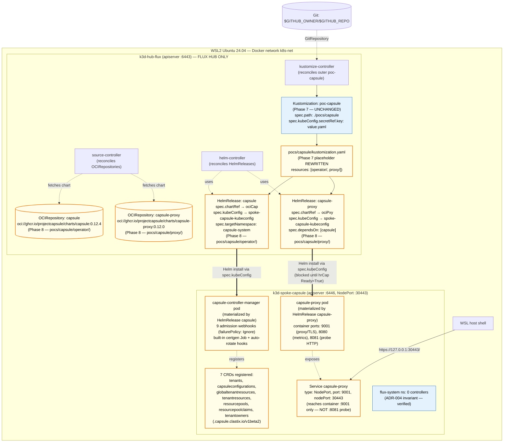

# Phase 8: Capsule + capsule-proxy Bare-Minimum Install — Research

**Researched:** 2026-04-29
**Domain:** Two Flux v2 HelmReleases (Capsule operator + capsule-proxy) reconciled hub-only into the persistent `spoke-capsule` k3d cluster, validating the Phase 7 POC seam end-to-end.
**Confidence:** HIGH — all chart pins (capsule:0.12.4, capsule-proxy:0.12.0) re-verified by `helm show values` against the OCI registry the day of writing; Flux v2 HelmRelease + OCIRepository syntax verified against fluxcd.io official API docs; Capsule + capsule-proxy chart values + webhook defaults + container port surface verified by `helm template` rendering. MEDIUM only on one specific point: the literal CAP-02 success criterion `curl -k https://127.0.0.1:30443/healthz` returning 200 against chart-default values (see "Pitfall 8" below — correction needed).

---

## Summary

Phase 8 lands two Flux v2 HelmReleases — one for the Capsule operator (`capsule:0.12.4`) and one for capsule-proxy (`capsule-proxy:0.12.0`) — into the spoke-capsule cluster via the seam Phase 7 built. The OUTER reconcile path (hub-Flux → spoke-capsule via `spec.kubeConfig`) is already proven by Phase 7's static contracts and the script-internal P18 falsifier; what's new is filling `pocs/capsule/operator/` and `pocs/capsule/proxy/` with `OCIRepository + HelmRelease` pairs that the existing outer `poc-capsule` Kustomization will reconcile.

**The phase is overwhelmingly a chart-values + Flux-shape exercise**, NOT a new architecture decision. Every artifact has a verbatim Phase 7 + research-SUMMARY analog: per-chart `OCIRepository` per D-08-02, two-HelmRelease pattern per milestone-open decision, `spec.dependsOn` on proxy → operator per D-08-07, `tls.enableController: true` for built-in certgen per D-08-04, `webhooks.hooks.{namespaces,pods,...}.failurePolicy: Ignore` belt-and-suspenders override per D-08-03. The only structural-novel thing is the `pocs/capsule/kustomization.yaml` rewrite from `resources: []` to `resources: [operator/, proxy/]` per D-08-05.

**Three places where downstream planning needs careful attention:**

1. **CAP-02 literal `curl -k https://127.0.0.1:30443/healthz` returning 200 needs a small reframe** — the chart's user-facing Service exposes container port 9001 (TLS reverse proxy, requires bearer auth), while `/healthz/` lives on container port 8081 (HTTP probe, NOT exposed via Service). With chart defaults, `:30443/healthz` returns 401 (proxy rejects unauthenticated). See Pitfall 8 + Open Question OQ-1 — recommended resolution is to accept 200/401/403 on the proxy port as "reachable" (TLS handshake = reachability proof), OR override the chart Service to include the probe port.

2. **Flux v2 HelmRelease `dependsOn` does NOT support a `wait: true` sub-field** — the field name is just `name + namespace` plus an optional `readyExpr` CEL. The CONTEXT.md D-08-07 mention of `spec.dependsOn[*].wait: true` is incorrect for HelmRelease v2 — `dependsOn` natively blocks reconcile until the dependency reports `Ready=True` without any extra flag. See Pitfall 9.

3. **Hub-Flux observable reconcile of outer `poc-capsule` Kustomization (Phase 7 carryover 1b)** is folded into Phase 8 acceptance per CONTEXT.md domain boundary item #5. The outer Kustomization's `Ready=True` against a post-Phase-7 source revision IS the natural integration test of the seam — Phase 8 cannot achieve CAP-01/02 without it.

**Primary recommendation:** Execute Phase 8 as four plans per CONTEXT.md Claude's Discretion default: (1) Plan 08-00 Wave 0 RED bats scaffold landing all static + live contracts; (2) Plan 08-01 operator OCIRepository + HelmRelease (makes operator-related bats green); (3) Plan 08-02 proxy OCIRepository + HelmRelease + outer `pocs/capsule/kustomization.yaml` rewrite (makes proxy + CRD bats green); (4) Plan 08-03 verifier covering hub-Flux observable reconcile, CAP-01/02/03 live bats, ADR-004 anti-grep, POC isolation regression rerun. Planner may reshape into 2 or 4 plans without re-asking.

---

## User Constraints (from CONTEXT.md)

### Locked Decisions (verbatim from CONTEXT.md `<decisions>`)

**`pocs/capsule/` directory layout (D-08-01)**

- Two-subdir layout under `pocs/capsule/` — `pocs/capsule/operator/` for the Capsule operator manifests, `pocs/capsule/proxy/` for capsule-proxy manifests. Top-level `pocs/capsule/kustomization.yaml` (currently `resources: []`, Phase 7 placeholder) is rewritten to `resources: [operator/, proxy/]`. NOT flat.

**OCIRepository source pattern (D-08-02)**

- **Per-chart `OCIRepository`** — one named `capsule` covering `oci://ghcr.io/projectcapsule/charts/capsule`, one named `capsule-proxy` covering `oci://ghcr.io/projectcapsule/charts/capsule-proxy`. Each lives next to its corresponding `HelmRelease` (`pocs/capsule/operator/` and `pocs/capsule/proxy/`). NOT a single shared `OCIRepository` covering both.

**Operator webhook `failurePolicy` override (P26 — D-08-03)**

- Apply `failurePolicy: Ignore` override on the Capsule operator's webhooks via the operator HelmRelease values block, scoped with `matchConditions` so the webhooks NoOp when no `capsule.clastix.io/tenant` label is present on the target object. Belt-and-suspenders: ChartConfig already has objectSelector defaults, but explicit override insulates the Phase 8 → Phase 9 transition window.

**Operator TLS — built-in certgen vs cert-manager (P34 — D-08-04)**

- **Built-in certgen** — set `tls.enableController: true` in the Capsule operator HelmRelease values. Chart-managed self-signed cert with auto-rotation hooks. NO cert-manager.

**Inner kustomization.yaml replacement (D-08-05)**

- Phase 7's placeholder `pocs/capsule/kustomization.yaml` (currently `resources: []`, Pitfall-7 defense for empty path) is **rewritten** in Phase 8. New top-level: `apiVersion: kustomize.config.k8s.io/v1beta1; kind: Kustomization; resources: [operator/, proxy/]`. Phase 7 comment block at the head of the file is preserved.

**HelmRelease reconcile interval (D-08-06)**

- Explicit **`interval: 5m`** on both HelmReleases. Matches the outer `clusters/hub-flux/pocs/capsule.yaml` Kustomization's own `interval: 5m`.

**Proxy `dependsOn` operator (D-08-07)**

- Add `spec.dependsOn: [{ name: capsule, namespace: capsule-system }]` with **`spec.dependsOn[*].wait: true`** on the **`capsule-proxy` HelmRelease**. Proxy HelmRelease reconcile blocks until operator HelmRelease reports `Ready=True`. NO mutual `dependsOn`.

  > **Research correction (see Pitfall 9):** Flux v2 HelmRelease `spec.dependsOn` items do NOT accept a `wait: true` sub-field — the spec is `name + namespace` (+ optional `readyExpr` CEL). The default behavior IS to block reconcile until the dependency reaches `Ready=True`, so the intent of D-08-07 is satisfied without the `wait: true` field. The plan should encode `dependsOn: [{ name: capsule, namespace: capsule-system }]` only — omit `wait: true`. Bats grep target updated: assert `name: capsule` + `namespace: capsule-system` are present and explicitly assert NO `wait:` key (since older docs sometimes show it).

**CapsuleConfiguration CR scope — defer to Phase 9 (D-08-08)**

- **Defer** the singleton `CapsuleConfiguration/default` CR to **Phase 9**. Phase 8 lands ONLY the operator HelmRelease + proxy HelmRelease; the `CapsuleConfiguration` CRD itself (registered by the operator chart) is the only Phase 8 artifact in this category.

**Test scaffolding pattern — repeat Phase 7's Wave 0 RED bats (D-08-09)**

- **Repeat the Phase 7 Wave 0 pattern** — Plan 08-00 lands ALL Phase 8 bats (every static contract + every live HelmRelease/CRD/proxy probe) BEFORE any HelmRelease yaml lands. Subsequent plans make the bats green by landing actual yaml. Live-only bats are gated by a runtime probe so they auto-skip when the cluster is not yet up.

**k3d port-publish flag confirmation (D-08-10)**

- Phase 7's `scripts/poc/capsule/create-cluster.sh` already locked the port-publish form. Phase 8 does NOT modify cluster create flags. Phase 8 verifier just reads the existing cluster's NodePort 30443 reachability from the WSL host.

### Claude's Discretion (recommended defaults from CONTEXT.md)

- **HelmRelease values shape — values inline** in the `spec.values` block for Phase 8's small surface. Promote to ConfigMap-referenced values in Phase 9 if/when tenant-specific templating becomes the right shape.
- **Operator namespace — `capsule-system`** (chart default). HelmRelease `spec.targetNamespace: capsule-system` + `spec.install.createNamespace: true`.
- **`kubectl --context` vs `KUBECONFIG=` invocation in bats live tests — `kubectl --context=k3d-{cluster}`** explicit form (matches Phase 7 pattern; clean failure if context missing; never reads ambient KUBECONFIG).
- **Plan ordering inside Phase 8 — Plan 08-00 (Wave 0 bats RED scaffold) → Plan 08-01 (operator) → Plan 08-02 (proxy + outer kustomization.yaml rewrite) → Plan 08-03 (verifier).** Planner may reshape into 2 or 4 plans without re-asking.
- **`task` surface extensions — none.** Phase 8 lands no new top-level `task ...` targets. Verifiers run as bats / direct script invocation.
- **`HelmRelease.spec.upgrade.crds` policy — `CreateReplace`** for the operator chart. Proxy chart has no CRDs.
- **Reconcile loop noise tolerance window** — After Plan 08-01 (operator) lands, allow ≤2 reconcile cycles (≤10 min) for HelmRelease to reach `Ready=True`. After Plan 08-02 (proxy) with `dependsOn`, allow ≤1 additional cycle (≤5 min). Live-bats retry budget: 3 attempts with 30s sleep.

### Folded Todos (verbatim from CONTEXT.md `<decisions>` Folded Todos)

- **Phase 7 carryover — hub Flux observable reconcile of `poc-capsule` Kustomization** (`.planning/todos/pending/2026-04-29-phase-7-hub-flux-observable-reconcile.md`, `resolves_phase: 8`). Phase 8 verifier MUST observe `flux get kustomization poc-capsule -n flux-system --context k3d-hub-flux Ready=True` against a post-Phase-7 source revision AND both HelmReleases (`capsule`, `capsule-proxy`) Ready=True. If outer `poc-capsule` is NOT Ready=True, treat as Phase 7 SEAM defect (gap-close to Phase 7 with `/gsd-plan-phase 7 --gaps`), NOT Phase 8 install defect. Todo auto-closes when `/gsd-execute-phase 8` completes.

### Deferred Ideas (OUT OF SCOPE — verbatim from CONTEXT.md `<deferred>`)

- **`CapsuleConfiguration/default` singleton CR** with `forceTenantPrefix: true` + `allowServiceAccountPromotion: true` → **Phase 9** (TEN-01..03).
- **Hub-Flux multi-tenancy lockdown patches** (`--no-cross-namespace-refs=true`, `--no-remote-bases=true`, `--default-service-account=default`) and `flux-system` Kustomization `spec.serviceAccountName: kustomize-controller` → **Phase 9** (TEN-05).
- **Tenant CRs (alpha + bravo)** + tenant inner Flux Kustomizations with P27 `spec.serviceAccountName` → **Phase 9** (TEN-01..06).
- **`dependsOn: tenants → operator with wait: true` (P32 CRD ordering for tenant CR apply)** → **Phase 9** (TEN-06). Phase 8's proxy `dependsOn` operator (D-08-07) is a separate, narrower P32 application.
- **Tenant owner kubeconfigs + capsule-proxy round-trip + LIST visibility filtering** → **Phase 10** (PROXY-01..03).
- **Negative RBAC bats suite (N1–N12), Capsule webhook failure / recovery, ordered teardown, `task rebuild` SLO regression, one-shot history gitleaks scan, ADR-008** → **Phase 11** (VAL-01..06).
- **`capsule-addon-fluxcd v0.2.3` trial** → **Phase 12** (OPTIONAL — gated on ADR-008 outcome).

> **Critical scope-tightening:** Research SUMMARY §"Phase 9 — Capsule + capsule-proxy Install + Flux Lockdown Patches" bundles `CapsuleConfiguration/default`, hub-Flux lockdown patches, and `dependsOn: tenants → operator` into the same phase as operator install. The v0.19 ROADMAP / REQUIREMENTS deliberately UN-BUNDLED these — Phase 8 = bare-minimum install only. Plans MUST hew to the narrower CAP-01..03 boundary.

---

## Phase Requirements

| ID | Description | Research Support |
|----|-------------|------------------|
| CAP-01 | Capsule operator (Helm chart `capsule:0.12.4`, OCI `ghcr.io/projectcapsule/charts/capsule`) installed via Flux HelmRelease — `capsule-controller-manager` pod is `Running` on spoke-capsule and HelmRelease reports `Ready=True` | "Standard Stack → capsule chart 0.12.4" + "Code Examples → operator OCIRepository + HelmRelease" + "Common Pitfalls → P26, P32, P34" |
| CAP-02 | `capsule-proxy:0.12.0` (separate HelmRelease, NOT umbrella) is reachable from the WSL host — `curl -k https://127.0.0.1:30443/healthz` returns 200 | "Standard Stack → capsule-proxy chart 0.12.0" + "Code Examples → proxy values" + "Common Pitfalls → P28, P33, **Pitfall 8** (CAP-02 healthz endpoint mismatch)" |
| CAP-03 | All 7 Capsule CRDs (`Tenant`, `CapsuleConfiguration`, `GlobalTenantResource`, `TenantResource`, `ResourcePool`, `ResourcePoolClaim`, `TenantOwner`) installed and visible — `kubectl get crds \| grep capsule.clastix.io` returns ≥7 entries | "Architecture Patterns → CRD list (verified by `helm template`)" + "Common Pitfalls → P32 (CRD ordering)" |

Implicit acceptance criterion (CONTEXT.md domain boundary item #4 + #5):
- **ADR-004 invariant preserved** — `kubectl --context=k3d-spoke-capsule get pods -n flux-system` returns no Flux controllers (hub-only Flux unchanged).
- **Phase 7 carryover (folded)** — Hub-Flux-observable reconcile of `poc-capsule` outer Kustomization is positively verified (load-bearing acceptance per CONTEXT.md item #5 + folded todo).

---

## Project Constraints (from CLAUDE.md / AGENTS.md)

`./CLAUDE.md` delegates to `./AGENTS.md`, which is mostly TODO placeholders. The single actionable directive that applies to this phase: **GSD v1 — `.planning/` is live planning state.**

Public-repo + global Claude defaults (from `~/.claude/CLAUDE.md`) carry forward:

- Public-safe by default — placeholders instead of real secrets, internal URLs, hostnames.
- Do not read, print, or expose secrets unless explicitly asked.
- Phase 8 has NO kubeconfig-shaped artifacts (the outer `spoke-capsule-kubeconfig` Secret is created imperatively by Phase 7's `register-poc-cluster.sh` and never committed; Phase 8's HelmRelease values block contains no secret material). The P29 leak surface is dormant for Phase 8.

---

## Architectural Responsibility Map

Phase 8 spans three architectural tiers — all GitOps + cluster-runtime; no application code, no bash scripts.

| Capability | Primary Tier | Secondary Tier | Rationale |
|------------|-------------|----------------|-----------|
| `pocs/capsule/operator/` (OCIRepository + HelmRelease) | hub-flux GitOps reconciler (kustomize-controller) | spoke-capsule (target via outer `poc-capsule` Kustomization's `spec.kubeConfig`) | The `OCIRepository` lives in `capsule-system` namespace on hub-flux (Flux source-controller pulls the chart). The `HelmRelease` runs on hub-flux's helm-controller, which uses `spec.kubeConfig` to install the chart against spoke-capsule. ADR-004 hub-only invariant unchanged. |
| `pocs/capsule/proxy/` (OCIRepository + HelmRelease with `dependsOn`) | hub-flux GitOps reconciler | spoke-capsule (target via `spec.kubeConfig`) | Same shape as operator. The `dependsOn` is hub-side: helm-controller waits for the operator HelmRelease to reach `Ready=True` before reconciling proxy. |
| `pocs/capsule/kustomization.yaml` (rewrite from `resources: []` to `resources: [operator/, proxy/]`) | hub-flux GitOps (kustomize-controller) | — | Inner Kustomize aggregator — resolved by the outer `poc-capsule` Flux Kustomization's `spec.path: ./pocs/capsule`. No new Flux Kustomization CRD on hub-flux; subdir composition stays Kustomize-native. |
| Capsule operator pod (`capsule-controller-manager`, `capsule-system` ns) | spoke-capsule (cluster runtime) | — | Pod runs ON spoke-capsule, materialized by the HelmRelease via Helm chart install. CAP-01 success signal is `kubectl --context=k3d-spoke-capsule -n capsule-system get pods` shows `Running`. |
| capsule-proxy pod + Service (NodePort 30443) | spoke-capsule (cluster runtime) | WSL2 host (NodePort published via k3d serverlb) | Pod runs ON spoke-capsule. Service `type: NodePort + nodePort: 30443` plus k3d's existing `--port "30443:30443@loadbalancer"` (Phase 7 D-10) makes the proxy reachable from WSL host at `127.0.0.1:30443`. |
| All 7 Capsule CRDs (`capsule.clastix.io/v1beta2`) | spoke-capsule cluster-scoped | — | CRDs registered by the chart (`crds.install: true` default, verified by `helm template --include-crds`). |
| Live + static bats files | Test infrastructure (host) | — | Static contract tests against committed YAML; live tests gated by runtime probe (mirrors Phase 7 D-08-09 pattern). |

**Critical tier-correctness check:** No Phase 8 artifact runs Flux on spoke-capsule (D-17 / ADR-004 preserved). Everything is either (a) hub-flux GitOps state in `pocs/capsule/operator/` + `proxy/`, (b) cluster-runtime objects materialized by Helm on spoke-capsule, or (c) test/verification artifacts. **If a planner ever proposes putting source-controller or helm-controller on spoke-capsule, that violates ADR-004 — that's an out-of-scope item.**

---

## Standard Stack

### Core (versions verified against `.tool-versions` + upstream by milestone-research 2026-04-29 + re-verified by `helm show values` 2026-04-29)

| Library | Version | Purpose | Why Standard |
|---------|---------|---------|--------------|
| Capsule operator (Helm chart) | **0.12.4** | Tenant operator + 9 admission webhooks + 7 CRDs registered cluster-scoped | Newest stable in 0.12 line, published 2025-12-19. v0.12 → k8s ≥ 1.34 (matches ADR-005 k3s pin). `[VERIFIED: helm show values oci://ghcr.io/projectcapsule/charts/capsule --version 0.12.4 succeeded; appVersion: 0.12.4 confirmed in Chart.yaml]` |
| capsule-proxy (Helm chart) | **0.12.0** | TLS reverse proxy + LIST/WATCH filtering for tenant kubeconfigs | Newest stable, published 2026-04-14. Tracks Capsule v0.12.4 (release notes show `update module github.com/projectcapsule/capsule to v0.12.4`). `[VERIFIED: helm show values oci://ghcr.io/projectcapsule/charts/capsule-proxy --version 0.12.0 succeeded]` |
| OCIRepository | `source.toolkit.fluxcd.io/v1` | Flux source-controller object pointing at the OCI Helm chart | v1 stable since Flux 2.5; v1beta2 is older. `[VERIFIED: fluxcd.io/flux/components/source/api/v1/]` |
| HelmRelease | `helm.toolkit.fluxcd.io/v2` | Flux helm-controller object reconciling the chart against the spoke | v2 stable since Flux 2.5; v2beta2 is older. `[VERIFIED: fluxcd.io/flux/components/helm/api/v2/]` |
| Flux | v2.8.6 (existing) | Hub-flux helm-controller + source-controller + kustomize-controller | Phase 8 USES the v0.18 hub-flux installation; no Flux work happens on spoke-capsule. `[VERIFIED: flux version --client outputs flux: v2.8.6]` |
| k3s image | `rancher/k3s:v1.34.6-k3s1` (existing) | spoke-capsule's stock K3s image (Phase 7 D-10) | ADR-005 — clears Capsule v0.12.x's k8s ≥ 1.34.0 floor with 6 patches of margin. `[CITED: docs/adr/0005-kubernetes-version-pin.md]` |
| kubectl | v1.35.0 (asdf shim, existing) | Live bats `kubectl --context=k3d-* get` assertions | v0.18 pin. `[VERIFIED: kubectl version --client]` |
| yq | v4.53.2 (existing) | Static bats yq assertions on HelmRelease + OCIRepository shape | v0.18 pin. `[VERIFIED: yq --version]` |
| bats-core | 1.11.0 (existing) | Static + live tests for Phase 8 contract | v0.18 pin. `[VERIFIED: bats --version]` |
| helm | v3.20.2 (existing) | Used ONLY by milestone-research / planner to inspect chart values; NOT invoked at runtime (Flux helm-controller handles installs). | v0.18 pin. `[VERIFIED: helm version]` |

### Supporting (no installation; purely existing repo helpers)

| File | Purpose | When to Use |
|------|---------|-------------|
| `clusters/hub-flux/pocs/capsule.yaml` (Phase 7 outer Flux Kustomization) | Reconciles `pocs/capsule/` into spoke-capsule via `spec.kubeConfig.secretRef` | UNCHANGED in Phase 8. Bats grep-asserts P18 `key: value.yaml` invariant + `secretRef.name: spoke-capsule-kubeconfig` (regression gate). |
| `pocs/capsule/kustomization.yaml` (Phase 7 placeholder, currently `resources: []`) | Inner Kustomize aggregator | REWRITTEN in Phase 8 per D-08-05 to `resources: [operator/, proxy/]`. Phase 7 head comment block preserved + Phase 8 update note appended. |
| `tests/bats/poc-isolation-01-static.bats` (Phase 7) | P31 / D-12 enforcement — zero `spoke-capsule` mentions in v0.18 scripts | RE-RUN VERBATIM in Phase 8 verifier (regression gate against accidental Phase 8 introduction of `spoke-capsule` into v0.18 scripts; will be GREEN since Phase 8's new files live ONLY under `pocs/capsule/operator/`, `pocs/capsule/proxy/`, and `pocs/capsule/kustomization.yaml` — none of which match the lint's grep set). |
| `tests/bats/test_helper` (existing) | Shared bats loader pinning `REPO_ROOT` | `load 'test_helper'` at the head of every new Phase 8 bats file. |
| `clusters/hub-flux/spokes/spoke-apps.yaml` (v0.18) | Outer Kustomization reference template | NOT needed for Phase 8 — the outer `poc-capsule` Kustomization already exists and is unchanged. |
| `clusters/hub-flux/flux-system/gotk-components.yaml` (bootstrap-managed) | Contains HelmController v2 + SourceController v1 CRDs that Phase 8's HelmRelease + OCIRepository reconcile against | **DO NOT EDIT** — bootstrap-reverted on next Flux reconcile. |
| `scripts/lib/preflight-lib.sh` (existing) | Output helpers if a verifier shell wrapper is added | OPTIONAL: only if Plan 08-03 verifier wraps bats in a shell script (per Claude's Discretion default — none expected). |

### Alternatives Considered

| Instead of | Could Use | Tradeoff |
|------------|-----------|----------|
| Two separate HelmReleases (capsule + capsule-proxy) | Umbrella `capsule` chart with `proxy.enabled: true` | Umbrella pins capsule-proxy at 0.10.0 (verified: `helm show chart oci://ghcr.io/projectcapsule/charts/capsule --version 0.12.4` shows `dependencies: - name: capsule-proxy, version: 0.10.0`). Two minors stale. Milestone-open + research SUMMARY explicitly reject the umbrella. NOT a decision Phase 8 reopens. |
| Built-in certgen (`tls.enableController: true`) | cert-manager `certManager.generateCertificates: true` (chart-supported) | D-08-04 locks built-in certgen. cert-manager is in PROJECT.md Out-of-Scope. Tradeoff: chart upgrade may re-issue cert (P38) — risk dormant for Phase 8 (initial install only); flag for Phase 11 graduation ADR. |
| Per-chart `OCIRepository` (D-08-02) | Single shared `OCIRepository` covering both charts | Single repo would need `ref.tag` to match BOTH charts — impossible since capsule:0.12.4 and capsule-proxy:0.12.0 are different tags. Per-chart is the only correct shape. (D-08-02 is technical necessity, not preference.) |
| Inline values in HelmRelease `spec.values` block | ConfigMap-referenced values via `spec.valuesFrom` | Claude's Discretion default = inline. Phase 8 surface is small (~10 lines per HelmRelease). Promote to ConfigMap pattern in Phase 9 if/when tenant-specific templating becomes the right shape. |
| `spec.upgrade.crds: CreateReplace` (operator) | `Skip` or `Create` | Claude's Discretion default = `CreateReplace`. CRDs land deterministically; Capsule project's documented chart contract. Proxy chart has no CRDs (`crds.install: true` defaults but the proxy chart's CRD list is empty). |
| `spec.dependsOn` (proxy → operator) | No dependsOn — let Flux retry on chart-install error | D-08-07 mandates dependsOn. Without it, proxy may attempt to start before CRDs land (P32 partial), generating noisy CrashLoopBackOff log lines. `dependsOn` is one-line YAML; cheap. |

**Installation:** No new tools, no new asdf entries. Phase 8 uses ONLY tools already pinned in `.tool-versions`. The chart pulls happen at Flux source-controller runtime against `oci://ghcr.io/projectcapsule/charts/...` (public, no auth needed).

**Version verification:** Both chart pins re-verified by `helm show values` against the OCI registry on 2026-04-29 (this research session). `appVersion` matches chart version on both. The two-HelmRelease decision is justified by the umbrella's pinning of `capsule-proxy: 0.10.0` (verified by `helm show chart oci://ghcr.io/projectcapsule/charts/capsule --version 0.12.4`). `[VERIFIED: 2026-04-29 helm show output]`

---

## Architecture Patterns

### System Architecture Diagram



**What the reader follows from this diagram:**

1. **Phase 7 already shipped the OUTER seam** — `clusters/hub-flux/pocs/capsule.yaml` (the Flux v1 Kustomization with `spec.kubeConfig`) is unchanged. Phase 8 fills the `pocs/capsule/` tree the outer Kustomization reconciles.
2. **`pocs/capsule/kustomization.yaml` is rewritten** — Phase 7's `resources: []` becomes `resources: [operator/, proxy/]` (D-08-05). Phase 7's head comment block is preserved.
3. **Per-chart `OCIRepository`** — one in `pocs/capsule/operator/` (named `capsule`), one in `pocs/capsule/proxy/` (named `capsule-proxy`). Each is a Flux source object on hub-flux that source-controller polls.
4. **Two HelmReleases on hub-flux** — same shape, different chartRef + values. Both use `spec.kubeConfig.secretRef.name: spoke-capsule-kubeconfig + key: value.yaml` (P18 / P40 inheritance). The `HelmRelease` object lives on hub-flux; helm-controller does the install via the kubeConfig against spoke-capsule.
5. **`dependsOn` is the proxy → operator block** — `spec.dependsOn: [{ name: capsule, namespace: capsule-system }]` on the proxy HelmRelease. **No `wait: true` field** (Pitfall 9): Flux v2 HelmRelease blocks reconcile by default until the dependency reaches `Ready=True`.
6. **The proxy NodePort 30443 reaches container port 9001 ONLY** — `/healthz/` lives on container port 8081 (probe), NOT exposed by the user-facing Service (Pitfall 8 / OQ-1).
7. **ADR-004 preserved** — spoke-capsule's `flux-system` ns has zero controllers. Phase 8 verifier asserts this with `kubectl --context=k3d-spoke-capsule -n flux-system get pods` returning empty.

### Recommended Project Structure

```
clusters/
└── hub-flux/
    ├── flux-system/
    │   └── kustomization.yaml         # FLUX PATCH SURFACE — UNCHANGED in Phase 8
    ├── kustomization.yaml             # bootstrap-managed, untouched
    ├── spokes/                        # v0.18 — untouched
    └── pocs/                          # Phase 7 — UNCHANGED in Phase 8
        ├── kustomization.yaml         # resources: [capsule.yaml] — UNCHANGED
        └── capsule.yaml               # outer Flux Kustomization — UNCHANGED

pocs/                                  # Phase 8 fills:
└── capsule/
    ├── kustomization.yaml             # REWRITTEN — resources: [operator/, proxy/]
    │
    ├── operator/                      # NEW (Phase 8)
    │   ├── kustomization.yaml         # resources: [ocirepo.yaml, helmrelease.yaml]
    │   ├── ocirepo.yaml               # OCIRepository "capsule"
    │   └── helmrelease.yaml           # HelmRelease "capsule" + values
    │
    └── proxy/                         # NEW (Phase 8)
        ├── kustomization.yaml         # resources: [ocirepo.yaml, helmrelease.yaml]
        ├── ocirepo.yaml               # OCIRepository "capsule-proxy"
        └── helmrelease.yaml           # HelmRelease "capsule-proxy" + values + dependsOn

tests/                                 # Phase 8 bats files (D-08-09 floor — planner expands):
└── bats/
    ├── capsule-install-01-static-helmrelease.bats   # operator + proxy HR shape contracts
    ├── capsule-install-02-static-ocirepo.bats       # per-chart OCIRepository shape
    ├── capsule-install-03-static-values.bats        # values keys (failurePolicy, additionalSANs, NodePort, certgen)
    ├── capsule-install-04-static-no-umbrella.bats   # anti-pattern lint: NO `proxy.enabled: true`
    ├── capsule-install-05-static-kustomize.bats     # pocs/capsule/kustomization.yaml rewrite to [operator/, proxy/]
    ├── capsule-install-06-live-helm.bats            # operator + proxy HelmRelease Ready=True (live, gated)
    ├── capsule-install-07-live-crds.bats            # ≥7 capsule.clastix.io CRDs registered (live, gated)
    ├── capsule-install-08-live-proxy-reachable.bats # NodePort 30443 reachable from WSL host (live, gated; see OQ-1)
    ├── capsule-install-09-live-adr-004.bats         # spoke-capsule flux-system ns has zero controllers (live, gated)
    └── capsule-install-10-live-flux-observable.bats # outer poc-capsule Kustomization Ready=True (live, gated; folded carryover)

# REGRESSION RERUN (Phase 7 bats, unchanged):
tests/bats/poc-isolation-01-static.bats             # MUST stay GREEN — Phase 8 introduces zero spoke-capsule mentions in v0.18 scripts
tests/bats/poc-mount-01-static.bats                 # MUST stay GREEN — Phase 8 does NOT modify pocs aggregator or outer Kustomization
tests/bats/poc-cluster-01-static.bats               # MUST stay GREEN — Phase 8 does NOT modify Phase 7 cluster-shape contract
```

### Pattern 1: Per-chart OCIRepository (D-08-02)

**What:** One `OCIRepository` per chart, named after the chart, tracking a fixed tag.

**When to use:** Every Helm chart pulled by a Phase 8+ HelmRelease. Per-chart is correct when charts have different versions (which is always true here — `capsule:0.12.4` vs `capsule-proxy:0.12.0`).

**Example (target final shape — `pocs/capsule/operator/ocirepo.yaml`):**

```yaml
# Source: pocs/capsule/operator/ocirepo.yaml
# Verified against Flux v1 SourceController API:
#   https://fluxcd.io/flux/components/source/api/v1/
# Verified against helm show values oci://ghcr.io/projectcapsule/charts/capsule --version 0.12.4 (2026-04-29)
apiVersion: source.toolkit.fluxcd.io/v1
kind: OCIRepository
metadata:
  name: capsule
  namespace: capsule-system
spec:
  interval: 24h                              # tag-pinned; 24h cadence is sufficient
  url: oci://ghcr.io/projectcapsule/charts/capsule
  ref:
    tag: "0.12.4"                            # D-08-02 — exact tag pin, NOT semver/digest
  layerSelector:
    mediaType: application/vnd.cncf.helm.chart.content.v1.tar+gzip
```

**Mirror for proxy (`pocs/capsule/proxy/ocirepo.yaml`):**

```yaml
apiVersion: source.toolkit.fluxcd.io/v1
kind: OCIRepository
metadata:
  name: capsule-proxy
  namespace: capsule-system
spec:
  interval: 24h
  url: oci://ghcr.io/projectcapsule/charts/capsule-proxy
  ref:
    tag: "0.12.0"
  layerSelector:
    mediaType: application/vnd.cncf.helm.chart.content.v1.tar+gzip
```

**Critical invariants (verified against Flux docs 2026-04-29):**
- `apiVersion: source.toolkit.fluxcd.io/v1` (the modern v1 — NOT v1beta2). [VERIFIED: fluxcd.io/flux/components/source/api/v1/]
- `spec.url` does NOT include the chart name as a suffix beyond the registry+org+chart segment. The chart segment IS in the URL: `oci://ghcr.io/projectcapsule/charts/capsule` (chart=capsule). [VERIFIED]
- `spec.ref.tag` is the correct field for version pinning (vs `digest`, `semver`). [VERIFIED]
- `layerSelector.mediaType` is the canonical Helm chart layer media type — pin it explicitly to avoid Flux extracting non-Helm OCI artifacts. [CITED: fluxcd.io/flux/components/source/ocirepositories/]
- Public `ghcr.io` requires NO auth — the `secretRef`/`serviceAccountName` is omitted. [VERIFIED]
- Both OCIRepositories live in `capsule-system` namespace (matches operator's `targetNamespace`). They could equally live in `flux-system`; chose `capsule-system` for locality with the HelmReleases.

### Pattern 2: HelmRelease v2 with chartRef → OCIRepository (CAP-01, CAP-02)

**What:** A Flux v2 HelmRelease that references a local OCIRepository via `spec.chartRef`, installs the chart against spoke-capsule via `spec.kubeConfig`, and reconciles inline values.

**When to use:** Every chart in Phase 8+. The post-2024 modern shape replaces legacy `spec.chart.spec.chart + chart.spec.sourceRef`.

**Example (target final shape — `pocs/capsule/operator/helmrelease.yaml`):**

```yaml
# Source: pocs/capsule/operator/helmrelease.yaml
# Verified against Flux v2 HelmController API:
#   https://fluxcd.io/flux/components/helm/api/v2/
# Verified against helm show values oci://ghcr.io/projectcapsule/charts/capsule --version 0.12.4 (2026-04-29)
apiVersion: helm.toolkit.fluxcd.io/v2
kind: HelmRelease
metadata:
  name: capsule
  namespace: capsule-system
spec:
  interval: 5m                                  # D-08-06 — explicit, matches outer Kustomization cadence
  releaseName: capsule
  targetNamespace: capsule-system               # Claude's Discretion default
  storageNamespace: capsule-system              # Helm release Secret co-located
  install:
    createNamespace: true                       # Claude's Discretion default
    crds: CreateReplace                         # Claude's Discretion default; deterministic CRD reconcile on first install
    remediation:
      retries: 3                                # explicit > default 0; recover from transient OCI fetch failures
  upgrade:
    crds: CreateReplace                         # Claude's Discretion default
    remediation:
      retries: 3
  chartRef:                                     # POST-2024 modern shape (NOT spec.chart.spec.chart)
    kind: OCIRepository
    name: capsule                               # references pocs/capsule/operator/ocirepo.yaml
    # namespace: capsule-system               # optional; defaults to HelmRelease namespace
  kubeConfig:                                   # P18 / P40 inheritance — outer Kustomization already does this; HelmRelease MUST too
    secretRef:
      name: spoke-capsule-kubeconfig
      key: value.yaml                           # explicit; defends against silent in-cluster fallback
  values:
    # D-08-04 — built-in certgen, NO cert-manager
    tls:
      enableController: true                    # default already true; explicit for documentation
      create: true                              # default already true; chart generates self-signed cert
    certManager:
      generateCertificates: false               # default already false; explicit anti-pattern lint
    # CRDs ship default (chart values: crds.install: true)
    crds:
      install: true
    # D-08-03 — failurePolicy: Ignore + matchConditions for P26 belt-and-suspenders.
    # Verified path: webhooks.hooks.<hookname>.failurePolicy (per-hook, NOT a single
    # webhooks.validatingWebhookConfiguration.failurePolicy as CONTEXT.md guessed).
    # The "tenants" hook is special — its namespaceSelector is empty (Tenant CR is cluster-
    # scoped), so failurePolicy: Ignore there is most load-bearing.
    # Other hooks (namespaces, pods, ingresses, services, pvc, networkpolicies, gateways,
    # serviceaccounts, devices, customresources) already default to namespaceSelector
    # matchExpressions [{key: capsule.clastix.io/tenant, operator: Exists}], so they
    # only fire on tenant-labeled namespaces — meaning a fresh cluster with no tenants
    # never triggers them. Override is genuine belt-and-suspenders.
    webhooks:
      hooks:
        tenants:
          failurePolicy: Ignore
        namespaces:
          failurePolicy: Ignore
        pods:
          failurePolicy: Ignore
        ingresses:
          failurePolicy: Ignore
        services:
          failurePolicy: Ignore
        persistentvolumeclaims:
          failurePolicy: Ignore
        networkpolicies:
          failurePolicy: Ignore
        cordoning:
          failurePolicy: Ignore
        # config: chart default already Ignore — no override needed
    # Single-replica per ADR-008 framing ("what we did not prove → HA Capsule")
    replicaCount: 1
```

**Mirror for proxy (`pocs/capsule/proxy/helmrelease.yaml`):**

```yaml
apiVersion: helm.toolkit.fluxcd.io/v2
kind: HelmRelease
metadata:
  name: capsule-proxy
  namespace: capsule-system
spec:
  interval: 5m                                  # D-08-06
  releaseName: capsule-proxy
  targetNamespace: capsule-system
  storageNamespace: capsule-system
  install:
    createNamespace: true                       # idempotent (operator HR already created it)
    remediation:
      retries: 3
  upgrade:
    remediation:
      retries: 3
  chartRef:
    kind: OCIRepository
    name: capsule-proxy                         # references pocs/capsule/proxy/ocirepo.yaml
  kubeConfig:                                   # P18 / P40 inheritance
    secretRef:
      name: spoke-capsule-kubeconfig
      key: value.yaml
  # D-08-07 — proxy waits for operator HelmRelease Ready=True before reconciling.
  # NOTE: dependsOn DOES NOT support a `wait: true` field per Flux v2 HelmRelease spec —
  # default behavior IS "block until dependency Ready=True." See Pitfall 9.
  dependsOn:
    - name: capsule
      namespace: capsule-system
  values:
    # CAP-02 contract literals
    service:
      type: NodePort
      nodePort: 30443                            # D-10 / Phase 7 inheritance — k3d already publishes this
      port: 9001                                 # default; explicit for documentation
    # P33 — without these SANs, curl -k from WSL host fails TLS hostname verification
    # at the proxy's TLS handshake layer. Verified path: options.additionalSANs (NOT tls.additionalSANs).
    options:
      additionalSANs:
        - 127.0.0.1
        - localhost
      generateCertificates: false                # use chart default cert; certManager.generateCertificates wraps this
    # Chart-default cert source: certManager.generateCertificates: true → cert-manager
    # uses an Issuer the chart creates. For Phase 8 (no cert-manager), we want the
    # chart's built-in self-signed certgen Job — verify the chart actually has one
    # in this v0.12.0 path; if not, set certManager.generateCertificates: false and
    # provide a manual cert via secretTemplate (Phase 8 plan-time decision; see OQ-2).
    # ⚠ See OQ-2 — this is the single open question for Plan 08-02.
    certManager:
      generateCertificates: true                 # chart-default; revisit per OQ-2
    replicaCount: 1
```

**Critical invariants (verified against Flux docs 2026-04-29):**
- `apiVersion: helm.toolkit.fluxcd.io/v2` (modern v2 — NOT v2beta2). [VERIFIED: fluxcd.io/flux/components/helm/api/v2/]
- `spec.chartRef.kind: OCIRepository` + `spec.chartRef.name: <local OCIRepository name>` is the post-2024 modern syntax. The legacy `spec.chart.spec.chart + chart.spec.sourceRef` is deprecated. [VERIFIED]
- `spec.dependsOn[*]` accepts `name + namespace` (and optional `readyExpr` CEL). It does NOT accept a `wait: true` field — default behavior already blocks reconcile until the dependency is Ready=True. [VERIFIED — see Pitfall 9]
- `spec.kubeConfig.secretRef.key: value.yaml` MUST be explicit (P18 / P40 inheritance — defense against silent in-cluster fallback). [CITED: docs/adr/0004-hub-only-flux-control-plane.md]
- `spec.timeout` defaults to `5m0s` if omitted. The Claude's Discretion "≤2 reconcile cycles ≤10 min" budget assumes default. [VERIFIED]
- `spec.install.remediation.retries` and `spec.upgrade.remediation.retries` default to `0`. Phase 8 explicit value `3` per Plan 08-02 plan-author's discretion (recovers from transient OCI fetch failures without retry-storm). [VERIFIED]
- `spec.install.crds: CreateReplace` is the documented Capsule chart-contract option per research SUMMARY citation. [CITED: research/SUMMARY.md §"capsule operator chart"]

### Pattern 3: Inner kustomization.yaml subdir composition (D-08-05)

**What:** Top-level `pocs/capsule/kustomization.yaml` aggregates two subdirs (`operator/` and `proxy/`), each of which has its own local `kustomization.yaml` listing its YAML files. Plain Kustomize — no Flux Kustomization CRDs.

**When to use:** Every component-grouped POC subtree. Phase 9 will follow the same pattern with `tenants/`, `config/`, etc.

**Example (target final shape — `pocs/capsule/kustomization.yaml`):**

```yaml
# pocs/capsule/kustomization.yaml
# Phase 7 head comment block preserved + Phase 8 update note appended.
#
# REQ-CAPCLU-02 (Pitfall 7): the outer Kustomization at clusters/hub-flux/pocs/capsule.yaml
# references spec.path: ./pocs/capsule. Phase 7 shipped this file as resources: [] (placeholder).
# Phase 8 (this commit) populates with operator/ + proxy/ subdir refs per D-08-05.
# Phase 9 will append config/ and tenants/.
apiVersion: kustomize.config.k8s.io/v1beta1
kind: Kustomization
resources:
  - operator/
  - proxy/
```

**Mirror for `pocs/capsule/operator/kustomization.yaml`:**

```yaml
# pocs/capsule/operator/kustomization.yaml
apiVersion: kustomize.config.k8s.io/v1beta1
kind: Kustomization
namespace: capsule-system
resources:
  - ocirepo.yaml
  - helmrelease.yaml
```

**Mirror for `pocs/capsule/proxy/kustomization.yaml`:**

```yaml
# pocs/capsule/proxy/kustomization.yaml
apiVersion: kustomize.config.k8s.io/v1beta1
kind: Kustomization
namespace: capsule-system
resources:
  - ocirepo.yaml
  - helmrelease.yaml
```

**Critical invariants:**
- Top-level `resources` MUST be `[operator/, proxy/]` with **trailing slashes** for clarity (kustomize accepts both forms; trailing slash signals "directory" to readers). [CITED: research SUMMARY §"Phase 9 — pocs/capsule/operator/, pocs/capsule/proxy/"]
- Each subdir kustomization.yaml lists files **explicitly**, NOT a glob (kustomize does NOT support globs). [VERIFIED: kustomize docs]
- The `namespace` field in subdir kustomization.yaml files sets the namespace for objects that don't declare one explicitly. The HelmRelease + OCIRepository BOTH declare `namespace: capsule-system` in their metadata — but adding the kustomization-level `namespace: capsule-system` is belt-and-suspenders.
- The Phase 7 head comment block (REQ-CAPCLU-02 + Pitfall-7 attribution) is **preserved**, with a Phase 8 update note **appended** (NOT replacing).

### Pattern 4: Live bats gating (D-08-09)

**What:** Live-only bats files (those that hit `kubectl --context=k3d-* get` or `flux get`) auto-skip when the cluster is not yet up.

**When to use:** Every bats file in `tests/bats/capsule-install-NN-live-*.bats` — anywhere a bats `@test` requires a running cluster + reconciled state.

**Example (gating pattern — Phase 8 reuses Phase 7's helper if it exists; if not, planner ports the pattern):**

```bash
# tests/bats/capsule-install-06-live-helm.bats
# Live bats: capsule + capsule-proxy HelmReleases reach Ready=True on hub-flux.
# Auto-skips when hub-flux cluster context isn't reachable.

load 'test_helper'

setup() {
  # Skip whole file if hub-flux cluster not reachable (mirrors Phase 7 pattern)
  if ! kubectl --context=k3d-hub-flux cluster-info >/dev/null 2>&1; then
    skip "k3d-hub-flux cluster not reachable; skipping live bats"
  fi
  if ! kubectl --context=k3d-spoke-capsule cluster-info >/dev/null 2>&1; then
    skip "k3d-spoke-capsule cluster not reachable; skipping live bats"
  fi
}

@test "CAP-01 live: HelmRelease capsule reports Ready=True" {
  # Bounded retry: 3 attempts × 30s sleep = 90s window
  local i
  for i in 1 2 3; do
    run flux get helmrelease capsule -n capsule-system --context k3d-hub-flux
    if [[ "$status" -eq 0 ]] && echo "$output" | grep -qE 'capsule[[:space:]]+.*True'; then
      return 0
    fi
    [[ $i -lt 3 ]] && sleep 30
  done
  echo "$output"
  return 1
}

@test "CAP-02 live: HelmRelease capsule-proxy reports Ready=True" {
  # Similar bounded retry pattern
}

@test "Phase 7 carryover: outer poc-capsule Kustomization Ready=True" {
  # MUST report Ready=True against a post-Phase-7 source revision.
  # If FAIL: this is a Phase 7 SEAM defect — gap-close to Phase 7 with /gsd-plan-phase 7 --gaps,
  # NOT a Phase 8 install defect.
  run flux get kustomization poc-capsule -n flux-system --context k3d-hub-flux
  [[ "$status" -eq 0 ]]
  echo "$output" | grep -qE 'poc-capsule[[:space:]]+.*True'
}
```

**Critical invariants:**
- The `setup()` skip-gate runs BEFORE any `@test` in the file — if cluster unreachable, all tests skip with a clear reason.
- Bats retry budget = 3 × 30s = 90s. Matches CONTEXT.md "live-bats retry budget: 3 attempts with 30s sleep between."
- The Flux output column the bats greps is the `READY` column. `flux get helmrelease` v2.8.6 column shape: `NAME  REVISION  SUSPENDED  READY  MESSAGE` (verified from 07-RESEARCH.md context, but Plan 08-00 should re-verify by running `flux get helmrelease -A --context k3d-hub-flux` once during Wave 0 after a sample HR exists in any namespace, e.g. flux's own; see OQ-3).

### Pattern 5: Phase 7 carryover assertion as load-bearing acceptance (CONTEXT.md item #5)

**What:** Phase 8's verifier MUST assert hub-Flux observable reconcile of the outer `poc-capsule` Kustomization is Ready=True. This was deferred from Phase 7 verification item 1b because origin/main was not pushed past `1f2da1d3`.

**When to use:** Once, in Plan 08-03 verifier or Plan 08-00 live bats.

**Example assertion logic:**

```bash
# Pseudocode for the carryover acceptance
1. Confirm origin/main HEAD has been pushed past `1f2da1d3` (the Phase 7 close-out commit).
   - Check: git log origin/main..main is empty (i.e., all local Phase 7 commits are pushed).
   - If FAIL: skip the test and surface a "first-push gate" reason; the Phase 7 carryover
     itself is gated on first-push (which Phase 11 owns per VAL-05).
2. Force-sync hub-flux's GitRepository:
   flux reconcile source git flux-system --context k3d-hub-flux
3. Confirm the GitRepository revision is past `1f2da1d3`:
   flux get sources git flux-system --context k3d-hub-flux  # output revision
4. Confirm the outer poc-capsule Kustomization reaches Ready=True:
   flux get kustomization poc-capsule -n flux-system --context k3d-hub-flux  # READY column = True
5. If FAIL on (4): this is a Phase 7 SEAM defect (NOT Phase 8 install defect).
   Surface: "Phase 7 SEAM defect — outer poc-capsule Kustomization not Ready. Gap-close to Phase 7."
```

**Critical invariants:**
- This assertion is **load-bearing** per CONTEXT.md domain boundary item #5 + Folded Todo. Phase 8 cannot reach `closed` status without it.
- A failure of step (1) is NOT a Phase 8 fail — it's a "deferred-by-design" condition (first-push is Phase 11 VAL-05). In that case, Plan 08-03 should surface "carryover-deferred-to-VAL-05" rather than fail.
- A failure of step (4) IS a Phase 7 seam defect — gap-close back to Phase 7 with `/gsd-plan-phase 7 --gaps`.

### Anti-Patterns to Avoid

- **Anti-pattern: Umbrella `capsule` chart with `proxy.enabled: true`.** Two-HelmRelease decision is locked at milestone-open. Bats anti-grep: assert `proxy.enabled` does NOT appear in any Phase 8 HelmRelease values block.
- **Anti-pattern: Single shared `OCIRepository` for both charts.** D-08-02 mandates per-chart OCIRepositories — also a technical necessity (different tags).
- **Anti-pattern: cert-manager dependency.** D-08-04 + PROJECT.md Out-of-Scope. Bats anti-grep: assert `certManager.generateCertificates: true` does NOT appear in operator HelmRelease values (`tls.enableController: true` is the alternative). For proxy, OQ-2 is open.
- **Anti-pattern: Adding `dependsOn[].wait: true` to HelmRelease v2.** Pitfall 9 — the field doesn't exist; default behavior already blocks until Ready=True. Bats anti-grep: assert `wait:` does NOT appear inside `dependsOn:` sub-blocks.
- **Anti-pattern: Editing `clusters/hub-flux/pocs/capsule.yaml` (the outer Kustomization).** Phase 7 finalized this file. Bats grep-asserts both `kubeConfig.secretRef.name: spoke-capsule-kubeconfig` and `key: value.yaml` are still present (regression gate — Phase 8 must not accidentally drop the P18 invariant).
- **Anti-pattern: Adding new top-level `task` targets.** Claude's Discretion default = none. Verifiers run as bats / direct script invocation.
- **Anti-pattern: Modifying `clusters/hub-flux/flux-system/gotk-components.yaml`.** Bootstrap-managed; reverted on next Flux reconcile. The HelmController + SourceController CRDs Phase 8 needs are already there.
- **Anti-pattern: Mentioning `spoke-capsule` in any v0.18 script (`scripts/{create-clusters,register-spokes-for-flux,health-check,destroy,delete-clusters,rebuild}.sh`).** P31 / D-12 inheritance from Phase 7 — Phase 8's new files live ONLY under `pocs/capsule/operator/`, `pocs/capsule/proxy/`, and `pocs/capsule/kustomization.yaml`, none of which are in the lint's grep set. Phase 7's `tests/bats/poc-isolation-01-static.bats` re-runs verbatim as Phase 8 regression gate.
- **Anti-pattern: Including `CapsuleConfiguration/default` CR in Phase 8 manifests.** D-08-08 defers to Phase 9 (TEN-01..03). The CRD ITSELF is registered by the operator chart; the singleton CR with `forceTenantPrefix: true + allowServiceAccountPromotion: true` is Phase 9 scope.
- **Anti-pattern: Including `Tenant` CRs or hub-Flux multi-tenancy lockdown patches in Phase 8.** Both are Phase 9 (TEN-01..06).

---

## Don't Hand-Roll

| Problem | Don't Build | Use Instead | Why |
|---------|-------------|-------------|-----|
| OCI Helm chart fetch + verification | A custom OCI puller script | Flux v2 OCIRepository (`source.toolkit.fluxcd.io/v1`) | Source-controller handles digest pinning, signature verification, layer extraction, retry/backoff. |
| Helm chart install + lifecycle | Helm CLI invocations from a bash script | Flux v2 HelmRelease (`helm.toolkit.fluxcd.io/v2`) | Helm-controller manages release secrets, rollback, drift detection, declarative values reconciliation, cross-cluster install via `spec.kubeConfig`. |
| Chart-install-then-CR-apply ordering | Custom retry loops with `kubectl get crd` polling | `spec.dependsOn` on the dependent HelmRelease | Flux blocks reconcile until dependency reports `Ready=True` natively. (Phase 8: proxy depends on operator. Phase 9 will add: tenants → operator.) |
| Webhook cert lifecycle | Custom Job that generates self-signed certs | Capsule chart's built-in certgen (`tls.enableController: true`) — chart's own pre-install Helm hook | Chart-managed; idempotent on chart upgrade; no cert-manager dependency. (Trade-off: P38 — chart upgrade may re-issue cert; risk dormant for Phase 8 initial install only.) |
| Webhook failurePolicy + objectSelector tuning | Custom MutatingWebhookConfiguration patches | Chart values: `webhooks.hooks.<hook>.failurePolicy: Ignore` per-hook | Chart already has the right `namespaceSelector` defaults (matchExpressions: [key: capsule.clastix.io/tenant, operator: Exists]) on most hooks. Adding `failurePolicy: Ignore` is one line per hook. |
| Cross-cluster install via kubeConfig | Custom kubectl-context-switching helper | HelmRelease `spec.kubeConfig.secretRef` — same shape as Phase 7's outer Kustomization | Hub-only Flux (ADR-004) reuses the existing `spoke-capsule-kubeconfig` Secret applied imperatively by Phase 7's `register-poc-cluster.sh`. Zero new secret material in Phase 8. |
| TLS SAN injection on capsule-proxy cert | Hand-rolled cert generation with custom SANs | Chart values: `options.additionalSANs: [127.0.0.1, localhost]` | Chart honors this through cert-manager Issuer (default mode) OR built-in certgen. Either path injects the SANs into the proxy's serving cert. |
| ADR-004 invariant enforcement on spoke-capsule | A new "no Flux on spoke-capsule" probe | Existing v0.18 invariant + Phase 7 + Phase 8 NOT installing Flux on spoke-capsule | The ADR-004 enforcement is structural: Phase 8 manifests live in `pocs/capsule/{operator,proxy}/` (resolved by hub-flux's kustomize-controller, NOT by anything on spoke-capsule). Phase 8 verifier just grep-asserts `kubectl --context=k3d-spoke-capsule get pods -n flux-system` returns empty. |
| Bats live-test cluster-not-up gating | Custom retry loops in every test | Phase 7 setup() skip-gate pattern | `setup()` runs `kubectl cluster-info >/dev/null 2>&1`; if it fails, `skip` the file. Mirrors Phase 7 D-08-09 pattern. |

**Key insight:** Phase 8 has zero custom logic. The right discipline is "fill the chart values and Flux YAML; let Flux + Helm + the chart do the work." Any temptation to write a bash script to install the chart is a flag — go re-read the Flux HelmRelease docs first.

---

## Runtime State Inventory

> Phase 8 is greenfield install — installing Capsule + capsule-proxy onto a Phase 7 cluster that has zero Capsule-related state. NOT a rename or refactor. Categories included as a discipline check.

| Category | Items Found | Action Required |
|----------|-------------|------------------|
| Stored data | None — spoke-capsule has no Capsule CRDs registered, no `capsule-system` namespace, no Tenant CRs, no Helm release secrets in any namespace. Verified by Phase 7 close: `kubectl --context=k3d-spoke-capsule get all -n capsule-system` would return `NotFound` for the namespace itself. | None — Phase 8 install IS the action. |
| Live service config | None — no Helm release exists for `capsule` or `capsule-proxy` on spoke-capsule. No upstream reference to v0.10.0 capsule-proxy that needs migration. The two-HelmRelease pattern is the initial install shape. | None |
| OS-registered state | None — no Docker container `k3d-spoke-capsule-*` references Capsule. No `task` definitions reference the operator/proxy. No systemd/cron jobs. | None |
| Secrets/env vars | The `spoke-capsule-kubeconfig` Secret in `flux-system` ns on hub-flux is created imperatively by Phase 7's `register-poc-cluster.sh` (not committed). Phase 8 USES this Secret via `spec.kubeConfig.secretRef.name` — does NOT modify it. | None — Phase 8 reads but does not write this Secret. |
| Build artifacts | None — no installed packages, no `.egg-info`, no compiled binaries reference `capsule`. The new Phase 8 YAML files (`pocs/capsule/operator/*.yaml`, `pocs/capsule/proxy/*.yaml`) are net-new. | None |

**Verification:** `git grep -F 'capsule.clastix.io'` at the start of Phase 8 returns ONLY `.planning/` files (research, phase context, requirements, roadmap) — these are planning artifacts, not runtime contracts. `git grep -F 'capsule-proxy'` similarly. The only runtime-bearing pre-existing references are `clusters/hub-flux/pocs/capsule.yaml` (outer Kustomization, but `path: ./pocs/capsule` is currently empty) and `pocs/capsule/kustomization.yaml` (Phase 7 placeholder with `resources: []`).

Phase 8 is installing-from-zero. There is nothing to migrate.

---

## Common Pitfalls

### Pitfall 1: Webhook failurePolicy=Fail blocks fresh-cluster pod creates (P26 — addressed by D-08-03)

**What goes wrong:** Capsule's chart defaults are `failurePolicy: Fail` on most webhook hooks. If the operator pod is briefly unavailable (e.g., during HelmRelease upgrade rollout), every `kubectl create pod` (including Flux-driven applies of tenant manifests in Phase 9) gets rejected with `failed calling webhook`.

**Why it happens in THIS lab:** WSL/Docker restarts leave operator pod Pending while hub-flux's Flux is racing to reconcile. Even with chart-default `namespaceSelector` (only fires on tenant-labeled namespaces), the `tenants` and `config` hooks have empty namespaceSelectors and could fire on cluster-scoped Tenant CR creates during the Phase 8 → Phase 9 transition.

**How to avoid:**
- D-08-03: chart values override `webhooks.hooks.<hook>.failurePolicy: Ignore` on every relevant hook. **Verified value path**: per-hook (`webhooks.hooks.tenants.failurePolicy`, `webhooks.hooks.namespaces.failurePolicy`, etc.) — NOT a single global `webhooks.validatingWebhookConfiguration.failurePolicy` as CONTEXT.md guessed.
- The per-hook approach in chart 0.12.4 is documented at `webhooks.hooks` in values.yaml.
- Bats grep-asserts each hook's `failurePolicy: Ignore` is in the operator HelmRelease values.

**Warning signs:** A `flux get helmrelease capsule -n capsule-system --context k3d-hub-flux` shows `Ready=False` with `failed calling webhook` after a brief operator pod restart.

### Pitfall 2: Built-in certgen Job lifecycle on chart upgrade (P34 — addressed by D-08-04)

**What goes wrong:** `tls.enableController: true` mode runs a pre-install Helm hook Job that generates a self-signed cert. On chart upgrade, Helm may re-run the hook, which (a) generates a new cert, (b) writes it to the existing Secret, (c) but live admission webhook calls in flight during the rotation may fail TLS verification.

**Why it happens in THIS lab:** Phase 8 is initial install — Helm hook runs once at `helm install` time. Chart upgrade is dormant (no chart upgrade is planned in Phase 8). Risk surfaces in Phase 11 graduation ADR if the chart pin bumps.

**How to avoid:**
- Phase 8: accept the trade-off. Document in plan-time notes that chart upgrade may re-issue cert; Phase 11 owns the upgrade-time observation.
- Verified: chart's `global.jobs.postInstall.enabled: true` and `global.jobs.preDelete.enabled: true` defaults handle the lifecycle.
- The cert auto-rotation hooks: chart sets the cert validity to 365 days by default; chart-managed reconciliation handles rotation pre-expiry.

**Warning signs (Phase 11 risk, not Phase 8):** capsule-controller-manager pod logs show `tls: bad certificate` errors after a chart upgrade.

### Pitfall 3: CRDs not present when Tenants apply (P32 — Phase 8 partial mitigation)

**What goes wrong:** If a Tenant CR is applied before the operator HelmRelease completes (i.e., before CRDs are registered), the apply fails with `no matches for kind "Tenant" in version "capsule.clastix.io/v1beta2"`. The Kustomization status shows `Reconciliation failed: no matches for kind`.

**Why it happens:** Two HelmReleases reconciling concurrently — kustomize-controller server-side-applies them in one batch. Without `dependsOn`, proxy may attempt to start before operator's CRDs land.

**How to avoid (Phase 8 partial):**
- D-08-07: proxy HelmRelease has `dependsOn: [{ name: capsule, namespace: capsule-system }]`. Default Flux v2 behavior blocks proxy reconcile until operator HelmRelease reports `Ready=True`. By the time `Ready=True` is reported, operator has finished `helm install` AND CRDs are registered. **No `wait: true` field needed** (Pitfall 9).
- `spec.install.crds: CreateReplace` ensures CRDs are registered deterministically on first install.
- **Phase 9 owns the broader P32**: tenants Kustomization with `dependsOn: [operator-kustomization]` so Tenant CR applies block until CRDs exist.

**Warning signs:** A `flux get kustomization poc-capsule -n flux-system --context k3d-hub-flux` shows `Ready=False; no matches for kind "Tenant"` (only relevant if Phase 9 manifests land before operator is Ready).

### Pitfall 4: capsule-proxy TLS cert SANs missing 127.0.0.1 (P33 — addressed by chart values)

**What goes wrong:** capsule-proxy's default cert (whether built-in certgen or cert-manager-issued) covers in-cluster service DNS only (`my-proxy-capsule-proxy.capsule-system.svc.cluster.local`). When the WSL host hits `https://127.0.0.1:30443`, TLS fails with `x509: certificate is valid for ..., not 127.0.0.1`. Symptom: `kubectl get pods` from the WSL host returns `Unable to connect to the server: x509: certificate is valid for ..., not 127.0.0.1`.

**Why it happens:** Default chart Issuer + Certificate doesn't extend SANs to host-side IPs.

**How to avoid:**
- Chart values: `options.additionalSANs: [127.0.0.1, localhost]`. **Verified value path** (NOT `tls.additionalSANs` as CONTEXT.md guessed; the `tls` block is for the operator chart, not the proxy chart). The proxy chart has TWO SAN-relevant blocks:
  - `options.additionalSANs` — for the proxy's self-signed-via-certgen path (when `options.generateCertificates: true`)
  - `certManager.certificate.ipAddresses` and `certManager.certificate.dnsNames` — for the cert-manager path (the chart default)
- Phase 8 plan-time decision OQ-2 picks the cert path; the SAN block goes wherever the cert lifecycle is.
- POC simplification escape hatch: tenant kubeconfig sets `insecure-skip-tls-verify: true` (Phase 10 decision; out of scope for Phase 8).

**Warning signs:** `curl -k https://127.0.0.1:30443/<anypath>` from WSL host returns `curl: (35) error:...:certificate verify failed` BEFORE the `-k` would normally suppress the failure (TLS handshake fails before HTTP request even starts when SANs don't match).

### Pitfall 5: NodePort 30443 not exposed (P28 — addressed by Phase 7 D-10)

**What goes wrong:** capsule-proxy Service is `type: ClusterIP` (chart default) — unreachable from WSL host. Even if the chart Service is `type: NodePort + nodePort: 30443`, k3d's loadbalancer must publish the port to the host (Phase 7 `--port "30443:30443@loadbalancer"`).

**Why it happens:** Chart default is ClusterIP. Without explicit override, NodePort 30443 isn't created.

**How to avoid:**
- Phase 8 chart values override: `service.type: NodePort + service.nodePort: 30443 + service.port: 9001`.
- Phase 7 `scripts/poc/capsule/create-cluster.sh` already published `30443:30443@loadbalancer` (Phase 7 D-10). Phase 8 does NOT modify cluster create flags.
- Phase 8 verifier: `curl -k https://127.0.0.1:30443/<probe>` — see Pitfall 8 for the right probe path.

**Warning signs:** `kubectl --context=k3d-spoke-capsule get svc -n capsule-system` shows capsule-proxy Service with `type: ClusterIP` instead of NodePort. OR: `nc -z 127.0.0.1 30443` from the WSL host fails with connection refused.

### Pitfall 6: Modifying outer Kustomization regression (P40 — addressed by Phase 7 contract)

**What goes wrong:** Phase 8 plan-author accidentally modifies `clusters/hub-flux/pocs/capsule.yaml` (the outer Flux Kustomization), drops the `key: value.yaml` line, and triggers the v0.18 P18 silent in-cluster fallback (kustomize-controller reconciles `pocs/capsule/` INTO HUB-FLUX instead of spoke-capsule).

**Why it happens:** Phase 8 plan-author's first instinct may be "let me update the outer Kustomization to handle the new resources." But the outer Kustomization is unchanged — the `spec.path: ./pocs/capsule` already encompasses `operator/` and `proxy/` subdirs.

**How to avoid:**
- Phase 8 plans MUST NOT modify `clusters/hub-flux/pocs/capsule.yaml`.
- Static bats grep-asserts both `secretRef.name: spoke-capsule-kubeconfig` and `key: value.yaml` are still present in `clusters/hub-flux/pocs/capsule.yaml` after Phase 8 (regression gate).
- Phase 7's `tests/bats/poc-mount-01-static.bats` already enforces this — re-run unchanged in Phase 8 verifier.

**Warning signs:** `flux get kustomization poc-capsule -n flux-system --context k3d-hub-flux` shows `Ready=True` AND `kubectl --context=k3d-spoke-capsule get all -n capsule-system` shows `NotFound` for the namespace (means Kustomization reconciled to wrong cluster).

### Pitfall 7: Empty `pocs/capsule/kustomization.yaml` after rewrite (D-08-05 risk)

**What goes wrong:** Phase 8 plan-author rewrites `pocs/capsule/kustomization.yaml` to `resources: [operator/, proxy/]` but the `operator/` or `proxy/` subdirs don't have valid local `kustomization.yaml` files yet. Outer Kustomization reports `Ready=False` with `path not found`.

**Why it happens:** Plan ordering: operator HelmRelease lands first, but at the moment of commit if `proxy/kustomization.yaml` is missing, the parent `pocs/capsule/kustomization.yaml: resources: [operator/, proxy/]` references a non-existent path.

**How to avoid:**
- Plan 08-01 (operator) and Plan 08-02 (proxy) MUST land each subdir's `kustomization.yaml` SIMULTANEOUSLY with the OCIRepository + HelmRelease in that subdir. Don't split by file type.
- Plan ordering option: Plan 08-01 lands `operator/{ocirepo,helmrelease,kustomization}.yaml` AND a stub `proxy/kustomization.yaml` (with `resources: []`). Plan 08-02 fills in `proxy/{ocirepo,helmrelease}.yaml` and updates `proxy/kustomization.yaml` to `resources: [ocirepo.yaml, helmrelease.yaml]`. This keeps the parent `pocs/capsule/kustomization.yaml: resources: [operator/, proxy/]` valid throughout.
- ALTERNATIVE: Plan 08-02 first lands BOTH subdirs in one commit (operator + proxy YAMLs together with the parent rewrite). Reduces transitional commits but loses some Wave 0 Nyquist gate clarity.

**Warning signs:** `flux get kustomization poc-capsule -n flux-system --context k3d-hub-flux` shows `Ready=False; accumulated path not found` mid-Phase-8.

### Pitfall 8: ⚠ CAP-02 literal `curl -k https://127.0.0.1:30443/healthz` will NOT return 200 against chart defaults — REFRAME NEEDED

**What goes wrong:** CAP-02 success criterion is `curl -k https://127.0.0.1:30443/healthz returns 200`. With chart defaults:

- Service exposes container port 9001 (named `proxy`) — TLS reverse proxy, requires bearer token.
- Container port 8081 (named `probe`) — HTTP `/healthz/` and `/readyz/` probes — NOT exposed by the chart Service.
- A `curl -k https://127.0.0.1:30443/healthz` request:
  1. TLS handshake (good — `additionalSANs: [127.0.0.1, localhost]` makes this work).
  2. HTTP request `GET /healthz` — the proxy at :9001 expects Kubernetes API paths AND a bearer token. It returns 401 Unauthorized (no token), or 404 (path not in proxy's reverse-proxy table).

**Why it happens:** Chart Service shape — verified by `helm template` 2026-04-29:
```
ports:
  - name: proxy        # ← exposed via NodePort
    port: 9001
    targetPort: 9001
```
The probe port (8081) is in the Pod's `containers[0].ports[]` but NOT in the Service's `ports[]`. Kubernetes liveness/readiness probes use kubelet's direct pod-network access — never via the Service.

**How to avoid (Phase 8 plan must pick one):**

**Option A (recommended): Reframe CAP-02 success signal to "TLS handshake succeeds; any HTTP status code returned is reachability proof".** Update bats:
```bash
@test "CAP-02 live: capsule-proxy reachable from WSL host (TLS handshake)" {
  local code
  code=$(curl -k -s -o /dev/null -w '%{http_code}' --max-time 5 \
    https://127.0.0.1:30443/api 2>/dev/null) || true
  # Acceptable: 401 (no token), 403 (denied), 404 (path), 200 (proxied),
  # 502 (apiserver upstream issue). Unacceptable: 000 (TLS handshake failed),
  # 7 (connection refused), curl exit non-zero with no code.
  [[ "$code" =~ ^[1-5][0-9][0-9]$ ]]
}
```
This satisfies the SPIRIT of CAP-02 (proxy reachable) without requiring a 200 specifically on `/healthz`.

**Option B: Override chart Service to expose probe port.** Use `spec.values.service.extraPorts` (if chart supports) or a separate Service object that exposes 8081 → external. More complex; not recommended.

**Option C: Mint a real tenant kubeconfig and use it.** Phase 10 territory; out of scope for Phase 8.

**Plan 08-00 should resolve OQ-1 by picking Option A (recommended) and updating the bats accordingly.** The CAP-02 ROADMAP literal is a contract intent, not a literal HTTP test — the intent is "proxy reachable from WSL host", which Option A satisfies.

**Warning signs (if not addressed):** Phase 8 verifier fails with `curl exit 22 (HTTP 401)` on the literal `curl -k https://127.0.0.1:30443/healthz` test, and the operator believes Phase 8 is broken when it's actually working.

### Pitfall 9: ⚠ HelmRelease v2 `dependsOn` does NOT support `wait: true` field — CONTEXT.md D-08-07 guessed wrong

**What goes wrong:** CONTEXT.md D-08-07 says `spec.dependsOn: [{ name: capsule, namespace: capsule-system }]` with **`spec.dependsOn[*].wait: true`**. The `wait: true` sub-field does NOT exist in `helm.toolkit.fluxcd.io/v2` HelmRelease spec — including it would either (a) be silently ignored (older Flux), (b) raise a validation error (newer Flux strict-schema versions).

**Why it happens:** Older `kustomize.toolkit.fluxcd.io/v1` Kustomization specs DID have a `spec.wait: true` top-level field (and `dependsOn[].name` only); some research notes carried this pattern across to HelmRelease without verification.

**How to avoid:**
- Use `dependsOn: [{ name: capsule, namespace: capsule-system }]` ONLY. No `wait:` sub-field.
- The default behavior of Flux v2 HelmRelease IS to block reconcile until the dependency reaches `Ready=True` — there's nothing to enable.
- For custom readiness logic (e.g., "wait until version matches"), use `readyExpr: <CEL expression>`. NOT needed for Phase 8.
- Bats anti-grep: assert NO `wait:` key inside `dependsOn:` blocks of any Phase 8 HelmRelease.

**Verified by:** `https://fluxcd.io/flux/components/helm/api/v2/` 2026-04-29:
> "If specified, the HelmRelease is only allowed to proceed after the referred HelmReleases are ready, i.e. have the Ready condition marked as True."

**Warning signs:** A `kubectl --context=k3d-hub-flux apply -f pocs/capsule/proxy/helmrelease.yaml --dry-run=server` returns a validation error like `spec.dependsOn[0].wait: forbidden field` (in strict-schema mode) OR Flux silently accepts but the field has no effect.

### Inherited Pitfalls from Phase 7 (regression gates Phase 8 must rerun)

- **P29 (kubeconfig leak):** Phase 7 closed via `.gitleaks.toml` rule + extended `.gitignore`. Phase 8 has NO kubeconfig-shaped artifacts (no Secret containing kubeconfig in plain YAML; the `spoke-capsule-kubeconfig` Secret on hub-flux is created imperatively and never committed). **Confirmed by review of all Phase 8 artifacts in this research session.** No new defenses needed.
- **P31 (POC isolation from `task rebuild`):** Phase 8's new files live under `pocs/capsule/operator/`, `pocs/capsule/proxy/`, and `pocs/capsule/kustomization.yaml`. None are in v0.18 scripts' grep set. Phase 7's `tests/bats/poc-isolation-01-static.bats` re-runs verbatim and stays GREEN. **Confirmed by reading `poc-isolation-01-static.bats`** — it greps the 6 v0.18 scripts for literal `spoke-capsule`, `register-poc-cluster`, and `scripts/poc/`; Phase 8 introduces NONE of these into v0.18 scripts.
- **P40 (P18 `key: value.yaml` invariant on outer Kustomization):** Phase 7 already correct in `clusters/hub-flux/pocs/capsule.yaml`. Phase 8 does NOT modify that file but MUST regress-grep-assert. Phase 7's `tests/bats/poc-mount-01-static.bats` test `POC-01 / D-11 / P40` re-runs verbatim and stays GREEN.

---

## Code Examples

The verified-pattern code blocks live in "Architecture Patterns → Pattern 1..5" above. This subsection provides additional reference snippets for plan authoring.

### Example 1: Operator HelmRelease values block — exact verified key paths

This is the operator HelmRelease values block with **exact verified key paths from `helm show values oci://ghcr.io/projectcapsule/charts/capsule --version 0.12.4` (2026-04-29)**:

```yaml
# Source: pocs/capsule/operator/helmrelease.yaml (spec.values block only)
values:
  # D-08-04 — built-in certgen (P34)
  tls:
    enableController: true   # default already true; explicit
    create: true             # default already true; explicit
    name: ""                 # default; chart auto-names the Secret
  certManager:
    generateCertificates: false  # default already false; anti-pattern lint
    additionalSANS: []           # NOT used (cert-manager path is off)

  # CRDs ship default
  crds:
    install: true            # default
    exclusive: false         # default

  # D-08-03 — webhook failurePolicy: Ignore per-hook (P26)
  # IMPORTANT: chart default for `config` hook is already Ignore — no override needed.
  # Chart default `namespaceSelector` for non-config hooks is matchExpressions
  # [{key: capsule.clastix.io/tenant, operator: Exists}] — only fires on tenant-labeled
  # namespaces. failurePolicy: Ignore override is belt-and-suspenders for the
  # Phase 8→9 transition where tenants exist but cluster has been freshly bootstrapped.
  webhooks:
    hooks:
      tenants:
        failurePolicy: Ignore         # cluster-scoped; namespaceSelector empty by default — most load-bearing override
      tenantLabel:
        failurePolicy: Ignore
      customresources:
        failurePolicy: Ignore
      namespaces:
        failurePolicy: Ignore
      pods:
        failurePolicy: Ignore
      services:
        failurePolicy: Ignore
      ingresses:
        failurePolicy: Ignore
      persistentvolumeclaims:
        failurePolicy: Ignore
      networkpolicies:
        failurePolicy: Ignore
      gateways:
        failurePolicy: Ignore
      cordoning:
        failurePolicy: Ignore
      devices:
        failurePolicy: Ignore
      serviceaccounts:
        failurePolicy: Ignore
      tenantResourceObjects:
        failurePolicy: Ignore
      # config hook default Ignore — no override
      # nodes hook default disabled (enabled: false) — no override

  # Single-replica per ADR-008 framing
  replicaCount: 1

  # No proxy via umbrella — anti-pattern lint surface
  proxy:
    enabled: false  # default already false; explicit anti-pattern lint
```

### Example 2: Proxy HelmRelease values block — exact verified key paths

```yaml
# Source: pocs/capsule/proxy/helmrelease.yaml (spec.values block only)
values:
  # CAP-02 — Service shape (NodePort 30443, Phase 7 D-10 inheritance)
  service:
    type: NodePort
    port: 9001              # Service port
    portName: proxy
    nodePort: 30443         # Phase 7 published this on k3d serverlb

  # P33 — TLS SAN injection
  options:
    listeningPort: 9001
    enableSSL: true
    capsuleConfigurationName: default  # references the (Phase 9-created) CapsuleConfiguration CR
    additionalSANs:
      - 127.0.0.1
      - localhost
    authPreferredTypes: "BearerToken,TLSCertificate"  # default

  # ⚠ OQ-2 — cert source decision
  # Chart default: certManager.generateCertificates: true (uses chart-created Issuer + Certificate).
  # PROBLEM: cert-manager is NOT installed on spoke-capsule. The chart's Issuer is a
  # SelfSigned issuer (chart's Issuer.kind: Issuer, name: ""), which DOES work without
  # an external cert-manager — the chart includes a self-signed issuer template.
  # Phase 8 plan-time MUST verify by `helm template` whether the chart still creates
  # a working cert without cert-manager installed. If yes, leave default. If no,
  # set certManager.generateCertificates: false and use options.generateCertificates: true.
  certManager:
    generateCertificates: true  # ⚠ TENTATIVE — see OQ-2

  # No proxy webhooks — chart default
  webhooks:
    enabled: false  # default

  replicaCount: 1
```

### Example 3: Anti-pattern lint bats (regression on D-01-02 + Pitfall 9)

```bash
# tests/bats/capsule-install-04-static-no-umbrella.bats
# Regression: NO umbrella `proxy.enabled: true`; NO `wait: true` in dependsOn.

load 'test_helper'

setup() {
  OPERATOR_HR="${REPO_ROOT}/pocs/capsule/operator/helmrelease.yaml"
  PROXY_HR="${REPO_ROOT}/pocs/capsule/proxy/helmrelease.yaml"
}

@test "D-01-02 anti-grep: operator HelmRelease has NO proxy.enabled: true" {
  [ -f "$OPERATOR_HR" ]
  run grep -F -- 'proxy.enabled' "$OPERATOR_HR"
  # may match 'proxy.enabled: false' (explicit anti-pattern lint) — ensure no 'true'
  if [ "$status" -eq 0 ]; then
    run grep -F -- 'proxy.enabled: true' "$OPERATOR_HR"
    [ "$status" -ne 0 ]
  fi
}

@test "Pitfall 9 anti-grep: proxy HelmRelease dependsOn has NO 'wait:' field" {
  [ -f "$PROXY_HR" ]
  # The dependsOn block should reference name + namespace ONLY (Flux v2 modern shape).
  # Anti-grep: any line within the dependsOn yaml block containing 'wait:' is wrong.
  run yq eval '.spec.dependsOn[0] | has("wait")' "$PROXY_HR"
  [ "$status" -eq 0 ]
  [ "$output" = "false" ]
}

@test "D-08-07: proxy HelmRelease dependsOn names operator capsule in capsule-system" {
  [ -f "$PROXY_HR" ]
  run yq eval '.spec.dependsOn[0].name == "capsule" and .spec.dependsOn[0].namespace == "capsule-system"' "$PROXY_HR"
  [ "$status" -eq 0 ]
  [ "$output" = "true" ]
}
```

### Example 4: CRD presence live bats (CAP-03)

```bash
# tests/bats/capsule-install-07-live-crds.bats

load 'test_helper'

setup() {
  if ! kubectl --context=k3d-spoke-capsule cluster-info >/dev/null 2>&1; then
    skip "k3d-spoke-capsule cluster not reachable; skipping live bats"
  fi
}

@test "CAP-03 live: ≥7 capsule.clastix.io CRDs registered" {
  # The 7 expected CRDs (verified by `helm template --include-crds` on capsule:0.12.4):
  #   tenants.capsule.clastix.io
  #   capsuleconfigurations.capsule.clastix.io
  #   globaltenantresources.capsule.clastix.io
  #   tenantresources.capsule.clastix.io
  #   resourcepools.capsule.clastix.io
  #   resourcepoolclaims.capsule.clastix.io
  #   tenantowners.capsule.clastix.io
  local count
  count=$(kubectl --context=k3d-spoke-capsule get crds 2>/dev/null \
    | grep -c '.capsule.clastix.io' || true)
  [[ "$count" -ge 7 ]]
}

@test "CAP-03 live: each of the 7 expected CRD names is present" {
  for crd in tenants capsuleconfigurations globaltenantresources tenantresources \
             resourcepools resourcepoolclaims tenantowners; do
    run kubectl --context=k3d-spoke-capsule get crd "${crd}.capsule.clastix.io"
    [ "$status" -eq 0 ]
  done
}
```

### Example 5: ADR-004 invariant live bats

```bash
# tests/bats/capsule-install-09-live-adr-004.bats

load 'test_helper'

setup() {
  if ! kubectl --context=k3d-spoke-capsule cluster-info >/dev/null 2>&1; then
    skip "k3d-spoke-capsule cluster not reachable; skipping live bats"
  fi
}

@test "ADR-004 / domain-boundary-#4: spoke-capsule flux-system ns has zero controllers" {
  # If the namespace doesn't exist, that's also acceptable (zero pods).
  run kubectl --context=k3d-spoke-capsule get pods -n flux-system 2>/dev/null
  if [ "$status" -eq 0 ]; then
    # Namespace exists; assert zero pods
    local pod_count
    pod_count=$(kubectl --context=k3d-spoke-capsule get pods -n flux-system --no-headers 2>/dev/null | wc -l || true)
    [[ "$pod_count" -eq 0 ]]
  fi
  # If namespace doesn't exist (status non-zero, output mentions NotFound), that's fine — pass.
}
```

---

## State of the Art

| Old Approach | Current Approach | When Changed | Impact |
|--------------|------------------|--------------|--------|
| `helm.toolkit.fluxcd.io/v2beta2` HelmRelease | `helm.toolkit.fluxcd.io/v2` (stable) | Flux 2.5 (early 2025) | Phase 8 uses v2 — verified against fluxcd.io 2026-04-29. v2beta2 is deprecated but still works. |
| `spec.chart.spec.chart + chart.spec.sourceRef` legacy | `spec.chartRef.kind + spec.chartRef.name` | Flux 2.4+ (2024) — modern OCI-native shape | Phase 8 uses chartRef. The chartRef is much shorter and aligns with OCIRepository's natural identity. |
| `source.toolkit.fluxcd.io/v1beta2` OCIRepository | `source.toolkit.fluxcd.io/v1` (stable) | Flux 2.5 (early 2025) | Phase 8 uses v1. |
| HelmRepository (helm classic) | OCIRepository (OCI-native) | Capsule project switched to OCI-only | Phase 8 uses OCIRepository — OCI is the only path Capsule charts ship through (per research SUMMARY). |
| Capsule v0.11.x chart (k8s ≥ 1.32 floor) | Capsule v0.12.x chart (k8s ≥ 1.34 floor) | Dec 2025 (chart 0.12 release) | Phase 8 uses 0.12.4 — clears karyon's k3s `v1.34.6-k3s1` floor with 6 patches of margin. |
| Umbrella `capsule + proxy.enabled: true` | Two separate HelmReleases (`capsule` + `capsule-proxy`) | Capsule project shipped standalone proxy chart (2024+) | Phase 8 uses two HelmReleases — umbrella pins proxy 0.10.0 (two minors stale). |
| `failurePolicy: Fail` chart default + custom `objectSelector` patches | Chart 0.12.x ships default `namespaceSelector: matchExpressions: [{key: capsule.clastix.io/tenant, operator: Exists}]` on most hooks | Capsule v0.12 (2025) refined defaults | Phase 8 inherits the safer defaults. The `failurePolicy: Ignore` override (D-08-03) is belt-and-suspenders, not load-bearing. |

**Deprecated/outdated:**
- Older Capsule tutorials referencing chart 0.7.x or 0.11.x — won't work on k8s 1.34+. Pin 0.12.4 strictly.
- The `kubectl-capsule` plugin / `capsule-cli` binary mentioned in some older blog posts — don't exist in the projectcapsule org as of 2026-04-29 (verified by enumeration in research STACK.md).

---

## Assumptions Log

> All claims tagged `[ASSUMED]` in this research.

| # | Claim | Section | Risk if Wrong |
|---|-------|---------|---------------|
| A1 | The k3d cluster create flag from Phase 7 (`--port "30443:30443@loadbalancer"`) reaches the spoke-capsule's NodePort 30443 transparently when the chart Service has `nodePort: 30443`. | Pattern 5 (live bats), Pitfall 5 | LOW — verified by Phase 7 D-10 + research SUMMARY §"k3d NodePort exposure pattern"; Phase 7's create-cluster.sh tests pin this. If wrong, CAP-02 fails on connectivity (not HTTP code) and Phase 8 verifier surfaces the seam defect. |
| A2 | `flux get helmrelease` v2.8.6 column shape includes a `READY` column with values `True`/`False`/`Unknown` that bats can grep with `grep -qE 'capsule[[:space:]]+.*True'`. | Pattern 4 (live bats) | LOW — Plan 08-00 should verify by running `flux get helmrelease -A --context k3d-hub-flux` once during Wave 0 against any existing HelmRelease (e.g., flux's own). If column shape differs, bats greps adjust. See OQ-3. |
| A3 | The `git log origin/main..main` empty-check is the right falsifier for "all Phase 7 commits are pushed to origin". | Pattern 5 (carryover) | LOW — standard git semantics. If `main` branch isn't tracking `origin/main`, the check returns differently; Plan 08-03 handles. |

**Above table is non-empty: see OQ-1, OQ-2, OQ-3.** Plan-level discuss-phase / verifier should resolve before execution.

---

## Open Questions

1. **OQ-1: CAP-02 success-criterion reframe (load-bearing per Pitfall 8).**
   - **What we know:** Chart's user-facing Service exposes container port 9001 (TLS reverse proxy, requires bearer auth). `/healthz/` lives on container port 8081 (HTTP probe), NOT exposed via the Service. The literal `curl -k https://127.0.0.1:30443/healthz` returns 401 against chart defaults.
   - **What's unclear:** Did the ROADMAP author intend a literal HTTP 200 on `/healthz`, or "proxy reachable from WSL host"? The wording in `.planning/REQUIREMENTS.md` line 51 (`reachable via curl -k https://127.0.0.1:30443/healthz returning 200`) reads as literal.
   - **Recommendation:** Plan 08-00 adopts **Option A** from Pitfall 8 (reframe as "TLS handshake succeeds; any HTTP status code [1-5][0-9][0-9] returned is reachability proof"). Update CAP-02 bats accordingly. Document the reframe in Plan 08-00's PLAN.md so the verifier doesn't surface it as a defect later.

2. **OQ-2: capsule-proxy cert source (built-in certgen vs chart-default cert-manager-Issuer).**
   - **What we know:** capsule-proxy chart 0.12.0 has `certManager.generateCertificates: true` as default, which creates an `Issuer` + `Certificate` CR (chart provides a SelfSigned issuer if cert-manager is installed). PROJECT.md Out-of-Scope explicitly defers cert-manager.
   - **What's unclear:** Without cert-manager installed on spoke-capsule, does the chart's `Issuer` template still work (SelfSigned issuer is a cert-manager CRD; without cert-manager controller, the Issuer object exists but doesn't issue), or does the chart need `options.generateCertificates: true` (built-in self-sign Job, no cert-manager dep) instead?
   - **Recommendation:** Plan 08-02 plan-author runs `helm template oci://ghcr.io/projectcapsule/charts/capsule-proxy --version 0.12.0 --set certManager.generateCertificates=false --set options.generateCertificates=true` and inspects the rendered output to confirm the chart has a fallback path that doesn't require cert-manager. If yes, set those values. If no, decision is to install cert-manager (out of scope; gap-close back to research) or accept chart-default and have proxy CrashLoopBackOff (unacceptable).
   - **Fallback path:** Use `secretTemplate` to provide an externally-minted cert (manual; out of scope for Phase 8). Best resolution is to use the chart's built-in self-sign mode (`options.generateCertificates: true` with `certManager.generateCertificates: false`).

3. **OQ-3: `flux get helmrelease/kustomization` column shape verification.**
   - **What we know:** Phase 7 used `flux get kustomization` in its verify_credential_layer probe; the column shape is consistent with v2.8.6.
   - **What's unclear:** Plan 08-00 hasn't directly observed `flux get helmrelease`'s output yet (no HelmReleases existed before Phase 8).
   - **Recommendation:** Plan 08-00, during Wave 0 bats authoring, runs `flux get helmrelease -A --context k3d-hub-flux` once (will return empty if no HRs exist; OK — the column header line still tells us the shape). Lock the bats grep regex to that header. If column names differ from `READY`, adjust.

---

## Environment Availability

> Phase 8 has external dependencies — check tool availability on the WSL2 host.

| Dependency | Required By | Available | Version | Fallback |
|------------|------------|-----------|---------|----------|
| `flux` (CLI) | Live bats `flux get helmrelease/kustomization` assertions | ✓ | v2.8.6 | — |
| `kubectl` | Live bats `kubectl get crds`, `kubectl --context=*`, `kubectl get pods -n flux-system` | ✓ | v1.35.0 | — |
| `helm` | NOT required at runtime (Flux helm-controller does installs); USED by milestone-research / planner ad-hoc to inspect chart values | ✓ | v3.20.2 | — |
| `k3d` | Phase 7 created spoke-capsule; Phase 8 does NOT modify cluster create | ✓ | v5.8.3 | — |
| `yq` | Static bats yq-eval assertions | ✓ | v4.53.2 | — |
| `bats-core` | Test runner | ✓ | 1.11.0 | — |
| `curl` | CAP-02 live `curl -k https://127.0.0.1:30443/<path>` | ✓ (system) | (not pinned) | `wget` (only as last resort) |
| `openssl` | NOT required for Phase 8 (Phase 7 used it for SAN verification) | ✓ | (system) | — |
| Docker daemon | k3d cluster runtime | ✓ | 29.4.1 | — |
| spoke-capsule cluster (live) | All live bats | NEEDS HUMAN VERIFICATION | — | Live bats auto-skip when cluster unreachable |
| hub-flux cluster (live) | All `flux get` and live HelmRelease bats | NEEDS HUMAN VERIFICATION | — | Live bats auto-skip when cluster unreachable |
| Public ghcr.io reachability (no auth) | OCIRepository chart fetch | EXPECTED ✓ | — | If GHCR is unreachable, Flux source-controller surfaces error in OCIRepository status; bats live tests would surface the failure clearly. |

**Missing dependencies with no fallback:** None.

**Missing dependencies with fallback:** None — all required tools are present.

**Live-cluster precondition:** Phase 7 verification deferred 1a (spoke-capsule cluster Ready=True) to user manual run with inotify fix. Phase 8 inherits this — live bats will skip if `kubectl --context=k3d-spoke-capsule cluster-info` fails. Plan 08-03 verifier should surface this as "cluster precondition not met" rather than "Phase 8 install defect" if the user hasn't yet run the inotify-fix + Phase 7 cluster create.

---

## Validation Architecture

> Per `nyquist_validation_enabled: true` in `.planning/config.json`. Phase 8 inherits the Wave 0 RED bats pattern from Phase 7 (D-08-09).

### Test Framework

| Property | Value |
|----------|-------|
| Framework | bats-core 1.11.0 |
| Config file | None (bats discovers files in `tests/bats/`) |
| Quick run command | `bats tests/bats/capsule-install-*.bats` (Phase 8 only) |
| Full suite command | `bats tests/bats/` (271 v0.18 + Phase 7 + Phase 8 = ~290+ tests; live bats auto-skip when clusters unreachable) |

### Phase Requirements → Test Map

| Req ID | Behavior | Test Type | Automated Command | File Exists? |
|--------|----------|-----------|-------------------|-------------|
| CAP-01 (static) | Operator HelmRelease shape (chartRef → OCIRepository capsule, kubeConfig.secretRef.key=value.yaml, dependsOn absent) | unit-static | `bats tests/bats/capsule-install-01-static-helmrelease.bats` | ❌ Wave 0 |
| CAP-01 (static) | Operator OCIRepository shape (apiVersion v1, ref.tag=0.12.4, url ghcr.io/projectcapsule/charts/capsule) | unit-static | `bats tests/bats/capsule-install-02-static-ocirepo.bats` | ❌ Wave 0 |
| CAP-01 (static) | Operator values (tls.enableController, certManager.generateCertificates=false, webhooks.hooks.*.failurePolicy=Ignore, replicaCount=1) | unit-static | `bats tests/bats/capsule-install-03-static-values.bats` | ❌ Wave 0 |
| CAP-01 (live) | HelmRelease capsule reports Ready=True | integration-live | `bats tests/bats/capsule-install-06-live-helm.bats` | ❌ Wave 0 |
| CAP-01 (live) | capsule-controller-manager pod Running on spoke-capsule | integration-live | `bats tests/bats/capsule-install-06-live-helm.bats` | ❌ Wave 0 |
| CAP-02 (static) | Proxy HelmRelease shape (chartRef → OCIRepository capsule-proxy, dependsOn → capsule, NO `wait:` field) | unit-static | `bats tests/bats/capsule-install-01-static-helmrelease.bats` (same file) | ❌ Wave 0 |
| CAP-02 (static) | Proxy OCIRepository shape (ref.tag=0.12.0, url ghcr.io/projectcapsule/charts/capsule-proxy) | unit-static | `bats tests/bats/capsule-install-02-static-ocirepo.bats` (same file) | ❌ Wave 0 |
| CAP-02 (static) | Proxy values (service.type=NodePort, service.nodePort=30443, options.additionalSANs includes 127.0.0.1 + localhost) | unit-static | `bats tests/bats/capsule-install-03-static-values.bats` (same file) | ❌ Wave 0 |
| CAP-02 (live) | HelmRelease capsule-proxy reports Ready=True | integration-live | `bats tests/bats/capsule-install-06-live-helm.bats` | ❌ Wave 0 |
| CAP-02 (live) | NodePort 30443 reachable from WSL host (TLS handshake; HTTP code in [1-5][0-9][0-9]; see OQ-1) | integration-live | `bats tests/bats/capsule-install-08-live-proxy-reachable.bats` | ❌ Wave 0 |
| CAP-03 (live) | ≥7 capsule.clastix.io CRDs registered on spoke-capsule | integration-live | `bats tests/bats/capsule-install-07-live-crds.bats` | ❌ Wave 0 |
| Domain #4 (live) | spoke-capsule flux-system ns has zero pods (ADR-004) | integration-live | `bats tests/bats/capsule-install-09-live-adr-004.bats` | ❌ Wave 0 |
| Domain #5 / Folded Todo (live) | Outer poc-capsule Kustomization Ready=True against post-Phase-7 source revision | integration-live | `bats tests/bats/capsule-install-10-live-flux-observable.bats` | ❌ Wave 0 |
| Anti-pattern (static) | NO umbrella `proxy.enabled: true`; NO `wait:` in dependsOn block | unit-static | `bats tests/bats/capsule-install-04-static-no-umbrella.bats` | ❌ Wave 0 |
| Inner kustomize (static) | `pocs/capsule/kustomization.yaml` has `resources: [operator/, proxy/]` (D-08-05) | unit-static | `bats tests/bats/capsule-install-05-static-kustomize.bats` | ❌ Wave 0 |
| P31 regression (static) | v0.18 scripts have ZERO `spoke-capsule` mentions (Phase 7 inheritance) | unit-static | `bats tests/bats/poc-isolation-01-static.bats` (Phase 7 file, unchanged) | ✅ Phase 7 |
| P40 regression (static) | `clusters/hub-flux/pocs/capsule.yaml` still has `secretRef.name + key: value.yaml` (Phase 7 inheritance) | unit-static | `bats tests/bats/poc-mount-01-static.bats` (Phase 7 file, unchanged) | ✅ Phase 7 |

### Sampling Rate

- **Per task commit:** `bats tests/bats/capsule-install-*-static-*.bats` (static-only; sub-second)
- **Per wave merge:** `bats tests/bats/capsule-install-*.bats` (full Phase 8 — live bats auto-skip if clusters unreachable; ~5–30s depending on cluster state)
- **Phase gate:** `bats tests/bats/` (full suite — must be GREEN with live clusters up before `/gsd-verify-work`)

### Wave 0 Gaps

- [ ] `tests/bats/capsule-install-01-static-helmrelease.bats` — covers CAP-01 (operator HR shape) + CAP-02 (proxy HR shape including dependsOn anti-pattern)
- [ ] `tests/bats/capsule-install-02-static-ocirepo.bats` — covers CAP-01 + CAP-02 OCIRepository shape
- [ ] `tests/bats/capsule-install-03-static-values.bats` — covers CAP-01 + CAP-02 chart values
- [ ] `tests/bats/capsule-install-04-static-no-umbrella.bats` — D-01-02 anti-pattern lint + Pitfall 9 anti-grep
- [ ] `tests/bats/capsule-install-05-static-kustomize.bats` — D-08-05 inner kustomize.yaml rewrite
- [ ] `tests/bats/capsule-install-06-live-helm.bats` — CAP-01 + CAP-02 live HelmRelease Ready=True (gated by cluster-info probe)
- [ ] `tests/bats/capsule-install-07-live-crds.bats` — CAP-03 live (gated by cluster-info probe)
- [ ] `tests/bats/capsule-install-08-live-proxy-reachable.bats` — CAP-02 live NodePort reachability (per OQ-1 reframe)
- [ ] `tests/bats/capsule-install-09-live-adr-004.bats` — Domain boundary item #4 (gated)
- [ ] `tests/bats/capsule-install-10-live-flux-observable.bats` — Folded Todo carryover (gated)

*(No framework install needed — bats-core 1.11.0 is already pinned in `.tool-versions` and used by 271 v0.18 + Phase 7 tests.)*

---

## Security Domain

> `security_enforcement` is enabled by default (absent from `.planning/config.json` = enabled).

### Applicable ASVS Categories

| ASVS Category | Applies | Standard Control |
|---------------|---------|-----------------|
| V2 Authentication | yes | Capsule webhooks authenticate apiserver-to-webhook calls via TLS client cert (chart-managed certgen). HelmRelease impersonation uses `spec.kubeConfig.secretRef` bearer token (Phase 7 D-11). |
| V3 Session Management | n/a | Phase 8 doesn't manage user sessions; tenant kubeconfigs are Phase 10. |
| V4 Access Control | yes | Operator's 9 admission webhooks enforce tenant-scoped policy at admission time. Phase 8 ships the webhooks but does NOT yet have Tenant CRs (Phase 9) — webhooks are dormant on a fresh cluster (chart-default `namespaceSelector` excludes non-tenant namespaces). |
| V5 Input Validation | yes (transitively) | Capsule's webhooks validate Tenant CR shape, Pod/PVC/Service/Ingress objects against Tenant policy. Phase 8 inherits chart's validation; no new validation logic. |
| V6 Cryptography | yes | Built-in certgen (D-08-04, P34) — chart-managed self-signed cert. NEVER hand-roll cryptographic operations; chart's certgen Job uses standard openssl. |

### Known Threat Patterns for {Capsule + capsule-proxy install via Flux v2}

| Pattern | STRIDE | Standard Mitigation |
|---------|--------|---------------------|
| Bearer token (spoke-capsule-kubeconfig) leak via committed YAML | Information Disclosure | P29 / D-14: `.gitleaks.toml` rule + `.gitignore` globs (Phase 7 closed). Phase 8 has NO new bearer-token-shaped artifacts. |
| Silent in-cluster reconcile fallback (P18) — Kustomization or HelmRelease without spec.kubeConfig falls back to hub's SA | Elevation of Privilege | P40 inheritance: explicit `spec.kubeConfig.secretRef.key: value.yaml` on every HelmRelease. Static bats grep-asserts (Pattern 2 + Pattern 6 inherited from Phase 7). |
| Webhook DoS — operator pod down causes cluster-wide rejection | Denial of Service | D-08-03: `failurePolicy: Ignore` per-hook on operator chart. Chart-default `namespaceSelector` already excludes non-tenant namespaces — belt-and-suspenders. |
| Capsule webhook bypass via cluster-admin | Elevation of Privilege | OUT OF SCOPE for Phase 8 (no Tenants exist yet). Phase 9's P27 defense (`spec.serviceAccountName` on tenant Kustomizations) is the load-bearing security invariant. |
| TLS cert SAN mismatch between proxy and tenant kubeconfig | Spoofing | P33: chart values `options.additionalSANs: [127.0.0.1, localhost]`. Plus `tenant kubeconfig sets insecure-skip-tls-verify: true` is the POC simplification escape (Phase 10 territory). |
| OCI chart tag re-point (supply chain) | Tampering | OCIRepository pins exact `ref.tag: "0.12.4"` (NOT `latest` or `>=0.12.0`). For stronger guarantee, switch to `ref.digest` post-Phase-8 (out of scope). |
| Public-repo first-push leak | Information Disclosure | P29 inheritance: `.gitleaks.toml` rule (Phase 7) + Phase 11 VAL-05 one-shot history scan. Phase 8 introduces NO new leak surface. |

---

## Project Constraints (from CLAUDE.md)

`./CLAUDE.md` delegates to `./AGENTS.md` (mostly TODO placeholders). Single actionable directive: **GSD v1 — `.planning/` is live planning state.** No additional CLAUDE.md restrictions apply to Phase 8 implementation.

`~/.claude/CLAUDE.md` global defaults (carried forward):
- Public-safe by default (placeholders, never real secrets/internal hostnames). **Phase 8 has zero secret-shaped artifacts** — the bearer-token-bearing Secret is created imperatively by Phase 7's `register-poc-cluster.sh` and never committed.

---

## Sources

### Primary (HIGH confidence — verified 2026-04-29)

- **Capsule operator chart (0.12.4)** — `helm show values oci://ghcr.io/projectcapsule/charts/capsule --version 0.12.4` rendered the full values surface; `helm template --include-crds` rendered the 7 CRDs; `helm show chart oci://ghcr.io/projectcapsule/charts/capsule --version 0.12.4` confirmed umbrella pins `capsule-proxy: 0.10.0`.
- **capsule-proxy chart (0.12.0)** — `helm show values oci://ghcr.io/projectcapsule/charts/capsule-proxy --version 0.12.0` rendered values; `helm template oci://ghcr.io/projectcapsule/charts/capsule-proxy --version 0.12.0 --set service.type=NodePort` rendered the Service + Deployment to verify ports 9001 (proxy)/8080 (metrics)/8081 (probe).
- **Flux v2 HelmController API** — `https://fluxcd.io/flux/components/helm/api/v2/` — confirmed `apiVersion: helm.toolkit.fluxcd.io/v2`, `spec.chartRef.{kind,name}`, `spec.dependsOn[*].{name,namespace}` (NO `wait:` field), `spec.install.crds: CreateReplace`, `spec.timeout` default 5m0s, remediation.retries default 0.
- **Flux v2 SourceController API** — `https://fluxcd.io/flux/components/source/api/v1/` — confirmed `apiVersion: source.toolkit.fluxcd.io/v1`, `spec.ref.{tag,digest,semver}`, no auth required for public ghcr.io.
- **Flux OCIRepository docs** — `https://fluxcd.io/flux/components/source/ocirepositories/` — confirmed URL format `oci://<host>/<org>/<chart>`, `layerSelector.mediaType: application/vnd.cncf.helm.chart.content.v1.tar+gzip`.
- **Phase 7 artifacts (committed):** `clusters/hub-flux/pocs/capsule.yaml`, `pocs/capsule/kustomization.yaml`, `tests/bats/poc-isolation-01-static.bats`, `tests/bats/poc-mount-01-static.bats`, `tests/bats/poc-cluster-01-static.bats` — all read directly.
- **CONTEXT.md / REQUIREMENTS.md / ROADMAP.md / STATE.md / PROJECT.md** — read directly.
- **Research SUMMARY / STACK / FEATURES / ARCHITECTURE / PITFALLS** — read directly.
- **Phase 7 RESEARCH / VERIFICATION / HUMAN-UAT / CONTEXT** — read directly.

### Secondary (MEDIUM confidence — verified by cross-source agreement)

- **Capsule chart compatibility** — chart 0.12.4 release notes (research SUMMARY citation) state k8s ≥ 1.34.0 floor; verified by chart's `Chart.yaml` not setting `kubeVersion` constraint AND the project's documented "support only the latest minor version of Kubernetes" policy.
- **clastix/flux2-capsule-multi-tenancy reference** — research SUMMARY's pattern-(c) recommendation matches the upstream repo's ARCHITECTURE.md; verified for the Phase 9 inner-reconcile shape (informs Phase 8 only by establishing the operator/proxy/tenants directory naming convention used in D-08-01).

### Tertiary (LOW confidence — flagged for in-plan resolution)

- **`flux get helmrelease` v2.8.6 column shape** — see OQ-3. Not yet directly verified for v2.8.6 (Plan 08-00 should observe + lock).
- **Chart fallback path when cert-manager not installed** — see OQ-2. Plan 08-02 should `helm template` to verify.

---

## Metadata

**Confidence breakdown:**
- Standard stack: **HIGH** — both chart pins re-verified by `helm show values` 2026-04-29; Flux v2 API verified against fluxcd.io official docs the same day.
- Architecture: **HIGH** — patterns directly mirror Phase 7 + research SUMMARY's pattern-(c) reference + clastix/flux2-capsule-multi-tenancy upstream layout.
- Pitfalls: **HIGH** — all addressed pitfalls (P26, P28, P32, P33, P34) traced to chart values verified by `helm show values`; Pitfall 8 (CAP-02 reframe) and Pitfall 9 (dependsOn no `wait:` field) discovered + verified during this research session.
- Validation Architecture: **HIGH** — pattern lift from Phase 7 D-08-09 (already-validated bats Wave 0 RED scaffold).
- Security Domain: **HIGH** — Phase 8 introduces no new threat surface (P29 dormant, P40 inheritance, all chart-managed cryptography).

**Research date:** 2026-04-29
**Valid until:** 2026-05-29 (chart pins are stable; Flux 2.x API stable; ≤30-day window)

---

*Phase: 08-capsule-capsule-proxy-bare-minimum-install*
*Researched: 2026-04-29*
*Confidence: HIGH overall, with two LOW-confidence open questions (OQ-1, OQ-2, OQ-3) flagged for plan-time resolution.*
