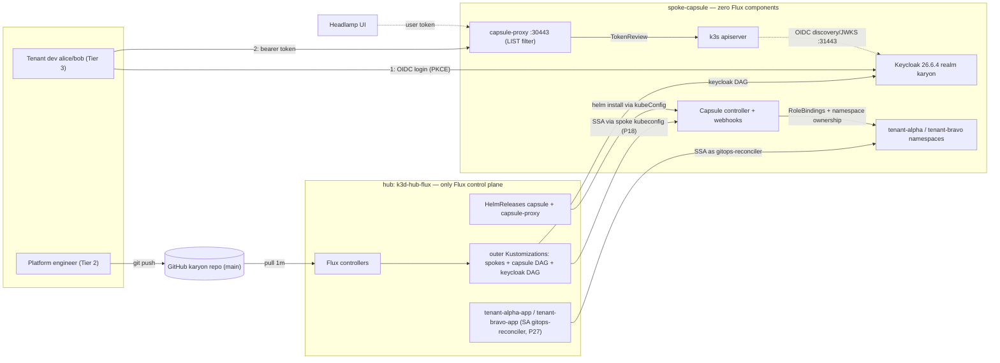

# Architecture: Flux + Capsule + Keycloak (the karyon multi-tenancy pattern)

status: Active (2026-07-06)
scope: The high-level pattern connecting GitOps delivery (Flux), tenancy
enforcement (Capsule + capsule-proxy), and identity (Keycloak) across the
karyon hub-and-spoke lab. Companion runbooks: `poc-capsule-demo.md` (6-act
demo), `poc-keycloak.md` (IdP install + OIDC wiring), `tenant-access.md` (access + admin),
`capsule-portable-setup-guide.md` (replicate elsewhere).

**Editable diagram (logos, draw.io):**
[`diagrams/karyon-architecture.drawio`](diagrams/karyon-architecture.drawio)
— import at <https://app.diagrams.net> (File → Open) or open with the draw.io
desktop/VS Code extension. Logos are embedded (CNCF artwork); no external
fetches needed. The inline mermaid below is the compact render-anywhere view.

## The pattern in one paragraph

One hub cluster runs Flux and nothing else; every other cluster is a "dumb"
spoke that Flux reaches remotely through per-spoke kubeconfig Secrets
(ADR-004). One spoke runs Capsule, which turns it into a multi-tenant cluster:
Tenant CRs define ownership and policy, admission webhooks enforce them, and
capsule-proxy gives tenant identities a filtered view of cluster-scoped
resources (the one thing vanilla RBAC cannot express). Keycloak — GitOps-
delivered onto the same spoke as an unconstrained platform tenant — supplies
the identities: realm groups map byte-for-byte onto Capsule's `Group`-kind
Tenant owners, so an OIDC login becomes tenancy membership with zero glue
code. Git is the single interface for everything except secrets, which are
minted imperatively by scripts and never committed.

## Layer 1 — GitOps delivery (Flux, hub-only)

- **ADR-004**: Flux v2.8.6 runs ONLY on `k3d-hub-flux`. Spokes carry zero
  GitOps footprint. The hub's kustomize-controller reconciles into spokes via
  `spec.kubeConfig.secretRef` — per-spoke kubeconfig Secrets created
  imperatively by the register scripts (bearer token of a spoke-side
  `flux-reconciler` SA).
- **P18 (silent misroute)**: a spoke-targeted Kustomization that omits
  `spec.kubeConfig` applies to the HUB while reporting Ready — every
  spoke-targeted manifest pins the full block, and register scripts run
  node-name falsifiers to prove routing.
- **P27**: `--default-service-account` lockdown applies to kubeConfig
  Kustomizations too, so every one carries an explicit `serviceAccountName`.
  Tenant Kustomizations impersonate a LESSER identity (`gitops-reconciler`,
  scoped inside the tenant) — that is what makes "tenants deploy through
  Flux" safe.
- **Split-path (D-08-12)**: HelmRelease/OCIRepository CRs land on the hub
  (spokes have no Flux CRDs); each HelmRelease then carries its own
  `spec.kubeConfig` so helm-controller installs onto the spoke.
- **The keycloak DAG** reuses all of it: `poc-keycloak-tenant` →
  `poc-keycloak-spoke` → `poc-keycloak-app`, ordered so the Tenant CR exists
  before the labeled namespace (D-11-07) and CRDs before CRs.

## Layer 2 — Tenancy enforcement (Capsule + capsule-proxy)

- **Tenant CRs** are the tenancy contract: owners (exact-string User / Group /
  ServiceAccount), quotas, limit ranges, registry allowlists. Three tiers:
  Tier 1 cloud ops (out of scope, talk-track), Tier 2 platform team
  (`capsule-platform-owners` Group + `platform-owner` SA — full tenant
  lifecycle, `auth can-i '*' '*'` = no), Tier 3 tenant devs
  (`tenant-workload-editor`, narrower than `edit`).
- **Webhooks enforce at admission**: the `namespaces` pair runs
  `failurePolicy: Fail` (chart default, restored after the cold-bootstrap
  deadlock — ADR-008 addendum). Consequence every workload on this spoke
  lives with: NOBODY (not even cluster-admin) can create a namespace outside
  a tenant — which is why Keycloak itself is a tenant.
- **capsule-proxy** does exactly one load-bearing thing: it filters
  cluster-scoped LIST (namespaces, tenants, …) for tenant identities. It does
  NOT authenticate — bearer tokens are TokenReviewed against the apiserver.
  Everything namespaced is plain RBAC via Capsule-injected RoleBindings.
- **GlobalTenantResource** seeds baseline workloads into every tenant
  namespace (match-all selector; Deployment shape — bare Pods are immutable
  on update and put the controller in a permanent error loop).

## Layer 3 — Identity (Keycloak)

- **Placement**: on spoke-capsule, as the unconstrained platform tenant
  `keycloak` (see `poc-keycloak.md` for why every alternative lost).
  Operator-managed (official manifests vendored @26.6.4), Postgres-backed,
  realm `karyon` imported declaratively (import-once).
- **The mapping that makes it work** — Keycloak group → Capsule owner:

  | Keycloak group (flat) | Capsule meaning |
  |---|---|
  | `capsule-users` | marker: "is a Capsule user" (in `userGroups` scope) |
  | `capsule-platform-owners` | Tier-2 Group owner on EVERY tenant (alpha, bravo, keycloak) |
  | `tenant-alpha-devs` / `tenant-bravo-devs` | per-tenant dev groups — promote to Tenant owners or `additionalRoleBindings` subjects |

  Two invariants keep this glue-free: groups are FLAT and the client's Group
  Membership mapper has *Full group path* OFF (Capsule matches
  `capsule-platform-owners`, never `/capsule-platform-owners`), and every
  Group promoted to owner is listed in `CapsuleConfiguration.spec.userGroups`
  (7 entries today).
- **Token flow (LIVE, wired 2026-07-06)**: user logs into Keycloak (public
  PKCE client `kubectl`, pinned issuer `https://localhost:31443/realms/karyon`)
  → id_token carries `groups` → kubectl/Headlamp sends it as a bearer to
  capsule-proxy `https://127.0.0.1:30443` → proxy TokenReviews it against the
  apiserver (OIDC flags validate issuer/JWKS against Keycloak) → Capsule
  exact-matches the resolved groups to Tenant owners. capsule-proxy itself
  needed zero OIDC config. Proven headlessly by
  `scripts/poc/keycloak/e2e-oidc-test.sh`: alice (platform owner) lists all
  tenant namespaces; bob (alpha dev) lists exactly one.
- **Tenant UI**: Headlamp v0.43.0 (kubernetes-sigs — the official successor
  to the archived kubernetes/dashboard) runs zero-RBAC in capsule-system and
  forwards the user's token to capsule-proxy, so the dashboard IS the
  tenant-scoped view. Access + user onboarding: `tenant-access.md`.
  The TokenRequest kubeconfig path remains as the no-IdP fallback.

## Trust and secret boundaries

| Boundary | Mechanism |
|---|---|
| Git → clusters | Flux PAT (hub Secret `flux-system`), mirrored read path `karyon-git-auth` per tenant ns |
| Hub → spokes | `flux-reconciler` SA bearer kubeconfigs (imperative Secrets, never in git) |
| Tenant reconcile privilege | P27 impersonation: `gitops-reconciler`, tenant-scoped |
| Human tenant access | Keycloak OIDC tokens via capsule-proxy (LIVE); TokenRequest kubeconfigs remain the no-IdP fallback |
| Keycloak DB / admin | `keycloak-db-secret` (imperative, non-rotating) / `keycloak-initial-admin` (operator-generated) |
| Enforcement point | Capsule admission webhooks (`namespaces`=Fail) + injected RBAC + proxy LIST filter |

## Port map

| Endpoint | Where | Purpose |
|---|---|---|
| `127.0.0.1:6443/6444/6445/6446` | host → k3d LBs | apiservers (hub, ml, apps, capsule) — operator only |
| `127.0.0.1:30443` | host → spoke-capsule LB | capsule-proxy — THE tenant entry point |
| `keycloak-service:8080` | in-cluster (port-forward) | Keycloak UI/API (plain http side) |
| `127.0.0.1:31443` | host (socat forwarder) + node loopback | pinned OIDC issuer (TLS) — browser, kubelogin, apiserver |
| `headlamp:80` (port-forward 4466) | in-cluster | tenant UI (Headlamp → capsule-proxy) |
| `k3d-<name>-server-0:6443` | k8s-net bridge | hub controllers → spoke apiservers |
