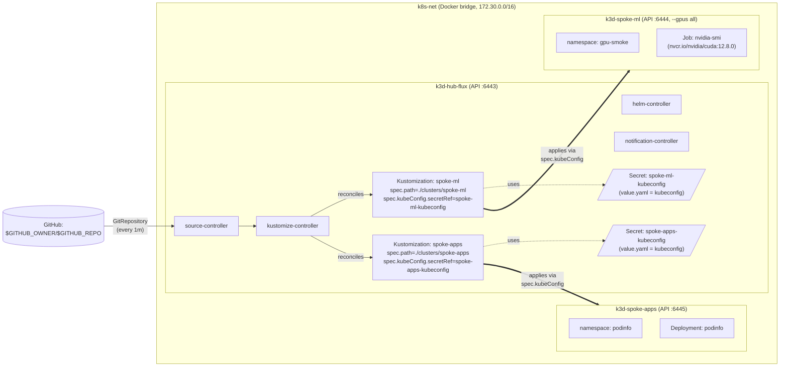

# Karyon Architecture

This document describes the topology of the karyon lab: three k3d clusters on
a single shared Docker bridge network, hub-only Flux GitOps, and the
`spec.kubeConfig`-mediated reconciliation pattern from `hub-flux` into each
spoke.

The diagram below renders natively on GitHub via the [Mermaid](https://mermaid.js.org/)
fence convention. For the rationale behind each architectural choice, see the
ADRs under [`adr/`](adr/).

## Hub-Spoke Topology

## What the Diagram Shows

- **Network:** All three k3d clusters attach to the `k8s-net` Docker bridge
  network (`172.30.0.0/16`). This is what makes Docker embedded DNS reachable
  cross-cluster: `hub-flux`'s `kustomize-controller` resolves
  `k3d-spoke-ml-server-0` and `k3d-spoke-apps-server-0` directly without
  host-routing gymnastics. Pinned in `scripts/create-clusters.sh`.

- **Hub controllers:** `flux bootstrap github` installs the four canonical
  Flux v2 controllers on `hub-flux`: `source-controller` (pulls Git,
  Helm, Bucket sources), `kustomize-controller` (reconciles `Kustomization`
  resources — including the spoke ones), `helm-controller` (reconciles
  `HelmRelease` resources), and `notification-controller` (event routing).
  See `flux-hub-spoke.md` for the patch-surface contract on
  `clusters/hub-flux/flux-system/`.

- **Spoke kubeconfig Secrets:** `scripts/register-spokes-for-flux.sh`
  provisions a legacy-Secret-backed ServiceAccount token on each spoke
  and embeds the kubeconfig (server + CA + token) into a
  `flux-system/<spoke>-kubeconfig` Secret on the hub under the key
  `value.yaml`.

- **Cross-cluster reconciliation:** Each spoke `Kustomization` on the hub
  has `spec.kubeConfig.secretRef.name: <spoke>-kubeconfig` AND
  `spec.kubeConfig.secretRef.key: value.yaml`. The
  `kustomize-controller` reads the kubeconfig from the Secret, talks to the
  spoke's apiserver via the Docker DNS hostname, and applies the manifests
  there. See [`adr/0004-hub-only-flux-control-plane.md`](adr/0004-hub-only-flux-control-plane.md)
  for the rationale and the silent-misroute defense.

- **Workload examples:** `spoke-ml` runs an `nvidia-smi` smoke-test Job;
  `spoke-apps` runs the standard podinfo Deployment.
  Manifests live under [`../examples/`](../examples/).

***

## Cross-Reference Index

| Concern | Doc |
|---------|-----|
| GPU pass-through and the 3-part k3d contract | [`gpu-notes.md`](gpu-notes.md) |
| Flux bootstrap behavior + the patch-surface contract | [`flux-hub-spoke.md`](flux-hub-spoke.md) |
| WSL2 networking modes (mirrored vs NAT) | [`wsl-networking.md`](wsl-networking.md) |
| Rebuild procedure + expected timings | [`rebuild-runbook.md`](rebuild-runbook.md) |
| Architectural decisions | [`adr/`](adr/) |
