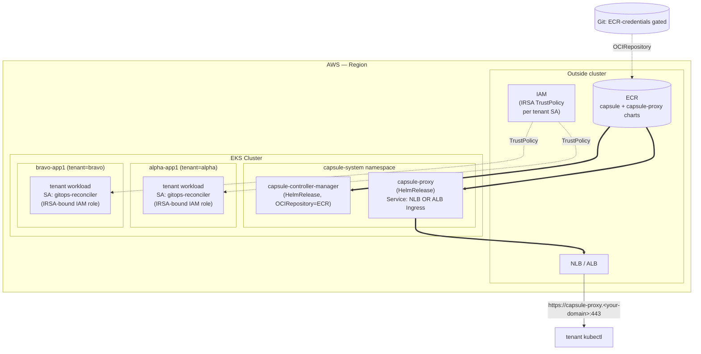

# Capsule on EKS — Rough-Cut Design (v0.19)

> **Status:** Draft — see frontmatter for status-rollover policy.
> **Audience:** Mixed Engineering + Cloud Ops. Brief, biased toward admin-required steps (CRD install, IRSA, ECR pull permissions). YAML appears only on important items.

## What Capsule is

[Capsule](https://capsule.clastix.io/) is a Kubernetes operator that adds first-class **multi-tenancy** on top of standard RBAC, ResourceQuota, LimitRange, and NetworkPolicy primitives. Tenant owners are bound to a `Tenant` CR; Capsule then auto-materializes per-tenant namespaces, quotas, and admission policies — so platform admins issue tenants instead of ad-hoc cluster-admin RBAC.

## Required CRDs (the 7)

Capsule installs 7 cluster-scoped CRDs. The POC validates only `Tenant` directly; the remainder are listed for completeness so the EKS install plan accounts for the full CRD blast-radius.

| CRD | Purpose | POC scope |
|---|---|---|
| **Tenant** | The boundary object: owners, namespace prefix, quotas, allowedNodeSelectors. | **In scope** — POC creates `alpha` + `bravo` Tenants. |
| **CapsuleConfiguration** | Cluster-wide controls: `forceTenantPrefix`, `allowedNodeSelectors` defaults. | In scope (one cluster-wide instance). |
| **GlobalTenantResource** | Cluster-scoped resource auto-replicated into every tenant namespace. | Out of scope (Phase 9+ if needed). |
| **TenantResource** | Tenant-scoped resource auto-replicated into all namespaces of one tenant. | Out of scope. |
| **ResourcePool** | Cross-tenant resource pool (separate model from baseline tenant isolation). | Out of scope (PROJECT.md). |
| **ResourcePoolClaim** | Tenant claim against a ResourcePool. | Out of scope. |
| **TenantOwner** | Lookup CR for tenant ownership (Capsule v0.12+). | Surface only; not directly used in POC. |

## Required permissions / RBAC

| Subject | Permissions | Where it lives |
|---|---|---|
| **Capsule operator SA** (`capsule-controller-manager`) | `cluster-admin` (operator manages all tenant resources cluster-wide) | `capsule-system` namespace |
| **capsule-proxy SA** | Read tenants + impersonate tenant owners | `capsule-system` namespace |
| **Per-tenant SA** (`gitops-reconciler` in tenant namespace) | Bound to `Tenant.spec.owners`; Capsule scopes their effective permissions to tenant namespaces | Each tenant's namespace prefix (e.g., `tenant-alpha`, `tenant-bravo`) |

**Admin-required step:** install Capsule's CRDs cluster-wide BEFORE any tenant Kustomization references them — Phase 9 enforces this with `dependsOn` + `wait: true` on the operator Kustomization.

## Topology (EKS target)

The diagram below is the EKS-target equivalent of the karyon k3d POC. Source-of-truth ASCII: `.planning/research/SUMMARY.md` §"Mental Model".



## Rough EKS install path

### High-level walkthrough (Cloud Ops orientation)

Bare-minimum steps to deploy Capsule + capsule-proxy on EKS for a comparable POC:

1. **Install CRDs cluster-wide** — apply Capsule's `crds/` manifest BEFORE any Tenant CR is referenced. If Capsule is installed via HelmRelease, ensure `helm.sh/hook: pre-install` order or set `dependsOn` on the operator Kustomization.
2. **ECR-host the Capsule + capsule-proxy charts** — `aws ecr-public get-login-password | helm registry login`, push both charts to your ECR registry, then reference via `OCIRepository` in Flux. (Narrative only; no full HelmRelease YAML — chart pins are `capsule:0.12.4` + `capsule-proxy:0.12.0`.)
3. **Grant Flux source-controller SA pull permissions on ECR** — annotate Flux source-controller's SA with `eks.amazonaws.com/role-arn` for an IAM role with `AmazonEC2ContainerRegistryReadOnly`.
4. **Provision IRSA TrustPolicies** for each tenant SA — see verbatim YAML below.
5. **Expose capsule-proxy via NLB or ALB Ingress** — see verbatim YAML below; ALB option requires AWS Load Balancer Controller installed in-cluster.
6. **Constrain tenant scheduling via CapsuleConfiguration `allowedNodeSelectors`** — see verbatim YAML below; constrains tenants away from system / GPU nodes.
7. **Mint per-tenant kubeconfigs** pointing at the NLB/ALB endpoint (`server: https://capsule-proxy.<your-domain>:443`).

### Not yet wired in the k3d POC (EKS deltas)

These items DO NOT appear in the karyon k3d POC and require explicit setup on EKS:

- ECR-hosted OCIRepository + ECR pull permissions for Flux source-controller SA
- IRSA TrustPolicy on tenant ServiceAccounts (replaces legacy SA-token bearer used in k3d)
- AWS Load Balancer Controller install (required for ALB Ingress option)
- ALB Ingress class + listener-port annotations
- Cluster-autoscaler / Karpenter integration with tenant nodeSelector constraints

### Verbatim YAML #1 — IRSA TrustPolicy for tenant ServiceAccount

```json
{
  "Version": "2012-10-17",
  "Statement": [
    {
      "Effect": "Allow",
      "Principal": {
        "Federated": "arn:aws:iam::<ACCOUNT_ID>:oidc-provider/oidc.eks.<REGION>.amazonaws.com/id/<OIDC_ID>"
      },
      "Action": "sts:AssumeRoleWithWebIdentity",
      "Condition": {
        "StringEquals": {
          "oidc.eks.<REGION>.amazonaws.com/id/<OIDC_ID>:sub": "system:serviceaccount:tenant-alpha:gitops-reconciler",
          "oidc.eks.<REGION>.amazonaws.com/id/<OIDC_ID>:aud": "sts.amazonaws.com"
        }
      }
    }
  ]
}
```

```yaml
# Companion ServiceAccount annotation
apiVersion: v1
kind: ServiceAccount
metadata:
  name: gitops-reconciler
  namespace: tenant-alpha
  annotations:
    eks.amazonaws.com/role-arn: arn:aws:iam::<ACCOUNT_ID>:role/karyon-tenant-alpha-gitops-reconciler
```

### Verbatim YAML #2 — capsule-proxy Service (NLB) and Ingress (ALB)

**Option A: NLB-fronted Service**

```yaml
apiVersion: v1
kind: Service
metadata:
  name: capsule-proxy
  namespace: capsule-system
  annotations:
    service.beta.kubernetes.io/aws-load-balancer-type: external
    service.beta.kubernetes.io/aws-load-balancer-nlb-target-type: ip
    service.beta.kubernetes.io/aws-load-balancer-scheme: internet-facing
spec:
  type: LoadBalancer
  ports:
  - name: https
    port: 443
    targetPort: 9001
    protocol: TCP
  selector:
    app.kubernetes.io/name: capsule-proxy
```

**Option B: ALB Ingress** (requires AWS Load Balancer Controller installed in-cluster — narrative-only callout)

```yaml
apiVersion: networking.k8s.io/v1
kind: Ingress
metadata:
  name: capsule-proxy
  namespace: capsule-system
  annotations:
    kubernetes.io/ingress.class: alb
    alb.ingress.kubernetes.io/scheme: internet-facing
    alb.ingress.kubernetes.io/target-type: ip
    alb.ingress.kubernetes.io/listen-ports: '[{"HTTPS":443}]'
    alb.ingress.kubernetes.io/ssl-redirect: '443'
spec:
  rules:
  - host: capsule-proxy.<your-domain>
    http:
      paths:
      - path: /
        pathType: Prefix
        backend:
          service:
            name: capsule-proxy
            port:
              number: 9001
```

### Verbatim YAML #3 — CapsuleConfiguration `allowedNodeSelectors`

```yaml
apiVersion: capsule.clastix.io/v1beta2
kind: CapsuleConfiguration
metadata:
  name: default
spec:
  forceTenantPrefix: true
  allowedNodeSelectors:
  - key: karpenter.sh/nodepool
    operator: In
    values: ["tenant-default"]
  - key: topology.kubernetes.io/zone
    operator: In
    values: ["us-east-1a", "us-east-1b"]
  # Cluster-autoscaler and Karpenter both honor these selectors when scaling
  # tenant pods; the CapsuleConfiguration-level constraint prevents a tenant
  # from scheduling onto a system / control-plane / GPU-only node.
```

## What this POC does NOT prove

The karyon v0.19 POC validates baseline tenant isolation on a single spoke. The following are explicitly **out of scope** for the POC and require separate validation:

1. **HA Capsule** — POC runs single-replica. Multi-replica + leader-election semantics are unverified.
2. **OIDC tenant authentication** — POC uses ServiceAccount tokens (or IRSA on EKS). OIDC issuers (Dex, Keycloak, Auth0) for tenant auth are unverified.
3. **Multi-spoke federation** — Capsule has no native cross-cluster Tenant. Tenants spanning multiple spokes are unverified.

These three items mirror the eventual ADR-008 graduation framing so the EKS-target audience and the karyon graduation ADR speak the same vocabulary.

---

*See `.planning/research/SUMMARY.md` for the full karyon v0.19 architectural correction; see `docs/architecture.md` for the karyon hub-spoke topology.*
