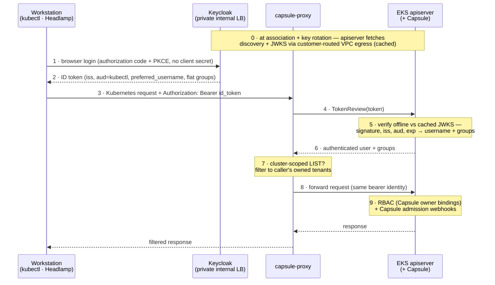

# EKS OIDC runtime auth flow (private Keycloak · capsule-proxy · Capsule)

Step-numbered sequence of the runtime identity chain described in
[`../eks-private-keycloak-oidc-strategy.md`](../eks-private-keycloak-oidc-strategy.md)
and [`../eks-identity-adoption-brief.md`](../eks-identity-adoption-brief.md).
A rendered export for embedding lives alongside:
[`eks-oidc-runtime-flow.svg`](eks-oidc-runtime-flow.svg) (compact vector of
this file's sequence). The high-resolution
[`eks-oidc-runtime-flow.png`](eks-oidc-runtime-flow.png) is rendered from
the Headlamp-centric mermaid in
[`../eks-oidc-tenancy-flow.md`](../eks-oidc-tenancy-flow.md) — same identity
chain at a different altitude; edit each diagram at its own source.

Three conversations that never overlap in time: the control plane talks to
Keycloak rarely (step 0), the human talks to Keycloak once per session
(steps 1–2), and every Kubernetes request (steps 3–9) involves no call to
Keycloak at all.

Trust anchors (one-directional; no shared secrets anywhere):

- apiserver → Keycloak: the OIDC association (public-CA TLS + cached JWKS).
- capsule-proxy → apiserver: TokenReview with the proxy's own credentials.
- clients → capsule-proxy: the proxy's pinned serving CA.
- workstations → Keycloak: the public CA on the issuer endpoint.

Keycloak is never called per request and never knows the cluster exists.
