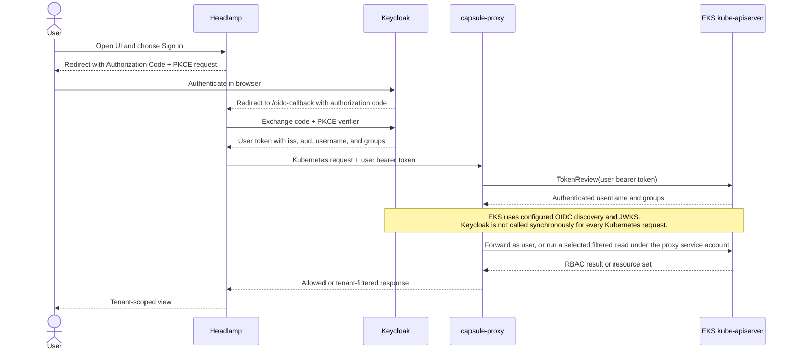
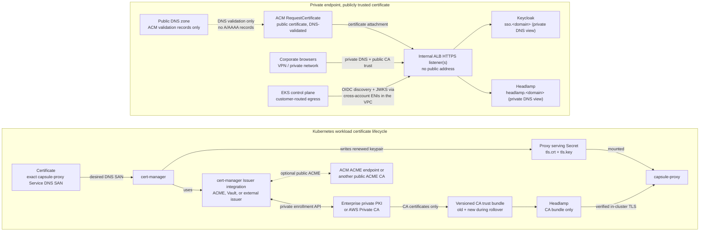

# EKS OIDC tenancy and certificate flow

status: Draft (2026-07-14; certificate/trust flow revised 2026-07-29 for the
private-issuer posture — the original assumed a publicly reachable issuer)
scope: Public-safe reference for the Keycloak -> Headlamp -> capsule-proxy ->
EKS identity path and its certificate trust boundaries.
companion: `eks-work-agent-prompt.md`, `eks-identity-adoption-brief.md`,
`eks-platform-handoff.md`,
[`eks-private-keycloak-oidc-strategy.md`](eks-private-keycloak-oidc-strategy.md)
(canonical owner of the private-issuer networking/TLS decisions this page's
certificate flow now reflects).

This design has two independent kinds of trust:

- **OIDC/JWT trust:** EKS trusts Keycloak's issuer, signing keys, audience,
  and claims.
- **TLS trust:** each client trusts the certificate presented by the next
  network hop.

cert-manager participates in TLS certificate issuance and renewal. It is not
itself a certificate authority, and it does not need one universal "seed CA."
Each `Certificate` should select an issuer appropriate to that hop's trust
boundary.

## Runtime identity and authorization flow

Confluence-ready export:
[`diagrams/eks-oidc-runtime-flow.png`](diagrams/eks-oidc-runtime-flow.png)
(5430 x 2433). The Mermaid block remains the editable source of truth.

kubectl follows the same identity path: kubelogin performs the Authorization
Code flow with PKCE, then kubectl sends the resulting token to capsule-proxy.
Headlamp's in-cluster API endpoint is overridden to the capsule-proxy Service,
and its own service account has no Kubernetes permissions.

The authorization result is route-dependent. Ordinary proxy routes use the
user identity and Kubernetes RBAC. Some intercepted cluster-scoped reads may
use the proxy service account and filter afterward; on those routes, proxy
permissions, Tenant owner groups, selectors, and filter logic are part of the
authorization boundary.

## Certificate and trust flow

Embeddable exports:
[`diagrams/eks-certificate-trust-flow.svg`](diagrams/eks-certificate-trust-flow.svg)
(self-contained vector) and
[`diagrams/eks-certificate-trust-flow.png`](diagrams/eks-certificate-trust-flow.png)
(5440-px raster of that SVG — replaces the pre-2026-07-29 public-posture
PNG under the same attachment name). The Mermaid block remains the editable
source of truth for content; regenerate the SVG and PNG together when it
changes.

The recommended default is deliberately split:

- Use an ACM `RequestCertificate` public certificate on the **internal** ALB
  serving the Keycloak issuer and Headlamp. DNS validation means the
  endpoints never need public reachability — only the validation CNAMEs live
  in public DNS; the hostnames resolve solely in the private DNS view.
- Use cert-manager with a private issuer for the internal capsule-proxy
  Service certificate.
- Give Headlamp only the proxy CA bundle. Never mount the proxy private-key
  Secret into Headlamp.

As of July 2026, ACM also offers an ACME endpoint that cert-manager can use to
place publicly trusted certificates in Kubernetes workloads. That is useful
when a workload terminates TLS for a public DNS name. ACM certificates created
through ACME cannot be attached to AWS-integrated services such as ALB; use
the normal ACM `RequestCertificate` path for an ALB listener.

## Certificate ownership by hop

| Hop | Certificate or trust source | cert-manager role | Requirement |
|---|---|---|---|
| Browser and EKS control plane -> Keycloak issuer hostname (private) | Recommended: ACM public certificate on the internal ALB | None on the ALB frontend | The issuer certificate must chain to a public CA — no enterprise-only, self-signed, or AWS Private CA chains for the EKS OIDC association. Reachability stays private: the control plane reaches the issuer through customer-routed egress, browsers through the corporate network. |
| Browser -> Headlamp hostname (private) | Recommended: ACM public certificate on the internal ALB | None on the ALB frontend | Certificate SAN must match the Headlamp hostname in the private DNS view. |
| Headlamp pod -> capsule-proxy Service | Enterprise/private PKI or AWS Private CA | Issue and renew the proxy leaf; publish trust separately | Leaf SAN must include the exact value used by `KUBERNETES_SERVICE_HOST`, for example `capsule-proxy.capsule-system.svc`. |
| External kubectl -> capsule-proxy, if exposed | ACM public certificate at the load balancer, or a public/enterprise certificate at the proxy when TLS passes through | Only when the Kubernetes workload terminates TLS | Decide the public hostname, TLS termination point, client trust population, and whether external proxy access is required. |
| kube-apiserver -> Capsule admission webhooks | Separate private webhook CA and serving certificate | May issue the leaf and inject the webhook `caBundle` | Do not reuse or conflate Capsule webhook TLS with capsule-proxy TLS. |
| capsule-proxy -> kube-apiserver | EKS API server CA | None | Use the EKS-provided API server trust path. |
| Keycloak -> RDS | AWS RDS CA bundle | None | Validate the database server chain independently of all ingress and workload certificates. |

## Which CA should cert-manager use?

An internal CA is normally **not publicly trusted**. Two questions must not be
conflated:

1. **Reachability:** can cert-manager reach the CA's enrollment API from EKS?
2. **Trust:** do EKS, browsers, kubectl clients, and workloads already trust
   that CA's root?

Publishing an internal CA endpoint does not make its certificates publicly
trusted. For the Keycloak issuer, use a publicly trusted server certificate;
the standard EKS OIDC association exposes no custom issuer CA bundle.

For `capsule-proxy.<namespace>.svc`, public CAs are not the right trust source.
Prefer one of:

1. The enterprise PKI through an approved ACME, Vault, or cert-manager external
   issuer integration.
2. AWS Private CA through the AWS Private CA Connector for Kubernetes.
3. If neither exists, a deliberately operated cert-manager CA `Issuer` backed
   by a constrained intermediate CA. Do not put an organizational root key in
   Kubernetes.

A cert-manager CA `Issuer` is not a zero-operations option: cert-manager does
not automatically rotate the CA certificate, can issue leaves that outlive
it, and does not automatically reissue every leaf when the CA Secret changes.
`SelfSigned` is suitable for bootstrapping a private CA, not as the routine
production issuer for service leaf certificates.

## Requirements

### Identity contract

- Freeze `keycloakBaseUrl=https://sso.<domain>` (a registrable domain; the
  hostname may resolve only in the private DNS view) and derive
  `issuerUrl=${keycloakBaseUrl}/realms/<realm>` before creating the EKS
  association.
- The token `iss`, EKS `issuerUrl`, Headlamp issuer, and kubelogin issuer must
  be byte-identical.
- Configure EKS with `usernameClaim=preferred_username`, `usernamePrefix=-`,
  `groupsClaim=groups`, and no `groupsPrefix`.
- Keycloak groups must be flat and emitted with `full.path=false`; group
  strings must exactly match Capsule Tenant owners.
- Confirm whether the selected Headlamp version forwards the ID token or
  access token and prove that token contains the EKS client ID in `aud`.
- Enumerate every capsule-proxy intercepted route and test actual direct and
  proxied requests. Do not treat `kubectl auth can-i` as sufficient where the
  proxy may substitute its own service account.

### Certificate lifecycle

- Use separate certificates, Secrets, and CA bundles for public ingress,
  capsule-proxy, Capsule webhooks, and RDS.
- Put only `tls.crt` and `tls.key` in the proxy serving path. Distribute an
  independently managed CA bundle to Headlamp.
- Plan CA rollover as: distribute old + new roots, issue new leaves, reload
  servers and clients, verify the new chain, then remove the old root.
- Decide certificate duration, `renewBefore`, private-key rotation, reload
  behavior, monitoring, and disaster recovery. Automate a workload rollout if
  capsule-proxy cannot hot-reload renewed material.
- Restrict who can create `Certificate` and `CertificateRequest` resources.
  Production approval policy should constrain issuer, namespace, DNS names,
  duration, key type, usages, and `isCA=false`.
- Prefer a signing service that keeps enterprise CA keys outside Kubernetes.
  If a CA key must exist in-cluster, use only a constrained intermediate and
  document its blast radius and recovery process.

### Required validation

- From outside the cluster, fetch Keycloak discovery and JWKS through the
  exact issuer URL; then prove EKS can authenticate a real token.
- Prove Headlamp validates capsule-proxy using only the distributed CA bundle.
- Confirm a wrong hostname and wrong CA both fail closed.
- Force a proxy leaf renewal and verify uninterrupted or bounded-restart
  behavior.
- Rehearse an old/new CA overlap and removal.
- Verify no workload other than capsule-proxy can read the proxy private key.
- Complete the direct-versus-proxy tenant authorization matrix from
  `eks-work-agent-prompt.md`, including the known node-list behavior.

## Decisions still needed in the target environment

| Decision | Recommended starting point | Evidence to obtain |
|---|---|---|
| Keycloak and Headlamp public TLS | ALB termination with ACM `RequestCertificate` certificates | Approved public DNS names, ALB ownership, and certificate policy |
| Internal proxy issuer | Existing enterprise PKI through a supported external issuer; otherwise evaluate AWS Private CA | Enrollment protocol, authentication, reachability, allowed `.svc` SANs, chain format, EKUs, lifetimes, revocation, and audit |
| Proxy exposure | In-cluster only for Headlamp unless external kubectl access is required | Consumer list and network path |
| CA bundle delivery | Versioned ConfigMap/Secret, optionally reconciled by trust-manager | Namespace scope, update permissions, application reload behavior, and rollover procedure |
| Proxy certificate reload | Hot reload if verified; otherwise controlled rollout on Secret renewal | Behavior of the exact pinned capsule-proxy version |
| Certificate request policy | Restricted RBAC plus an explicit approver policy | Permitted issuers, namespaces, SAN patterns, durations, usages, and key algorithms |

## Mirroring into Confluence

1. Pull the repository and open this page in GitHub's rendered view or a local
   Markdown preview.
2. Create a Confluence page named **EKS OIDC tenancy and certificate flow**.
3. Copy the rendered prose and tables section by section; do not paste the raw
   Mermaid fences into a standard Confluence editor.
4. Upload `diagrams/eks-oidc-runtime-flow.png` under **Runtime identity and
   authorization flow** and `diagrams/eks-certificate-trust-flow.png` under
   **Certificate and trust flow** (same attachment names as before, so
   Confluence versions them in place).
5. Display both images at full page width and add concise captions. The source
   PNGs retain enough resolution for Confluence's full-screen preview.
6. Add the source repository commit to the page and optionally attach this
   Markdown file so the editable Mermaid remains discoverable.
7. Make environment-specific substitutions only in the internal Confluence
   copy. Do not sync internal hostnames, CA names, or repository details back
   into this public repository.
8. For later diagram revisions, upload the replacement PNG with the same file
   name so Confluence records a new attachment version.

## References

- [Amazon EKS external OIDC requirements](https://docs.aws.amazon.com/eks/latest/userguide/authenticate-oidc-identity-provider.html)
- [Amazon EKS control plane egress routing (customer-routed)](https://docs.aws.amazon.com/eks/latest/userguide/control-plane-egress.html)
- [ACM certificates for ALB](https://docs.aws.amazon.com/elasticloadbalancing/latest/application/https-listener-certificates.html)
- [ACM ACME automation](https://docs.aws.amazon.com/acm/latest/userguide/acm-acme.html)
- [ACM integrated-service restrictions](https://docs.aws.amazon.com/acm/latest/userguide/acm-services.html)
- [AWS Private CA Connector for Kubernetes](https://docs.aws.amazon.com/privateca/latest/userguide/PcaKubernetes.html)
- [cert-manager CA Issuer limitations](https://cert-manager.io/docs/configuration/ca/)
- [cert-manager SelfSigned guidance](https://cert-manager.io/docs/configuration/selfsigned/)
- [cert-manager approval policy](https://cert-manager.io/docs/policy/approval/)
- [trust-manager and safe trust-bundle rotation](https://cert-manager.io/docs/trust/trust-manager/)
- [CA/Browser Forum server-certificate requirements](https://cabforum.org/working-groups/server/baseline-requirements/requirements/)

The broader editable platform sketch remains in
[`diagrams/eks-platform-sketch.drawio`](diagrams/eks-platform-sketch.drawio).
