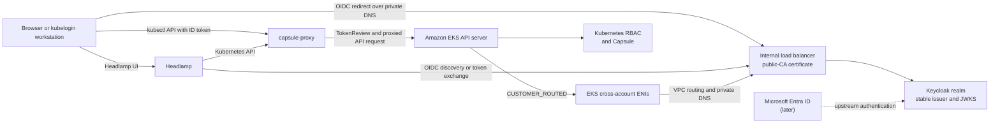

# Strategy guide: private Keycloak OIDC for Amazon EKS

status: Active (2026-07-28)
audience: cloud, platform, identity, networking, and security teams evaluating
the karyon identity pattern for an enterprise EKS environment.
purpose: describe the AWS capabilities, architectural constraints, and
cross-team decisions required to use a private Keycloak issuer with EKS.

This is a strategy and decision guide, **not a deployment runbook**. It does
not prescribe account-specific commands, Terraform modules, load balancer
annotations, or a production cutover procedure.

Companion documents:

- [`eks-identity-adoption-brief.md`](eks-identity-adoption-brief.md) explains
  the Keycloak → EKS → Capsule identity and authorization contract.
- [`eks-platform-handoff.md`](eks-platform-handoff.md) translates the karyon
  components into a single-cluster EKS platform.
- [`tenant-access.md`](tenant-access.md) is the end-user access runbook to
  adapt after the platform design is settled.

Canonical ownership across the set:

- This guide owns AWS private-issuer networking, TLS, load-balancer, client
  reachability, Entra-evolution decisions, and the recommended EKS association
  field contract.
- The identity adoption brief owns the token, claim, and Capsule group trust
  contract.
- The platform handoff owns component translation and implementation
  references.

Where the same topic is summarized in more than one document, follow the
detail in its canonical owner above.

## Executive position

A Keycloak issuer does **not** need to be internet-facing for EKS.
Amazon EKS customer-routed control plane egress can route OIDC discovery and
JWKS requests through the cluster VPC to a private endpoint.

The supported shape is:

- Keycloak remains reachable only through private networking.
- The issuer presents a certificate that chains to a publicly trusted CA.
- VPC DNS resolves the issuer hostname to an internal load balancer.
- EKS uses `controlPlaneEgressMode=CUSTOMER_ROUTED` so its control plane
  resolves and reaches that private address through the VPC.
- Browsers, kubelogin workstations, and Headlamp receive their own private
  route and DNS path to Keycloak.

The distinction is load-bearing:

> Public certificate trust does not imply public network reachability.

AWS announced customer-routed control plane egress on **June 18, 2026** and
published the private-OIDC walkthrough on June 22. The current EKS external
OIDC page retains legacy statements that an issuer must be publicly accessible
over the internet, but now includes a Note directing private-provider designs
to `CUSTOMER_ROUTED` reachability. Read that page together with the feature
documentation: `AWS_MANAGED` egress has that limitation; `CUSTOMER_ROUTED` is
the supported private-provider path.

## Reference architecture

A step-numbered runtime sequence of the same flow lives in
[`diagrams/eks-oidc-runtime-flow.md`](diagrams/eks-oidc-runtime-flow.md)
(with an embeddable SVG export alongside).



The same byte-for-byte issuer value must appear in the Keycloak token,
Keycloak discovery document, EKS association, kubelogin configuration, and
Headlamp configuration:

```text
https://sso.<domain>/realms/<realm>
```

Changing that value later is an identity migration, not a routine DNS
change.

## What customer-routed control plane egress changes

With the default `AWS_MANAGED` mode, EKS controls the API server's outbound
path and cannot use a private VPC-only OIDC endpoint. With
`CUSTOMER_ROUTED`, customer-facing API server traffic leaves through the
existing cross-account ENIs in the selected cluster subnets.

| Concern | Architectural consequence |
|---|---|
| OIDC discovery and JWKS | EKS can resolve a Route 53 private hosted-zone record and reach an internal load balancer. |
| VPC routing | The platform owns the routes, security groups, NACLs, firewalls, and return path from the control plane ENIs. The EKS cluster IAM role needs `ec2:DescribeVpcs` and `ec2:DescribeDhcpOptions`. |
| DNS | The VPC DHCP options must include `AmazonProvidedDNS`, and the VPC's `enableDnsSupport` and `enableDnsHostnames` attributes must both be true for private hosted-zone resolution; the resolver path must handle every private and public name the control plane needs. |
| Other control-plane calls | Admission webhooks and aggregated API servers use the same customer-routed path. This is broader than an OIDC setting. |
| Irreversibility | A cluster cannot return from `CUSTOMER_ROUTED` to `AWS_MANAGED`; reverting requires cluster replacement. |
| IAM authentication | The EKS IAM authenticator remains available, and its STS path remains AWS-managed. |
| Infrastructure as code | Terraform AWS provider v6.52.0 added `vpc_config.control_plane_egress_mode`; use that or a module version that exposes it so the cluster setting does not drift out of band. |

This feature controls **outbound traffic from the API server**. It is
independent of EKS private API endpoint access, which controls inbound
traffic from kubectl, nodes, and other API clients. A private platform may
use both.

Because the setting is a one-way cluster-lifetime choice, it should be
treated as a Tier-1 platform decision rather than a Keycloak installation
detail.

## Why the homelab did not have this restriction

karyon controls its k3s API server directly. It can configure a custom OIDC
CA file and provide a lab-specific network path to Keycloak. The managed EKS
control plane exposes neither of those controls: the external OIDC
association has no custom-CA field, and before customer-routed egress its
network path could not resolve or route to a VPC-only issuer.

The June 2026 EKS feature closes the **reachability** gap. It does not change
the **certificate trust** rule. This is why a private/self-signed Keycloak
issuer could work in the homelab while the same endpoint could not simply be
copied into EKS.

This was never a missing-JWKS problem in Keycloak. It was a difference
between a self-managed API server—where the platform owns trust and
routing—and a managed API server with a narrower configuration surface.

## What does not change: public TLS trust

EKS does not accept a custom CA bundle for an associated OIDC provider.
The issuer certificate must chain to a public root. Self-signed certificates
and certificates issued by AWS Private CA do not satisfy this requirement.

That still permits an entirely private endpoint:

1. Choose an issuer hostname below a registrable domain the organization
   controls, such as `sso.<domain>`.
2. Validate a public certificate with DNS. DNS validation does not require
   the Keycloak endpoint to be reachable from the internet.
3. Keep certificate-validation records in public DNS.
4. Resolve the issuer's A/AAAA or alias record only in the private DNS view,
   pointing to an internal load balancer.
5. Keep public ingress, public load balancer addresses, and public issuer
   address records absent.

An internal-only suffix with no publicly registrable parent is incompatible
with this EKS design. Use a hostname beneath an organization-controlled
registrable domain.

## Keycloak already provides discovery and JWKS

There is no separate service that publishes Keycloak's signing keys.
Each Keycloak realm owns its signing keys and exposes the standard
unauthenticated OIDC endpoints:

```text
Discovery:
https://sso.<domain>/realms/<realm>/.well-known/openid-configuration

JWKS:
https://sso.<domain>/realms/<realm>/protocol/openid-connect/certs
```

The discovery document contains a `jwks_uri` pointing to the realm's
certificate endpoint. The JWKS contains public keys only; it does not expose
private signing keys or user data.

Those endpoints are available whenever the Keycloak realm is available.
Whether they are internet-facing, VPC-only, or reachable through a corporate
network is determined by DNS and network exposure—not by a Keycloak
"publish JWKS" setting.

## Every reachability plane must be designed

Making the EKS control plane reach Keycloak solves only one of the required
paths.

| Source | Destination | Required path | Typical failure if omitted |
|---|---|---|---|
| EKS API server | Keycloak discovery/JWKS | `CUSTOMER_ROUTED`, VPC DNS, subnet routes, SGs, and NACLs | OIDC association or token validation fails. |
| EKS API server | Capsule webhooks and aggregated APIs | The same customer-routed VPC path | Admission or extension APIs fail independently of user login. |
| Browsers and kubelogin workstations | Keycloak, Headlamp, and capsule-proxy | Corporate DNS plus VPN, Direct Connect, transit routing, or another approved private-access path | EKS trusts the issuer, but humans cannot complete login or reach the client endpoint. |
| Pods such as Headlamp | Keycloak and capsule-proxy | Cluster DNS, workload network policy, and egress rules | UI login or proxy access fails inside the cluster. |
| EKS control plane; IRSA-enabled workloads | The public EKS service-account OIDC issuer; AWS STS | `CUSTOMER_ROUTED` control-plane reachability to `oidc.eks.<region>.amazonaws.com`; workload DNS and network access to STS | ServiceAccounts cannot assume their IAM roles even if human OIDC works. |
| Keycloak, after Entra integration | Microsoft identity endpoints | Approved outbound workload egress or proxy | Brokered Entra login fails while local Keycloak login may still work. |

Route 53 Resolver endpoints and forwarding rules can bridge corporate and
VPC DNS when the issuer name must resolve from both environments. The exact
network product is organization-specific; the requirement is consistent
resolution of the same issuer URL. An associated Route 53 Resolver
`FORWARD` rule for the same domain takes precedence over an associated
private hosted zone, so enterprise apex forwarding can silently shadow
`sso.<domain>`; preserve most-specific resolution where namespaces overlap.

## Choose one Keycloak load balancer and TLS pattern

An ALB and an NLB are not interchangeable in Keycloak configuration.

| Pattern | Certificate and backend | Keycloak implication | Position |
|---|---|---|---|
| Internal ALB with TLS re-encryption | Public ACM certificate on the ALB; TLS also used to the Keycloak target | Enable and trust the ALB's `X-Forwarded-*` headers, pin the full hostname, and restrict direct backend access. The ALB does not validate the target certificate; AWS relies on in-VPC packet-level authentication. | Recommended enterprise baseline when L7 policy and managed certificates are desired. |
| Internal ALB with edge termination | Public ACM certificate on the ALB; HTTP to Keycloak | Same proxy-header controls, plus an explicitly enabled HTTP backend. | Simpler, but weaker than re-encryption; use only if internal plaintext is accepted. |
| Internal NLB with TCP passthrough | The NLB holds no certificate; install a public-CA certificate and private key on Keycloak, for example through cert-manager/ACME DNS-01 or an ACM public certificate requested with export enabled | Do not enable forwarded-header parsing; use PROXY protocol only if both ends are deliberately configured for it. | Valid L4 alternative when end-to-end TLS is preferred. |
| NLB TLS termination | Public ACM certificate on the NLB | NLB does not supply the ALB `X-Forwarded-*` contract. A direct HTTP Keycloak target needs a separately proven hostname/origin design, or an L7 proxy behind the NLB. | Do not treat as a drop-in variant of the ALB design. |

Whichever pattern is selected, Keycloak must be configured with the exact
external HTTPS hostname. Network policy or security groups should prevent
callers from bypassing the trusted proxy path and forging proxy headers.

## Preserve a stable EKS token contract

The cluster-facing contract should be chosen once and managed as an
interface, independent of whether users are local to Keycloak or originate
in Entra.

| EKS OIDC field | Recommended contract | Reason |
|---|---|---|
| Issuer URL | `https://sso.<domain>/realms/<realm>` | Stable Keycloak issuer and discovery root. |
| Client ID | A stable public-client audience such as `kubectl` | Must appear in the ID token's `aud` claim. |
| Username claim | `preferred_username` | Matches the karyon identity model. |
| Username prefix | `-` | EKS otherwise defaults to the issuer URL when a non-`email` username claim is used. |
| Groups claim | `groups` | Carries the Capsule owner-group seam. |
| Groups prefix | Unset | Preserves exact flat group names; use a prefix only if every downstream subject is designed for it. AWS rejects `system:` or any portion of it in either the username or groups prefix. |
| Required claims | Organization-specific | Can constrain the accepted token population, but becomes part of the immutable association contract. |

The EKS association is one per cluster and cannot be edited in place.
Changing it means disassociating and creating a new association. IAM access
continues to coexist with the external OIDC association.

Validation should use an **ID token** and confirm `iss`, `aud`,
`preferred_username`, and the flat `groups` array before testing
authorization. Password/direct grants are not a production login design;
kubelogin and Headlamp should use authorization code flow with PKCE.

## Implications for Capsule, capsule-proxy, and Headlamp

### Capsule

The OIDC-to-Capsule seam is the exact group string:

```text
Keycloak token group
  = Capsule-recognized user group
  = Tenant Group owner name
```

Keep group output flat (`tenant-<name>-devs`) and keep Keycloak's Full group
path option disabled. Select and pin the work environment's Capsule version
before translating the lab manifests: karyon currently demonstrates the
Capsule 0.12.x `spec.userGroups` shape, and `spec.userGroups` is already
deprecated in v1beta2 in favor of `spec.users` (entries of
`kind: User|Group|ServiceAccount` plus `name`); current 0.13.x releases keep
the field but mark it deprecated.

`CUSTOMER_ROUTED` also changes the network path used to invoke Capsule's
admission webhooks. Inventory every webhook and its `failurePolicy`; do not
assume the whole system either fails open or fails closed. Validation must
cover both rejection behavior and expected mutations such as owner
references, RoleBindings, and managed labels.

If the EKS platform adopts karyon's `forceTenantPrefix` posture, preserve
the bootstrap dependency:

```text
Capsule ready
  → Keycloak platform Tenant
  → Keycloak namespace and operator/database prerequisites
  → Keycloak custom resource and realm
```

If the work platform chooses a different namespace policy, document that as
an intentional divergence from the lab.

### capsule-proxy

capsule-proxy does not need a Keycloak integration. It forwards the bearer
token to the API server's TokenReview endpoint; EKS performs OIDC
authentication, and Capsule/RBAC perform authorization.

The proxy still needs an approved exposure model, a stable serving
certificate/CA contract, and a private route for its users if it is not
internet-facing. IAM or OIDC authentication alone does not provide
Capsule's filtered cluster-scoped LIST behavior.

### Headlamp and kubelogin

The karyon lab shares one OAuth public client (no client secret) between
kubelogin and Headlamp. That remains valid if the work platform deliberately
accepts the shared redirect/origin boundary. A stronger enterprise default
is separate public clients, each using PKCE and narrowly scoped redirect
URIs/Web Origins, with an audience mapper that puts the same EKS audience
(`kubectl` in this pattern) into both ID tokens (enable the mapper's
**Add to ID token** switch — Keycloak's audience mapper defaults to
access-token-only, and the ID token is what EKS validates).

Whichever client shape is chosen, Headlamp must continue to target
capsule-proxy and trust the proxy's serving CA.

Because login redirects the user's browser to the issuer, private Keycloak
requires workstation reachability even when Headlamp itself runs inside the
cluster.

## Separate the two emergency identity paths

Two fallback mechanisms cover different failures:

- **EKS IAM access** is the platform break-glass path for Keycloak, OIDC, or
  private-issuer network failure. Provision and exercise dedicated EKS
  access entries and Kubernetes authorization before the one-way egress
  decision.
- **Local Keycloak accounts** can preserve human login during an Entra
  outage, but only while Keycloak and its private network path are healthy —
  and only if break-glass accounts with local Keycloak credentials are
  deliberately provisioned and the realm's browser flow still offers local
  login (JIT-brokered users have no local password by default, and an
  automatic Identity Provider Redirector hides the local form).

IAM access bypasses an OIDC outage. It does not bypass a fail-closed Capsule
admission webhook, so the emergency role also needs authority and procedures
to repair the VPC or webhook path.

## Evolution when Entra becomes authoritative

Keycloak can remain the cluster-facing issuer while Entra becomes the
authoritative identity source:

```text
User authenticates at Entra
  → Keycloak brokers the login
  → Keycloak maps enterprise entitlement to stable platform groups
  → Keycloak signs the ID token
  → EKS validates the same issuer, audience, username, and groups
```

This leaves the EKS association, Keycloak issuer URL, JWKS, kubelogin
client, Headlamp client, and Capsule owner names unchanged.

Treat the upstream-to-platform entitlement mapping as an explicit design:

| Entra input | Trade-off |
|---|---|
| Application roles mapped to Keycloak groups | Preferred starting point: semantic values, explicit assignment, and no raw directory-group overage in the platform token. |
| Groups assigned to the enterprise application | Narrows token contents, but has direct-membership and licensing constraints and commonly yields object IDs that still need mapping. |
| All directory groups | Exposes object IDs and can omit the groups claim when JWT group overage is reached; requires Microsoft Graph or provisioning logic. |
| SCIM or another provisioning feed | Can make Keycloak group membership explicit and durable, but adds a lifecycle integration to operate. Keycloak-native SCIM is experimental on the repo-pinned 26.6.x and Preview from 26.7; older versions need a third-party extension. |

Also define the user-profile contract before brokering is enabled:

- choose the Entra attribute that becomes Keycloak's stable
  `preferred_username`; do not assume a mutable email address or UPN is a
  permanent identifier;
- define rename, collision, and existing-account linking behavior;
- choose just-in-time creation versus pre-provisioning/SCIM; and
- map required profile attributes such as `email`, `given_name`, and
  `family_name`, with trusted-email behavior approved by the identity team.

The durable promise is not that Keycloak remains the source of truth.
It is that Keycloak continues to emit a small, stable platform vocabulary
while Entra owns credentials and enterprise membership.

## Recommended work packages

| Work package | Primary owner | Required outcome |
|---|---|---|
| Cluster networking | Cloud/Tier 1 | Decide whether to create or permanently convert the cluster to `CUSTOMER_ROUTED`; prove every control-plane dependency has a route. |
| DNS and certificate trust | Networking/security | Approve the issuer name, public certificate validation, private DNS views, and corporate resolver integration. |
| Keycloak exposure | Platform/identity | Select one ALB/NLB TLS pattern, pin the hostname, and prevent proxy bypass. |
| EKS authentication | Cloud/Tier 1 | Approve the OIDC claim contract and establish tested IAM emergency access. |
| Tenancy | Platform/Tier 2 | Pin Capsule APIs, define group ownership, choose webhook failure policies, and expose capsule-proxy appropriately. |
| User access | Platform/end-user computing | Provide private browser/kubelogin connectivity and configure Headlamp redirects, origins, and proxy trust. |
| Entra readiness | Identity/security | Choose app roles, assigned groups, or provisioning as the authoritative entitlement feed into stable Keycloak groups. |
| Operations | Shared | Monitor control-plane egress, load balancer/DNS health, Keycloak availability, webhook behavior, and authentication failures. |

## Strategy-level acceptance outcomes

The eventual implementation should demonstrate all of these outcomes:

- The issuer, Headlamp, and capsule-proxy have only the exposure approved by
  the organization; Keycloak has no unintended public network path.
- The discovery document reports the exact issuer and a reachable `jwks_uri`
  over a publicly trusted TLS chain.
- The EKS identity-provider association reaches `ACTIVE`, and a real ID
  token resolves to the intended username and groups.
- The cluster reports `CUSTOMER_ROUTED` and `ACTIVE`; an IRSA-enabled
  workload can still assume its expected IAM role.
- VPC Flow Logs, load balancer telemetry, DNS telemetry, or equivalent
  evidence confirms the expected control-plane-to-issuer path.
- A tested IAM administrator can access EKS without Keycloak and has the
  authority needed to execute the declared network/webhook recovery path.
- Capsule namespace admission and owner-reference mutation work after the
  egress change. Load-bearing mutations on hooks that retain
  `failurePolicy: Ignore`, especially pod managed labels, are also present;
  cross-tenant workload and Secret access remain denied.
- A platform owner sees the intended tenant scope through capsule-proxy, and
  a tenant user sees only their own scope. As a negative control, the same
  tenant token receives `403` for namespace LIST against the API server
  directly.
- kubelogin and Headlamp complete authorization-code/PKCE login from an
  intended corporate workstation. With separate clients, Headlamp's own ID
  token contains both its client audience and the common EKS audience and
  succeeds through capsule-proxy.
- The Entra design can replace local authentication without changing the
  cluster-facing issuer or downstream group vocabulary.

## Decisions to record before implementation

1. New EKS cluster or one-way conversion of an existing cluster?
2. Which subnets, routes, DNS resolvers, SGs, NACLs, and inspection devices
   carry all customer-routed control-plane traffic?
3. Which registrable issuer domain and public certificate authority are
   approved?
4. Which Keycloak load balancer/TLS topology is the standard?
5. How do corporate clients resolve and reach private Keycloak, Headlamp,
   and capsule-proxy?
6. What exact issuer, audience, username, prefix, and group contract will
   EKS trust?
7. Which Capsule version and owner schema will the work platform pin, and
   what are the webhook failure policies?
8. Which IAM principals are the tested emergency administrators?
9. Which Entra construct becomes authoritative for platform entitlement?
10. What are the stable Entra-to-Keycloak username, profile, provisioning,
    and account-linking rules?
11. Which team owns each dependency and its operational response?

Once these decisions are recorded, an environment-specific implementation
plan can turn them into Terraform, Kubernetes manifests, validation steps,
and a cutover/forward-repair procedure.

## Primary sources

- [AWS: grant users access with an external OIDC provider](https://docs.aws.amazon.com/eks/latest/userguide/authenticate-oidc-identity-provider.html)
- [AWS: configure control plane egress routing](https://docs.aws.amazon.com/eks/latest/userguide/control-plane-egress.html)
- [AWS announcement: customer-routed control plane egress (2026-06-18)](https://aws.amazon.com/about-aws/whats-new/2026/06/amazon-eks-customer-routed-control-plane-egress/)
- [AWS private OIDC walkthrough (2026-06-22)](https://aws.amazon.com/blogs/containers/amazon-eks-now-supports-control-plane-egress-through-your-vpc/)
- [AWS Certificate Manager: DNS validation](https://docs.aws.amazon.com/acm/latest/userguide/dns-validation.html)
- [AWS Certificate Manager: exportable public certificates](https://docs.aws.amazon.com/acm/latest/userguide/acm-public-certificates.html)
- [Elastic Load Balancing: ALB target groups](https://docs.aws.amazon.com/elasticloadbalancing/latest/application/load-balancer-target-groups.html)
- [Route 53: private hosted-zone considerations](https://docs.aws.amazon.com/Route53/latest/DeveloperGuide/hosted-zone-private-considerations.html)
- [Amazon EKS access entries](https://docs.aws.amazon.com/eks/latest/userguide/access-entries.html)
- [Terraform AWS provider v6.52.0 release](https://github.com/hashicorp/terraform-provider-aws/releases/tag/v6.52.0)
- [Capsule API reference](https://projectcapsule.dev/docs/reference/)
- [Keycloak OIDC discovery and certificate endpoints](https://www.keycloak.org/securing-apps/oidc-layers)
- [Keycloak reverse-proxy and TLS modes](https://www.keycloak.org/server/reverseproxy)
- [Keycloak 26.7.0 release](https://www.keycloak.org/2026/07/keycloak-2670-released)
- [Microsoft: group claims and application roles](https://learn.microsoft.com/en-us/security/zero-trust/develop/configure-tokens-group-claims-app-roles)
